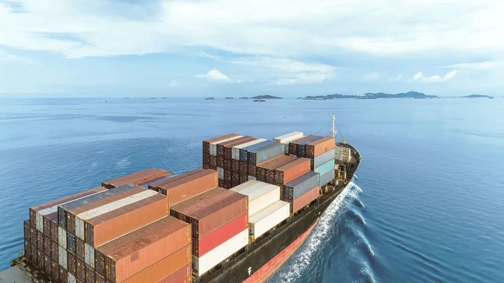

# 中欧投资协定前景未明，但“与中国脱钩不可行”成共识

**文｜《财经》记者 江玮**

**编辑｜郝洲**

法国总统马克龙访华之旅使中法在经贸领域的合作更进一步，然而中欧经贸关系中还有一个悬而未决的问题：中欧投资协定。被搁置两年多的中欧投资协定前景未明，甚至没有出现在和马克龙一同访华的欧盟委员会主席冯德莱恩的议程中。

4月6日晚，在结束对华访问前，冯德莱恩在北京出席记者会时表示，她此行没有提及中欧投资协定。“我们的立场是：我们需要对中欧投资协定进行重新评估。”她说。

冯德莱恩回顾了中欧投资协定的谈判历程。双方在大约十年前开始谈判，于两年前完成了谈判，“但从那以后发生了很多事情”。她提及欧洲企业在中国市场的准入问题和公平竞争环境。

2014年，中国和欧盟启动投资协定谈判，经过35轮谈判，中欧于2020年12月宣布完成谈判。中国商务部当时表示，中欧投资协定着眼于制度型开放，是一项平衡、高水平、互利共赢的协定，涉及领域远远超越传统双边投资协定，谈判成果涵盖市场准入承诺、公平竞争规则、可持续发展和争端解决四方面内容。

中欧投资协定谈判完成后，后续签署批准进程展开。协定原本有望于2022年上半年法国担任欧盟轮值主席国期间完成生效所需程序。但2021年5月，欧洲议会通过决议，以与经济不相关的政治问题为由“冻结”批准协定的讨论。

**如何打破僵局**

为激活中欧投资协定，中方近来释放出一些积极信号。中国驻欧盟使团团长傅聪在今年2月出席欧盟智库对话活动时表示，一些欧洲经济界人士对中国市场准入有些抱怨，中欧投资协定将解决这些问题，但这个有效的工具却被搁置了。“我们应该向前看。”傅聪说。

在市场准入方面，中欧投资协定采取了准入前国民待遇加负面清单模式，中方首次在包括服务业和非服务业在内的所有行业以负面清单形式做出承诺。

3月30日，傅聪在接受英国《金融时报》采访时就如何打破中欧投资协定批约僵局回应说，中方提议双方同时解除制裁，消除批准这项协定的政治阻碍。“但与此同时，我们也表示，如果一些政客认为不可行，我们也愿意听取欧方的意见或建议。”他强调，只要基于互惠和平等的原则，中方对所有解决方案持开放态度。

傅聪表示，在与欧盟方面不同人士交谈的过程中，他发现很多人非常支持批准该协定，但也有人狂热地反对这一进程。“我们确实希望政治家们，特别是欧盟领导层，能够拿出足够的勇气和政治力量来推动该协定批准。对此我仍然很乐观。我们确实希望冯德莱恩主席访华能够为双边关系创造良好氛围，助力双方更容易地取得一些具体成果，包括投资协定。”

中国国际问题研究院欧洲研究所所长崔洪建在接受《财经》记者采访时表示，虽然出现一些新的积极动向，但激活中欧投资协定仍有难度和障碍；被冻结的是一份经贸协定，却受到了政治因素的干扰。

在他看来，现阶段解冻中欧投资协定的阻力比两年前不但没有减少，反而因为新冠疫情和乌克兰危机出现新的阻力。此外，欧洲这两年更重视供应链安全，最近出台的法律法规基调都是保护，而投资协定的核心是双向开放，两者存在矛盾。

欧盟委员会重新评估中欧投资协定的立场意味着结果的不确定性。崔洪建分析说，虽然欧洲议会冻结这份协议，但只要作为负责谈判并提出协议文本的欧委会没有放弃，中欧投资协定就仍有希望。但如果欧委会在做出重新评估后决定撤回，就只能重新谈判。

欧盟委员会发言人在接受《财经》记者采访时重申了冯德莱恩在3月30日就中欧关系发表讲话时的立场。冯德莱恩当时说：“我们需要在透明、可预期和互惠的基础上重新平衡欧盟与中国的关系。我们需要确保我们的贸易和投资关系在中国和欧盟都能促进繁荣。2020年完成谈判的中欧投资协定旨在实现这样的重新平衡。但我们要认识到世界和中国在过去三年发生了重大的变化，我们需要在更广泛的中国战略下重新评估这份投资协定。”

**与中国脱钩不可行**

尽管中欧投资协定前景未明，但中欧经贸关系仍在向前发展。据中国商务部公布的消息，在马克龙访华期间，中法36家企业签署了绿色、创新、航空、新能源等领域18项合作协议。

这些协议包括空客与中国签署160架飞机的采购协议，并将在天津建设第二条生产线；中国船舶集团与法国达飞海运集团签约建造两种型号16艘超大型集装箱船，签约金额超过210亿元人民币，创下中国造船业最大单笔集装箱船订单纪录；法国电力公司与中广核集团续签全球合作协议，与国家能源集团、国家电投集团分别签署关于海上风力发电、创新低碳项目的合作协议；法国苏伊士集团与中铁上海工程局、万华化学集团签订海水淡化项目合同等。

当被中国媒体问及如何看待中国未来的投资环境时，随同马克龙一起访华的空客公司CEO傅里（Guillaume
Faury）回应称，空客在中国的投资协议表明了对于中国投资环境的信心。“在过去几年，我们一直在大力投资中国市场，我们对于在中国发展业务很有信心。”他说。

崔洪建表示，在没有中欧投资协定的情况下，中欧双方的经贸合作也会继续推进，但签订中欧投资协定是双方在法律上做出承诺，提供了一种法律基础。而且中欧投资协定是在全球化高速发展时期的产物，双方花费了很多精力，做出双向开放的承诺。“如果能激活它，对于中欧乃至世界经济都有提振作用，值得努力。”

与中国和欧盟互为彼此第一大贸易伙伴的现状相比，中欧双向投资仍有巨大潜力。

据中国商务部、国家统计局和国家外汇管理局联合发布的《2021年度中国对外直接投资统计公报》，2021年中国对欧盟投资流量达78.6亿美元，比上年下降22.2%，占流量总额的4.4%。

中国贸促会今年3月发布的欧盟营商环境报告显示，在欧盟的中资企业认为，欧盟市场仍具有吸引力，但2022年欧盟营商环境退坡，对外资企业造成较大挑战。

针对欧盟营商环境中出现的市场准入壁垒增多增高、用行政手段限制市场行为等问题，在欧中资企业提出的建议之一是尽快恢复中欧投资协定的批准程序，推动协定早日签署。如果中欧投资协定签署并实施生效，40.87%的受访中资企业将加大对欧投资。

中国商务部公布《中国外资统计公报2022》则显示，2021年欧盟在华投资金额为51亿美元，同比下降10.4%，占中国实际使用外资金额的2.8%。不过欧盟对华投资在连续几年出现下滑之后于2022年出现新的增长。2022年，欧洲企业新增对华投资121亿美元，大幅上涨70%。

冯德莱恩在访华期间强调，与中国脱钩并不符合欧洲的利益。“一些人呼吁与中国脱钩，我不认为这是一个可行和可取的策略。我认为我们需要的是去风险，这意味着在关注特定风险的同时，也要意识到大多数商品和服务或者贸易是没有风险的。”她说。

中国外交部欧洲司负责人在介绍冯德莱恩访华相关情况时也表示，双方同意加强互利合作，一致反对“脱钩断链”。20年来，中欧贸易额增长近9倍，欧盟对华投资增长近3倍。中国对欧盟投资从零开始，发展到目前的1044亿美元。中欧已经形成强大的经济共生关系。

