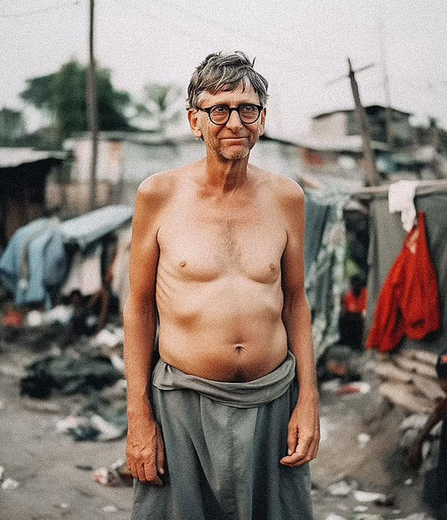
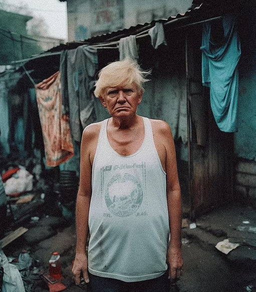
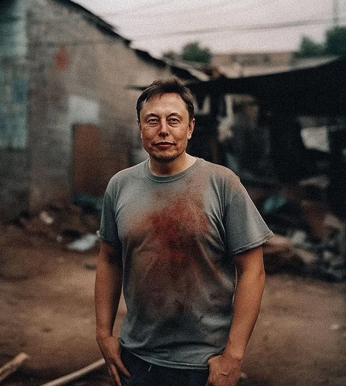

# 假如特朗普、马斯克等富豪生在贫民窟会什么样？AI画作告诉你

【环球时报综合报道】据《印度快报》9日报道，一组名为“贫民窟的亿万富豪”的人工智能（AI）画作在网上发布后，引起了全球关注。这组画作的作者是印度数字艺术家戈库尔·皮莱，他借助AI技术将特朗普、马斯克和比尔·盖茨等全球知名富豪的形象，放置在贫民窟背景中。在画作中，这些亿万富豪衣着褴褛，和四周环境融为一体，这一创意让不少网友纷纷点赞。

_印度数字艺术家戈库尔·皮莱借助AI技术将比尔·盖茨等全球知名富豪的形象，放置在贫民窟背景中。图源：外媒_

_印度数字艺术家戈库尔·皮莱借助AI技术将特朗普等全球知名富豪的形象，放置在贫民窟背景中。图源：外媒_

_印度数字艺术家戈库尔·皮莱借助AI技术将马斯克等全球知名富豪的形象，放置在贫民窟背景中。图源：外媒_

戈库尔没有说明自己这组创作的意图，但许多网友表示，作品看起来很真实，画中富豪们的神态、气质和真正的贫民窟居民极为相似，让观众从这组作品中看到了“另一个世界”，引发了大家对全球贫富差距问题的思考。有网友认为，关于特朗普的AI作品最让他感兴趣，图中“特朗普”的身材比他的现实原型更为消瘦，与背景完美贴合，显得栩栩如生。（张贤志）

