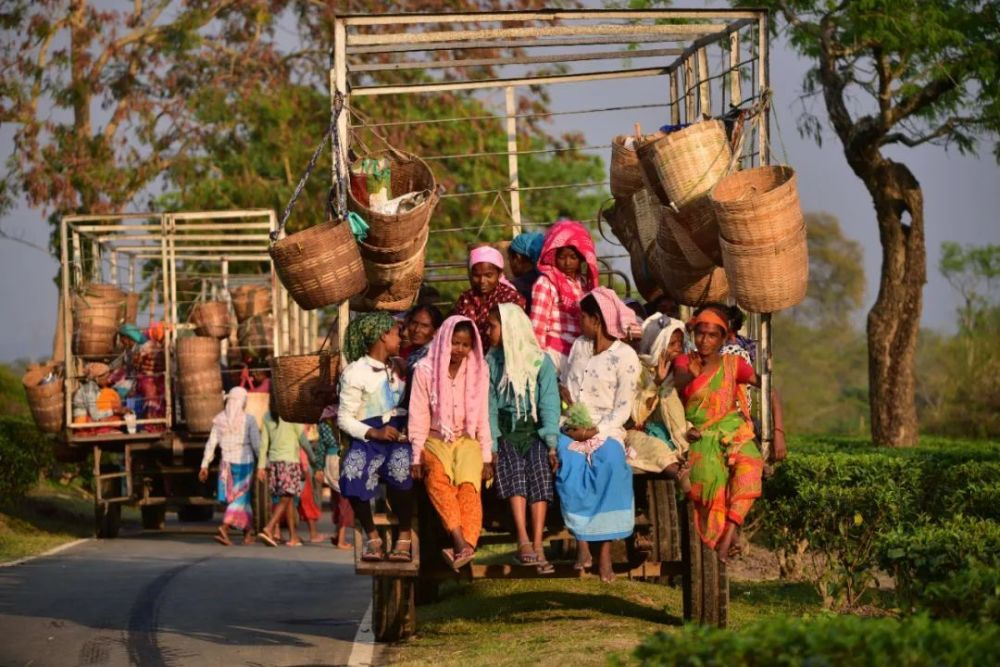

# 印度将成全球人口第一大国，在中低端制造业方面或与中国展开竞争

_▲3月14日，在印度阿萨姆邦纳加奥恩，工人采茶后乘车离开。图/新华社_

**文 | 穆光宗**

据环球时报报道，一系列人口统计研究预测显示，印度人口将在4月中旬超过中国，增至14.1亿，成为全球人口最多的国家。2023年4月下旬，联合国或将官宣印度取代中国成为全球人口第一大国。

这将为印度开启新的篇章，进而传递了两个信号。其一是印度的庞大人口体量会提升其国际地位，尤其是作为世界第五大经济体，它还是增长最快的经济体。其二则是印度成为全球第一人口大国，意味着中国成为世界人口第二大国，会不会因此影响中国的大国地位？

**人口基数影响国力较量**

印度跃升全球第一人口大国的位置是一个标志性事件——国力的较量离不开对人口这个基本因素的考量。

之所以说印度人口规模成为世界第一，不仅仅具有象征意义，是因为人口因素也是推动文明演进的基本力量，人口的结构变动会影响人口与外部世界资源环境、经济社会的外在联系。

从中长期发展趋势来看，在中低端制造业方面，印度或将与中国展开竞争。具有劳动力无限供给优势的国家不只有中国，印度、越南等东南亚诸国都为经济起飞储备了大量年轻劳动力资源。

由此获得的启示是，人口多寡不仅在于国家、社会和政府的观念，而且在于国家是否具备治理人口转化的能力；人口规模巨大固然充满挑战，但是在正向的思维和灵活的体制中，是可以化压力为动力、变挑战为机遇的，最终持续收获潜在的人口红利。

印度人口的相对优势是年轻劳动力数量充裕，而且工资水平不高。但也有相对劣势，就是作为产业工人需要培训周期和成本，而且受传统文化影响，工作效率似乎低下。这将无可避免地影响其人口红利的转化。

_▲1月13日，在印度阿萨姆邦一处村庄，当地村民参加捕鱼活动，庆祝丰收节。图/新华社_

**管理庞大的人口挑战巨大**

印度人口之所以表现出强劲的增长力，与该国传承至今的、早婚多育的“子福”生育文化密不可分。

印度法定婚龄为女性18岁，男性21岁，然而童婚在一些地区也依然流行。据联合国推算，印度有大约2.23亿女性在未成年时结婚，早婚导致早育多育，女童入学率低下。

而从人口年龄结构看，中国0-14岁占比17.95%，15-59岁占比63.35%，60岁及以上占比18.70%，其中65岁及以上占比13.50%；印度0-14岁占比31.2%，15-64岁占比63.6%，65岁及以上占比5.3%。

可以看到，印度人口年轻有活力，生育潜力大。但印度农业人口占据总人口的70%以上，这部分劳动力整体受教育水平低下。

根据预测，2064年全球人口将增至峰值97亿，印度人口或将持续增长至17亿，管理这么庞大的、宗教信仰各异的人口或成为印度政府面临的巨大挑战，庞大的人口规模也会给印度的淡水资源、能源安全和环境卫生带来压力。

此外，面对迅速增长的工作、年龄、人口，国家创造就业岗位的能力也受到考验。印度严重的阶层分化和固化制约其生产力发展，使印度半数以上的劳动力仍在从事与农业相关的生产活动，效率低下，难以充分释放人口红利。

_▲2020年11月1日，安徽省合肥市肥西县紫蓬镇普查员、普查指导员在居民家中进行登记。图/新华社_

**中国需挖掘人口结构优势**

人口是国之大者，十八世纪法国思想家孔德说过：“人口即命运”。

生育率高的国家往往是人均收入低的国家，未来，随着时间推移，全球人口增长可能越来越集中在世界上最贫穷的国家，特别是撒哈拉以南的非洲地区。

从中国人口看，我国当前正面临着少子化与老龄化趋势的挑战。如何面对这种人口趋势的转变，需要我们加以正视。

在某种意义上，孩子既是个人、夫妇和家庭的“私人品”，也是国家、社会和民族的“公共品”，所以生育既是关系家族繁衍的家事，也是关系民族繁衍的国事。传宗接代、种姓繁衍是亘古不变的中国价值观，追求人口可持续发展也是人类普遍的价值观。

2022年是中国人口负增长的元年，中国内地总人口下滑至14亿1175万人，比上年末减少85万人，是60多年首次出现人口下降
。中国由此进入人口红利收缩、人口负担（负债）扩张的时期。

因此，如何保护好中华民族的生育文化和生育能力确实是一个战略性话题，中国要回归到更替水平上下附近的适度生育水平上，推动以人口复兴为宗旨的第三次人口转变的到来，“强力支持优化生育”和“软性鼓励适度生育”是题中应有之义。

可以说，中国告别了世界第一人口大国的地位，同时也告别了人口总量理论统治的旧时代，却迎来了培植、挖掘人口结构优势和凭人口实力决胜未来的新时代。我们要把握好这种人口大变局，在新征程中，实现新的赶超。

撰稿 / 穆光宗（北京大学人口所教授）

编辑 / 刘昀昀

校对 / 刘越

