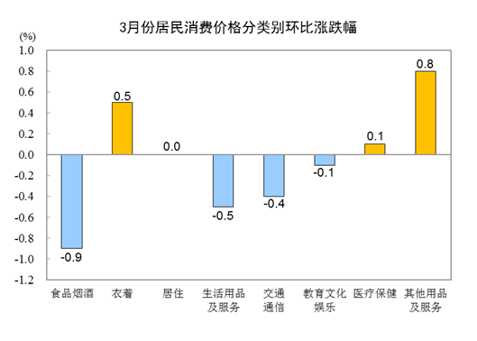

# 国家统计局：3月CPI同比上涨0.7%，鲜菜价格下降11.1%

2023年3月份，全国居民消费价格同比上涨0.7%。其中，城市上涨0.7%，农村上涨0.6%；食品价格上涨2.4%，非食品价格上涨0.3%；消费品价格上涨0.5%，服务价格上涨0.8%。

1­­—3月平均，全国居民消费价格比上年同期上涨1.3%。

3月份，全国居民消费价格环比下降0.3%。其中，城市下降0.3%，农村下降0.3%；食品价格下降1.4%，非食品价格持平；消费品价格下降0.5%，服务价格上涨0.1%。

**一、各类商品及服务价格同比变动情况**

3月份，食品烟酒类价格同比上涨2.1%，影响CPI（居民消费价格指数）上涨约0.59个百分点。

食品中，鲜果价格上涨11.5%，影响CPI上涨约0.24个百分点；蛋类价格上涨7.8%，影响CPI上涨约0.05个百分点；畜肉类价格上涨4.6%，影响CPI上涨约0.14个百分点，其中猪肉价格上涨9.6%，影响CPI上涨约0.11个百分点；粮食价格上涨2.0%，影响CPI上涨约0.04个百分点；鲜菜价格下降11.1%，影响CPI下降约0.28个百分点。

其他七大类价格同比五涨两降。其中，其他用品及服务、教育文化娱乐、医疗保健价格分别上涨2.5%、1.4%和1.0%，衣着、生活用品及服务价格分别上涨0.8%和0.7%；交通通信、居住价格分别下降1.9%和0.3%。

**二、各类商品及服务价格环比变动情况**

3月份，食品烟酒类价格环比下降0.9%，影响CPI下降约0.26个百分点。食品中，鲜菜价格下降7.2%，影响CPI下降约0.17个百分点；畜肉类价格下降2.4%，影响CPI下降约0.08个百分点，其中猪肉价格下降4.2%，影响CPI下降约0.06个百分点；水产品价格下降0.8%，影响CPI下降约0.02个百分点；鲜果价格上涨0.4%，影响CPI上涨约0.01个百分点。

其他七大类价格环比三涨一平三降。其中，其他用品及服务、衣着、医疗保健价格分别上涨0.8%、0.5%和0.1%；居住价格持平；生活用品及服务、交通通信、教育文化娱乐价格分别下降0.5%、0.4%和0.1%。

**2023年3月份CPI环比下降 PPI环比持平**

**——国家统计局城市司首席统计师董莉娟解读2023年3月份CPI和PPI数据**

国家统计局今天发布了2023年3月份全国CPI（居民消费价格指数）和PPI（工业生产者出厂价格指数）数据。对此，国家统计局城市司首席统计师董莉娟进行了解读。

**一、CPI环比下降，同比上涨**

3月份，生产生活持续恢复，消费市场供应充足，居民消费价格环比下降，同比上涨。

从环比看，CPI下降0.3%，降幅比上月收窄0.2个百分点。

其中，食品价格下降1.4%，降幅比上月收窄0.6个百分点，影响CPI下降约0.27个百分点。食品中，天气转暖，鲜菜上市量增加，价格下降7.2%，降幅比上月扩大2.8个百分点，影响CPI下降约0.17个百分点，占CPI总降幅近六成；受存栏量较为充裕及消费需求回落影响，猪肉价格下降4.2%，降幅收窄7.2个百分点，影响CPI下降约0.06个百分点；粮食、食用油、鲜果、鸡蛋、禽肉类等食品价格较为稳定，涨跌幅在-0.1%—0.4%之间。

非食品价格由上月下降0.2%转为持平。非食品中，出行需求持续恢复，宾馆住宿和飞机票价格分别上涨3.5%和2.9%；春装换季上新，服装价格上涨0.5%；车企降价促销，燃油小汽车价格下降1.9%。

从同比看，CPI上涨0.7%，涨幅比上月回落0.3个百分点。其中，食品价格上涨2.4%，涨幅比上月回落0.2个百分点，影响CPI上涨约0.43个百分点。

食品中，鲜果价格上涨11.5%，涨幅比上月扩大3.0个百分点；猪肉价格上涨9.6%，涨幅扩大5.7个百分点；鸡蛋和禽肉类价格分别上涨7.8%和7.4%；鲜菜价格下降11.1%，降幅扩大7.3个百分点。

非食品价格上涨0.3%，涨幅比上月回落0.3个百分点，影响CPI上涨约0.23个百分点。

非食品中，服务价格上涨0.8%，涨幅比上月扩大0.2个百分点，其中飞机票、宾馆住宿、交通工具租赁费、旅游价格分别上涨37.0%、6.1%、5.9%和5.3%，涨幅均有扩大；工业消费品价格由上月上涨0.5%转为下降0.8%，主要受能源和汽车价格下降影响，其中汽油和柴油价格分别下降6.6%和7.3%，燃油小汽车价格下降4.5%。

据测算，在3月份0.7%的CPI同比涨幅中，上年价格变动的翘尾影响约为0.7个百分点，与上月相同；新涨价影响约为0，上月为0.3个百分点。扣除食品和能源价格的核心CPI同比上涨0.7%，涨幅比上月扩大0.1个百分点。

**二、** 国家统计局：3月PPI同比下降2.5％，环比持平

3月份，受国内经济加快恢复及国际市场部分大宗商品价格走势影响，全国PPI环比持平；受上年同期对比基数较高影响，同比下降。

从环比看，PPI继续持平。其中，生产资料价格由上月上涨0.1%转为持平；生活资料价格由上月下降0.3%转为持平。国内生产和市场需求持续改善，重点项目加快推进，钢材、水泥等行业价格有所上涨，其中黑色金属冶炼和压延加工业、水泥制造价格均上涨1.3%。

国际输入性因素带动国内石油、有色金属相关行业价格下行，其中石油和天然气开采业价格下降0.9%，石油煤炭及其他燃料加工业价格下降0.4%，有色金属冶炼和压延加工业价格下降0.3%。受气温回升等季节因素影响，用煤需求有所减少，煤炭开采和洗选业价格下降1.2%。此外，计算机通信和其他电子设备制造业价格由上月下降1.1%转为上涨0.4%。

从同比看，PPI下降2.5%，降幅比上月扩大1.1个百分点，主要受上年同期石油、煤炭、钢材等行业对比基数走高影响。其中，生产资料价格下降3.4%，降幅扩大1.4个百分点；生活资料价格上涨0.9%，涨幅回落0.2个百分点。

主要行业中，进口依赖度较高的石油、有色金属及相关行业价格下降较多，其中石油和天然气开采业价格下降15.7%，降幅扩大12.7个百分点；石油煤炭及其他燃料加工业价格由上月上涨1.7%转为下降6.1%；化学原料和化学制品制造业价格下降7.7%，降幅扩大1.7个百分点；有色金属冶炼和压延加工业价格下降8.0%，降幅扩大2.7个百分点。上述行业合计影响PPI同比下降约1.38个百分点，占总降幅的近六成。

此外，黑色金属冶炼和压延加工业价格下降11.0%，煤炭开采和洗选业价格下降3.2%；文教工美体育和娱乐用品制造业价格上涨4.1%，电气机械和器材制造业价格上涨0.3%。

据测算，在3月份2.5%的PPI同比降幅中，上年价格变动的翘尾影响约为-2.0个百分点，上月为-0.9个百分点；新涨价影响约为-0.5个百分点，与上月相同。

**相关阅读：**

国家统计局：3月PPI同比下降2.5％，环比持平

