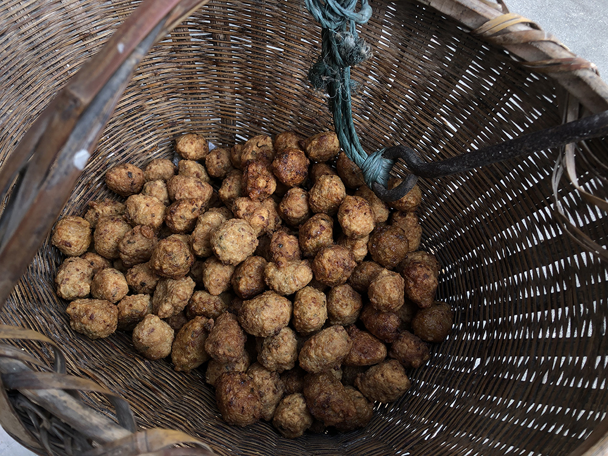
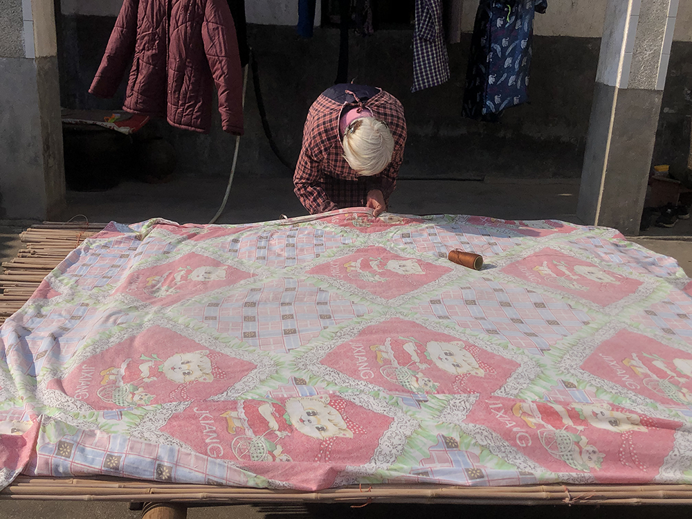
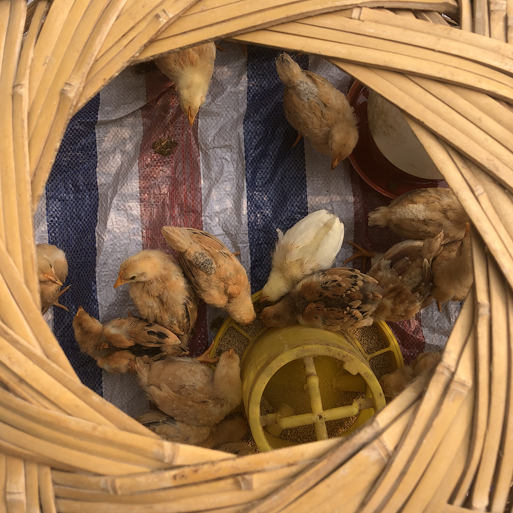

# 外婆77岁，还在农村找零工

**【编者按】**

“身边”是澎湃人物作者以第一人称做近处叙事的栏口。“身边”意味着，在眺望远处之外，能有近处的观瞻，从细小、贴近之地出发，觉知日常生活的外延，探求与“良好生活”的距离。

这篇“身边”讲述了农村的银发零工，作者回到外婆所在的农村住了一阵，却惊讶地发现，像外婆这样的七旬老人，以及她的同龄人，他们选择就近打零工，为了打发时间、赚取收入，也为了给下一代“减负”。

**日结零工**

去年过完年，我决定回乡下陪外婆住几晚，顺便感受下村里老人的平静生活。

_外婆过年炸的肉圆。本文图片均为澎湃新闻特约撰稿
张维 拍摄_

我去的那几天，外婆天天都在努力给自己找零工做。她一生做农，打零工也无外乎跟农活有关：主要是帮人栽花、种菜之类。

我在她家的第二天，她去田里摘菜，拎着篮子走到菜地，随后一转弯，去了一处大棚，问老板要不要人，但那个老板说现在不缺人，外婆只好离开了，临走时还叮嘱对方记得缺人时找她。

次日早上六点，她又和另外两个七十多岁的老人相约着步行半小时去农场找工作。她不会用手机，家人给她备了一只老人机，教会她接电话，她让我把她的电话号码写在一张纸片上，这样农场老板需要小工时可以联系她。

自2016年起，村里的农用地一片片由村合作社流转，被人承包搞种植。外婆的地也几乎都被承包了。这意味着，留守乡村的老人不再能通过种地获得收入，同时闲暇时间也多了。种植户有时会招小工种菜、摘菜等，但这样的活少，他们通常不需要那么多人力。

最受老人欢迎的工作是去城里栽花种树。21世纪后，由于城市快速扩张，各种市政建筑工程蓬勃发展，有人把村里没有工作的农村老人带到城市绿化带或工地栽花，每人一天70元。老人都很乐意去，相对种田来说，栽花轻松，能打发时间，工资还能按日计算。

栽花在我们村的历史有十年了。记得2018年夏天，我回去看望73岁的外婆，第二天她刚好要去城里栽花。担心来不及，她凌晨三点起床准备，吃早饭、打扫卫生、喂鸡，都弄完了天还没亮，距离出发还有一个小时。她就坐在厨房等，怕费电，也没开灯。快到时间了，我陪她一起去乘车，结果到了车跟前，组织方说这天人够了，她只得默默回去。

我打算去看看栽花到底是怎么一回事，就跟着车上的其他老人一起去了工地。这些老人大多是我儿时的邻居，他们年纪大了，独自生活在村里。车子最后停在了新城区一个市政建设工地，房子建好了，老人们下车，开始在院子里种树、松土、浇水。

前几年外婆也去栽花，去年断断续续栽了三个月的花，每天天不亮就起来，忙到天黑才回家。但后来别人开始嫌她年纪大，不要她，导致她整日烦闷。每当傍晚她看到邻居从城里种花回来了，不免感叹，人家都在栽花赚钱，自己却在家闲着。

**低龄老年人，超龄工作者**

我外婆所在的村位于安徽省安庆市，临江而建。和中国大多数乡村一样，年轻人都去了城市打工，现在村里只剩下老人。目前，在家居住的60岁以上的老人有350人左右，他们主要在家干农活，或在周边做承包户，也有结对外出栽花、找零工，一般打零工的老人年龄主要在60至75岁，身体还算康健。

据2020年开展的第七次全国人口普查显示，中国65岁以上的老人有近2亿，占全国人口近20%，而其中农村的空巢老人有近1.2亿。中国人口进入老龄化后，如今60-69岁的被称为“低龄老年人”。

在我们村，老人目前的收入主要是地租和新农保补助。农地被承包，每年按亩补偿，水田450元/亩，旱地500元/亩，外婆和舅舅及其他子女的地共有两三亩，共有地租约一千多；另外，从2012年起，新农保惠及农村老人，一开始每人每月55元，逐年增加，今年已增加到60-65周岁是135元/月，65-75周岁140元/月，75-85周岁是145元/月，以此类推，每10岁的梯队递增5元；针对80周岁以上老人，有额外的民政补助25元/月/人；无子女五保户除了新农保外，额外领取每月680元/人。按规定，外婆今年可望从新农保拿到1740元。除此之外，她的生活主要靠子女补贴和自己打工。

_待遇领取的相关规定公示_

村里我外婆这一辈的，大部分在75岁以上，最多有六个孩子，最少只有两个孩子。外婆生了五个女儿和一个儿子，他们都在本市打工，逢年过节会回来看望她，大部分子女都会给她钱，一般一次两百，她的衣物也都是子女买的。

_天气好时，外婆在晒被子、缝被子_

和大多数农村老人一样，外婆在村里消费不多，日常也就是种菜、养鸡。她最大的消费是烟。外婆年纪大了之后爱上抽烟，一开始因为身体疼痛而抽烟，后来上瘾，现在每天要抽一包多，一星期抽一条。子女们每次回去都会给她买烟，这样累积起来，也基本都够她一年的消耗。

子女能不能为老人养老，也要看子女的经济能力如何。村里80多岁的王奶奶有两个女儿，两个儿子。小女儿离婚了没有钱，其他三个孩子经济条件好点，一年各给老人2000块钱。还有位奶奶有四个孩子，老大从来不给钱，去年过年因为老人80岁生日，才给了六百；小女儿给了一千，还是瞒着自己的丈夫给的。

**为了下一代**

虽然吃穿不愁，但外婆仍是很着急。

做小工赚的这些钱对于求医看病简直是杯水车薪。外婆的牙齿不好，每次我说带她去看牙齿，她都坚决不去，因为“要花许多钱”，即使我主动说要承担费用，她也坚决不去。

平时种菜，她要买肥料，买种子，这些她也都不会开口找子女要。在她看来，一代人有一代人的压力，子女也要努力工作给孙辈买房。

老人们几乎都是同样的想法：尽量为下一代减轻负担。中午，村里另一个奶奶来找外婆聊天，她已经80多岁了，50多岁的儿子最近出了车祸，但由于媳妇不愿照顾，这责任自然落到了她身上。除了照顾儿子，她还要照顾同样年迈的老伴。

村里也有境况好的老人给外婆带来某种“同辈压力”。有时闲聊，外婆谈到从村小退休的小江老师。小江老师在村小教了一辈子书，他教过我父母，也教过我，直到后来村小倒闭了，生源越来越少，我2003年出生的表妹去读书时，班上只有六个人。外婆聊到小江老师，是因为他退休后一年有五万元退休金，此外，他还在家里养了4000只鸡，为孙子买了房和店铺。

我只好跟外婆打趣说，你还想给孙子买房吗？我不知道外婆是否这样期待。但无论如何，她希望通过自己的努力还能让下一代过得轻松点。外婆的孩子们现在都在城市打工，各自忙着抚养孩子，有的人因为村里拆迁分到钱买了房，有的借钱买了房，以便孩子读书。外婆最小的儿子在工地打工，养两个孩子，一个读高中，一个读大学，经济压力很大。

一切跟我想象的太不一样了，我原本以为住在村里的外婆是快活的，轻松的，但她好像也挺累，这种累不仅仅是身体上，还有精神上。我曾不止一次听她和我的父辈们讲到那些吃不上饭的年代，那些年代似乎已经很远很远了，就像村里的那些老人一样离我很远。

家人聊起外婆要去栽花这事，总劝她不要去了。他们认为，她这么大年纪，别人不要，她非要去，总不免有很多闲话，还会被人骂。但外婆不在乎，尽管不断被拒绝，仍不放弃，她像个刚刚毕业的大学生，抓住一切工作的机会，一旦听说哪里缺人，就马上报名，如果别人没招工，她就主动去问。在我记忆中，外婆一直是一头银发，后脑勺扎着两个少女时期的小辫子，平时她会把辫子盘上去。前两年，为了让自己看上去年轻些，她还让女儿帮忙染了一头黑发。

今年我以为她肯定没希望找到小工了。没想到昨天晚上，她出去邻居家转了一圈，居然又给自己找到活，并且决定第二天早上六点坐车去栽花。那天晚上她很兴奋，一边想着如何安置我，一边收拾行李。她拿出饭盒、水杯、栽花工具，又找到很久没用的消防头盔，用刷子刷得干干净净。凌晨三点闹钟响了，她准时起来，五点准备完毕，她就一直在等。那时天还没亮，她就每分钟喊醒我一次，说她要走了，让我离开时关好⻔，一直到六点，她出发了。

_外婆安置捉回来的小鸡_

**独守乡村**

过了几天，我再次回去。看得出，外婆栽了几天花后，整个人轻松了许多。这天，她不用去打零工，带着我去村里捉了二十只小鸡，她开心地说，等鸡长大了，我们回家就有鸡蛋吃了。

在不打工的日子里，外婆也总是待在村里。老人们的日常娱乐很贫乏，除了打打小麻将就是唠嗑。那些不喜欢打麻将的老人，只能继续到田里干活，我外婆就属于此类。她是很闲不住的人。等她从农场回来，才早上八点，虽然没找到工作，但她又开始了一天的忙碌：做饭，洗衣，喂鸡，除草。

二月的尾巴仍是寒意阵阵，父亲让我带了一袋买来的西瓜种子给外婆。她第二天吃完早饭就扛着锄头去江边开垦田地，开始为种西瓜做准备。那是一片荒草地，上面长着一米高的枯灌木，外婆想把它清理干净，再播种。

外婆打理土地时很专注。我看着她细心地用锄头锄草，清理杂物，又一遍遍翻土垦地，直到硬土块变得蓬松而肥沃，呈现出她满意的样子。常常干了一会儿她就累了，衣服也汗湿了。棉袄、毛衣、短棉背心，最后只剩下里面的秋衣。空气潮湿寒冷，她的身体却热腾腾的。

子女们常要接她到城里住几天，她不愿意，说家里有鸡要照顾。外婆特别爱干净，已经形成了自己的生活习惯。她每天早上六点起床，忙完家务，就去田里干活，中午回来吃饭，下午继续出去，晚上回来，她通常要洗衣，做饭，喂鸡，洗漱。等把一切都收拾妥当后，她才会坐下来吃个饭，看个电视。家里有个小电视，她调来调去想找个好看的剧，一边调一边说“没有什么好看的”，有时选中一部，却看着看着就睡着了。

村里的老人大都过着类似的生活：在家种菜，给儿女们吃。外婆种的菜，住在城里的子女每过一段时间会回来，再驮一蛇皮袋的菜回城里。子女回乡总是让她开心，她会把自己有的东西，菜啊，油啊，鸡蛋啊，塞满子女的车。他们离开了，她继续种地，等他们下一次回来。

乡村的夜静静的。外婆家前后左右都是邻居的房子，但除了前后各住着一个老太太，其余的都空着。外婆睡在自己结婚时的旧床上，很小很小。13年前，外公得肺癌去世了，此后就剩外婆独居三层楼的房子，八九间房，一个大院子，种有一棵柿子树。十年前，外婆的房间里有一口棺材，那是外公去世时她为自己一起准备的。后来，由于禁止土葬，外婆的棺材被村干部搬走了。没了棺材，房间显得格外空荡。我住在那的一天凌晨，外头响起唢呐声，是熟悉的葬礼乐队，我问外婆害怕吗？她说，不怕，门关着的。

