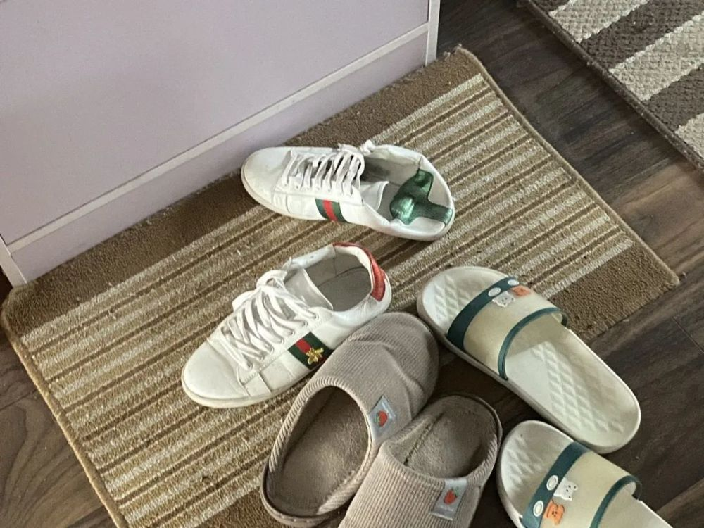
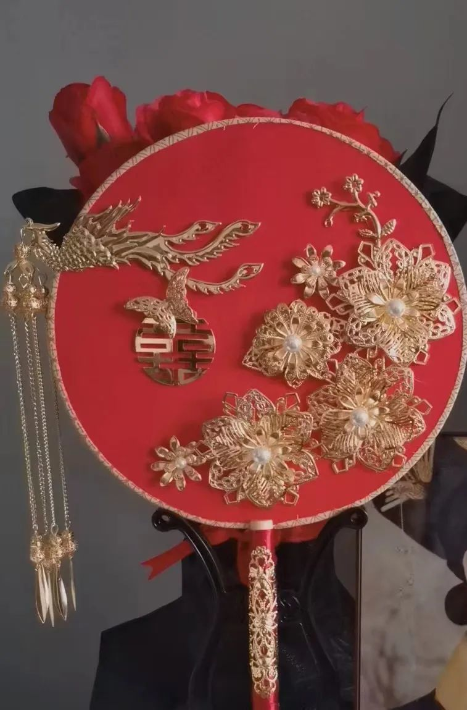
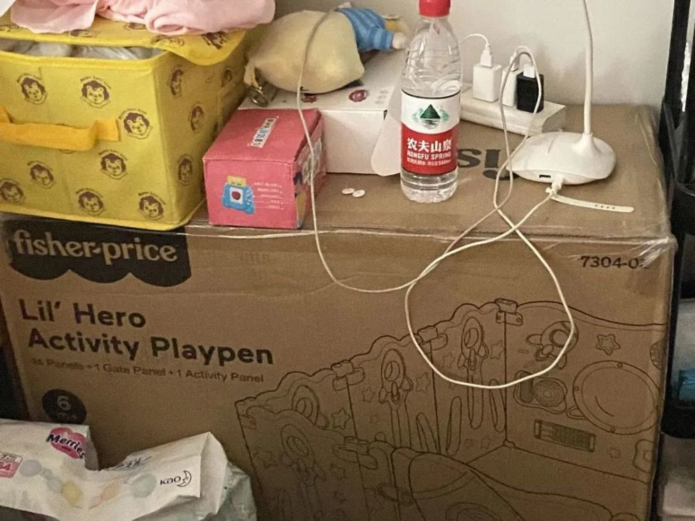

# 年轻夫妻靠抠门落户北京：一根香菜吃5个月，女儿衣服大多是别人送的

紧缩时代的年轻人不可避免走向消费降级。省钱不仅是风潮，更是一种乐趣。

在北京通州，林华李朵夫妇过着极简的生活，他们拒绝一切基本生存需求外的消费。通过极度抠门的生活方式，夫妻俩完成了一场阶层跃迁，并成功落户北京。

**“抠”出一个家**

从菜市场买回一根香菜能吃多久？

恰当的季节，如果把从菜市场买来的香菜栽进盆栽，它就会在数个月时间里长到半米高，并且生得更为健硕。

在新北京人李朵和林华家中，一株香菜在朝北房间的昏暗角落里静谧生长着，它至少比当初同在菜摊的香菜多活了5个月。必要的时候，他们会从香菜躯干上掐下三、四片叶子，放进锅里为炒好的菜提味。

香菜根部的盆栽，是李朵夫妇的微缩菜园。不同季节，这里会适时地长出厨房里需要的一些东西，如蒜苗、韭菜。盆栽的原住民，一株观赏绿植，不得不与它们共享土壤和养分。

李朵记得，当初这根香菜是和其他4根香菜一起买回家的，一共花了3块多，如果一顿吃光，“太不值当。”李朵这样想着，挑出5根香菜里最鲜嫩的一根，种在了盆栽里蒜苗的旁边。此后5个多月，这个家再没有购买过香菜。

_图
| 半米高的香菜_

在这个家中，男女主人用尽可能低的支出维持家庭运转。林华在媒体工作，李朵在互联网的外包岗位，两人的薪资都算不上太高。刨去8000元的房贷，他们一个月开销只占到收入的十分之一。

这座房子里，摆在明面上的东西，除了四堵墙、一个天花板和家具，几乎都是“薅”来的。

在这个家的垃圾桶里，除了烂菜叶和用过的纸巾，再找不出其他的垃圾。阳台也塞满了用编织袋、塑料袋包好的物品。这些都是不同亲戚和朋友送的旧东西，它们被当作这个家待使用的物品保存。

鞋柜旁的餐桌下，有两个已经被磨出毛边的纸箱，里面装满了夫妻俩的战利品：通过在各种平台签到打卡换来的纸巾、湿巾等日用品。这所房子里到处都能看到纸箱子，且用途不一。长而窄的箱子在卧室床尾充当床头柜，上面摆着插排、台灯和纸尿裤；方正的纸箱则发挥了本职的收纳作用，里面装着孩子的衣服、纸巾等日用品；小一点的则被压扁整齐叠在厨房冰箱旁边，他们准备再攒一点就拿去卖。

维持基本的饮食，李朵和丈夫只需要三个锅。一个老式电饭锅、一个炒锅和一个经过多年使用，已经被灶火燎得发黑的蒸锅。蒸锅里，两个各吃了一半的馒头，干枯发黄地放着，等待下一餐继续被食用。

一周蒸一次馒头，主食就够了。李朵介绍起这锅馒头语气略带骄傲：蒸锅是用信用卡积分换的，0元，鸡蛋是经营网络农场游戏兑换到的，0元，面粉也是银行卡和话费积分换的，一袋2.5千克，花费2元。蒸馒头用的垫纸，0元，是每天到网购平台签到用红包换的。他们对金钱换算相当熟悉，能够随意计算出一顿饭菜的成本。

李朵的备忘录上，详细记录着每天到各大平台签到的顺序，密密麻麻记了十几条。夫妻俩可以为了12卷卫生纸，连续去某平台签到28天。他们甚至将0元薅到的东西，转手卖出去，比如一个护肤品小样卖15元钱，够一家人两天的伙食费。

这个家里唯一的奢侈品是一双运动鞋，那属于林华。不过它的第一任主人并不是林华，而是他的一位同事。鞋子旧了以后，同事给他送了过来。但同事的脚比他小了一号，林华只好把鞋跟踩下去，把运动鞋当成拖鞋，时常穿着在小区里溜达。

_图
| 林华的名牌鞋_

这房子如果是租来的，就更合理一些。但事实是，这是男主人林华婚前靠节俭生活省下的积蓄，首付200多万买下的房子。不过，连他自己也会感慨，屋内的陈设，“甚至还不如有的出租屋。”

家中仅有的超脱基本生存需求之外的物品，是几个动画角色的公仔。年代久远，公仔们经过多次清洗，脸颊和身体都不同程度地起球。李朵说，“这几个娃娃是我小时候爸妈给买的，结了婚我就从天津带过来了。”

2016年，附近房价疯涨的前夕，36岁的林华买下这套二手、约100平米的两室一厅的房子。

买房的时候，林华没有花太多钱添置家具。他计划着等结了婚，按照妻子的审美重新布置。为了省钱，他跑遍了北京便宜的家具市场。由于展品长期暴露在外，经过客人试用、触摸等，往往有瑕疵，一般客人都不愿意购买，他却专挑瑕疵品和二手的买。最终，所有的家具加起来不到1万块钱。

婚后，李朵想起林华买房时的计划，忍不住发笑：“没想到娶了个我吧。”她说，林华当初一定没想到这个家的女主人也“抠门”。于是，婚后，屋子仍以当初随意的样貌保留了下来。

餐桌上，摆着一个在城市里并不常见、发白的暖水壶，那是男主人林华7年前买的。如今，他们依旧烧水喝，因为觉得用饮水机买桶装水喝不划算，还要给饮水机24小时通着电。“塑料桶也不健康”，林华补充道。

2022年，李朵和林华生了孩子。怀孕期间，李朵和林华也没有因网上制造的母婴需求焦虑，盲目消费。当“买贵就是买好”的观念诱导着部分人打开钱包时，他们认真对比成分、产地和商品评价，坚持要在合理范围内以最低价格买到最好的产品，“我女儿的奶粉是我找了渠道，直接从荷兰发货的，比官网买便宜了47元。”

在这个新北京人家中，衣物控制在一定的数量。家里添了一个人，衣柜依然不拥挤。“我们每个季度的衣服不会超过5套，鞋子只有春夏秋冬4双，全靠袜子薄厚调节温度。除非衣服穿烂，或者非常有必要，才会买新的。”李朵扯了扯自己的上衣，“比如这件哺乳衣，15块钱，是我去年唯一的新衣服。”衣柜里至今还挂着她初二时买的两件大衣，它们仍背负着李朵在春天出门的体面。

女儿的衣服大多都是别人送的，“干净、暖和就行。小孩儿感觉不到衣服新旧的，很多大人不停给孩子买不必要的东西，其实是为了满足自己。”李朵说，她和丈夫很少给女儿买衣服，认为这无法阻挡爱意的表达。有关孩子身下的小棉被，夫妻俩的记忆出现了误差，李朵声称这是邻居不要的，林华有些疑惑：“剖腹产套餐里不应该送一条吗？”

他们曾在小区群里免费领到一个婴儿餐椅和一辆推车。等到需要用的时候，他们发现餐椅靠背太过陡，孩子根本坐不稳。李朵有些迟疑：“要不去买一个吧。”林华看了一眼闲置的、发旧的推车问：“那不是斜的吗？”而后，那辆推车就成了孩子的餐椅，原本的餐椅摆到了床头，充当了床头柜。美中不足是稍微有点高，拿放东西可能还得起身。

在孩子开始上学之前，育儿成本很低。孩子出生后，他们收到不少礼物。亲友们的善意也不被浪费，送的玩具、衣服和婴儿推车等礼物，都是夫妻俩提出来的。李朵在好友面前更为直接：“给他们看购物车，省得他们猜，东西也都实用。”

**“抠门”夫妇**

“没什么难堪的。”李朵代表夫妻俩发言，“我们‘抠’不是因为穷。”相反，因为节俭的生活，提升着夫妻俩的存款增长速度。每月生活费控制在1000元以内，其他的收入存进银行，小部分购买理财产品，这样的生活让他们心安。单从屋内陈设判断，很难相信这对婚后三年的夫妇已经手握百万元级别的存款。

要不是因为相同的生活方式，很难说李朵和林华会不会走到一起。

2020年，两人经朋友介绍认识。在见面之前，林华就听说李朵每天坚持带饭，他对于这次相识颇有期待：“一个90后女孩居然自己带饭上班。”

当时李朵才26岁，刚随公司从天津搬到北京，朋友打趣要帮她介绍对象，她全没放在心上。一次，朋友问起她最大可以接受多大年纪，她说是35岁。朋友又问，能否接受超出范围一点，她想了想，说可以。隔天，那位朋友就把林华的联系方式推了过来。一聊才知道，林华已经40岁。李朵有些失望，但怕驳了朋友面子，她还是赴约了。

在烧烤店的第一次碰面，无论是期待这次相见的林华，还是悻悻赴约的李朵，都没料到会遇到一个和自己过着如此相似生活的人。吃完饭，林华送李朵回家，当时接近晚上九点。快到家时，李朵提出要绕路去超市买些菜，做第二天带去公司的饭。林华回忆，当时他确信，两人如果恋爱，绝不会因为生活方式发生争吵。

在两人此前的恋爱经验中，很少有同龄人能接受这样的生活方式。被恋爱对象劝告后，他们都偶尔想过为了感情退让一步。但最终生活理念上的摩擦，让之前的感情无疾而终。林华一直到40岁都没遇到合适的。

正式恋爱后，两人约会的地点常在家中。他们不在意约会的地点是否浪漫，最重要是性价比。免费的公园，便宜的奶茶店、家常的菜馆，都是很好的场所。周末，两人会一起去菜市场对比菜品价格，回来再慢条斯理地做上几顿饭。时至今日，除非为了某道特别想吃却不会做的菜，夫妻俩几乎不点外卖。

后来结婚，钱也能省就省。他们家里的电视柜上，至今还摆着两把用于婚礼拍摄、红色的中式扇子。那是李朵花了24元从网上买的材料，自己一针一线制成的。婚纱照花了大价钱。起初，两人打算租借衣服，找朋友帮忙拍摄婚纱照。细究下来，发现妆发、灯光等都是大问题。最后两个人花了3000元拍了婚纱照，“毕竟婚纱照可能一辈子就拍一次。”李朵说。

_图
| 李朵自制的扇子_

这段婚姻三年过去，两人从恋爱、结婚到生子，从未争吵过。两人可以为了研究去哪里买东西更实惠，一起讨论到深夜。李朵很喜欢这默契的感觉。

李朵和林华的“抠”各有缘由。

林华出生于安徽农村，家里五个孩子里，他排第二。幼年时家中贫寒，时常饿肚子的经历，让他养成了珍惜物品的习惯。后来林华从名校毕业、找到体面的工作，也时常害怕不努力工作就要回到从前的生活里去。于是在工作后，他始终不敢松懈，决意要把钱攒下来，实现阶层跨越。

李华的节俭生活则是一场意外。1994年，她出生于天津市一个普通的双职工家庭。因为是独生女，父母从不吝于给她零花钱，“他们觉得我不瞎买没用的东西就好。”那时候的她，从来没想过自己有一天会变得“抠门”。

她回忆不起大学时一个月生活费是多少，只记得没钱了父母就会一两万地打到卡上。那时候网购刚兴起，李朵的桌子上总堆满了还没拆的快递，衣柜也一直被塞得满满当当。打开柜门的一瞬间，总是一大堆衣服掉出来。大二时，她眼也不眨地买了一个一万多块的相机。这样的日子一直持续到大学大四那年。

李朵的母亲在一次检查中，被确诊为乳腺癌晚期。第一次治疗，药费、路费、住宿费、化疗费用等，前后花费加起来将近60万，几乎是掏空了家里的积蓄。好在经过一个多月的治疗，病情有所好转。父女俩原本计划着把母亲接回家静养，但一个下午母亲的病情突然恶化，他们叫来救护车，结果母亲没能挺到抢救，就在医院门口去世了。

承受着失去母亲的痛苦的同时，李朵领悟到此前富足的生活其实并不牢靠。她把几乎全新的相机以半价出售，却无人问津。买过的东西根本没办法再变回钱。母亲离世后，李朵丧失了在消费中获得快乐的能力。她望着自己买过的衣服、鞋子、包包，完全没有研究怎么搭配的欲望，只觉得碍眼。

同年，李朵回到天津，开始了她并不顺利的求职之路。找不到工作的日子里，她总是口袋空空，但再也不好意思伸手向父亲要钱。那时候，她只敢租月租房，白水煮面条拌黄豆酱，经常一连吃好几顿。她很坦诚地说：“最初抠门就是因为穷，但后来有钱了也舍不得花了。”攒钱带来的安稳感和底气，让她不再惧怕生活中的意外降临，因为起码在金钱这方面，她有能力保护身边的人。

**靠“抠门”落户北京**

李朵从工作开始，就养成一个习惯，每搬一次家，都会想法子在短期内进入小区的二手交易群。这个对于大部分人如同鸡肋的群，对她来说却是个薅羊毛的好地方。李朵搬进丈夫家后，便开始了在跳蚤市场的蹲守。同时，在这里她也从群里的蛛丝马迹中窥见与自己完全相反的另一种生活，也就是大多数北漂选择的生活方式。

群里每到年底或者“金三银四”的时候，都会有人转送或者转卖各种用品。北漂族来的来，去的去，失意者离开，得意者搬走，在这样一个以北漂族为主的小区，再正常不过。群里出现的大多都是些不方便携带的东西，衣架、鞋柜、没用且占地方的毛绒玩具……

这些曾经带给漂泊者们快乐的物品，在他们离开时全成了垃圾和累赘。李朵看到用得上的免费东西都会毫不犹豫地上门去取。如今，家里不少东西都是邻居送的，他们从不认为这是乞讨或吝啬，恰恰是物尽其用。

在二手群里，李朵也卖出去过一些东西。大三时，学长学姐在操场搭起一个“跳蚤市场”，李朵路过花10元钱买下一个接近全新的紫色瑜伽垫。从南昌毕业后五年，她从天津辗转至北京，始终都背着那个瑜伽垫。前段时间，她发现实在用不上，就小心翼翼刷干净，然后挂在小区的二手群里，10元钱卖了出去。也许，买下这个三手瑜伽垫的女孩也是个北漂，等她搬走了，又会把这个瑜伽垫挂在这个二手群里卖掉。

有时从群里收到东西，李朵会在心里为原主人感到可惜。这东西在她眼里明明还有很多用途、还很新，怎么在别人眼里就是没用的呢？同为北漂的一位朋友告诉她，自己搬家时很多东西都会扔掉，总想着：“这又不贵，大不了买新的。”李朵记得公司搬来北京那天，她和同事一同租了辆大货车，她的东西是最少的，但也是最全的。她把锅碗瓢盆都带去了，其他同事没有一个带的。

李朵身边的大部分北漂的朋友，都不会拘泥于这样的小钱，甚至有不少是“月光族”，他们信奉的主义是：人生苦短，及时行乐。他们并不指望通过攒钱实现阶层跃迁。毕竟，在北京买房、落户，对大部分普通工薪族都过于高远。可林华不这么想，他毕业后曾在南昌工作了三年，那里常年下雨，冬季湿冷，且工资低廉。之后，他来到北京工作一段时间后，不断看到大城市的优点，尤其是在教育上。那时候，他就下定决心要在北京落户、买房，让自己的孩子也享受到这样的待遇。

为了达到这个目标，夫妻俩一直致力于“抠门”。当然，身处消费主义泛滥的社会，他们或多或少都动摇过。李朵曾经看上一款两万多的托特包，当时的她手里已经有几十万的存款，完全买得起。但在犹豫许久之后，她还是选择守住自己的底线，在网上买了个80块钱的仿制品，开心地背去上班。有一天，她发现同事背了个一模一样的，感到一阵心虚，接下来很长一段时间，她都没有再背这个包。再后来，她想明白了，坚持自己的生活方式没什么错。她又背起包包，有人问起，她坦然回复：“这是假的。”

林华和李朵居住的小区，是北京通州区梨园镇的一个中档小区。虽未处于城区，但周围设施配备较为完善，有不少餐饮店、超市等，出小区过条马路就是地铁站。由于交通便利，加上租金低廉，小区成了不少北漂族的落脚点，但和他们一样能“上岸”少之又少。

_图
| 被当作床头柜的纸箱_

夫妻俩时常能看到小区里一些穿着光鲜的年轻人，他们很少在超市买菜遇到这些人。小区门口消费一次大约三四十元的快餐店里，挤满了这些北漂族的孩子，楼下的垃圾桶每天都堆积着各式各样的外卖袋。

他们的家在一楼，每到傍晚，操着各地口音的老头、老太太就会带着孙子、孙女在小区里玩耍。孩子们在外追逐打闹的声音，在家听得一清二楚。李朵曾在物业群提出异议：“在家看看书也好啊。”邻居回说，现在小孩正是玩闹的年纪。李朵听后忍不住为女儿的未来忧心：“这样的环境里，孩子得有多强的自控力才能好好学习啊。”

她想到自己小时候学习成绩不好，一直浑浑噩噩，身边都是学习差的朋友，导致中考成绩不够理想。父母花了不少钱让她借读在一所很好的高中，她才幡然醒悟，非常刻苦地弥补才上了一所211。在她的记忆中，这种从零开始的过程十分折磨。而那些向来成绩优异的同学，看上去似乎不那么费力，也能考到985甚至前十的大学。

李朵不愿女儿再经历这些。小区内部有幼儿园，她考察过，教学质量一般。她觉得女儿真在这里就读书会比别人差一截，“通州的教育水平跟市里差一截，最好的学校也只能跟市里一般的学校打个平手。”

攒钱的欲望在女儿出生后迅速加强，他们有了新目标——要在北京二环买一套学区房，让孩子能够上百年名小，“让她成为二环胡同里长大的北京孩子。”在他们看来，百年名小里的学生们都很自律，那样的环境下，女儿也一定会耳濡目染。

如今，他们的目标快要实现了，但长期以来的习惯让夫妻俩变得像生活在现代城市里的古人。比起大部分北漂族居无定所的生活，他们稳定得多，他们有房、有存款。和北京本地人相比，他们又显得紧绷。他们没有大部分北漂那样“挣点钱回老家、出来只是见世面”的心态，也不具备北京本地人“在自己家”那样的自如。李朵想，也许自己很难过上正常的北京人的生活，但女儿可以，这就足够。

李朵和林华知道自己追求的东西和眼下的生活方式似乎是矛盾的，但对于普通的北漂族而言，这是个鱼和熊掌的选择题。显然，夫妻俩选择看向更长远的未来。他们像是在冬季蛰伏的动物，长久地埋头抵御风寒，期待一个春天的到来。

＊文中受访者信息有模糊处理

\- END -

撰文 | 吴向娟

编辑 | 温丽虹

