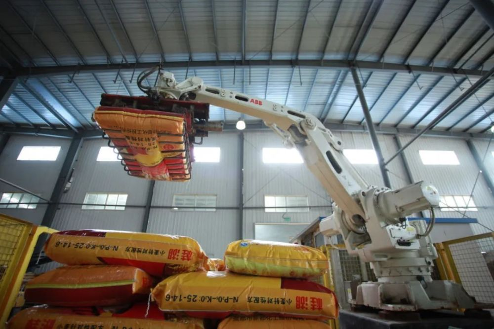
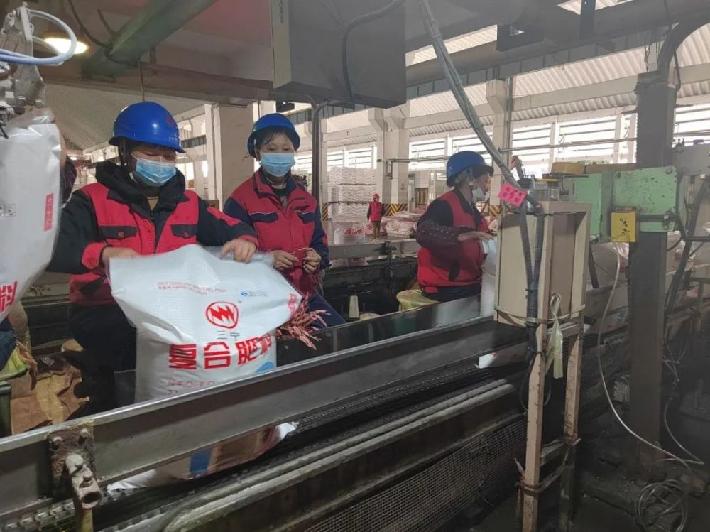
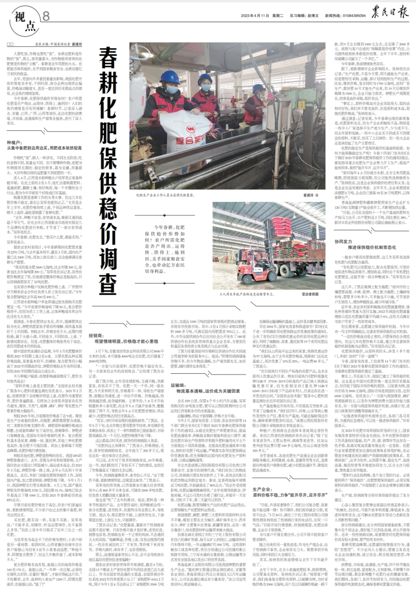

# 春耕化肥保供稳价调查

今年春耕，化肥保供稳价形势如何？农户所需化肥是否产得出、运得快、供得上、施到田，关乎国家粮食安全，也牵动亿万农民切身利益。

人要吃饭，作物也要吃“饭”。如果说肥料是作物的“饭”，那么，使用量最大、为作物提供营养的化肥便是作物的“主粮”。春耕是全年用肥的大头。化肥能否保供稳价，关乎到国家粮食安全，也牵动着亿万农民的收益。

去年，受国内外多重因素叠加影响，我国化肥市场形势复杂多变，个别时段、部分品种出现供应偏紧，价格波动幅度大、甚至一度达到历史最高点的情况，社会焦灼情绪显现。

今年春耕，化肥保供稳价形势如何？农户所需化肥是否产得出、运得快、供得上、施到田？人们的焦灼情绪是否有所缓解？春耕时节，记者深入湖北、安徽、江西、广西、山西等省份，走访化肥的消费端、市场端、流通端和生产端等全链条，进行了深入采访。

**01**

**种植户：**

**从集中备肥到边用边买，用肥成本依然较高**

作物吃“饭”，跟人一样讲究。不同生长阶段，吃的食物不同，饭量也不同。但不管哪种作物，底肥为作物提供长期的、稳定的营养，最为关键，用量最大。大田作物后续的追肥量不到底肥的一半。

进入4月，江西省水稻种植大户吴军亮正准备种植早稻。在此之前的2至3月，他忙活着购置肥料、基施底肥、翻耕土壤、育好秧苗，每一个步骤的全力付出，都为今年早稻有个好收成打好基础。

购置化肥是春耕工作的头等大事。但这几年化肥价格不稳定，着实让吴军亮感到忐忑，“尤其是去年上半年，化肥价格持续上涨，个别品种供应紧张，顾不上高价，就赶紧购置了春耕化肥。”

“去年，种粮不容易，农资成本高，晚稻又遇到高温干旱天气。好在去年江西省新余市政府对指定几个品牌的化肥进行补贴，才节省了一部分农资成本。”吴军亮坦言。

今年春耕，化肥充足。“想买什么肥，都能买到。”吴军亮表示。

据农业农村部预计，今年春耕期间化肥需求量为2270万吨，与去年基本持平，截至3月底，国内生产量已达2400万吨，再加上部分进口，完全能够满足春耕生产需要。

“我买的复合肥3600元每吨，比去年降300元，尿素也比去年每吨降200元。”吴军亮告诉记者，虽然化肥价格便宜了些，但他感觉整体价格还是挺高的，只从经销商那里买了32吨化肥。

也有部分种植户反映化肥价格上涨。广西贺州市天顺来农业合作社负责人彭上坚告诉记者：“今年复合肥每吨比去年高300至400元。”

江西省水稻种植户李金萍通过批发商购买化肥便宜一些。“今年尿素价格每吨下降50元，复合肥价格持平，但因为员工工资上涨，总体种粮成本和去年比没有太大变化。”

据调查，今春化肥供应充足，其中，氮磷肥供应较为充足，钾肥供需紧张矛盾有所缓解，保供基本面好于上年同期。相较去年，价格变化不大，近期行情较稳，属于大稳小调，不同地方、不同阶段，上涨、下跌情况都存在。但是，化肥整体价格依然处于高位，农民用肥成本仍然较高。

据中国农资流通协会监测，今年3月化肥整体价格较2021年同期上涨2至6成。主要化肥品种近期价格趋稳，尿素基本持平，但磷铵、复合肥等仍小幅高于2022年同期高价位，钾肥价格较去年有所回落，但较2021年同期仍高出五成左右。

不少种植户疑惑，疫情影响减弱情况下，肥价为何依然高企？

“原料价格上涨是主要因素。”全国农业技术推广服务中心肥料质量监测处吴优表示。2021年2月起，疫情背景下全球粮价明显上涨，化肥作为重要农资，肥价普遍跟涨。后续加之全球很多国家存在货币超发，煤炭、天然气、硫磺、磷矿、钾矿等化肥生产要素价格大幅抬升。

相较2021年初，目前煤炭价格涨了近9成。煤炭是生产合成氨的原料，而氮肥、磷肥都需要合成氨，对二者都有价格支撑作用。磷肥原料硫磺价格波动频繁，合成氨和磷矿处于高价位，很难降价。钾肥进口依赖度高，受国际市场价格制约更多。复合肥原料基本是尿素、磷酸一铵、氯化钾，其他三种化肥都是高价，复合肥不可能回落。再加上春耕属于用肥高峰期，化肥价格行情坚挺。

相较其他化肥，钾肥是特殊的存在。我国45%的钾肥依靠进口。去年，受俄乌冲突和疫情影响，主产国向农业大国出口明显减少，海运成本高企，自2021年3月起，钾肥价格一路上扬，去年6月达到十年来最高点。此后，多部门加强化肥保供稳价工作，深挖国内产能，加之需求转弱，钾肥价格下降。今年1月1日，我国钾肥实行零关税政策。3月上旬，国产氯化钾批发价格每吨3720元，同比降10.1%，每吨已较去年最高点下降1000元，但较2021年春耕前仍然高85%左右。

尽管目前化肥价格处于高位，但农户们普遍反映，看跌情绪明显，不少农户由过去的集中备肥，转为边用边买。

买化肥，跟买房一样，买涨不买跌。吴军亮说：“不敢多买，怕降价，听说还要掉价，先不备那么多货。”而彭上坚今年只购买了往年三分之一的化肥。

当吴军亮为高企不下的价格发愁时，小农户却是另一番场景。前段时间，山西省襄汾县南辛店乡农户崔银山为自家3亩冬小麦春浇追肥。“种地不多，即便复合肥贵了，但这几年粮价涨了，成本影响不大。”

复合肥价格有高有低，崔银山买的每袋价格是160至170元。崔银山说：“一年种一次庄稼，必须给庄稼吃点好的、足量的‘粮食’，才能对得起这片田。”不枉勤劳，去年，他种的小麦亩产1200斤，即便化肥涨价，但崔银山说：“值了！”

**02**

**经销商：**

**观望情绪明显，价格稳才能心里稳**

3月下旬，安徽省浩然农业科技有限公司5000平方米的仓库，本可储备4000吨左右化肥，但只储备了2000吨货物。

“一方面与目前原料、化肥价格不稳定有关，另一方面来自去年的深刻体会。”总经理丁凯告诉记者。

据丁凯介绍，去年受疫情影响，交通不畅，货源紧张，有钱买不了货。化肥一天一个价，同一款化肥，今天卖和明天卖，价格都不一样，导致生产端惜售，放慢出货速度，进一步拉升价格。价格越高，经销商越恐慌，抢货越积极。正常年份，7、8月才开始购置秋季小麦化肥，而去年5、6月就开始备货，整整提前了两个月，导致去年5、6月化肥需求增加，供应减少，化肥价格达到历史最高点。

“其实，当时市场呈现的是假性缺货。”丁凯说。去年5月下旬，东北作物主要用肥季节结束，率先降价甩卖剩余库存，再加上下一季作物需求已提前备好，市场需求减弱，仅一个月后，化肥价格便开始下降。

这让最高点时买进、囤货的经销商陷入焦虑。

“没想到这么快降价。”丁凯表示，价格倒挂，无奈，很多经销商赔钱卖。去年他亏了200多万元，现在还有一部分库存正在消化。

可以说，去年对于很多经销商来说，10年难遇。这一年，他们既经历了有钱买不了货的情况，也经历了价格暴涨又下跌的无奈过程。

今年，经销商谨慎很多，拿货信心不足。“由于肥价不稳，看跌情绪明显，边观望边拿货。”丁凯表示。

吴军亮的供货商，江西省新余市施大壮农资批发中心有800多平方米仓库，可储存2000多吨化肥，但负责人郭鹏没敢大量备货。

他也是“吃”了去年的教训。他说，肥料是一种季节性强的产品。去年肥价高时，预判晚稻会用一部分化肥量，进货较多，但最终没有走那么多，导致亏损。他认为，现在肥价不稳，上游供货充足，下游观望态度，上游压力大，只能降价。

丁凯告诉记者：“化肥暴涨、暴跌对于经销商来说都不是好事。只有价格平稳才是好事，进货好进，销售也容易，经销商也有一个正常的利润，不会遇到太大的风险。”他解释道，价格上涨，容易出现毁约情况，一些没有诚信的工厂不发货，等价格下来再发货。价格大跌时，库存多了，也容易赔钱。

那么，流通渠道拿货信心不足，会不会导致部分地区基层化肥到位进度偏晚？

据农业农村部农资保供专班调度，截至4月初，全国13个粮食主产省份化肥平均到位进度已达九成以上。作为全国农资流通的主渠道，全国供销合作社系统2022年四季度累计从工厂采购肥料4163.2万吨，预计今年1至4月还将从工厂采购肥料3500万吨左右，完成近1000万吨的国家和省级化肥商业储备，并将有序投放市场。其中，3至4月预计采购实物肥料1800多万吨，可满足国内用肥需求70%以上。此外，中华全国供销合作总社向社会公开发布了180家供销合作社系统农资保供重点企业名单，方便农民和基层各类经营主体及网点与企业对接。

丁凯与安徽省宿州市埇桥区供销合作社共同成立符离李桥为农服务中心。他说：“即便经销商储备货物不多，但今年物流通畅，生产端货源充足，如有需要，随时调货也来得及。”

_工人用叉车把产品转运至运输货车上。受访者供图_

**03**

**运输端：**

**物流基本通畅，运价成为关键因素**

全长559公里，仅需6个半小时汽车运输，吴军亮购买的32吨复合肥，便可从云图控股荆州分公司运到江西省新余市的水稻基地。

运输通畅，供应才能保障，价格才会平稳。

今年2月，国家发改委、工信部、农业农村部等14个部门联合发布《关于做好2023年春耕化肥保供稳价工作的通知》，从稳定化肥生产和要素供应、提高化肥流通效率、积极稳妥做好储备和进出口调节、规范化肥市场生产经营秩序和提升肥料施用水平五个方面提出十项具体措施。在提高化肥流通效率中指出，组织好化肥干线运输，严格落实农用化肥铁路运价优惠政策；优先保障供应国内的化肥及生产原料水路、公路运输畅通等。

辛志杰是成都云图控股股份有限公司负责江西省新余市、宜春市的销售代表。“我们有自己的物流公司，经销商只需在相关软件上下单，系统会匹配司机把货物运到指定地方。新余、宜春两地每年销售近万吨化肥，年前就提走了80%左右。”而去年受疫情影响，化肥运输稍微麻烦些。“去年疫情导致新余、伊春封城，不过公司及时办理了通行证，并提早一天安排，司机不下车，第二天就可以到货。”

化肥运输，既要保障生产出的化肥产品运得出，还要保障生产化肥原料运得进。

我国氮肥、磷肥、钾肥三大肥料所用原材料分布不平衡，煤炭主要在北方城市，磷矿南多北少、西多东少，钾矿主要集中在青海、新疆等省份，还有一部分靠进口，给化肥原材料运输带来极大挑战。

坐落在湖北省枝江市的三宁化工股份有限公司有自己的磷矿资源，每天从矿山到枝江，运输原料的汽车络绎不绝，一年运输磷矿约300万吨。这些原料被加工成各种化肥，然后分别通过公司自建的紫云铁路专用线、三宁深水港码头集装箱、公路运输等方式发往全国各地以及出口到世界各国。

青海盐湖工业股份有限公司是我国钾肥的重要生产企业。“氯化钾主要通过铁运销往湖北、安徽等农业省份，青海省周边（西北五省地区）以汽车运输为主，公司在流通区域还有少量库存。”该公司宣传培训中心郭亚楠表示。

在确保运输通畅的基础上，运价是关键考虑因素。

早在2004年，国家发改委和铁道部专门印发《关于进一步明确农用化肥铁路运价优惠政策的通知》，公布了首份《实行铁路优惠运价的农用化肥品种目录》，列明了硫酸铵、尿素、氯化铵等19个农用化肥品种实行优惠运价。

“我们从山西高平运过来的尿素，铁路优惠运价为97元每吨，由于去年化肥价格高，铁路部门还在此基础上，再次优惠了10%至20%，一吨运费80多元。”丁凯表示。

“但目前执行不同生产标准的化肥产品，也未全面列入优惠运价目录。例如目前执行《肥料级氯化钾（GB/T37918-2019）》标准的产品已纳入铁路运输优惠目录，而先前制定的《氯化钾（GB/T
6549-2011）》标准下产品却未列入，目录还存在进一步优化的空间。”全国农业技术推广服务中心肥料质量监测处处长田有国告诉记者。

生产基地靠近市场布局，不仅提高交货效率，还节省了运输成本。“我们在四川、河南、山东等核心粮作及经作主产区，都有生产基地，可就近辐射周边市场，确保春耕用肥及时送达。”成都云图控股股份有限公司媒介采购部部长李俊蕊表示。

种植户、经销商也会选择本省或周边省份货源。来自江西省的经销商彭奇告诉记者：“除了在本省进货外，主要从贵州、湖南等省进货。比如从贵州进货运费只要100多元每吨，但从云南进货得300多元。”

为节省成本，各地化肥生产流通企业还创新营销服务模式，利用微商、电商、直播带货等方式，直接面向终端用户销售化肥，减少化肥流通环节、降低化肥流通成本。

_化肥生产企业工作人员正在将化肥装袋。崔建玲
摄_

**04**

**生产企业：**

**原料价格不稳，力争“能开尽开、应开尽开”**

“目前，外省尿素降价了，咱们公司复合肥、尿素能不能也降一降？你不降价，我们库存就会亏损，更卖不出去。”3月30日，湖北三宁化工股份有限公司销售经理张炳亮挂了经销商打来的电话后，长叹一口气说：“目前市场行情看跌，经销商观望，化肥出库慢，企业日子很艰难。”

为与客户开展长期合作，公司不得不按照客户要求降价。

随之而来的另一重焦虑是，作为生产端企业，由于经销商不拿货，企业库存压力大。既要承担市场风险，同时承担巨大仓储压力。

其实，张炳亮的焦虑情绪从去年下半年就开始了。

去年下半年，北方小麦施底肥旺季，按照惯例，公司要备足原料。张炳亮告诉记者：“按照客户要求，我们准备复合肥所有原料，以硫磺为例，当时采购价格为3500元每吨，而7月以后硫磺价格就一路下跌，到9月左右降到1000元左右，足足降了2000多元。按照与客户达成的‘保障最低价结算’约定，公司最终按照秋季最低价结算。去年下半年，原材料仅硫磺公司就亏了一个多亿。”

今年春耕，焦虑情绪依然存在。

眼下，看跌情绪对企业影响较大。张炳亮告诉记者：“生产化肥，不是今天要，明天就能生产出来，而是要经历采购、运输、排计划到组织生产的过程。比如，煤炭价格，签合同时为1700元每吨，送到厂里生产，最快要10天才能生产出来，但10天后煤炭价格降为1500元，企业只能亏损卖。钾肥生产周期更长，经常是高价采购，低价卖出。”

“事实上，原料价格高对企业风险很大，低的话相对好些，我们并不想卖高价，但是原料成本高，助推化肥价格高。”张炳亮表示。

通过调查，记者发现，今年春耕出现的新现象是：化肥原料充足，但生产企业积极性不高，特别是一些中小厂家选择不生产或少生产，少亏或不亏。而去年原料短缺，一些中小企业买不到或买不到便宜的原料，不敢买，怕买了之后掉价。但一些大企业还是承担起了生产主要责任。

化肥的稳定生产是保供稳价的基础和前提。如何才能保障稳定生产呢？今春十四部门发布的《关于做好2023年春耕化肥保供稳价工作的通知》提出，督促指导重点化肥生产企业努力开工生产，提高产能利用率，做到“能开尽开、应开尽开”。

“面对每年4、5月份南方水稻、北方玉米用肥高峰期，即使面临亏损预期，但公司依然选择继续生产。”张炳亮说，这是企业保供稳价的责任和义务，也是企业长远发展的考虑。去年冬天，企业承接国家淡储肥5万吨，企业自己储备18至20万吨肥料，以保春耕生产。

青海盐湖钾肥和藏格钾肥两家生产企业扩大120万吨（实物量）产能全部开工，不断增加供应量。

“目前，公司在全国的十一个生产基地的肥料生产线马力全开，日产肥料近2万吨，同比增长38%。”新洋丰农业科技股份有限公司副总裁赵程云表示。

**05**

**协同发力**

**推进保供稳价机制常态化**

一般农户都用化肥做底肥，这几年吴军亮选择有机肥与化肥配合施用。

“有机肥可以培肥地力，配合化肥使用，可更好地促进作物品质提升，增加收益，同时由于有机肥比化肥便宜，还能节省一部分种粮成本。”吴军亮告诉记者。

这几年，丁凯在做测土配方施肥。“宿州市的土壤需要高氮、中磷、低钾。测土配方施肥，土壤缺啥补啥，需要多少补多少，不多施也不少施，可节省农户无效投入，增加种植收益，减少环境污染。”

近年来，农业农村部积极推动化肥减量增效、绿色种养循环等重大项目实施，2022年我国化肥减量增效示范区化肥施用量平均减少6%，这些方式确实为农户节省了一些农资成本。

但长期来看，还需建立保供稳价机制。今年中央一号文件明确提出，完善农资保供稳价应对机制。

“一定的价格波动是正常的，只要保持在合理范围内。但这几年化肥价格不太稳，建立并完善保供稳价机制是极为必要的。”田有国告诉记者。

化肥保供稳价，从原料到田头，涉及十多个部门，多部门如何“下好一盘棋”？

今春，国家发改委、工信部等14个部门发布的《关于做好2023年春耕化肥保供稳价工作的通知》，为春耕化肥保供稳价奠定了基础。

事实上，早在前几年，我国已建立了保供稳价机制。这也是去年国内化肥价格一度达到历史最高点，但仍低于国际市场价格的原因。以尿素为例，国内市场为3000元每吨，国际市场是我国的2倍，达到6000元每吨。吴优表示：“一方面与我国煤炭、磷矿资源能够自主，以及作为钾肥消费大国议价能力强有关，另一方面与我国保供稳价机制、淡储计划、进出口政策及时调整等措施有关。”

“应推进保供稳价机制常态化，各部门各司其职，当遇到应急情况，可以统一推进保供稳价。”田有国表示。

在2023年化肥市场和国际贸易研讨会上，国家发展改革委经贸司张金光指出，今年化肥保供稳价工作具备较好基础，但产、供、储、销等环节还存在一些矛盾，距离实现高质量发展还有一定差距。化肥行业发展需要更加完善的政策体系保驾护航，有必要逐步构建系统协调的产供储销调控政策体系。其牵涉面广，应多方协作，从供需平衡、稳定生产、高效流通、规范经营等多维度协同发力，区分主次与轻重，聚焦重点有序推进。

“肥料行业比较特殊，是个加工型的行业。必须做到两个‘保供稳价’，化肥想要保供稳价，必须实现原料的保供稳价。”中国氮肥工业协会理事长顾宗勤表示。

生产端、经销商等分别对保供稳价提出了各方建议。

心连心集团复合肥事业部副总经理孟铮表示：“机械化、自动化，可提升效率和质量，降低成本，促进环保和安全，还可解决化肥装车劳动力老龄化及人员断档等问题。”

部分经销商建议：充分利用国家储备政策，不要集中在个别企业，最好能下沉到各县域，并公开指导价。还有一些经销商反映，尿素期货对化肥保供稳价具有较大影响，要严防资本炒作。

春耕用肥高峰期，还需谨防制售假劣行为，谨防“忽悠团”。不少业内人士建议：需建立各县龙头企业沟通机制，成立协会，联合抵制忽悠团，净化市场。

消费端、市场端、流通端、生产端，四个环节像齿轮一样，相互连接，紧密配合，互相影响，不管哪个环节出现问题，都会影响整个化肥行业的健康发展。我们期待，各部门、各环节协同发力，共同推动化肥保供稳价机制常态化，确保春耕化肥量足价稳。

**作者：农民日报·中国农网记者 崔建玲**

**【版权声明】本文著作权归农民日报所有，未经授权，不得转载。**

