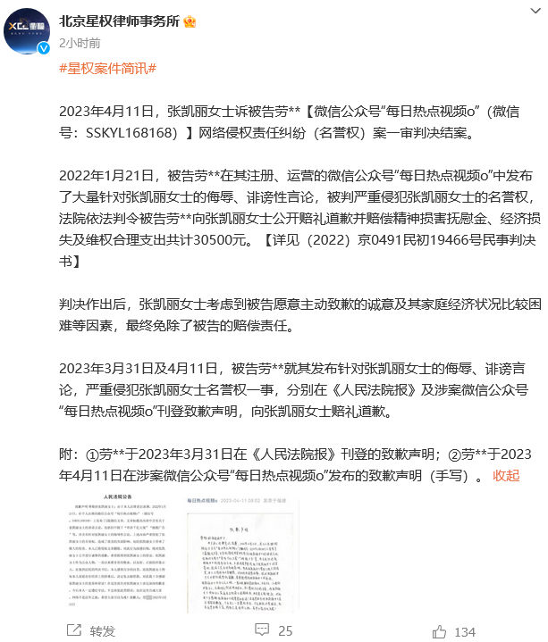
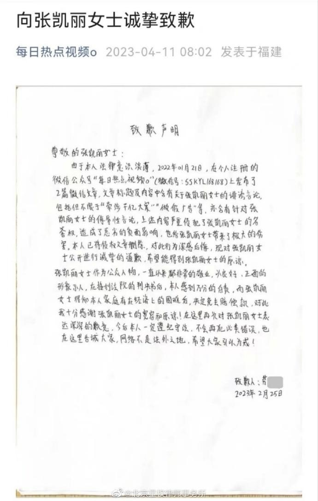
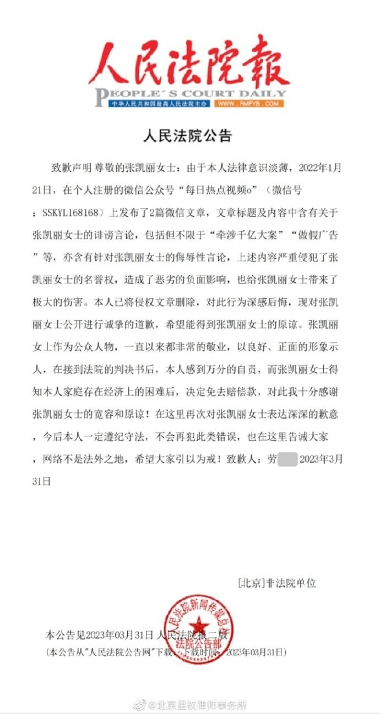
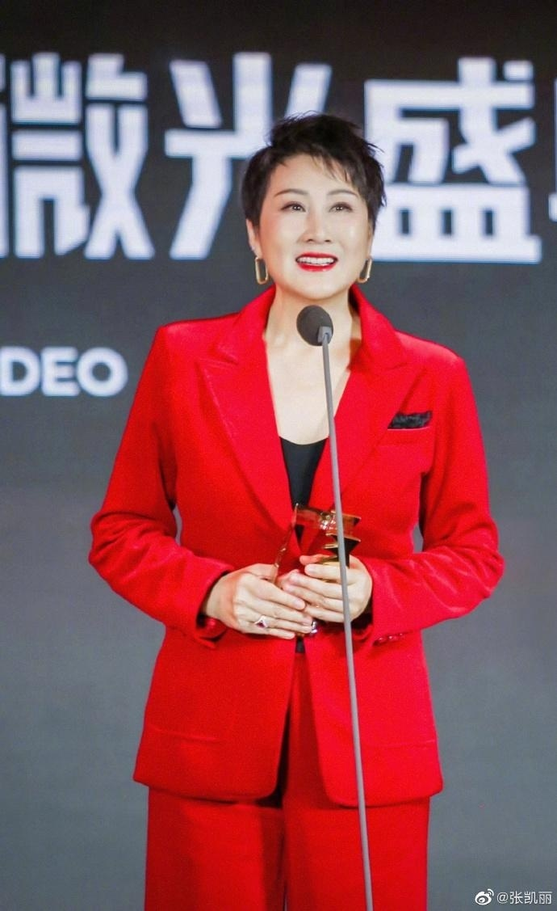

# 演员张凯丽名誉权维权胜诉：考虑到被告经济困难，免除赔偿责任

4月11日，北京星权律师事务所发布案件简讯，女演员张凯丽诉被告劳某某网络侵权责任纠纷（名誉权）案一审判决结案。

案件简讯全文如下：

2022年1月21日，被告劳**在其注册、运营的微信公众号“每日热点视频o”中发布了大量针对张凯丽女士的侮辱、诽谤性言论，被判严重侵犯张凯丽女士的名誉权，法院依法判令被告劳**向张凯丽女士公开赔礼道歉并赔偿精神损害抚慰金、经济损失及维权合理支出共计30500元。【详见（2022）京0491民初19466号民事判决书】

判决作出后，张凯丽女士考虑到被告愿意主动致歉的诚意及其家庭经济状况比较困难等因素，最终免除了被告的赔偿责任。

2023年3月31日及4月11日，被告劳**就其发布针对张凯丽女士的侮辱、诽谤言论，严重侵犯张凯丽女士名誉权一事，分别在《人民法院报》及涉案微信公众号“每日热点视频o”刊登致歉声明，向张凯丽女士赔礼道歉。

附：①劳**于2023年3月31日在《人民法院报》刊登的致歉声明；②劳**于2023年4月11日在涉案微信公众号“每日热点视频o”发布的致歉声明（手写）。

据人民法院公告显示，被告人在其注册的公众号中发布关于“牵涉千亿大案”“做假广告”等诽谤言论。

公开资料显示，张凯丽1962年9月29日出生于中国吉林省长春市南关区，毕业于吉林艺术学院，中国内地女演员、国家一级演员，代表作有《渴望》《军嫂》《裸婚时代》《咱们结婚吧》《人民的名义》等。

**【来源：九派新闻综合北京星权律师事务所官博、当事人账号】**

