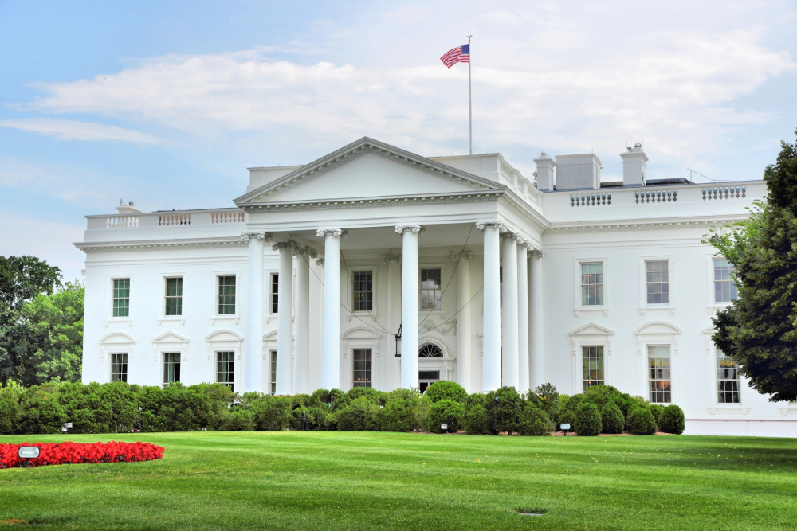

# 白宫：拜登签署法案，结束美国新冠疫情“国家紧急状态”

【环球网报道】法新社等多家外媒最新消息称，美国总统拜登当地时间10日签署法案，正式结束新冠疫情“国家紧急状态”。

法新社说，白宫表示，拜登当天签署了国会早些时候通过的一项法案，“终止与新冠疫情有关的国家紧急状态。”法新社在报道这一消息的同时提到，新冠疫情已在美国造成超100万人死亡。

_白宫
资料图_

另据《国会山报》报道，此前，有近200名众议院民主党人针对该法案投了反对票，但法案仍在众议院获得通过；随后该法案在参议院两党议员中获得68票赞成票、23票反对票通过。

《国会山报》称，白宫此前曾表示，计划在5月11日逐步结束围绕新冠疫情的国家紧急状态和公共卫生紧急状态，并允许各州开始逐步结束在紧急状态下制定的措施。不过有专家表示，结束紧急状态将产生“有限的影响”。

路透社今年1月31日报道称，美国总统拜登宣布将于今年5月11日正式结束该国2020年延续至今的新冠疫情国家紧急状态以及公共卫生紧急状态，回归常态化管理。紧急状态结束的同时，也意味着这些保障性的法规、免费医疗及纾困措施逐一失效。关注医疗保健问题的美国非营利机构凯泽家族基金会负责人詹·凯特当时表示，“人们很快就会注意到，他们得为一些紧急状态期间免费的东西埋单。”

