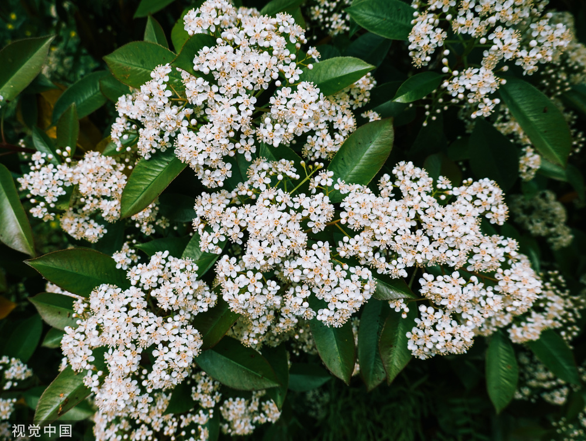

# 石楠花因腥气被“网暴”：功能上“无所不能”，不代表选择中无可替代

评论员 陈思

东西就怕有梗，一旦有梗，好的更加功德无量，坏也要罪加一等。

石楠花，最近就臭成了网络上的热梗。知“楠”而退，强人嗦“楠”，“石楠花的花语：yue”……石楠花到底是个什么味，才这么让“闻者”苦不堪言？

有段子说，闻香师将石楠花的味道描述为：四分海腥气，三分杏仁牛奶味，两分茉莉玫瑰混合花香与一分怪诞上头的浓稠粘腻感。但普通人的嗅觉没那么灵敏，不论怎么闻，都是一股精液味！

有了这个与性相关的热梗，网友们自然兴致勃勃、兴奋不已，男男女女在遮遮掩掩中羞羞答答地说说笑笑，一派春意盎然。都说这花“罪大恶极”，可怎么看它都是劳苦功高啊……

其实除了臭，石楠花在降尘环保、吸附有害气体、减少噪音、美化环境等多个方面作用突出，更主要的是它是“低维护”“易维护”的植物，是非常适合用于大面积绿化工程的植物。没有必要污名化它。

但科学上无毒，不代表生活中无害。功能上“无所不能”，不代表选择中无可替代。

既然石楠花因为气味难闻屡上热搜，就说明它在某种程度上确实对很多人的生活产生了困扰。有没有替代树种？能不能减少种植密度？可不可以移植出人口密集区？这些问题，显然还需要园林部门进一步给出明确的答案。

责任编辑:王珍珍

