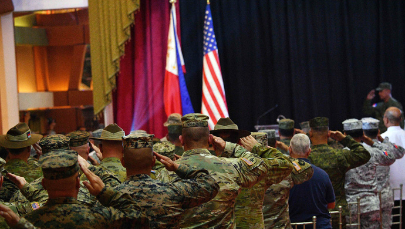

# 美菲“肩并肩”军演开幕，规模前所未有，专家：针对南海的意味明显

今天，美国拉着菲律宾，在全世界面前“秀团结”。

在菲律宾首都马尼拉，史上规模最大的美菲“肩并肩”联合军演拉开帷幕，以提升两军配合作战能力。

在美国首都华盛顿，美菲外长防长“2+2”会谈即将启动，以推进两国在“印太地区”的密切合作。

今年的演习有何特点？美菲外交和军事关系走势如何？将对地区局势带来怎样的影响？随着菲律宾海域舰笛鸣响，一串问号浮出水面。

**军演：针对性强**

“肩并肩”是菲美年度例行大型军演，始于1991年，1995年一度中断，1999年重新恢复。今年已是第38届。

虽说例行，但与往年比，今年又有诸多破例之处。

一是，规模前所未有。

这场为期18天的演习将有逾1.76万名士兵参加（包括菲军5400人、美军1.22万人和澳大利亚军队111人）。日本、英国以观察员身份参与其中。这是过去30多年来规模最大的一次“肩并肩”联合军演，参演人数几乎是去年的两倍。

二是，内容守故纳新。

往年的演习，内容大多以两栖登陆、联合反恐、人道救援等常规科目为主。今年的演习创下多个“首次”，如首次设立海上实弹射击环节，其中包括“爱国者”导弹、“海马斯”高机动火箭炮系统的实弹训练；首次设置实弹击沉目标船项目，两军将在西菲律宾海击沉一艘61米长的模拟敌舰；首次进行网络防御演练，以增强两军网络空间作战能力等。

“今年的演习将走出传统训练区，进一步测试联盟的互操作性和准备情况。”美菲联合军演发言人洛基科说。

三是，地点较为敏感。

演习将在菲吕宋岛北部、巴拉望省、巴坦群岛省和三描礼士省等地区举行，包括南海争议岛屿附近。有外媒预告，双方将首次在南海展开实弹射击。

**中国社会科学院亚太与全球战略研究院研究员许利平**
指出，与过去一段时间相比，这次演习的主要区别在于，针对性强。以前的演习更多是以人道主义救援、救灾、反恐等科目为主。现在，两军在南海进行实弹射击，针对南海的意味愈发明显。

**军事专家王强**
认为，本次军演有两方面特点，其一，军兵种作战要素、兵力部署以及调动使用情况比以往更大。其二，进一步坐实了美菲军事联盟围堵、遏制中国的意图。

直观来看，“相较前几年，今年的演习是在菲律宾新政府倒向美军怀抱、近期开放4个新军事基地的背景下举行。”王强说，演习场景会涉及4个新军事基地的使用问题。鉴于这些基地的敏感位置，也预示着美军下决心要把菲律宾打造成在台海、南海问题上对抗和遏制中国的桥头堡。

从深层次看，“自奥巴马政府推出‘亚太再平衡’政策以来，美国长期在亚太地区进行集中部署、集中调动。在这个过程中，60%的再部署已经完成，但一直缺少一个前沿存在。”王强指出，如今，尽管菲律宾声称不会介入中美之间的矛盾冲突，但因为新基地的存在，客观上弥补了美军的短板，形成了菲律宾为美军提供战略支撑的态势。

**对话：关系回暖**

美菲军演开幕之际，在太平洋彼岸，美国国务卿布林肯和防长奥斯汀定于11日在华盛顿接待来访的菲律宾外长马纳洛和防长加尔维斯，共同举行“2+2”部长级对话。

这是该机制自2012年4月启动以来的第三次聚会，也是继2016年1月后时隔7年一键重启。

根据双方预告，会谈期间，两国代表将就能源、安全、贸易和经济合作等重要问题展开对话，还将确认“促进地区安全、实现共同繁荣、联盟现代化以及打击恐怖主义和其他跨国犯罪”的具体举措。

两位分析人士认为，两国高官“久别重逢”并不让人意外。就在本月初，美菲加强防务合作的氛围已被推至高点。

当时，菲律宾国防部正式宣布4个新增军事基地的位置，允许美军根据美菲2014年《加强防务合作协议》轮换驻扎、使用跑道和燃料库等设施。这样一来，美军在菲律宾可以使用的军事基地总数增加至9个。

更引人注目的是，4个新基地的选址（3个靠近吕宋岛北部、1个位于巴拉望省的巴拉巴克岛）极具战略意义。

吕宋岛北部与中国台湾岛隔巴士海峡相望。巴士海峡是一处咽喉要道，中国海军可由此进入开阔的太平洋，美国军舰也可由此进入南海。巴拉巴克岛靠近中国南沙群岛，面向中国南海海域，可容纳不同类型潜艇，对于该地区任何地点的海上防御行动都可能至关重要。

正因如此，一些外媒得出结论：菲律宾在外交上“迁就”美国，美菲在军事上加强“绑定”。

从新增基地，到重启“2+2”部长级对话，一连串军事和外交互动，究竟折射出双方怎样的考量？

“新一届菲律宾政府的对美政策正在回调。”许利平指出，2016年杜特尔特政府上台后，美菲关系出现降温。如今，小马科斯政府上台后，美菲关系正在回暖，美菲同盟进入加固进程，在军事和外交合作上表现出更趋协调、紧密的走向。

究其背后，许利平从内外两方面加以观察。内部，在南海问题面临压力的情况下，菲律宾政府有一定需求，想通过加强菲美合作，获得军事和经济上的更多利益。外部，美国希望通过加强美菲军事合作，更好地把菲律宾绑架在“印太战略”框架上，为美国的利益服务。

“但是，美国能否满足菲律宾在经济上的愿望和需求，仍是重要的观察点。”许利平说，美国许诺给菲律宾8500万美元援助，用于升级原有的5个老军事基地。但这笔建设费与实际需求比，仍是杯水车薪。

王强注意到，小马科斯上台后首个出访的非东盟国家就是中国，还推出新的大面积减贫计划。可见，他上台后的初衷是发展经济、搞好对华关系。但是，菲律宾政坛的结构谱系非常复杂，受家族政治势力胁迫、域外势力干涉等因素影响，再加上菲律宾国内矛盾重重，小马科斯似乎正在走向另一条道路。

**局势：更趋复杂**

美菲在练兵场上“大展拳脚”之际，舆论发现，“美菲+”多边合作同样势头强劲。

有日媒披露，菲政府正积极加入包括美国及其盟友的新多边讨论，菲参议院也持支持态度。上月，美英澳宣布核潜艇计划细节时，东盟只有一个国家支持，就是菲律宾。如今，新的地区权力集团呼之欲出，比如，日菲美拟于本月成立三方安全对话机制，以应对中国。

对此，菲律宾国内不乏批评和质疑。

一些商界和政界人士反对菲律宾与美国及其盟友“过从甚密”，担心菲律宾被美国的地缘政治议程劫持，其中包括前总统杜特尔特、小马科斯姐姐伊梅·马科斯等。数百名菲律宾民众11日举行集会抗议，要求美军离开菲律宾。

两位分析人士指出，随着美菲、“美菲+”加强防务合作，地区局势呈现出更为复杂的态势。

“美菲军演是一个危险信号。”王强从三个层面进行分析。

一来，在中美关系遭遇困难的情况下，美国执意在中国周边加强军事部署、策动与盟友的军事演习，无非想借此向中国施压，势必会遭到中方反制，也会推动地区局势进一步升温。

二来，美菲军演挑动南海局势朝着更不稳定的态势发展，也会对其他国家施加负面影响。目前，一些周边当事国仍有较清醒的认识，希望保持地区和平发展，不想介入大国矛盾。

三来，可以想见，在遏华战略抓手和能力不足的情况下，美国肯定会继续打“联盟牌”，进一步打造环绕中国的联盟包围圈。未来，不排除多点联动，形成新的对华军事战略包围的态势。

“毫无疑问，地区集团化的趋势值得警惕。”许利平指出，打造所谓的小集团，只能满足个别国家利益、集团利益，并不符合地区的广泛利益、共同利益。不过，这种小集团能走多远，有待时间的检验。

**走向：仍在摇摆**

值得一提的是，两位分析人士都提到，尽管菲美合作升温，但并不能简单地判断小马科斯“倒向”美国。

从历史上看，“美国势力长期在菲律宾深度介入，菲律宾很难实现真正的主权自主。”王强说，因此，目前的态势也是多方权力平衡的结果。

从现实看，“小马科斯政府仍处在动态平衡的过程中，仍在中美之间不断摇摆，尚未找准一个停靠点。”许利平指出。

一方面，菲律宾不愿意绑在美国的战车上，这不符合菲律宾自身利益。作为东盟成员，奉行大国平衡，是其一贯的外交原则。美军长期驻扎留给菲律宾人的历史伤痛仍在。反对美国长久驻军，也是写入菲律宾宪法的基本原则。即使《加强防务合作协议》规定的9个军事基地，也只允许美军临时存在，而不是长久驻扎。

另一方面，菲律宾正通过在中美之间出险招、走险棋，试图获得自身利益的更多筹码。为了应对南海局势等现实问题，菲律宾国内也存在“希望将美国作为地区平衡力量”的声音和需求。但是，菲律宾能否如愿以偿，这些险招、险棋能否达到其目的，仍待观察。美菲自1951年结盟以来，与其他美国盟友比，菲律宾得到的美方援助较为有限。

