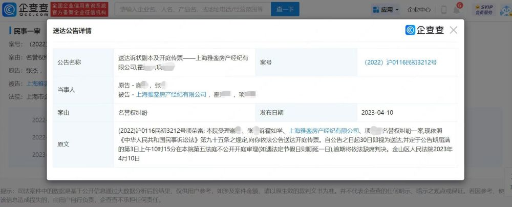
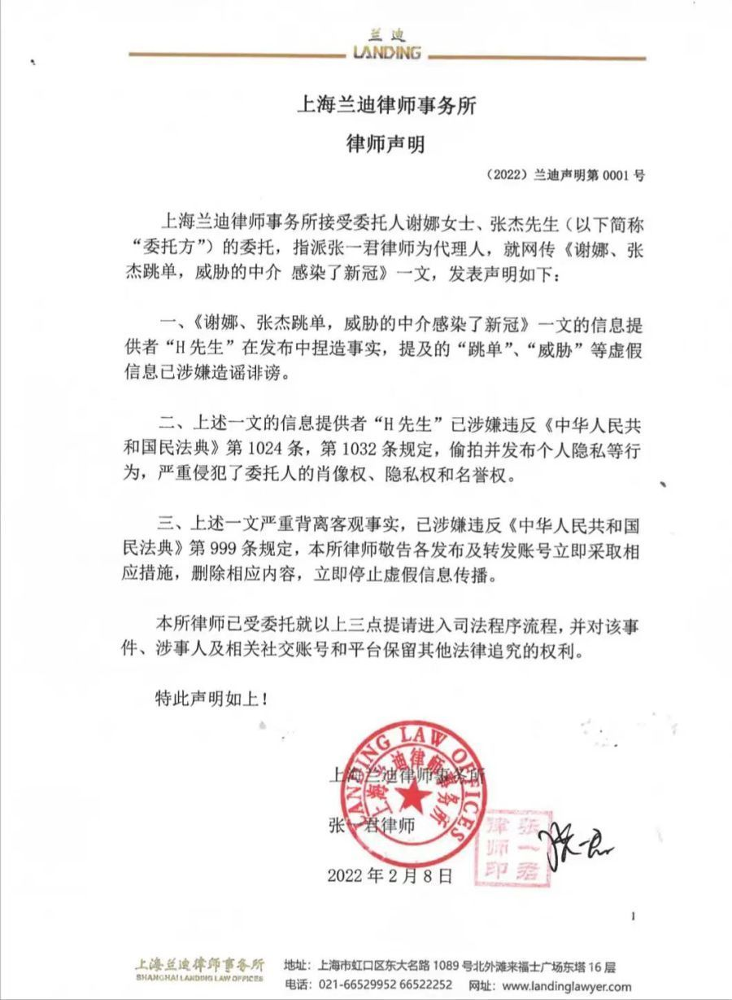

# 谢娜张杰因名誉权起诉中介，此前法院已认定二人购房不存在跳单

近日，上海雅銮房产经纪有限公司起诉上海思和资产经营管理中心的中介合同纠纷案一审败诉，法院认定张杰、谢娜购房不存在“跳单”行为，驳回上海雅銮房产经纪有限公司的全部诉讼请求。

企查查APP显示，4月10日，上海市金山区人民法院向上海雅銮房产经纪公司、霍某某等送达诉状副本及开庭传票，原告方为谢娜、张杰，案由涉及名誉权纠纷。文书显示，自公告之日起30日即视为送达,并定于公告期届满的第3日上午10时15分在本院第五法庭不公开开庭审理。

**此前报道**

**谢娜张杰被曝买房跳单，律师发布声明否认**

据媒体报道，2022年2月7日，一位化名H的房产经纪人表示，自己曾于2019年6月21日和22日两次为张杰、谢娜带看房源，后者以不喜欢该房为由不再购买。此后不久，
H经纪人发现二人已私下联系房东上海思和资产经营管理中心，并购买了该房源，以此避开大额中介费。

根据上述经纪人提供的信息，张杰、谢娜所购房源为思南公馆东苑7号101室，面积341.77平方米，竣工时间是2010年，于2019年12月14日正式网签，成交价格为5920万元。

**随后，谢娜张杰方发表声明**

（正观新闻综合国际金融报、企查查等）

