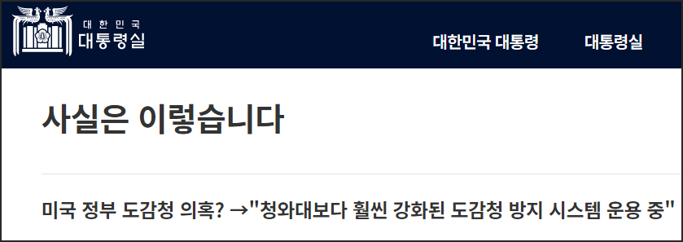

# 韩国总统府否认“长期被美国监听”：部分泄露文件是假的

【文/观察者网 李泽西】

美国五角大楼文件泄露事件持续发酵，文件显示美方涉嫌长期窃听韩国等盟友。此事引发韩国国内不满，韩最大在野党共同民主党表示强烈抗议，该党最高委员郑清来甚至质疑韩国总统尹锡悦“还没去美国，就先挨一耳光”。4月11日，韩国总统办公室发表声明，称认为“相当数量的泄露文件是伪造的”，将“加强与美国的信任与合作”，批评在野党对美国的质疑为“自残”乃至给朝鲜“递刀子”。

_韩国总统办公室声明截图_

据此前报道，尹锡悦将于本月26日起对美国进行国事访问。在美国政府和各大媒体刚发现泄露文件，但涉韩内容尚未被曝光时，韩国总统办公室曾宣布尹锡悦将在美国国会发布“历史性的演讲”，庆祝美韩结盟70周年。这将是韩国总统自2013年5月以后时隔10年再次在美国国会发表演讲。

然而，曝出的文件却可能破坏这一“历史性”时刻。据《纽约时报》8日报道，外泄的文件内容包括韩国政府内部针对是否要违反“不提供致命武器”的原则，向基辅出售火炮弹药进行的讨论，这意味着美国一直在监听这一在亚洲的主要盟友。

“被美国监听突破的安保室…尹总统访美前‘侵犯主权’的不利因素”，《韩民族日报》9日以此为题刊发报道，认为这将对韩美关系产生不利影响。报道称，如果美国中情局（CIA）当真成功窃听到隶属于韩总统室的国家安保室周边人员，这意味着韩国外交安全出现严重漏洞。

共同民主党党首李在明10日在该党最高委员会议上表示，“大韩民国是主权国家，与美国是同盟关系。同盟的核心价值就是相互尊重”，“虽然总统室被窃听一事很荒唐，但从常识来讲，窃听同盟国家的总统办公室也很难让人接受”。该党最高委员郑清来更是批评尹锡悦“已经在日本挨了一耳光，现在还没去美国就要先挨一耳光吗？请保持国家体统。”

韩国总统办公室9日就曾对此事进行初步回应，表示将与美方进行必要的沟通，同时称过往“类似情况”很多，但从未动摇韩美同盟。

_5日，尹锡悦会见美国访问韩国的议员（图源：韩国总统办公室）_

11日，韩国总统办公室再次发布声明称，美韩两国国防部长均认为“相当数量的泄露文件是伪造的”，韩国龙山总统府“是一个军事设施，它的反窃听系统比青瓦台强得多”，因此“关于窃听的指控是荒谬和错误的”。据韩国国防部消息，韩国国防部长官李钟燮当天早上应约同美国国防部长奥斯汀通话，此次通话应美国防长奥斯汀要求而进行。通话中奥斯汀就近期美国军事机密外泄一事向韩方进行了说明。

军队将领出身的韩国国会国防委员会共同民主党议员金炳柱10日在接受《东亚日报》采访时曾质疑“进入总统室的所有设备中可能都被安装了监听装置”。他还提到，“更重要的是，与总统室围墙相连的美军基地是‘治外法权’地区。（距总统室）100米远的地方有美军基地，监听就很容易了”，“美军的龙山酒店是10层以上的建筑，从那里可以观察到一切”。

而韩国总统办公室多名官员11日称，总统府大楼内进行的会议或通话被美国情报机构窃听或监听的可能性微乎其微。韩总统办公室有关人士当天在接受韩联社电话采访时表示，总统府大楼装备了防窃听系统，只是出于保密原因无法对外公开详情而已，总统办公室等总统府各办公空间内都安装有相关设备。韩总统办公室也表示，在总统府地下三层掩体举行的国安会会议内容不可能被窃听或监听。

除了坚决否认被监听之外，韩国总统办公室声明中还给反对派的批评扣上了“通朝”的帽子，称“韩国共同民主党急于煽动公众”，“甚至不屑于检查信息真实性，是在朝鲜‘不断挑衅和核威胁’的情况下，动摇韩美联盟的‘自残’和‘危害国家利益的行为’，信息战是没有边界的，在我们需要加强和发展美韩情报联盟的关键时刻，人民将对共同民主党的外交自残行为作出评判。”

但韩总统室的反驳可能很难浇灭质疑的声音。《韩民族》11日发文称，美国监听韩国总统府已持续40多年，是一个“公开秘密”。报道称，在1970年代，在韩美就驻韩美军撤离、韩国人权等问题发生争执的背景下，美国CIA被曝窃听时任韩国总统朴正熙。《纽约时报》称，美方利用“高性能定向电波探测”，通过玻璃窗的震动等手段窃听，此后朴正熙为避开窃听不再在办公室谈论重要的事情，而是在青瓦台院子里边逛边说。《韩民族日报》报道称，美国家安全局2007年曾将韩国指定为“核心情报收集对象国”。

五角大楼匿名官员此前曾向美国媒体表示，这些外泄文件总体似乎为真。据《华尔街日报》报道，它们部分来自为美国国防部长和参谋长联席会议主席准备的每日情报报告，但五角大楼一些其他人员也可以获得这些报告。拜登政府正努力删除流传的文件，但仍有数十份文件可查看。“这是五眼联盟的噩梦。”或许正如美国情报官员对美媒所说，无论外泄情报是否为真，这些材料的泄露都可能影响盟友间的情报共享。瑞士《新苏黎世报》指出，泄密的文件已经使美国与其盟友的关系复杂化，并引发了人们对美国保密工作能力的怀疑。

**本文系观察者网独家稿件，未经授权，不得转载。**

