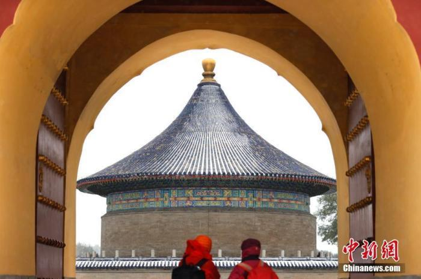
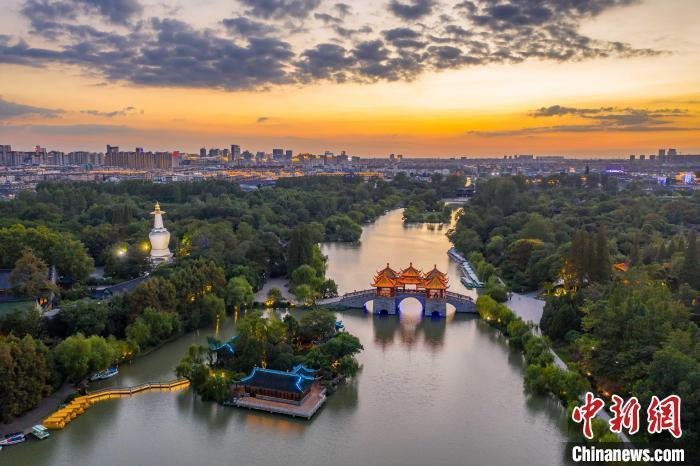

# “我的特种兵式旅游，坐9小时硬座还能日行4万步”

中新网4月12日电 (中新财经记者 谢艺观)4月1日，大川坐在回程的列车上，和网友交流着旅行的体验。

“天安门升旗看了，景山公园登高望远了，故宫角楼拍了，东交民巷到了，大栅栏前门瞧了，天坛祈年殿去了，门钉肉饼吃了，什刹海游了，鼓楼经过了，烟袋斜街五道营去了。”

一天时间内，大川玩完了上述景点。当旅行结束时，大川看了一眼手机，步数停留在了4.2万步。

在有限的时间和花销内去尽可能多的景点，“特种兵式旅游”正成为越来越多年轻人的旅行方式。他们在工作和学习的间隙，选择去另一个城市，享受短暂的“累并快乐着”的时光。

_资料图：寿皇殿建筑群。
中新社记者 易海菲 摄_

**“一躺下，腿都抬不起来了”**

目前在内蒙读大学的大川平时就是个旅游爱好者。在来北京之前，他已经去多地当了“特种兵”。

南京三天两夜的旅行中，大川去了鸡鸣寺、玄武湖、钟山风景区、明孝陵、中山陵等地。宁波一日旅行中，他又打卡了日湖公园、老外滩、天一广场、城隍庙、鼓楼、月湖公园等。

边逛各种景点，边品尝当地特色小吃，那几日，他的手机里充斥着各种旅行照片。

“几次‘特种兵式旅行’下来，感觉还是挺好的，最大的问题是累和煎熬，特别是回到学校上课的时候会比较累。”大川说。

故宫、景山公园、国家博物馆、天安门、天坛……当用一天时间打卡完上述景点，小雨(化名)的步数已突破四万，“晚上回到酒店，一躺下，腿都抬不起来了。”

在北京的几天，小雨日均3万步，马不停蹄地奔向一个又一个景点。“真的是累并快乐着，虽然一天走下来腿脚都疼，但很开心。”

_资料图：天坛。
中新社记者 富田 摄_

**“用更少时间和钱去获得更多体验”**

结束学习、工作后，拿起行李奔向机场或车站，结束旅程后，又匆匆忙忙赶回自己的城市。年轻人为何要为一趟旅行“日夜兼程”。

“打工人休假时间短，但又想看更多的风景，所以就选择了这样的旅行方式。”在上海工作的小雨向记者直言。

钟楼、大雁塔、大唐不夜城、秦始皇兵马俑……刚在西安进行完两天一夜“特种兵式旅行”的敏敏(化名)，在接受采访时也提到，“因为只有周六周日有时间，不想浪费时间，就选择了‘特种兵式旅行’，感觉很是充实。”

“我现在已经大四了，大学的前三年没法出去玩，如今马上要毕业了，想好好利用下半价学生票，又只有周末有空，就只好用短短两天时间去旅行，去玩个够。”身在江苏徐州的毛毛(化名)最近刚去了扬州旅行，把扬州有名的景点玩了个遍。

对于大学生而言，选择“特种兵式旅游”，除了时间成本，还有经济成本的考虑。

“多数大学生要使用生活费出去旅游，这种旅行方式能利用有限的生活费体验尽可能多的景点。如果能压缩旅游时间，就能节省占大头的车票和住宿。有人选择坐过夜车，不仅能省下住宿费，车费也更加便宜。”大川谈及“特种兵式旅行”如是表示。

为了节省花销，大川这次去北京，选择坐九个小时的硬座，“来回车票和景点门票控制在200元以内，再加上其他花销，这趟北京之旅，共花了1200元。”

“之前去南京和扬州旅行也是这样，四天时间大约花了2000元，大头主要在吃饭。”他补充道。

利用夜车出行节省住宿费，是很多年轻人的通用做法。4月5日，正值清明节，某旅行平台上，4日至5日，有62%的“00后”游客选择夜间“晚9点-早9点”出发的航班和火车。此外，近三成“00后”游客一天之内打卡超过4个景区。

为了节省时间和成本，最受欢迎的“特种兵”旅游目的地，往往是景点相对密集，火车、高铁和市内公共交通便利的城市。

一些24小时餐厅、洗浴中心也聚集了不少进行“特种兵式旅游”的人。此前有媒体采访了一些在海底捞内夜宿、休息的顾客，他们绝大部分是来北京旅游的年轻人。

“对于当代年轻人，特别是当代大学生来说，会考虑如何更省钱，或者用更低的价格去获得更多的体验。”盘古智库高级研究员江瀚向记者表示，所以年轻人在体能比较充沛的情况下，会选择这样一种旅游方式，其实也是年轻人一种生活方式的体现。

“宁可鞋底走穿，也要把景点看完”，年轻人正在用脚步丈量更多的景点。“当这些年轻人将自己的‘特种兵式旅游’分享到社交平台上，并配以海底捞过夜、硬座过夜、洗浴过夜等省钱攻略，在这种氛围的影响下，就会有更多的年轻人选择这种旅行方式。”大川认为。

记者注意到，“特种兵式旅游”在短视频平台上已经有了相应的“视频模板”，配音也很是类似。

_资料图：扬州瘦西湖。张卓君 摄_

**选择了“特种兵式旅游”，就会有取舍**

年轻人喜欢分享生活的特质，再加上社交媒体的推动，让“特种兵式旅游”在网上火了起来，甚至一度登上微博热搜。

虽然很多人羡慕年轻人说走就走的态度，但从舆论来看，这种旅游方式也引发了不少争议，包括“这跟出差有啥区别”“完全就是走马观花”“是不是为了博流量”等。

“这种旅游方式的好处是相对成本较低、时间效率较高，但也只有年轻人这种相对而言体能较强的才有可能支撑下来，若是中老年人，可能支撑不了这种强度。”江瀚称。

对于很多人质疑“体验太差”，江瀚认为，“既然选择了这种旅游方式，年轻人就会有取舍，选择‘特种兵式’，也就不怕其带来的体验没有那么好，更多的是用更低的成本获得更多的体验。至于体验的好坏，是否获得全部体验，或已不是年轻人最关注的。”

大川也提到，由于压缩了经济成本，得到的体验肯定是有限的。“就我来说，其实‘特种兵式旅行’比较少，也更倾向于度假型和体验型。不过，跟同学结伴的时候往往会选择‘特种兵’模式，性价比也较高。”

北京一行后，大川已经在计划下次去哪个城市。虽然刚去过北京，但他还是想要再去一次，西安则是他另一个想去的城市。

4月初去完北京后，4月7日(周五)晚上10点多，小雨从上海出发，次日9点半到达青岛，开启了30个小时的“特种兵式旅游”，这次她要看看日出日落，在海边吹吹风。(完)

