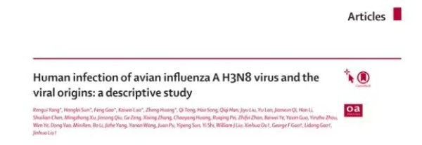
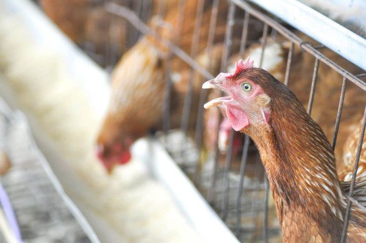

# 世卫通报全球首例H3N8死亡病例：发病前有活禽暴露史，未发现人传人

确诊患者为我国广东省的一名56岁女性，于2023年2月22日发病，3月3日因严重肺炎住院，3月16日去世。3月27日，国家卫生健康委员会向世卫组织通报了该病例，这是第三例报告人感染甲型H3N8病例。2022年4月和5月，中国河南省、湖南省相继报告出现人感染H3N8亚型禽流感病例，这是首次报告人类感染甲型H3N8禽流感毒株。这两个病例中，有一人患上了危重病，另一人则病情轻微，均因直接或间接接触受感染家禽而感染。

世卫组织通报显示，此次死亡病例是通过严重急性呼吸道感染监测系统发现的，患者既往有多发性骨髓瘤等基础病史，发病前有活禽暴露史，家周边有野禽活动史。在报告确诊病例后，疾控部门已按照相关方案开展流行病学调查、密接者追踪管理、涉疫场所排查、现场消杀等疫情处置工作。追踪结果显示，密接者中没有发现其他病例。从病人的住所和发病前待过的菜市场收集的环境样本检测显示，样本呈甲型H3N8禽流感病毒核酸阳性。初步流行病学调查表明，接触活禽市场可能是感染的原因，但目前尚不清楚感染的确切来源是什么，以及这种病毒与在动物中传播的其他甲型H3N8禽流感病毒有何关系。

甲型H3N8禽流感病毒在全球动物中普遍存在，是鸟类中最常见的亚型之一，之前曾在禽类、马、犬、猪、海豹等动物中分离到毒株。据报道，甲型H3N8禽流感病毒在各种哺乳动物物种中存在跨物种传播，包括在狗和马中流行。世卫组织表示，禽流感病毒从鸟类向人类的传播通常是零星散发的，并且发生在特定背景下——大多数是由于接触受感染的家禽或受污染的环境。但由于禽流感病毒的普遍存在，预计今后还会有更多的散发病例。

世卫组织风险评估指出，现有的流行病学和病毒学信息表明，甲型H3N8禽流感病毒不具备人际持续传播的能力。因此，世卫组织评估认为该毒株人际传播的可能性很低。然而，由于流感病毒的性质不断演变，世卫组织强调继续加强全球监测的重要性。为了尽量减少感染风险，世卫组织建议各国应提高公众对避免接触高风险环境的重要性的认识，如活体动物市场/农场、活禽或可能被家禽或禽类粪便污染的表面。

3月30日，广东省疾病预防控制中心副主任李艳撰文表示，目前发现的人感染H3N8均为偶发个案，发病前均有活禽暴露史，密切接触者和共同暴露者健康监测均未发现新增病例，提示现阶段该病毒传播风险低。

2022年，中国农业大学动物医学院刘金华教授团队在《柳叶刀-
微生物》杂志上发表研究结果，在对第二例报告人类感染H3N8的湖南长沙病例进行研究发现，H3N8禽流感病毒感染人属于典型的“溢出性感染”事件，尚不具备持续人际间传播能力。病毒基因序列分析显示，感染人的H3N8病毒是由欧亚禽分支H3基因、北美禽分支N8基因和H9N2病毒内部基因三源重排组成的新型病毒。

李艳表示，除了H3N8，目前人类感染的禽流感包括H5N6、H5N1、H9N2、H7N7、H7N9、H10N3、H10N8、H5N8等亚型，主要感染来源是人接触染毒的活禽、病死禽或去过受污染的活禽销售市场。患者初期一般表现为流感样症状，如发热、咳嗽、少痰，可伴有头痛、肌肉酸痛和全身不适。重症患者病情发展迅速，多呈重症肺炎等表现。其中人感染H5N1和H5N6等亚型的重症率和病死率较高，而人感染H3N8亚型的致病性有待进一步观察。

虽然现阶段该病毒传播风险低，目前未发现人传人，但也不能掉以轻心。建议大家日常购买、处理禽类时要注意做好防护。

**购买禽类时：**

不购买病死禽，尽可能不购买活禽，建议直接购买集中宰杀处理好的生鲜或冰鲜禽。不购买来源不明的禽鸟类产品，也不要光顾违规售卖活禽的流动摊档。不接触高风险环境，如活体动物市场/农场以及活禽，或有可能被家禽粪便污染的物体表面；如必须接触，应好戴口罩、手套，接触后尽快洗手。不从活禽市场或流动摊贩处购买活禽回家饲养，更不要与原有家禽混养。

**处理禽类时：**

尽量避免在家宰杀活禽，如果一定要在家宰杀，建议戴口罩和手套，避免用手触摸眼、口、鼻，宰杀完成后立即用肥皂或洗手液和流动水彻底清洁双手；处理生食和熟食之间也要彻底清洁双手。处理和烹饪禽肉及其制品时，应注意生熟分开，切过生肉的砧板应做好彻底的清洗消毒，食物要煮熟煮透。

去公园、野生动物园、郊外等地方游玩时，应特别注意不要近距离直接接触野生禽鸟，尽量远观，如近距离观赏建议戴口罩，不接触病死禽鸟，更不要捡回食用。

若接触活禽或病死禽后有发热、咳嗽等呼吸道症状，应戴上口罩，尽快就诊，并告诉医生禽类接触史或有无去过活禽市场。

环球时报健康客户端记者 张健

责编：罗榕

主编：丁文君

