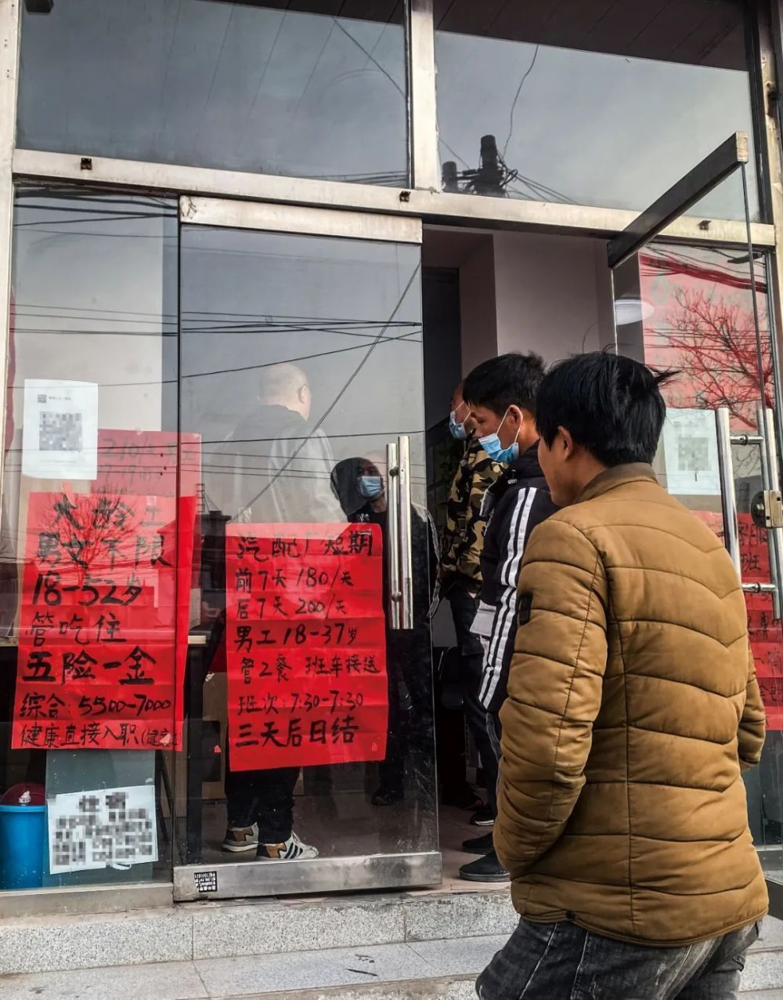

# 中国第一代农民工，还在打工

_有人驾车前来招工地小工，工人们迅速围上去争相推销自己。_

**文 |《财经》记者 王丽娜**

**编辑 | 朱弢**

在干涸的池塘里捡小石头的一份日结零工，让两个五十来岁的男人争吵起来，他们互相指着对方喊“他不专业”“他不行”，希望自己被挑中而令对方出局。这份工作的报酬是日薪100元。

几分钟前，他们两人率先冲出“趴活”的人群，分别钻进一辆白色电动汽车的副驾和后座。可驾驶电动汽车的男人说，他只需要一个工人。

三人吵嚷几句后，僵持住了，驾车男人无奈地伸头探出车窗。一旁围观的人喊道，两个都拉走吧。男子摇了摇头，“拉走我都得给钱”。但两人谁也不愿下车走人，十来分钟后，这名男子只好两人都带上，驾车离去。

67岁的李辉，双手插兜，站在3米开外望着这辆车和围观的人群，这条马路有数百人，他压根就没能挤到车门前，也就不具有参与竞争的机会。

这是2023年3月21日早上7时许，李辉在北京市顺义区仁和镇河南村环岛附近的马路上，已经趴近1个小时的活。

顺义区河南村有一个自发形成的劳务市场。每天凌晨4时起，租住在村子附近的农民工或乘公交车，或走路，赶到这里，等在路边“趴活”。他们多是做短期工或者日结工，主要是去建筑或装修工地做些辅助工或零散杂活，另外还有搬运、保洁等活计。

**一有招工的人前来问询，工人们便蜂拥而上推销自己，争取被选中，待谈好劳务内容和日薪后，跟着招工者离开，一天的生计也就有了着落。**

在顺义、通州等北京远郊区，存在不少这样的日结劳务市场，活跃其中的多是50岁以上的农民工，而其中60岁左右以及年龄更大的民工，则已经超过了在建筑工地务工的年龄上限。近两三年，不少地方出台建筑行业“清退令”，禁止60岁以上的男性以及50周岁以上的女性从事建筑施工作业，有些工地还进一步收紧年龄限制。

**一个不容忽视的数据是，2021年全国农民工总量达到约2.93亿人，平均年龄41.7岁，50岁以上农民工所占比重27.3%，约7985万人。再过十年，他们都将跨过60岁这个坎，成为超龄农民工，一旦务工受限，可能将加剧他们的生活和养老困境。**

好在，政策不断调整。2023年2月13日，中央一号文件提出，维护好超龄农民工就业权益。他们，将何以养老？

**“早起走不了就被剩下了”**

早上8时，日结工劳务市场的用工高峰已过，人群陆续散去。一个老人蹬着三轮车路过，故意打趣地喊着“捡烟头咯，一天50元”。

对李辉来说，算上这天，他已经五天没找到活干了。

在四天前，《财经》记者在顺义区高丽营村的一处劳务市场上，第一次见到李辉，67岁的他头戴一顶迷彩鸭舌帽，遮挡灰白的头发。当时，李辉正向一个男子推销自己，对方在昌平区小汤山镇承包了七八亩菜地，想雇一个人帮他干农活，一个月四五千元。李辉向对方介绍，他今年刚体检过“没啥毛病”，在老家种过多种蔬菜，打理菜地不成问题。

再次见面，李辉告诉《财经》记者，那天他搭男子的车去了菜地，但对方说还有别的竞争者，需要考虑一下，两天后回了信，“没看上我”。在高丽营没有找到活儿干，李辉想着“转战”到河南村的劳务市场看一看。

李辉的住处在北小营镇，是一个工头介绍的废弃厂房，不需要租金，距离河南村12公里。他早上4点半起床，将前一晚剩下的米饭和菜热了做早餐，摸黑赶到公交车站，再换乘一次，下车步行20分钟，赶到河南村的劳务市场。其实，前一天李辉就打算来这里，但找错了地方，赶到时已经8点多，自然是什么活儿也没找到，“白搭了几元车费”。

今年，李辉找活儿不是很顺利。2月10日，李辉从老家来到北京，先在老乡介绍的一处工地上干了十天，负责地基及复合地基承载力检测。李辉说，他外出务工已有15年，这几年岁数渐长后，工地上适合他的主要是检测、给吊车挂钩、杂工等轻活。“其他重活工头不让做，年龄在那摆着。”近两三年，一些建筑工地限制工人年龄，李辉靠着熟悉的工头和老乡介绍，辗转各个小工地做散工，没有活儿干时就去劳务市场“趴活”做日结工。

做完十天检测工，李辉来到一处医院的在建工地，那是去年就和工头谈定的长期活儿，他带着铺盖卷打算在工地长住。但进工地当天需进行安全教育培训，并登记年龄等身份信息，60岁以上的工人不要，对此工头也无计可施。计划落空，临近3月赶上李辉老家种植板栗，他只好花费128.5元买了趟13小时的慢速火车先回老家。

在老家待了一周，李辉还是想出来找活儿做，再次进京。二度进京后，李辉起初在一个小工地帮忙开槽钻地基，有管理人员问起他的年龄并察看身份证后，让他走人。他解释说，家里条件差，出来挣个生活费。带他的小工头担心承包方不满，两天后也坚持让他走人。李辉就这样开始游荡在高丽营村、河南村等各个劳务市场，碰运气找活儿。

早上五六点钟才是劳务市场最活跃的时期。建筑工地或用工处分散在偌大北京的各个角落，招工者一般驾驶小巴或者轿车过来，现场挑好人，直接拉往用工现场，以赶早上开工的时间。8点后，招工的人稀少起来，十来分钟才来一两个。给的价格也低，招一个工地小工，日薪150元，不管午饭。招给树木拆除支撑架的工人，日薪100元，工作还包括把拆下来的架子装上车。啤酒厂招装卸工，12瓶装每件算0.085元……

李辉说，今年不少工地还未开工，目前劳务市场上散活儿、零工不多，给的价也不如往年，有些小工日薪150元。去年时，工地招聘大工（技术工）一天三四百元，小工（普工、杂工）200元上下，赶上农忙返乡季节工钱会再上涨。据他观察，这几天的情况是早起走不了就被剩下了，一天撂荒。工地、绿化、保洁等岗位，他都看，“没技术，那还不就下个力气”。

**“55岁以下好安排，大龄没单子”**

在人群中穿梭，李辉不时和其他工人闲聊两句。工人们以男性为主，多在45岁以上，不少人头发斑白，他们大多随身背着挎包，塞满瓦刀、电钻、卷尺等小型工具和水壶。

一位戴红色帽子的工人对李辉说，他老乡带了1000元出来，两天没找到活儿，遂返回老家。“1000元钱够干啥，买完车票花不了几天”。另一个工人说，找不到活儿净搭饭钱。也有工人过来搭话，“生活费都挣不到，咋好回家。”

一位57岁的工人说，他今年来北京七天，才干了一天活儿，他感叹道，60后的工人越来越难找活儿。他选择来劳务市场是因为工钱日结。2021年10月至2022年5月，他在一个工地干活，工钱拖到今年3月初才到账，“还好区劳动监察部门一直在帮忙催要”。他去年还给一位老板干活，到现在5000多元工钱还欠着。

一位瘦高个工人53岁，他说起自己前几年主要做消防管道的施工，去年因疫情赋闲在家，今年出来务工，一些工地要求进行安全生产考试，他考了好几次没考过，“我不想干零工，但还没找到中短期工”。

在河南村劳务市场上不只有男工，一辆招工的车停下后，工人们冲上去里外围了几层。52岁的王敏挤到车前，喊着“我能干”，但那个岗位还是被一个年轻点的男工抢走。王敏主要接给铁栏杆刷漆的活儿，她的丈夫是一名电焊工，两人同在北京打工，供养家中的孩子读书。

农民工进入城市，主要在建筑业、制造业、服务业务工。3月17日，在高丽营村附近的劳务市场，也多是45岁以上的农民工们寻找工作。60岁的张永军，来北京务工十余年，前些年在建筑工地做瓦工，这几年转向家居装修瓦工，收入略有下降，但好在工钱现结，还有休息日（北京市禁止双休日和节假日装修）。他自称，每月除去400元房租和吃饭钱，能落下约6000元钱，出来打工“是想贴补孩子”，他的两个儿子都在大城市按揭买房，月月须还房贷。

_在北京市通州区马驹桥镇“劳务一条街”，没找到活儿的工人在劳务中介处寻找工作机会。_

**在通州区马驹桥镇的“劳务一条街”，早上也有一个自发形成的劳务市场，做日结的务工者来此聚集等活儿。**
沿街的门脸房有多家劳务中介，提供日结岗位和短期工或合同工。门前张贴的招聘启示显示，短期工或合同工多集中在保安、保洁、家政等岗位，年龄多限制在18岁-45岁，个别招聘“大龄保洁女性57岁以下”，没有一张启示提到招聘58岁及以上的人员。

3月16日早上，62岁的周超在“劳务一条街”白等了近两小时。三天前周超从老家来京，住在附近的小宾馆，每天20元住宿费。

8时左右，周超待不住了，走向附近一家熟悉的劳务中介，那家中介去年曾给他介绍过岗位。中介公司负责人王金己正在查看手机信息，面对周超的询问，头也没抬就问“多大了”，听说62岁，答道，
**“55岁以下好安排，大龄没单子，62岁哪有。”**

周超不善言辞，坐在沙发上不言语，过了片刻问，“我做保安、保洁行吗？”再次得到否定答复后，他仍然坐在沙发上不动。王金己则盯着手机，忙着打字、接听电话，在聊天中王金己建议对方，“今年工作（招聘）发出去别犹豫，一犹豫人就够了。”有的求职者刚到北京，王金己交待，赶紧给用工方打电话，说一下“岗位给我留着”。

王金己对《财经》记者说，最近没有大龄的单子，如果有会考虑周超，“他能挣钱，我也能挣钱（介绍费）”。王金己称，今年因疫情防控措施调整后，求职者较前两年倍增，而就业岗位没有新增，还导致工价下跌，用工方更挑剔年龄身高等因素。比如，往年保洁月薪4200元左右，年龄限制在62岁以下，最近招聘的单子降到月薪3500元左右，年龄限制为55岁以下，还往往吃住只包一项。

_北京市顺义区仁和镇河南村附近的马路边，早上7点后，还有不少没找到日结岗位的农民工在“趴活”_

近几年高龄农民工就业出路日渐逼仄。2019年3月起，建筑工人实名制管理办法开始全面实行。
**一些地方先后出台“清退令”，即禁止18周岁以下、60岁以上的男性以及50周岁以上的女性这三类人员，进入施工现场从事建筑施工作业。**
有些地方还规定，禁止55周岁以上男性、45周岁以上女性进入施工现场从事高空、特别繁重体力劳动，以及其他危险性、风险性高的特殊工作。

当下，中国老龄化呈加速态势，农民工老龄化趋势则更加突出。根据国家统计局发布的《2021年农民工监测调查报告》，2021年全国农民工总量约2.93亿人，农民工平均年龄41.7岁，40岁及以下农民工所占比重为48.2%，50岁以上农民工所占比重为27.3%，约7985万人。往前推十年即2011年，50岁以上农民工所占比重仅为14.3%。

**这意味着，再过十年，7985万农民工的年龄将达到60岁，成为超龄农民工，达到甚至超过了城镇职工法定退休年龄。**

**都是为了生计**

这些50岁以上高龄的甚至超龄农民工，他们身上背负着“第一代农民工”的标签。

安徽师范大学社会工作与社会学系副教授仇凤仙长期关注农村社会学、社会保障等领域，她主持的国家级社科基金项目——第一代农民工可持续生计研究，2022年底通过结项验收，近期还将出版专著。

仇凤仙对《财经》记者指出，在上世纪70年代及以前出生，并在80年代初至90年代外出务工的人群，在学术界被称为第一代农民工，他们是生计型农民工，外出务工是为解决家庭生计问题，所挣的钱用于整个家庭经济开支。他们与之后的第二代和第三代农民工有明显的代际差异，第二代农民工主要是改善自身处境和个人发展，第三代农民工则越来越多融入城市成为新市民。目前，第一代农民工的年龄都超过50岁，很多仍在外出打工。仇凤仙曾遇到过72岁的女性农民工。

在高丽营村附近的劳务市场，《财经》记者见到当天找工失败、准备买菜回去休息的白民。

白民租住在周边的村子里，12平方米的一间房，月租金450元。

59岁的白民有些不平，当天看上他的小工头，给他提供的是去工地清理和打扫垃圾的岗位，日薪最高给他180元，不管午饭和接送。中午白民得花费20元左右买午饭，还吃不饱，再扣除车费和15元房租。“合着我这一天剩下不了多少钱”。白民说，清理工地垃圾的活儿又脏又累，前几天他在工地刷墙除锈，呛得他一上午换了四个口罩。他宁愿选抡大锤、拆墙的工作，虽然累些但日薪高一些。

白民在建筑工地打工的经历并不多。他记得20多年前，自己在天津一个工地做钢筋工，干了一个春天，麦收时回老家，工头拖欠了他近一半工钱。那1000多元钱白民要了几年都没要到手，一气之下他把欠条撕掉，不再去工地打工，转身去城市里卖麻花。新冠疫情后，麻花生意难以支撑，他又出来在工地打工、做保安，做日结工。

与多数高龄农民工不同，白民具有高中学历，因几分之差没考上大学，父亲生病家里困难，他就没再坚持读书。如今，白民还能背诵曹刿论战、岳阳楼记等文章。马上步入60岁，他的一些高中同学已从县城局长、副局长的位置退休，他还在外奔波，白民说，“但凡家里有生计，谁愿意背井离乡。”

白民有两个儿子，大儿子已成家，小儿子20岁出头刚出去打工。白民还有过一个女儿，14岁时因病去世。“病没瞧好，花了上万元，够买好几辆小四轮，当时小麦才三四毛钱一斤”。

目前，给小儿子结婚做准备令白民很有压力，他掰着指头说，老家目前结婚彩礼的行情在10万-20万元，“你算算我得多少年干出来”。

在工地，高龄农民工不好做。2022年冬天，他在工地做小工供灰供砖，有一次干活慢了一些，被工头骂，对方一直让他走人。因为疫情原因，他后来只能滞留工地上，回不去租住的村子。

这几年，仇凤仙先后访谈了200多个45岁以上的高龄、超龄农民工，发放调查问卷2500份。老家外出务工的农民工、马路边遇到的绿化工人、小区里的保洁员等，都是仇凤仙的访谈对象，她常常在午休时带上午饭和水果，和农民工们蹲在一起边吃边聊。

在她所在城市芜湖，仇凤仙关注到近年来的新现象，即从事社区保洁、绿化一类工作的农民工，工资以日结为主，一天80元左右，年龄多在65岁左右，来自芜湖市近郊和周边县乡。一个月干几天活就能收入四五百元，对农村老人来说收入相对可观。早晚乘坐劳务中介的小巴进出城，这些老人并不觉得辛苦，相反“精神状态还蛮好”，自我价值的存在感超出在家留守的老人。一个老人对仇凤仙表示，“出来后还能学到东西，蹲在家里什么也不懂。”

**手里有5万块钱就很满足了**

高龄农民工就业背后，也折射出建筑行业和保洁等服务行业的就业年龄结构。

53岁的徐力，自18岁进入建筑工地打工，做过各个工种的工长，如今是一名工头，手下长期稳定的农民工有30余人。目前他最年轻的工人45岁，徐力对《财经》记者感叹，建筑业农民工进入断档期。

徐力表示，建筑行业是高危行业，特别是外墙和高空作业，不适合年龄大、腿脚不好的高龄农民工，但身体条件不错的六七十岁农民工，还可以做地面辅助工、杂工。几年前，徐力的工地有一名工人做到75岁，后来被徐力劝回老家，“我看着害怕”。这几年，建筑行业出于安全考虑，出台规定限制超龄农民工，“有些工地要求60周岁不能用，我们也挺为难”。

但建筑行业又很难吸引年轻工人。据徐力观察， **85后的建筑业农民工很少。他认为，这与建筑行业工人的收入和工程层层转包利润空间降低等有关系。**

1987年，徐力离开当时的北京密云县，到城区进入建筑队打工，一天工资5元，当时一个城市普通职工的月工资才五六十元。2000年左右，建筑工人一天收入30元，也比进工厂收入高。现在他负责的工地，技术工工资一天近400元，小工200多元。在工地务工的收入比在工厂打工略高或持平，“但工厂一般包吃住，而工地打工脏累、吃住条件差，还不招人待见，对年轻人越来越缺乏吸引力”。

徐力观察到，建筑行业时有欠薪，也令年轻人止步。随着工程层层分包成为普遍现象，甚至出现三包四包情形。上世纪90年代末期，开始出现第一波农民工欠薪潮，而年轻人花销大，不愿意进入可能“干了活拿不到钱”的行业。徐力称，2006年左右，北京的一些国有建筑企业为了吸引年轻人加入，按照学历给工资，试用期缩短，他只有初中学历，那时他带的几个徒弟工资都比他高，后来他就辞职出来做工头。新冠疫情后，徐力观察到建筑行业欠薪现象又有所“抬头”。

跟第一代农民工访谈时，仇凤仙关心的问题达70多个，
**主要集中于几类，比如目前的生计模式靠什么，何时打算停止工作，将来老了往哪里去，最担心什么事情，有没有为自己存养老钱等。**

当被问到何时停止工作时，令仇凤仙印象深刻的是，很少有农民工提到想休息了就返乡。“没有一个界限，基本上都是说干不动、不能干了为止”。

仇凤仙曾问受访农民工，有没有为养老存钱？结果显示，已有存款的不足15%。再继续问，现在有多少存款？大部分人回答在3万-5万元之间。那存多少钱能养老呢？“他们表示，手里面有5万块钱左右就很满足了，很少有人说我要存到10万块钱。打算存到10万以上的比例不足1%。”仇凤仙告诉《财经》记者。

仇凤仙的调研显示，60岁及以上农民工有存款的比例远高于55岁以下的高龄农民工，50岁左右的农民工普遍没什么积蓄。仇凤仙进一步解释说，50岁左右的农民工，个人的生命历程开始往下走，但从家庭生命周期看，正值用钱最高峰。他们的孩子大多在20多岁，或正在上大学，或将婚配提上日程，父辈面临高额的教育和彩礼等支出。60多岁的农民工则更有养老规划意识，“多数已经完成对子代的任务，这时候才有能力来为自己想一想。如果有三五万元在手里，已经算幸福的老人了，至少生活不会过于困顿。”

仇凤仙解释，第一代农民工的命运与时代变化联系更加紧密。他们早年碰上经济困难时期，读书也不多。成年后的青壮年时期，虽然赶上上世纪80年代后期中国逐渐放宽对人口迁移流动的限制，但在90年代中后期又一度遭遇诸多外出务工限制。进入21世纪，中国城镇化加速，第一代农民工参与其中并作出贡献，他们普遍工资不高、劳动强度大、缺乏社会保障。“人到中年后，子代买房和婚姻费用上涨，他们怎么能攒得下钱？六七十岁的农民工，他们的子代正值压力最大的阶段，给不了老人太多的钱，并不是孝不孝顺的问题。那只能祈祷身体好，不要有意外，这些老人他们都说，你怎么好去伸手要孩子的钱。”

**没有退休的概念**

“清退令”出台后，高龄农民工的就业权益相继引起重视。

劳动法专家、上海财经大学法学院教授王全兴告诉《财经》记者，此前建筑行业出台超龄农民工“清退令”，更多出于建筑行业安全生产和保障农民工健康权益考虑，却未对超龄农民工的就业权益和生活困境需要加以足够关注。同时，“清退令”影响到农民工劳务市场的供给，提高建筑行业的用工成本。

好在，政策不断调整。2022年11月，人社部、农业农村部等部门印发《关于进一步支持农民工就业创业的实施意见》，指导企业不得以年龄为由“一刀切”清退大龄农民工，为有就业需求的大龄农民工免费提供公共就业服务。2023年2月13日，中央一号文件提出，维护好超龄农民工就业权益。

政策的落地有待时日，而日常生活还在继续。

在劳务市场屡屡受挫，停歇五天后，3月26日，李辉给《财经》记者发信息说，他通过以前的工头介绍，在工地找到一个五天的岗位，日薪200元，每天工作九小时。

李辉的老家在山区，一人几分田地，近年来因农村土地承包“增人不增地”，他的儿媳和孙女都没有土地。四年前，他家承包的土地被征用建学校，一亩地给了几万元补偿。儿子一家外出做卷帘门生意，常年不在家。卷帘门生意并不好做，李辉说，“饱和了，就像新建工地减少一样。”因此，李辉和老伴不主动向儿子要钱，老家日常开支都是老两口掏钱。李辉表示，一年他能挣上三四万元就“很满意”。

白民外出做日结工之余，还在老家承包了老乡和亲戚们的20余亩土地。有一次，白民去老家的乡政府办事，和一个工作人员聊起来，对方认为他兼顾打工和承包土地，太辛苦，建议他在老家找个看大门之类的清闲岗位。“我就对他说，咱们乡里所有的政府机关都加起来，有多少大门岗位呢，再算算咱有多少五六十岁还出去打工的农民？有就业岗位谁也不愿意出来。”

受就业形势紧张，以及他们自身的身体健康状况、岗位变动等因素影响，六七十岁农民工返乡之后的生计问题，仇凤仙尤其关注。在她看来，部分超龄农民工被淘汰回乡村，家里如有几亩土地还可以维持生活，失地、少地的农民工将面临更加艰难的生活和养老压力。

回到乡村后，他们将来何以养老更是未知。仇凤仙指出，中国农村家庭传统的养老支撑在弱化，第一代农民工的子女中不少人离开乡村进入城市和县城买房，他们只能主要依靠自养。新型农村社会养老保险提供了一定保障，但当前农村60岁以上老人享有的100余元基础养老金，保障力度有限。因此对农村老人来说，没有退休的概念，活着就是劳作，他们普遍为生活和养老储备不多。

仇凤仙寄希望于通过乡村振兴的全面推进，让第一代农民工返乡后，有机会继续参与乡村建设，通过劳动获得报酬。

王全兴指出，放在“三农”问题的分析框架中，全面实施乡村振兴战略，发展乡村经济，才能找到治本之策。否则随着超龄农民工就业去劳动关系化、去劳务关系化，转向灵活用工，对他们的社会保障盲区会更大。

**（应受访者要求，李辉、周超、白民、徐力、王敏、张永军为化名）**

