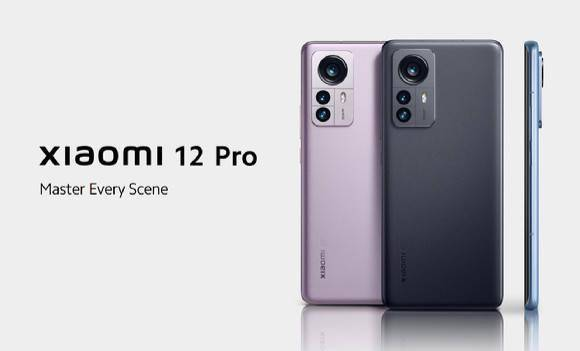
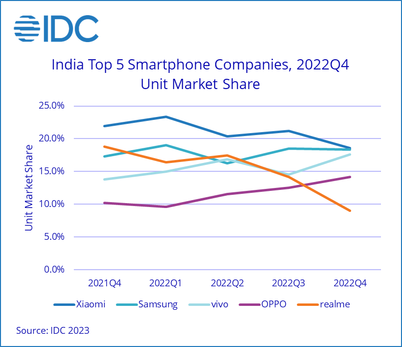
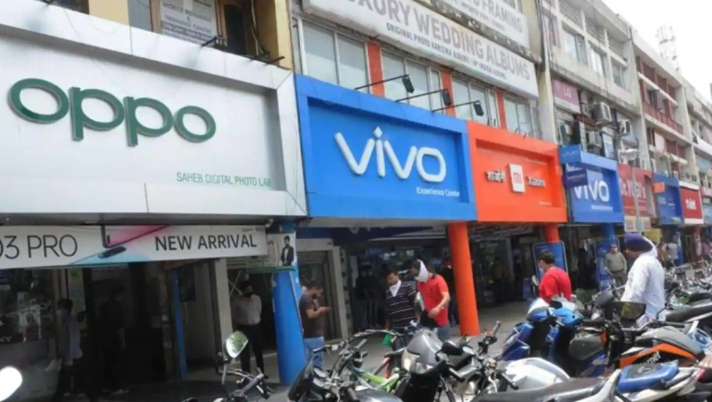
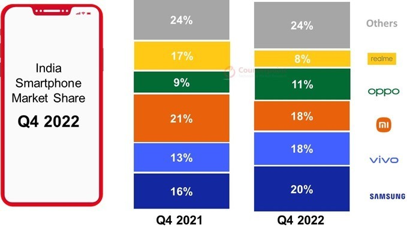
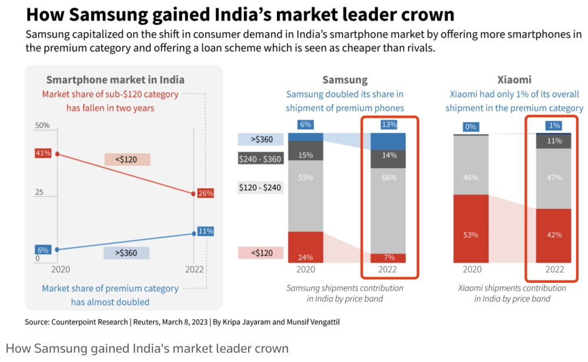
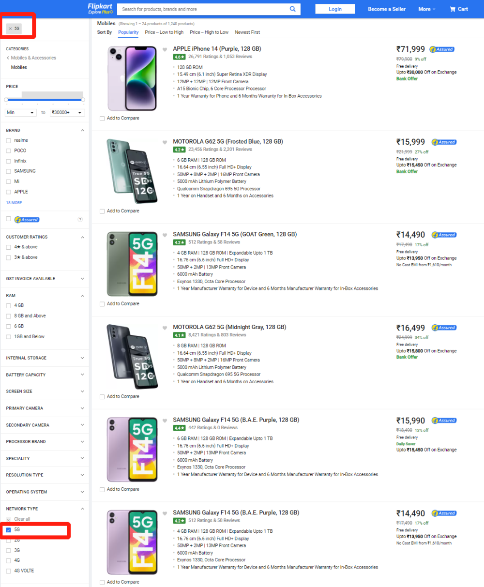
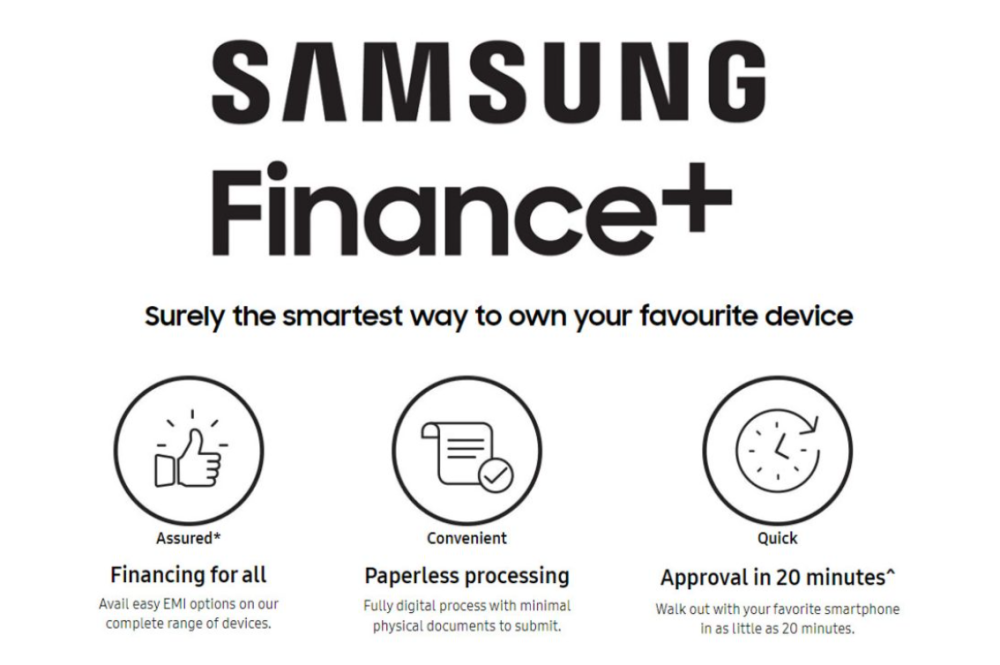
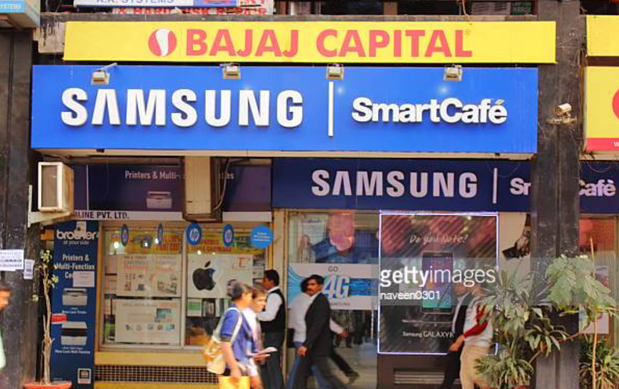
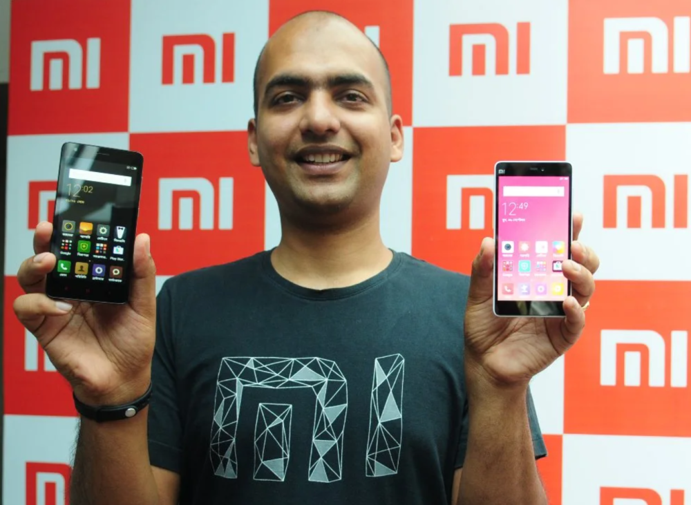
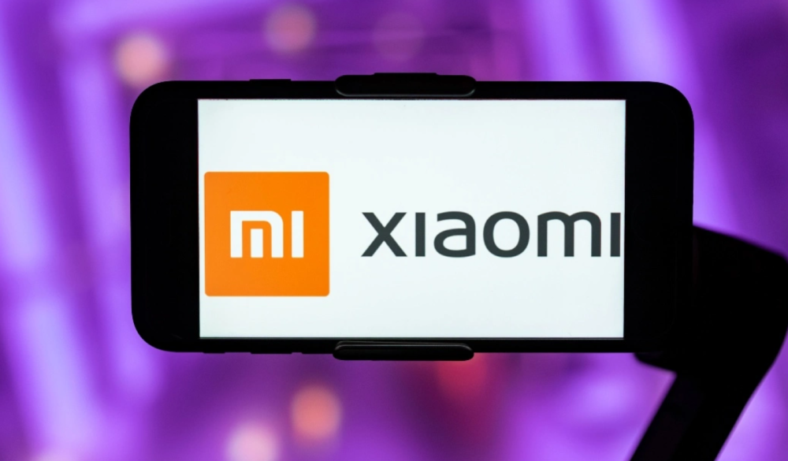

# 五年卫冕，一朝输敌，中国手机伤心印度

**智东西（公众号：zhidxcom）**

**作者 | 云鹏**

**编辑 | 心缘**

最近，印度手机市场掀起了一股中国手机降价潮。

据韩媒报道， **小米、一加、摩托罗拉等中国手机品牌纷纷开始在印度市场实施大幅降价策略，一些旗舰机型降价一度超过800元。**

比如小米 12 Pro就降价了1万卢比（约合人民币837元），一加 10R、moto edge
30等机型也降价3000卢比到4000卢比（约合人民币251元到335元）不等。

值得一提的是，这些降价产品多以中高端机型为主。

中国手机厂商为何要降价？这或许与中国手机品牌近来在印度市场遭遇的“挫折”有关。

去年四季度，三星在出货份额上正式超越小米成为印度智能手机市场第一，自2018年从三星手中夺得第一后，小米第一次被三星反超了。

_▲2021年Q4至2022年Q4印度智能手机市场出货份额曲线，来源：IDC_

除了销量上的疲软，近两年来，以小米为代表的中国手机品牌在印度市场可以说是屡屡碰壁：印度政府三番五次“找麻烦”，不是冻结资产，就是找高管“约谈”。这些事，小米、OPPO、vivo几乎都经历过。

一时间，舆论一度营造出一种 **“小米在印度不行了”、“中国手机在印度不行了”** 的态势。

如今印度已经超过美国成为 **全球第二大手机市场，** 而印度也即将在人口数上超越中国，成为 **全球人口第一大国。**
在印度市场重要性愈发凸显、印度中产阶级快速壮大、印度消费电子市场高速发展的今天，中国手机品牌真要搭不上印度这班车了吗？

**中国手机称霸印度市场的光景，真要成为过去时了吗？**

**事实可能没有表面看上去这么简单。**

即使销量有所下滑，中国手机品牌依旧在印度智能手机市场的出货量前五中占据四席，且整体份额总和超过55%，印度智能手机市场半壁江山依旧属于中国品牌。

一位印度当地手机经销商曾在接受采访时说，在印度， **用“家喻户晓”来形容小米、OPPO、vivo、realme这几个头部中国品牌，一点都不过分。**

虽然中国手机品牌在印度市场的整体地位目前仍难以撼动，但三星对于小米的反超不禁令人开始思考一个问题：

**在印度市场一直难逢对手的中国手机品牌小米，为何会失去霸主地位？**

而小米丢冠是否只是一个开始？
**在中印关系未能明显缓和、消费电子市场短期难以明显回暖、全球经济下行压力依旧凸显的各类复杂因素交织下，印度市场对于所有中国智能手机品牌是否都在酝酿新的挑战？**

深入印度手机市场后，
**我们发现事实并没有想象中那样简单，以三星苹果为代表的高端欧美日韩品牌、中国手机品牌和印度本土品牌三方之间正在上演一场极为复杂且精彩的对决，**
而真正的胜负还远未分出。

一、三星超过小米，不是小米不行了，而是印度市场变了

在印象中，小米在印度市场的高歌猛进似乎早已成了“常识”，中国手机品牌的“性价比”，也是其他海外品牌所难以企及的，所以当四季度三星反超小米夺得出货量第一时，很多人的第一反应都是：
**为什么？**

要回答这个问题， **我们不妨从多个维度回顾一下四季度的印度智能手机市场。**

首先， **从出货市场份额来看，**
根据Counterpoint数据，四季度三星的市场份额从去年的16%增加至今年的20%，的确增长了不少，反观小米这边则从21%降至18%。

_▲2022年Q4印度智能手机市场出货份额，来源：Counterpoint_

不过值得注意的是，vivo和OPPO两大品牌份额均有明显提升，其中vivo的市场份额更是增长了5个百分点，出货份额涨幅甚至超过了三星。OPPO这边则是从9%提升至11%。

看来， **小米的大幅度下滑，放之于整个中国手机品牌，并非普遍现象。**

当我们把目光聚焦于realme时，或许答案已经浮上水面。realme四季度出货份额从去年的17%大跌至8%，也从去年的第三名一路跌至第五名。

那么小米和realme是否有共同点呢？没错，这两大品牌均以“极致性价比”出名，2023年之前，其产品几乎均以中低端智能手机为主。

**是不是印度低端智能手机市场出了问题？**

从IDC给出的数据来看，2022年的印度智能手机市场，呈现出明显的“向高端化发展”的趋势。全年印度智能手机的平均售价达到了创纪录的224美元（约合人民币1540元），同比增长了18%。

而低于150美元（约合人民币1032元）的机型市场占有率从54%降低至46%，低于120美元（约合人民币825元）的机型市场占有率更是从两年前的41%降低至26%。

除了这些“百元机”、“千元机”，2000元档位的“中端机”市场同样出现了萎缩，根据IDC数据，
**300美元（约合人民币2063元）以下市场的整体出货量降幅达到了15%。**

相反，500美元（约合人民币3438元）以上的高端机型出货量却大涨了55%。

可以说，小米和realme的主战场，也就是 **印度的中低端智能手机市场，在2022年遭遇了“滑铁卢”。**

诚然，三星在印度市场也有不少低端机产品，但相比小米，三星的产品线在各个价格段覆盖的更为全面，比如在中高端市场，三星的F系列、M系列以及旗舰S系列智能手机均在印度市场取得了不错的销售表现。

相比之下，2022年小米和realme在中高端智能手机市场几乎还处于“空白”状态，虽然两者在国内均有高端旗舰机布局，但在印度市场中还是以中低端产品布局为主。

比如去年在印度市场，售价120美元以下的机型，小米有39款，而三星只有7款。相反，360美元以上的中高端机型，三星有16款，而小米只有6款。

Counterpoint数据显示， **过去两年，360美元以上的高端智能手机仅占小米手机总出货量不到1%。**

_▲三星和小米近两年不同价格段机型出货份额占比情况，来源：Counterpoint_

如果以高端机中的5G智能手机为例，三星和小米之间的机型布局差异会更加明显。

当我们在印度最大电商平台Flipkart的手机品类中，将筛选标签选中5G后，页面显示的前六款手机中有三款都是三星手机，第一款为苹果的iPhone
14，剩下的两款为摩托罗拉机型。

_▲Flipkart官网手机分类中，选中5G标签后的呈现结果_

根据IDC数据，2022年5G智能手机大约占了印度智能手机市场三分之一的出货份额，而2023年5G智能手机出货量占比可能会提升至60%，增幅十分明显。

而 **在印度的5G智能手机市场中，三星和苹果几乎成了唯二的选择。**

实际上，此前小米这样的产品布局，给了三星很大的增长空间，2022年印度中高端智能手机市场的很大一部分增量，都被三星吃去了，而另一部分则被苹果吃去。

根据Counterpoint数据，2022年三星以21%的市场份额成为了印度最畅销的5G智能手机品牌，在365美元以上市场中出货量超过苹果，以38%的出货份额位居第一。而在550美元以上市场中，三星也是出货量增长最快的品牌。

总体来看， **作为全球第二大、未来有潜力与中国智能手机市场“掰手腕”的印度智能手机市场，是在快速发展变化的，用户需求、消费者青睐的产品都在快速迭代。**

随着印度中产阶级的不断壮大，印度在消费电子领域的消费水平是在快速提升的，苹果、三星这样的高端品牌也日益受到印度消费者的认可和选择。手机均价的上涨、5G手机的加速普及，都成为了新的行业变量和机遇。

**三星显然更好地抓住了这种变化带来的机遇，并成功实现了反超。**

二、三星为何能卖好“高端机”？印度已成重点押宝对象

三星在印度智能手机市场实现逆袭，是抓住了印度中高端智能手机市场的崛起浪潮。但在这样的成绩背后，三星究竟是如何卖好“中高端手机”的？对于不少印度普通消费者来说，可能花3万卢比（约合人民币2518元）购买一部智能手机仍然不是一件容易的事。

这就要说到 **三星在印度市场亮出的关键杀手锏之一：贷款服务。**

简单来说，就是分期购，就像我们常用的支付宝花呗、京东白条，或者是银行卡分期贷款。

比较值得一提的是，根据印度当地媒体报道，三星这项贷款服务，可以为印度没有贷款历史、信用评分较低甚至是没有工资单的消费者提供“方便和有保证”的贷款。

提供这项服务对三星来说是有风险的，但对于消费者来说却极大降低了购买高端手机的门槛。

据了解，印度当地的手机零售商们都非常认可这项服务，并对这项政策给予充分支持。

印度一家手机店的老板Sanjeev Kumar Verma在接受媒体采访时说，
**以前他每个月只能卖出5部三星手机，但现在他一个月能卖20部，其中18部都是通过三星的贷款服务买的。**

三星印度移动部门负责人Raju Pullan称，这项贷款计划在2022年的印度市场为三星带来了10亿美元的销售额。

**如果说贷款服务的推出，让印度普通消费者“买得起”三星高端手机，那么三星在印度市场渠道建设方面的努力则让消费者“买得到”三星手机。**

三星印度移动业务主管Aditya
Babbar特别提到，三星2022年对于线上和线下销售都有所加强，比如线上三星的主力机型都会提供更大的折扣力度，最大折扣甚至可以超过60%。

此外针对线下市场，三星扩大了零售店的布局范围，现在印度消费者不仅可以在大城市买到三星的旗舰手机，还可以在二三线城市以及小城镇体验到三星的手机。

从三星的销售数据来看，印度小城镇高端手机市场的增速要远高于大城市。

这一系列布局，让越来越多的印度消费者接触到了三星手机，三星高端手机在印度市场的受欢迎程度也越来越高。据报道，三星Galaxy
S23系列在发布后的24小时内，在印度接到了近14万部订单，是上一代旗舰发售首日订单的2倍。

最后， **想在印度做好生意，除了做好消费者方面的工作，有一件事必须要重视，那就是要跟印度政府打好交道。**

近年来，三星在印度市场的本土化布局不可谓不频繁。

据报道，目前三星最新的旗舰智能手机Galaxy S23系列、以及Galaxy Z
Fold4系列折叠屏旗舰机，都已经开始在印度组装生产了。并且三星也向印度政府承诺，将在推动印度市场发展方面继续贡献力量。

除了生产基地的建设，三星甚至还建立了一个以印度市场为重点的研究中心。

三星智能手机业务总裁TM Roh在公开采访中特别说道： **“印度是三星希望夺回的一个重要市场。”**

总体来看，
**三星的成功并非偶然，冰冻三尺非一日之寒。三星在印度手机市场从生产体系建设、渠道铺设、市场营销到金融服务等多方面发力，最终能够在市场需求发生转型时抓住这波机遇。**

三、小米为何错失良机？表象之下或藏着深层次“内部矛盾”

虽然三星在印度中高端智能手机市场占据了优势，但这种优势并非小米不可企及的，甚至从高端机的“产品力”来讲，小米的12系列、小米13系列近年来都在国内高端市场中取得了不错的表现，也赢得了不错的市场口碑。

**小米并不是没有拿得出手的高端产品，相反，从雷军宣布小米将向高端市场发起冲击起，小米就一直重视高端旗舰产品的打造。**

小米这次在印度智能手机市场“节奏”把握上的失误，有些令人感到意外。因为
**此前小米在印度市场的成功，恰恰源于小米对印度智能手机市场需求的精准把握，以及产品策略上的成功。**

2014年7月，小米正式进入印度市场，同年5月加入小米的 **马努·杰恩（Manu Kumar Jain），** 成为了小米印度业务发展初期的“灵魂人物”。

_▲LinkedIn上一些关于马努·杰恩的介绍_

30岁创业、两年把公司市值做到10亿美元，后公司被印度本土第一大电商收购，他是印度50位最具影响力年轻人之一、《财富》全球40位40岁以下商业精英之一，还登上过福布斯封面。

32岁那年，杰恩开始加入并执掌小米印度，在他的带领下，小米初期与印度电商巨头Flipkart合作，通过补贴、大力度折扣发力当时有着巨大增长潜力、存在大量产品空白的印度线上手机市场。

小米进入印度市场初期每年只发布2-3款手机，坚持打造精品，将每款手机都打造成了“爆款”，此外得益于一把手杰恩对印度市场的深刻理解，小米手机能够精准提供很多印度消费者迫切需要的本土化人性服务，比如解决印度语言众多的一些特殊设计。

很快，小米就成为了印度家喻户晓的品牌。

可以说， **小米的成功，与小米在印度市场的用人、本土化运作都有着密切关系。那么小米在印度市场的失利是否也与小米印度管理层的调整震荡有关？**

据统计，过去一年里， **小米印度至少有5名高管离职，** 其中就包括一手带大小米印度的功臣杰恩。

2022年4月，印度执法局传唤了马努·杰恩，要求其配合调查，据外媒报道，小米曾提交过一份法庭文件，称其高管在接受印度执法局质询时曾面临“身体暴力和胁迫”的威胁。当然，印度当局很快发表声明否认了这一指控。

同年6月，小米印度公司进行组织调整，正式宣布马努·杰恩退任，并任命小米印尼前总经理、小米旗下POCO创始成员谢子阳为小米印度业务的新负责人。

除了杰恩，2022年小米印度离职的关键人物还包括 **CMO Jaskaran Singh Kapany、线下销售运营总监Sunil
Baby以及首席商务官Raghu Reddy。**

据印度媒体报道，小米在印度的薪酬水平相对竞争对手更低。一位前小米印度高管称，小米中高层管理人员的薪酬比OPPO、vivo、一加、三星这些品牌要低40%-50%，他认为这是导致公司高离职率的潜在原因之一。

这位小米前高管还补充说，虽然小米在薪酬方面没有优势，但
**此前杰恩时代所创造的“创业文化”还是帮助小米吸引了大量人才，小米印度团队“非常清楚他们要做什么”，而这很大程度上依赖于围绕杰恩建立的体系，在杰恩离开后，这个体系也面临着“崩溃”。**

他说，小米印度高层员工对谢子阳的任命感到失望，他们认为这会让他们未来的职业发展受到限制。

不论如何， **2022年的小米印度，的确经历了管理层的大幅震荡调整，而这一系列调整或许会对小米在印度市场的策略、布局产生影响。**

相比早期的“精品”策略，2021年小米在印度推出了17款不同价位的智能手机，而2022年这一数字上升到了18款。

“机海”战术并没有换来销量上的积极反馈，相反，这一策略造成了库存的大量积压。直到2022年四季度的节日季促销，小米还在计划用线上渠道清理老款机型的库存，最终实际销售表现不佳，进一步加剧了库存的问题。

要知道， **这个时候三星正忙着用新机型抢占中高端市场。**

不过，在2022年印度智能手机市场吃了大亏的小米，也在调整着自己的产品布局，小米印度发言人告诉媒体， **2023年小米在印度市场的产品组合将更加精简。**

今年1月，小米在印度推出了Redmi Note 12系列中高端机型，其中顶配版本售价超过3万印度卢比（约合人民币2518元）。并且Redmi Note
12系列在印度上市两周内就实现了6100万美元的销售额。

此外，今年小米还在印度推出了小米13
Pro旗舰手机，售价近8万印度卢比（约合人民币6715元），这也是小米在印度推出过的最贵的智能手机。当然，小米还推出了与三星类似的贷款服务，降低消费者购买高端机的门槛。

正如开篇所说，小米最近还在一些印度市场的中高端机型上给予了较高的折扣力度，进一步刺激销售。

总体来看，在内部、外部种种复杂因素作用之下， **2022年小米在印度市场走的略显不易，但小米也在积极调整，尝试重新在中高端市场中“找回场子”。**

CyberMedia Research行业情报主管Prabhu
Ram认为，小米在印度市场的品牌力还在，小米在印度线上线下市场也有着坚实的布局，同时小米的高端产品有着不错的竞争力和性价比，
**小米的“卷土重来”，只是时间问题。**

四、地缘政治矛盾之下，米OV的印度神话还能否延续？

小米在印度市场受挫之所以受到如此高的关注度，一方面是因为此前小米长期稳坐市场头把交椅，市场对头部玩家关注度更高。另一方面则是因为
**小米的受挫是当下中国品牌出海印度的一个缩影。**

在小米之外，vivo、OPPO和realme也占据着印度智能手机市场近三分之一的出货份额，可以说，中国品牌在印度智能手机市场中长期占据着主导地位。
**但今天，中国手机品牌在印度市场的发展，正受到越来越多“非经济”因素影响。**

2021年10月，印度电子和信息技术部对中国智能手机品牌展开系列测试，要求获取手机及组件的数据和细节。

Counterpoint研究主管Tarun
Pathak称，印度监管机构对中国品牌进行了一定的“限制”，印度希望清楚地了解中国企业是如何在印度开展业务的，并且印度政府意识到，
**印度市场对中国品牌的依赖超过了中国品牌对印度市场的依赖。**

也正因如此，印度政府不太可能对中国智能手机实施全面禁令，因为目前市场上还没有能够完全取代中国手机厂商的公司。

**虽然大动作没有，但小动作却不断。**

2020年中印边境冲突发生后，印度禁用了小米社区和小米浏览器，并关闭了小米社区网站，小米来自中国的货物在印度港口被拦下，接受更加严格的审查，而一些小米线下商店还因为民众的不满情绪而遭到破坏。

从2021年年底到2022年5月份，印度政府已经连续三次严查小米的税务问题，2022年7月，印度税收情报局又指控OPPO逃税5亿美元。

2022年8月，有印度媒体报道称，印度正试图将中国品牌手机的售价限制在1.2万卢比（约合1001元人民币）以上，以支持低价的低端本土手机发展。当然，报道中提到的限制至今仍未落地。

值得一提的是， **尽管印度政府动作不断，但中国手机品牌却没有过多受到这些动作的影响。**

IDC研究主管Kiranjeet Kaur称，印度市场中短时间内确实发生了一些抵制行为，但长期来看，中国手机厂商们的出货量其实并没有受到明显影响。

在他看来，中国手机品牌这些年已经在印度市场积累了很好的口碑信誉，另一方面，印度消费者对价格仍然十分敏感，中国手机的价格优势明依然显，且品质过硬、功能丰富，印度消费者对中国品牌手机仍然十分认可。

**两个字总结就是：真香。**

当然， **中国手机品牌这样“所向披靡”，也跟印度本土手机品牌“扶不起”有密切关系。**

2020年边境冲突之后，印度本土手机品牌本有一波逆袭的机会，但据报道，当时大部分印度本土手机品牌所想的不是凭借自身产品、价格优势卷土重来，而是利用印度民众的情绪。

一家公司在新机宣传中打出“Chini Kum”的口号，而这个短语可以理解为“中国成分少”，另一家公司则提出用他们的手机代替中国手机，以显示“desh
bhakti（对国家的忠诚）”。但最终这些手机都销量惨淡。

简单来说就是， **印度消费者可以“穷”，但不“傻”。**

**印度本土品牌手机与中国品牌手机的差距不是价格，而是实际产品质量和使用体验。**

有意思的是，当听到印度政府将限制中国手机品牌售价时，很多印度当地人都觉得受益者是三星、诺基亚和摩托罗拉，而非印度本土手机品牌，一些印度消费者甚至表示，他们宁愿购买二手的非印度品牌手机，也不会选择“国产手机”。

一位印度手机零售商形象地打了个比喻：
**“印度品牌就像退休了几年的板球明星突然又出来打球了，或许他们曾有辉煌战绩，但这并不意味着今天他们能打的一样好。”**

整体来看，
**中国手机品牌在印度市场的发展虽然短时间面临各种复杂因素的挑战，但大体上并没有失去根本的技术、产品、服务、渠道等方面的优势。中国品牌重回巅峰，或许只是时间问题。**

五、苹果三星押宝的印度，已成为兵家必争之地

如今谈及消费电子市场，印度似乎总是在话题的中心。

**在全球消费电子市场一片萧瑟的大环境下，印度市场似乎已成为巨头们纷纷押宝的兵家必争之地。**
三星的线上线下加强布局、建厂，苹果的供应链转移、线下零售开店。

去年在印度独立75周年纪念日的演讲中，莫迪说道：“我们必须在未来25年内，在我们有生之年，把印度变成一个发达国家。”

今天的印度，拥有超过14亿人口，与中国相当，但印度的经济发展水平、基础设施建设水平、居民消费水平仍与中国差距较大，差距就意味着增长空间。

印度目前4G的普及率只有55%，2022年印度市场的功能机销量仍然有5700万部，占整体手机出货量的28.5%，印度还有很多人在用着3G手机。相比之下，2023年中国的5G普及率已经要超过40%，4G普及率超过95%。

增量，是印度市场最重要的关键词。而苹果、三星这些欧美日韩巨头重点布局印度市场，无疑也是看重了印度市场的高发展潜力。

**印度市场很可能成为下一个“中国市场”。**

因此，不仅是小米，所有中国手机品牌都要神经紧绷，印度这块大蛋糕，没有人可以放弃。甚至对于所有消费电子企业来说，印度市场都需要重点研究，在国内各类电子产品市场红利逐渐见底、普及率逐渐遇到瓶颈之下，寻找新兴增量市场，或许是一场攸关生死、不允许失败的仗。

结语：印度智能手机市场结构性调整或带来新契机

从小米手机暂时丢掉印度市场第一的表象之下，我们看到了印度智能手机市场正在发生深层次结构性调整。而全球范围内的经济下行、通货膨胀、地缘政治博弈加剧等众多因素，也成为所有中国品牌出海必须要面对的“不确定性”。

全球科技产业发展自有其规律，各个新兴市场就像一座座金矿，被不断开采，而印度显然是下一个“富矿”，所有科技巨头都虎视眈眈、垂涎三尺。

未来印度智能手机市场必然还会发生更加深刻的结构性调整，能否把握住这些转型、变革，准确抓住用户需求的变化，对于所有智能手机厂商，都会是更大的考验。

