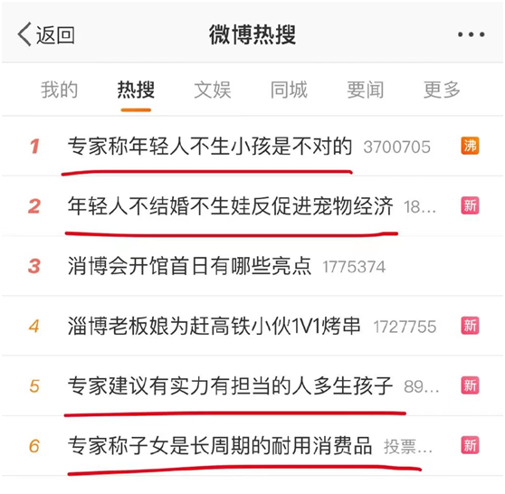

# 人口学者何亚福：大部分家庭生养孩子是负收益，无需指责年轻人不生娃

中国国际经济交流中心总经济师陈文玲近日表示， **年轻人不生小孩是不对的，** 这句话引发热议 **。**

她表示，按照贝克尔经济学家的行为经济学说，子女也是消费品，子女是长周期的消费品，是可以给你带来长久回报的耐用消费品。

所以，年轻人不生小孩是不对的， **你没有长周期的耐用消费品，他的价值是超过你购买其他消费品的价值。** 这个话题很快登上微博热搜第一。

陈文玲所提到的“贝克尔”，是指美国经济学家Gary
Becker（1930-2014），曾于1992年获得诺贝尔经济学奖。在贝克尔的理论中，孩子被认为是以与其他商品相同的方式向父母提供效用。

在消费者理论中，没有现成替代品的商品被称为是
“正常的”；收入的增加会引起这些商品的更多消费。由于孩子似乎没有什么替代品，因此，人们可能会期望生育率随着收入的增加而提高。当然，除了收入以外，影响生育率的还有其他因素。

但贝克尔的理论似乎与现实世界观察到的情况相反，只要留意一下世界各国的生育率，就会发现这样一个普遍现象：富裕国家的生育率较低，贫穷国家的生育率较高。

也就是说， **各国的人均收入与生育率之间存在明显的负相关。**

根据联合国发布的《世界人口展望2022》的数据，按照收入水平的高低划分，高收入、中等收入和低收入国家2021年的总和生育率如下：高收入国家平均为1.56，中等收入国家平均为2.17，低收入国家平均为4.62。

关于生育率与收入的关系，详见我不久前写的文章《“越穷越生，越富越不生”是真的吗？》，本文就不重复了。

本文要讨论的问题是： **年轻人不生小孩是对还是不对。**

**首先，我不赞成“子女也是消费品”这种提法。** 因为子女是人，不是物品。“子女也是消费品”这句话，有物化子女的意味。

其次，即使纯粹从经济学意义上来说， **“子女的价值是超过你购买其他消费品的价值”这句话也值得商榷。**
在现代社会，随着社会养老保障的健全，越来越多的人不靠“养儿防老”。

另一方面，抚养子女的成本不断上升。从经济利益的角度来看， **在目前中国，大部分父母抚养孩子是“亏本生意”** 。

也就是说，对于大部分家庭来说，父母一生中对子女的付出，是大于子女一生中对父母的回报。

尤其是，在当今社会，啃老已是一个十分普遍的现象。对于许多家庭来说， **“养儿防老”已经变成“养儿啃老”。**

**既然大部分家庭生育和抚养孩子是“负收益”，那么，年轻人不生小孩，就没有什么好指责的了。**

但如果大部分年轻人都不愿意生小孩，也并不符合国家和民族的长远利益。所以，国家有必要出台支持生育的政策，减轻年轻人的生育负担，专家也不应该指责年轻人不生小孩。

如果国家出台的政策，能够使家庭多生孩子成为正收益，那么自然就能提高生育率。如果家庭多生孩子是负收益，那么专家说什么都没用，年轻人还是不愿意生小孩。

**所以，国家财政补贴生育是合理的** 。

理由是：生育和抚养孩子对于家庭来说是“负收益”；而在正常情况下，一个人一生中所创造的社会财富总的来说是大于他（她）所消耗的社会财富，对于国家来说是“正收益”。

所以，一个家庭生育和抚养孩子其实是以极大的成本为国家、为社会作贡献。

