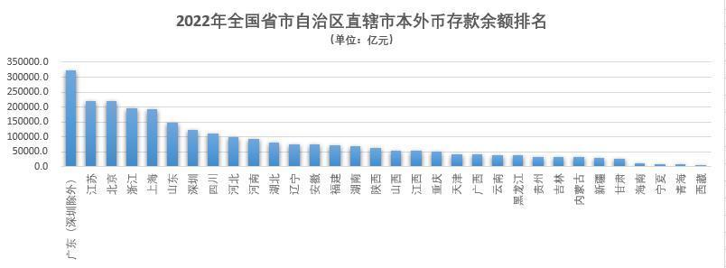
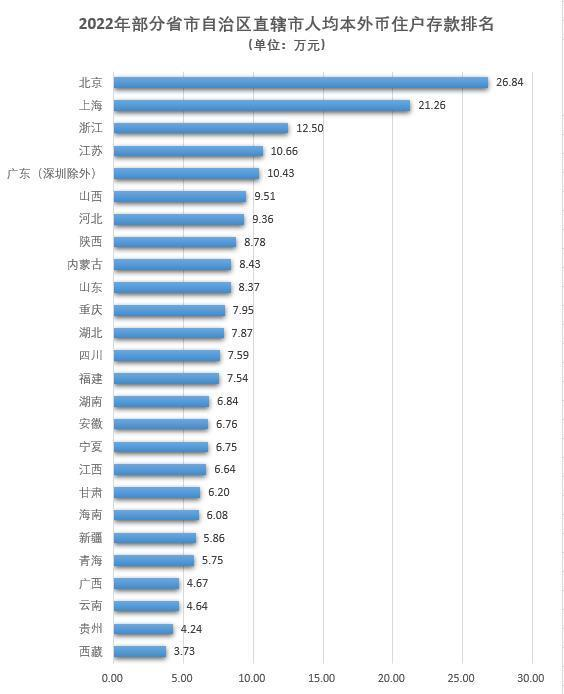

# 居民超额存款三年10.8万亿：北京人均存款已近27万，上海超21万

4月11日，央行公布了2023年一季度的金融数据，其中透露了大量信息。除了超预期的新增社融、持续改善的信贷总量和结构外，居民存款也备受关注。

**居民存款增加近10万亿**

央行数据显示：一季度人民币存款增加15.39万亿元。其中，住户存款增加9.9万亿元，在新增存款中占比64%。

单月来看，1月份住户存款增加6.2万亿元；2月份住户存款增加7926亿元；3月份住户存款增加2.9万亿元。

可见，居民存款依旧在惯性向前，但同比增量已有所下降。

据中信证券测算，2019年以来我国居民共积累了10.8万亿元超额存款。其中，疫情期间消费下滑贡献约4.9万亿元，房地产销售下滑贡献约3.0万亿元，理财回表贡献约2.6万亿元。

尤其是去年，住户存款暴增了17.84万亿元，创下历史新高。这庞大的居民存款如何转化成为消费是当下讨论的热点。

多家券商研报认为，今年，随着居民消费及购房活动的回暖，以及权益市场的改善，能够在一定程度上带动储蓄的消耗，尤其是对资本市场的流入值得期待。

但也有专家提出了不同的见解，远东资信研究员冯祖涵在研报中表示，当前有观点认为高额新增存款可以转化为消费。但这属于本末倒置，存款变动属于收入与消费变动的被动结果。提振消费的源动力并非存款，而是收入增长。

冯祖涵认为，如果经济基本面持续好转、劳动力市场有所改善，居民收入增长回暖，尤其是中低收入人群收入增速回升，自然会带动消费需求扩张。

**北京人均存款已接近27万元**

老百姓的存款热情高居不下，那么，庞大的居民存款来自于哪些地区？

第一财经结合央行、地方统计局公布的数据梳理了全国省市自治区直辖市截至2022年末本外币存款余额情况以及其中的住户存款情况。

根据整理的数据显示：第一经济大省广东（深圳除外，下同）的本外币存款规模遥遥领先，超过32万亿元，是国内存钱最多的地区。其次是江苏、北京，本外币存款余额均超过了20万亿，而浙江、上海正在接近20万亿。

在住户存款方面，广东依旧位列第一，住户存款规模超过11万亿，是国内唯一迈过10万亿存款门槛的省份，事实上，从居民存款的角度，也再次印证了广东第一经济大省的地位。

江苏以9万亿的存款规模紧随其后，另外，浙江、山东均超过8万亿。河北、四川、北京、上海的住户存款在5万亿~7万亿之间。

而从人均住户存款来看，北京、上海高居榜首，其中，北京的人均存款接近27万元，上海人均存款超过21万元。

另外，去年各省居民人均可支配收入数据也显示上海、北京遥遥领先，与上述数据相互呼应，只有收入高，才能存得多。

长三角两大省份浙江、江苏的人均住户存款分别为12.50万元、10.66万元，从上海到江浙，凸显出长三角的不容置疑的居民经济实力。

而广东在人均数据上仅位列第5，人均住户存款刚刚10万出头。另外，由于深圳未披露住户存款余额，所以无法判定深圳的人均住户存款规模，但可以预估的是，其数据表现大概率位于广东乃至江浙之上。

