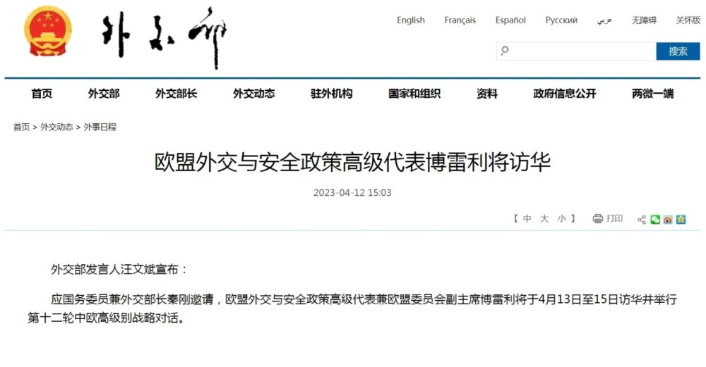
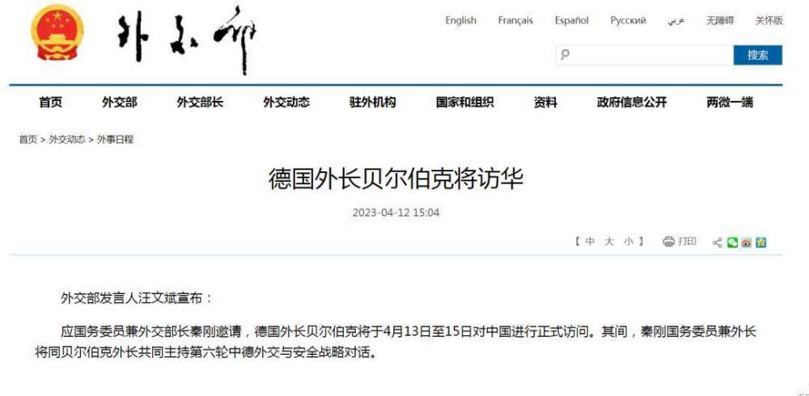

# 欧盟外交与安全政策高级代表博雷利、德国外长贝尔伯克将访华

来源：人民日报客户端

外交部发言人汪文斌宣布：

应国务委员兼外交部长秦刚邀请，欧盟外交与安全政策高级代表兼欧盟委员会副主席博雷利将于4月13日至15日访华并举行第十二轮中欧高级别战略对话。

外交部发言人汪文斌宣布：

应国务委员兼外交部长秦刚邀请，德国外长贝尔伯克将于4月13日至15日对中国进行正式访问。其间，秦刚国务委员兼外长将同贝尔伯克外长共同主持第六轮中德外交与安全战略对话。

