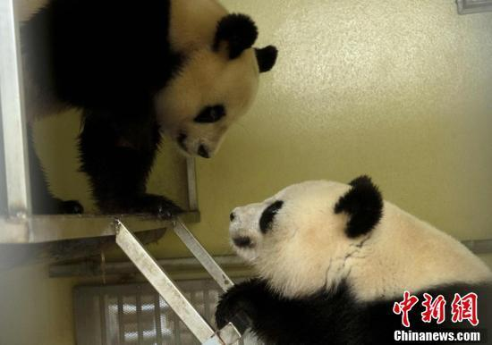
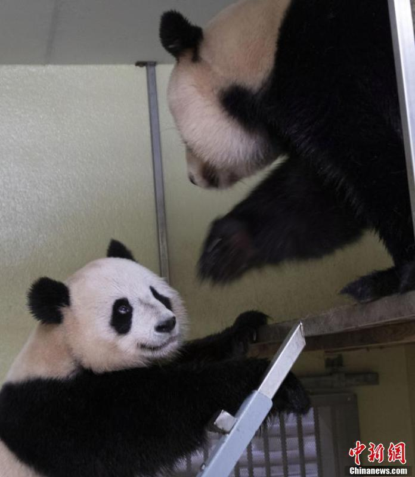
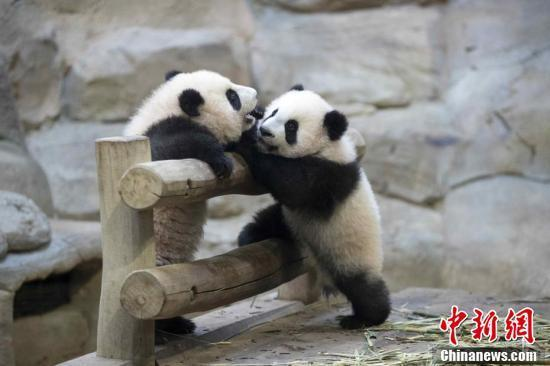
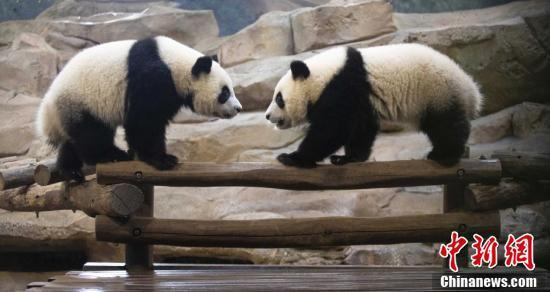

# 法国博瓦勒动物园：旅法中国大熊猫“欢欢”和“圆仔”的租期将延长

_2021年3月拍摄的“欢欢”和“圆仔”照片。（资料图片）法国博瓦勒动物园 供图_

_近日，法国圣艾尼昂市博瓦勒野生动物园方面表示，旅法中国大熊猫“欢欢”和“圆仔”的租期将延长。图为2021年3月拍摄的“欢欢”和“圆仔”照片。（资料图片）法国博瓦勒动物园
供图_

_“欢欢”于2021年在法国产下的双胞胎幼崽“欢黎黎”和“圆嘟嘟”可以在博瓦勒动物园继续被喂养至4岁，即2025年。图为2022年1月拍摄的“欢黎黎”和“圆嘟嘟”照片。（资料图片）法国博瓦勒动物园
供图_

_“欢欢”于2021年在法国产下的双胞胎幼崽“欢黎黎”和“圆嘟嘟”可以在博瓦勒动物园继续被喂养至4岁，即2025年。图为2022年10月拍摄的“欢黎黎”和“圆嘟嘟”照片。（资料图片）法国博瓦勒动物园
供图_

