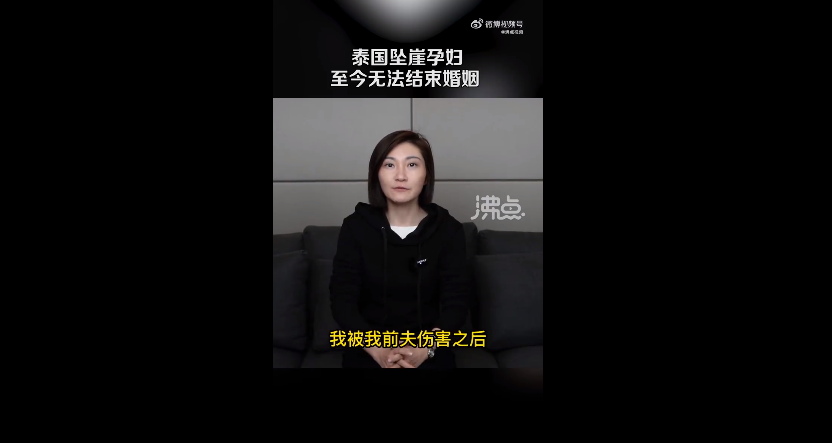
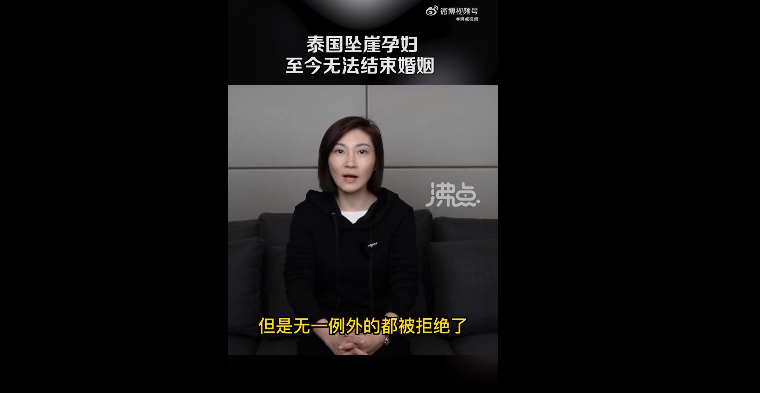
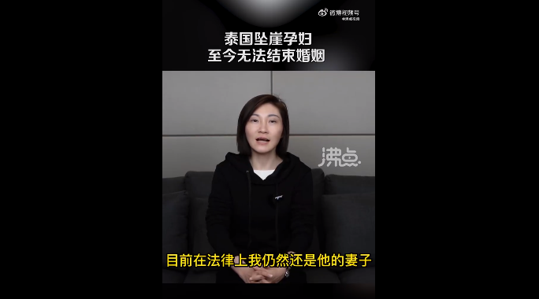

# 泰国坠崖孕妇称仍未离婚：注册相亲网站都被拒绝，正努力摆脱这段婚姻

4月11日，中国孕妇泰国坠崖案当事人王暖暖发布视频称，至今仍然无法结束与恶魔丈夫的婚姻关系。渴望一段新的感情，注册相亲网站因没有离婚证被屡屡拒绝。2019年6月9日，怀孕三个半月的王暖暖，在泰国乌汶府帕登公园，被丈夫俞某东从34米高的悬崖上推下，全身17处骨折，在ICU抢救了8天，腹中胎儿没能保住。

（来源：沸点视频）

