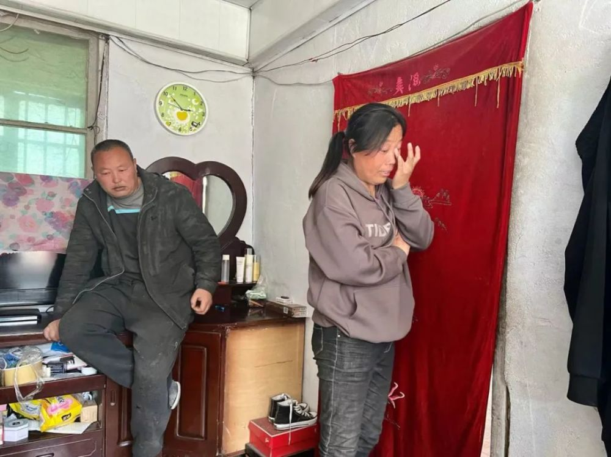
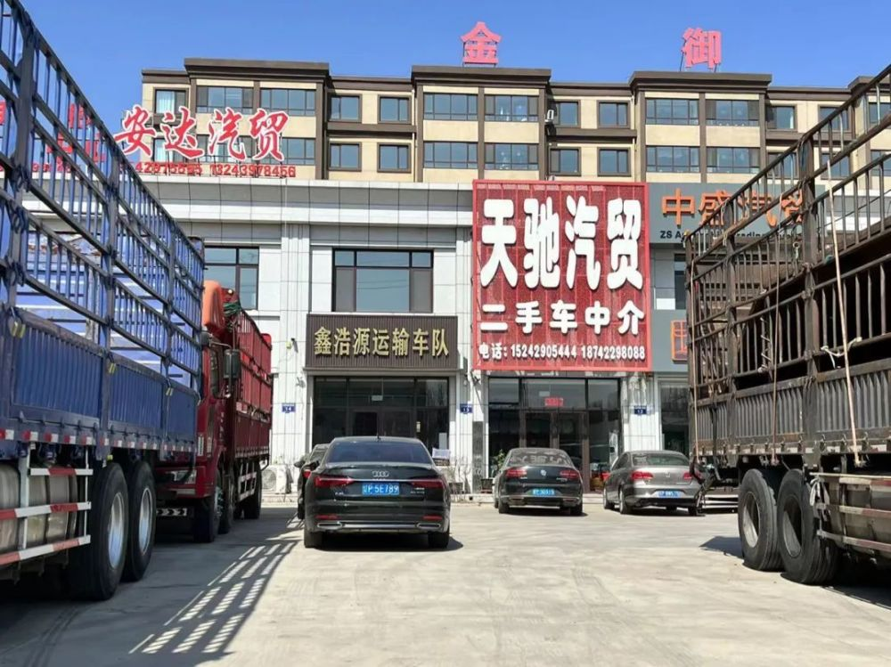
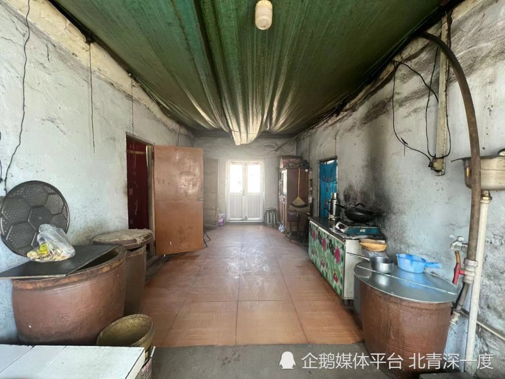
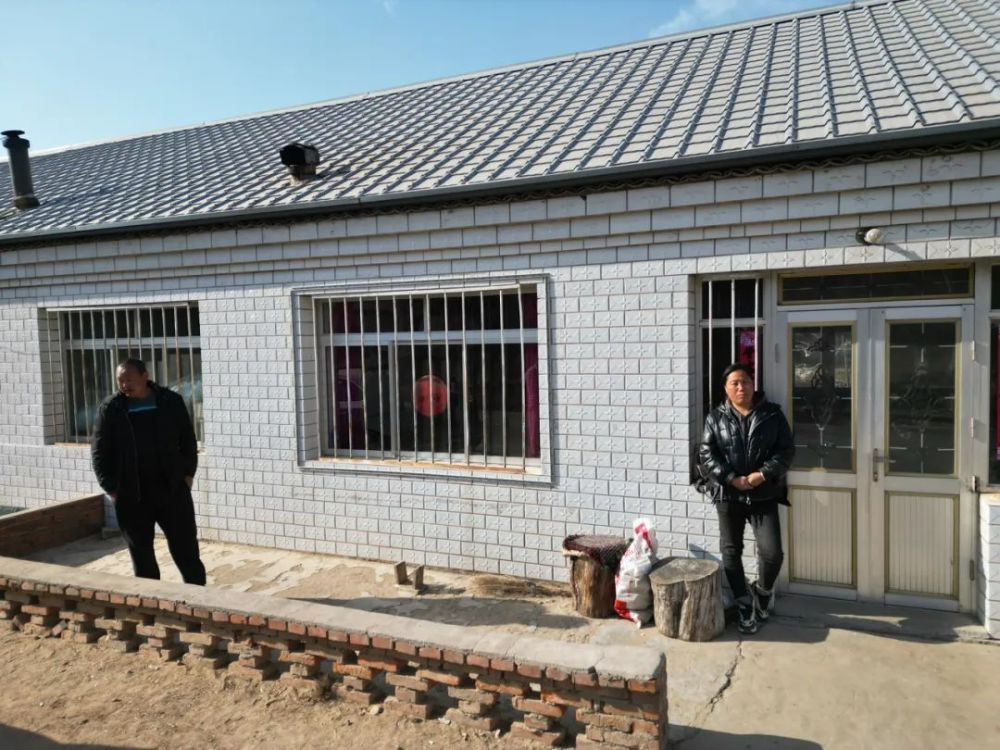

# 涉疫获刑4年的货车司机仍被监视居住，几亩地玉米是全家的唯一收入

记者/ 张蕊

编辑/ 石爱华

_谈及贺宏国被判刑的这一年，妻子忍不住流泪_

时至四月，辽宁绥中进入春耕节气，贺宏国也到田里播下三亩玉米。再审没进展，监视居住之下，这几亩地的玉米或许是他未来一年唯一的收入。

贺宏国是辽宁省葫芦岛市绥中县人，2021年，他和大舅子韩东开始搭伙跑货车。2022年1月，一次长途货运后，两人因行程报备问题，最终以妨害传染病防治罪被判处有期徒刑4年。

判决生效后，两人没有上诉，一直处于被监视居住的状态。没办法跑车的这一年，日子也过得拮据窘迫。

2023年1月8日，我国对新冠病毒感染从“乙类甲管”变为“乙类乙管”。最高法等五门联合发布通知，对违反新冠疫情预防、控制措施和国境卫生检疫规定的行为，将不再以妨害传染病防治罪、妨害国境卫生检疫罪定罪处罚。

虽然韩东和贺宏国一审被判之后没有上诉，案件已处于结案状态。但政策的变化还是让两人燃起了希望。新政宣布之初，两人就以“法院认定事实有误，适用法律错误”为由，向绥中县法院提交了再审申请。此时，距离一审判决已经过去了63天。

3月28日，在第二次监视居住到期后，绥中县法院向贺宏国和韩东下发了第三份监视居住决定书。关于两人的再审申请，绥中县法院表示“仍在审查中，很快会有消息”。

3000斤玉米是去年的唯一收入

三月底，在绥中见到贺宏国时，他正在家对面的小沟旁劈柴，妻子韩迎春在旁边利落地整理着干树枝。看到记者，两人停下手中的活计。贺宏国一米八上下的个子，花白的头发剃得很短，黑色的条纹毛衫外面套了一件洗得发白的黑棉衣。

他略显局促，似乎不知道该怎么打招呼。“晚上冷，得烧坑，要不睡不着。”相比沉默寡言的贺宏国，妻子韩迎春要健谈得多。在过去的400多天里，贺宏国和妻子女儿一直生活在加碑岩乡，这里是距离县城最远的乡镇，买菜要到几公里外的集市，去县城只有一趟下午两点半就准时收车的公交。韩迎春说，住在这里的好处就是省钱。

贺宏国家里的老屋有两间房，进门五六平米的门厅既是连廊，也是厨房。除了在外上大学的儿子，夫妻两人带着女儿挤在一间不到10平的房里，另一间住着贺宏国的父母。

这一年，贺宏国变得愈发不愿意和人说话，没事就干躺着，要么发呆，要么玩手机，他常常后悔当初去了绥芬河，“老的老，小的小，没有收入，要怎么生活？”没办法外出跑车，夫妻两人去年唯一的收入，就是卖了不到三千斤玉米。

贺宏国和韩迎春回加碑岩乡生活后，也给女儿办了转学。周围的人大多对他们表示理解，但也有人会对着女儿指指点点，“看，这就是贺宏国的女儿。”每次听到，女儿都要回家跟母亲叨叨。让韩迎春庆幸的是，女儿大大咧咧的性格从不往心里装事，“就怕孩子出现心理问题。”

贺宏国的搭档韩东也有一样的烦恼。

被监视居住的日子，韩东满脑子是“我要是进去了，这个家该怎么办？” 两个老人，两个孩子，还有房贷，这些担忧让他睡不踏实。

之前，每次跑车后回家，韩东的两个孩子都抢着和他聊天，有说不完的话。现在每天在家，孩子们却很安静。“我儿子高三，他说我要是最终被判刑就不上学了，去打工挣钱。”

自己偷偷哭过后，韩东告诉儿子，“你现在什么都不用想，即使我去服刑了，卖房卖地都会供你读书。”韩东这辈子没什么文化，他不能让儿子也和他一样。“我妈看见我就哭，所以我也不敢总回老家，就在县城的家里呆着。”韩东说。

韩东也曾尝试出去打零工，“就扛了两天沙子，挣了300元。”长期零工对工作时间有要求，不能缺勤，因为监视居住要随传随到，韩东没办法保证这一点。

_贺宏国的货车挂靠的鑫浩源运输车队。他从绥芬河返回的第二天曾到车队办事，接触过他的经理事后没有感染_

送往绥芬河的包心菜

在贺宏国和韩迎春的婚姻里，性格爽朗的韩迎春是家里的主心骨，贺国宏在外奔波挣钱，她管着孩子，照顾老人，操持家里大大小小的事情。

监视居住的一年来，韩迎春怕丈夫压力大，时时宽慰他，鼓励他多出门，溜达也好，找人聊天也好。反倒是最喜欢“凑伙伙”的韩迎春，现在怎么也“叫不出去”。每天干完活，她和贺宏国早早回家。吃完饭，两人就躺在床上“烙烧饼”，“睡不着的时候，我就在想，事情是怎么发展到这一步的？”

时间回到2022年1月22日，韩东和贺宏国从武汉拉了一车包心菜送往黑龙江省牡丹江市。当日傍晚6点多，他们经过绥中县，在当地做了核酸，略作休整后，就又出发了，“连家都没顾上回。”路上，核酸结果出来了——阴性。贺宏国安了心，在此之前，他有些感冒症状，鼻子“不得劲”，但核酸结果一直是阴性。

顺利赶到牡丹江市后，他们这趟行程本该就此结束。可贺宏国收到配货人消息，让他们继续将货物送到牡丹江市代管的县级市绥芬河。于是，两人先卸下半车包心菜，又配了半车胡萝卜，当晚开到绥芬河将货物卸下。

“在绥芬河卸车的时候，我们都没下车。”这是让韩东最困惑的地方，他不知道自己和贺宏国是在哪里被感染的。在绥芬河所做的核酸，两人的结果也是“阴性”。

准备返程的时候，贺宏国又接到一单生意，货主让他们去同为牡丹江市代管的县级市东宁，拉一车玉米送到辽宁省锦州市。锦州距离绥中只有不到3个小时的车程，两人爽快地应下了。

1月25日凌晨，韩东和贺宏国到了锦州，在锦州港卸完货，当日下午2点左右回到了绥中。韩东和贺宏国的户口都在老家村里，疫情之初，每个村民小组都建了微信群，发通知、通报都在群里。两人每次出车回来，都需要在群里报备。

韩东在群里报备了从锦州返回的信息，贺宏国也由妻子进行了报备。回来时，锦州没有疫情，所以韩东和贺宏国没有再做核酸，就各自回家了。“没有人问，也没有人要求我们去做。”贺宏国说。

1月26日，韩东刷视频时看到了绥芬河爆发疫情的消息。他还庆幸，离开得及时。事后，韩东反省，自己唯一做得不到位的是，从手机上看到绥芬河爆发疫情后，没有及时报备自己去过那里。

贺宏国甚至没有关注到绥芬河的疫情，他很少看新闻，也不怎么刷视频。他更没有想到自己后来会和绥芬河疫情联系在一起。

据韩东所述，看到绥芬河爆发疫情后的第二天，他曾约贺宏国一起去做核酸，但因为贺宏国住的较远，交通不便，就拒绝了。

直到2022年2月7日，绥中出现了一例新冠肺炎病例。

_贺宏国被判刑后，为了省钱，他回到老家和父母一起生活_

关于感染源头和瞒报

感染者是韩东的小舅子。2月2日，韩东去其家中聚餐。“去之前我专门做了核酸，拿到阴性结果才去。”韩东说。

2月8日，绥中县通知全员核酸，同时，相关经营场所被要求暂停营业，公共交通实行管制。当天，韩东作为密接被拉走隔离。同一日，贺宏国核酸结果异常被隔离，随后两天，贺宏国和韩东的核酸结果相继显示阳性，两人被送入定点医院治疗。

2022年2月11日，葫芦岛市新冠疫情防控工作新闻发布会通报，经中疾控基因测序比对，当地首发病例感染病毒株与绥芬河市疫情早期病例高度同源。

与此同时，绥中县公安局找到正在治疗中的韩东和贺宏国，通过视频方式分别给他们做了笔录。两人这才意识到，事情开始严重了。

2月24日，葫芦岛市召开疫情防控工作新闻发布会，宣布查清了疫情的源头是两名曾经去过绥芬河的货车司机。

到现在，对于源头的认定，韩迎春还觉得困惑，“我和女儿一直没阳，我们和他是最密切的接触者了，如果源头是他，我们怎么没被感染？”

韩东的代理律师对“源头”的认定也提出过异议，他曾在开庭时表示，韩东从绥芬河市疫区返回后，经过 17
天才被确诊新冠肺炎，并不能合理排除韩东从疫区返回绥中县时并未感染新冠肺炎，不排除其返回绥中县后感染的可能。

治疗中的韩东得知自己和贺宏国被认定为引发绥中县疫情的责任人时，第一反应是“自己有责任，但并大”，因为“主观上并没有故意隐瞒行程，也没有瞒报”。“我手机也没关机，也没有换手机换卡。”韩东说。

贺宏国则很委屈，“我们都没症状，确诊时间距离我们从绥芬河返回已经过去两周了。”不过两人没有对责任认定提出异议，他们心里的想法是，虽然不是故意引发了疫情的传播，但确实去过绥芬河。

韩东与贺宏国的事情发生后，绥中县加强了对货车司机的管控。和韩东同乡的货车司机李伟回忆，从2022年3月开始，从绥中县离开的车主需要做三次核酸，还要社区开具“货车出车”证明，返乡后需要提供行程码、健康码、核酸证明和接收证明，如果途径涉疫地区，还要经过14天集中隔离、14天健康监控才能正常活动。为了避开繁琐的手续，李伟有一次离开绥中4个多月才回家。

2022年9月29日，绥中县检察院向绥中县法院提起公诉，指控韩东、贺宏国得知绥芬河爆发疫情后，未履行疫情防控相关规定，未对去过绥芬河的行程进行报备。

“是否瞒报”成了案件争议的焦点。

韩东和贺宏国所在村子的防疫人员在接受调查时表示，曾在微信群里发布过“外省市返乡需提供健康码、行程码、48小时内核酸证明、从何处返乡”的通知，韩东和贺宏国的妻子曾在微信群里报备过锦州行程和核酸证明，但没有上报14天行程。

韩东和贺宏国表示，并没有隐瞒自己的行程，之前出车回来，就是最后一站是哪里就报备哪里，从来没有要求要报备全部的行程，“我们从绥芬河回来的时候，那里还没有发生疫情，按照当时的防控政策，是不需要报备的。”

深一度记者采访的多名货车司机证实了贺宏国和韩东的说法——从哪里回绥中，就报备哪里，并没有对行程码、健康码、核酸做硬性要求。“我们都是到处跑，如果报备14天的行程，那得写多少？”货车司机徐光说，2022年2月8日之前，他跑车从外地回绥中，只偶尔在下高速时会有人问从哪里返回的。社区群里虽然发过通知，但没有做强制性要求。

贺宏国那辆车头为咖啡色的加挂货车，挂靠在鑫浩源运输车队的名下。车队负责人黄经理在接受深一度记者采访时表示，贺宏国和韩东的事情出来之前，货车司机们回绥中并不需要报备，下高速也基本没有人管。

黄经理最后一次见贺宏国，是其回绥中的第二天，“他到车队来算账，但年前我们车队和他接触过的人都没有被感染。”当天，贺宏国还去接种了新冠疫苗第三针。

针对两人是否瞒报的说法，判决书显示，一位流调人员作为证人接受调查时表示，曾在1月28日给贺宏国打过流调电话，询问其近期是否去过绥芬河，她印象中贺宏国的说法是“一个多月前去过”。

对此，韩东与贺宏国均表示，在接到流调电话询问他们是否去过绥芬河时，他们都如实告知对方自己曾在一月底去过绥芬河，没有隐瞒行程。

_2023年3月28日，监视居住到期后，贺宏国来到法院询问再审申请情况，被告知“等消息”。当晚，他接到了第三份监视居住通知_

四年的刑期

开庭前，绥中县检察院联系韩东和贺宏国，让他们签一份“认罪认罚书”，当看到上面的量刑建议是“三年”时，韩东问，三年是缓刑还是实刑，对方回答“实刑”。“我感觉有点多。”韩东提出质疑。检察官告诉他，如果觉得刑期长，可以不签字。于是，两人都没有签字认罚。

10月中旬，绥中县法院开庭审理了此案。除了韩东和贺宏国，两家人谁都没能进入法庭。10月31日，绥中县法院下发一审判决。法院认定，两人未履行疫情防控相关规定对去过绥芬河市的行程进行报备。后二人均被确诊新冠肺炎，造成绥中县范围内大量人员感染，“后果特别严重”，根据传染病防治法规定，应处三年以上七年以下有期徒刑。

判决显示，韩东和贺宏国最终获刑4年，没有缓刑。

得知判决结果的瞬间，韩东和贺宏国都不敢相信，“判得太重了。”韩东说，原本以为最多也就判3年，没想到会被判4年。贺宏国甚至眼前一黑，还没走出法院，眼泪先出来了。

判决书对于“后果特别严重”的描述是：绥中县183人被感染，7865人被隔离，全县陆续划定34个封控区、管控区和重点防范区，启用隔离场所61家，财政共支出各项疫情应急处置费用约1.55亿元。

对此，北京师范大学刑法研究所副所长彭新林认为一审判决量刑过重，适用法律错误。“如果真是他们引发的疫情，那肯定有责任，但是否造成了特别严重的后果，是值得商榷的”。彭新林表示，两人的行为确实造成了严重后果，但谈不上“特别严重”，不能把“板子”全部打在两个司机身上，“方方面面都有责任”。

得知贺宏国被判了4年，韩迎春背着家人，哭了好几天。她盘算着，如果丈夫去服刑，那她就出去打工挣钱。

韩迎春的想法还没来及告诉贺宏国，14岁的女儿也流露出要外出打工挣钱的念头。她告诉女儿，即使父亲去服刑，也要好好上学，挣钱养家的事情交给妈妈。

韩东和贺宏国没有上诉。“我们担心上诉可能会被加刑。”

判决下发后，韩东和贺宏国一直没有被收监，“最初是因为疫情，放开之后就没人管了。”韩东说。

2023年1月7日，最高法、最高检、公安部、司法部、海关总署联合出台《关于适应新阶段疫情防控政策调整依法妥善办理相关刑事案件的通知》，指出目前正在办理的相关案件，依照中国刑法、刑事诉讼法相关规定，及时妥善处理。犯罪嫌疑人、被告人处于被羁押状态的，各办案机关应当依法及时解除羁押强制措施；涉案财物被查封、扣押、冻结的，应当依法及时解除。

这个新规主要针对未审结案件。韩东和贺宏国一审没有上诉，判决已经生效。中国政法大学教授罗翔也撰文称，“命运给他们开了一个巨大的玩笑”。罗翔认为，既然一审判决已经生效，通知的出罪规定就和他们没有关系。“中国刑法采取的立场是认为既判力的效力高于溯及力，对行为人有利的法律不能溯及已经生效的裁决”。

贺宏国贺韩东没想到，当初不上诉的决定会影响到事后。但他们仍递交了再审申请。之后，他们多次询问派出所和法院，得到的答复都是“让等消息”。

_再审申请没消息，判刑又未收监，贺宏国觉着，监视居住的日子就像一直“悬着”_

悬着的日子

绥中县是沿京哈高速去往东三省的必经之地，也是一个被货车环绕的小县城。截止2022年6月，绥中县有运输车队150余家，货运车辆1.1万余辆，涉及从业人员达1.5万余人，贺宏国和韩东就曾是他们中的一员。

跑车的时候，是贺宏国觉得最有盼头的日子。如今申请再审没有消息，判刑又未被收监，被监视居住的日子让贺宏国的心一直悬着，“充满了不确定性”。

早年，贺宏国给别人开车，每个月拿固定工资。2019年6月，贺宏国和合伙人共同出资购买了一辆加挂货车，花光了家里的积蓄，还借了不少钱。他的想法很简单，总给别人打工，不如自己买辆车，辛苦一点但能多挣一些钱。

“2019年货运市场确实火爆，工厂出货量多，货车基本都在连轴转。”绥中县一家运输车队的负责人说，当年，有车的都挣钱了。

贺宏国的货车跑的是固定线路，从南方拉蔬菜、水果到哈尔滨、沈阳等东北的城市。因为疫情，跑车的日子变得更加辛苦。虽然总碰到下高速堵车、卸货等待等各种问题，但每趟车都能挣钱。

韩迎春也觉得家里的日子会越来越好。2020年中，为了让孩子有更好的学习环境，他们搬到了县城，先租了一套房子，打算存几年钱，再买一套房子。可钱还没存够，贺宏国先“出了事”。

2022年6月份，在合伙人的提议下，贺宏国卖掉了那辆占一半份额的大货车。“如果不能出车，等于一直在赔钱。”他算了一笔账，除去贷款，停车费、保险等各种税费，一个月下来的折损要五六千元。

谈及为什么不雇司机跑车，韩迎春说，雇司机会“赔得更多”。她算了一笔账，大车必须两个司机轮流开，一名司机一个月的工资9000元，加上吃住，两名司机要超过2万元的开支。这样一来，运费无法覆盖成本，还得倒贴。

鑫浩源车队的黄经理曾帮贺宏国想过办法，只是司机们对这辆牵扯了“官司”的车多少有些忌讳，“没人愿意开，只能低价卖了。”

韩东打算，只要改判无罪，马上就去出车。他不知道的是，今年货运行业变得更难做了，一些车主甚至雇不起司机。“货少了，运费低了”，黄经理说，往年一年能挣到十万，现在也就能挣六七万。司机的工资也从原来每天300元左右，降到了220元。

贺宏国与韩东现在最大的期望就是再审申请可以得到回复。3月28日一早，贺宏国从加碑岩的家里出发，前往法院。这一天，是他和韩东第二次监视居住到期的日子。他想去法院问一问，申请再审的流程走完了没有，监视居住到期该怎么办，“悬着让人很难受。”

当日上午10点，贺宏国到了法院，他再一次得到“去等通知”的消息，“下午会有人联系。”下午6点左右，贺宏国和韩东接到通知，监视居住再一次被延长半年。

（为保护采访对象隐私，文中李伟、徐光为化名）

【版权声明】本文著作权归【北京青年报】所有，腾讯新闻已获得信息网络传播权授权，任何第三方未经著作权所有人授权，不得转载。

