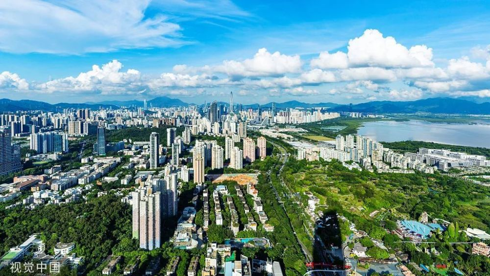

# 深圳六折人才房，为何不到半年就“取消”了

推出不到半年，深圳的六折人才房，将成历史。

近日，深圳市规划和自然资源局发布关于公开征求《深圳市地价测算规则（修订征求意见稿）》意见的通告。

上述文件提到，深圳住房建设局正在牵头制定保障性住房相关政策，取消了原来的安居型商品房、人才住房等住房类型，新增了保障性租赁住房、共有产权住房等住房类型。

这意味着，深圳的住房保障体系，将由现在的公共租赁住房、人才住房、安居型商品房三种类型为主，转为以公共租赁住房、保障性租赁住房、共有产权住房三种类型为主。

_深圳。图/视觉中国_

深圳的六折人才房政策，缘何短短不到半年就“取消”了？为什么深圳转而选择共有产权房模式？

**“遇冷”的人才房**

2022年11月，深圳正式推出了六折人才房政策。彼时，作为经济特区和一线城市，深圳的六折人才房一经推出，立即引发各方关注。

据了解，首批6个人才住房项目，共计4422套房源。而申请者的门槛也并不高，需要购房者自身在深圳无房，且具有全日制本科以上学历或二级以上国家职业资格证书、深圳户籍以及在深圳缴纳社保。

在一线城市中，深圳户籍的准入门槛相对较低。普通高等教育本科以上学历，45周岁以下的人员；普通高等教育专科以上学历，35周岁以下的人员和有高级专业技术资格50周岁以下的人员，以及中级专业技术资格45周岁以下的人员，都可申请深圳户籍。

首批次人才房共吸引了15294户家庭参与认购，远超4422套可售房源。然而，4422套可售人才房中，最终仅有1930套房源被选定。

面对人才房的“遇冷”，深圳为了增加符合条件的购房者，甚至修改了准入门槛：深圳人才房的单身购买的年龄限制从35周岁下调至30周岁。此外，申请人的配偶、未成年子女，不再受深圳市户籍限制。

此后，深圳人才房“遇冷”的境况并没有改变。

2023年，深圳人才房共推出11个人才房项目，共8510套房源。但市场售价6折的人才房，最终去化率只有43.65%。

最近，深圳市住建局公布了两个项目的选房结果。其中，安居同乐馨苑项目199套可售人才房全部告罄，但是有超过六成有机会选房的人放弃了选房。深铁熙府三房户型选房已结束，708名报名者仅选走155套房，去化率只有15%；深铁熙府两房户型的选房正在进行，弃选率超八成。

深圳人才房缘何“遇冷”？不少行业人才将其归因于长达10年的“禁售期”。

据了解，深圳人才房签订买卖合同10年后，可根据有关规定申请100%产权上市交易。这意味着购房者在买房的10年内，无法卖房。

而在户型选择方面，深圳人才房也存在诸多限制。有弃选深圳人才房的市民告诉中国新闻周刊，弃选原因是对户型不满意，根据规则，三口之家只能选择两居室，不能选择三居室。

“房子10年不能买卖，但是10年内很可能要二胎，如果再将老人从老家接来，两居室就不太够住，所以规则本身有不合理的地方。”该市民表示。

市场行情也影响着不少购房者的心理。

广东住房政策研究中心首席研究员李宇嘉分析，人才房十年以后才能上市交易，产权是受限的，而十年以后到底房价怎样，十年以后增值收益到底怎么分配，深圳人才房现在也没有明确的规则。

“近期深圳不少商品房的价格正在下降，而且房子的供应量却在不断增加，根据深圳‘十四五’规划，深圳政府加大了保障性住房的供应，未来深圳房源供应量非常充足，新房相比五年前甚至要增长40%～50%，且普遍将采取限地价、限房价的模式。”李宇嘉对中国新闻周刊表示。

**共有产权房登上舞台**

在不少业内人士看来，此次深圳保障房制度的变化，更像是向其他城市保障房制度看齐。

值得注意的是，根据文件，在深圳人才房成为历史的同时，共有产权住房将登上舞台。相比深圳人才房10年的禁售期，共有产权房的禁售期仅有5年（可售卖给同样具有共有产权房资格的购房者），售价一般而言也只有同等地段的5折。

“一直以来，北京和上海等城市，保障住房主要包括保障性租赁住房和共有产权房，深圳则是采取人才房和安居房制度，此次深圳的改变，有向这些城市看齐的意味。”上海易居研究院研究总监严跃进对中国新闻周刊表示。

2016年，深圳首次提出构建人才住房和保障性住房双轨并行的住房保障体系。到2018年8月，深圳正式出台保障房体系的相关文件，提出建立商品房占比40%左右，人才住房、安居型商品房、公共租赁住房各占20%左右的住房供应结构。

但在2021年6月，国务院发布了《关于加快发展保障性租赁住房的意见》，这份文件确立了我国要构建公租房、保障性租赁住房和共有产权住房“三位一体”的住房保障体系。

在不少业内人士看来，此次深圳的改变算不上突然。

“所谓人才房‘遇冷’，一部分原因是符合条件的市民虽然只能购买一套，可以在流程上申请多套，但更主要原因是可以购买的群体，存在一定门槛，所以没有想象的那么火爆。”严跃进说。

李宇嘉认为，过去，包括深圳在内的不少热点城市，保障房体系更多偏向人才，进而促进本地经济发展，这虽然无可厚非，但优先保障人才的住房需求，存在一定的功利性，可能无法解决不少新市民和年轻人的住房困难，此次深圳保障房制度的改革，主要特征就是将保障房范围扩大。

相比人才房，共有产权房的受众，显然更大。比如，申请北京、上海等城市的共有产权房项目，并不需要当地户籍。

**多地探路保障房建设**

2021年8月，时任住房和城乡建设部部长王蒙徽在新闻发布会上表示，公租房、保障性租赁住房和共有产权住房针对群体是不同的，公租房主要是为了解决城镇住房和收入双困家庭；保障性租赁住房重点解决人口净流入的重点城市新市民和青年人的住房问题；共有产权住房是由城市政府因地制宜，帮助有一定经济实力，买不起房子的居民能够尽快改善居住条件。

目前，不少城市在共有产权房方面，探索出一定的经验。

李宇嘉说，“北京的共有产权主要是针对特定人群，比如连续几年在北京持续缴纳社保的无房群体，都可以申请排队买这类房子，虽然在交易上存在一定限制。”他认为，北京的做法值得借鉴。

近年来，北京共有产权房发展在业内受到不少好评。有北京市民告诉中国新闻周刊，其2020年在北京亦庄开发区购买的共有产权房，其售价仅有市场的一半，户型和周边配套方面也比较满意，但硬性条件是需要在亦庄开发区内就业。

目前，大多数北京共有产权房不需要本市户籍，比如今年4月大兴推出的共有产权住房项目，除了本市户籍无房家庭，在大兴区重点企业、国家高新技术企业、新媒体产业园、生物医药基地产业园、京南大学联盟、大兴国际机场驻场单位工作的人员，都可以申请。

谈到上海的共有产权房等保障房项目，李宇嘉认为，当地政府从供地开始政府就重点扶持，提供了大量的地块，这样做法也值得借鉴。

“北京和上海等城市，已经在探索当地国企或城投平台在保障房方面发挥主导作用，这包括不计短期的亏损来增加保障房的供应，进而实现规模化供应。”李宇嘉说。

作者：赵越

