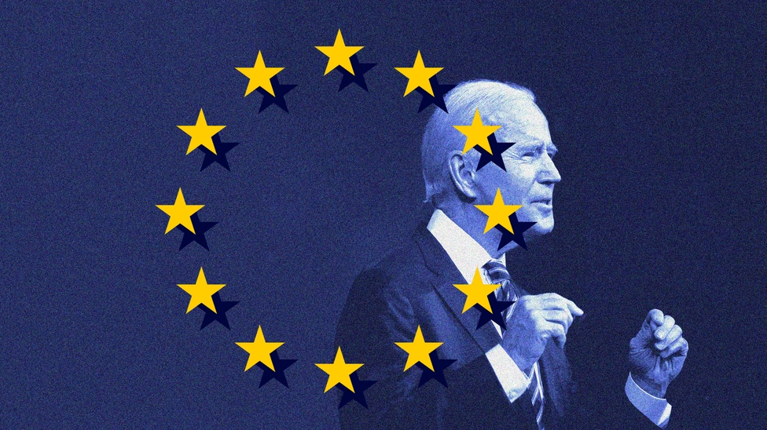

# 美媒：美国与中国进行“孤独冲突”，几乎没有盟友支持其对华“冷战”

【环球网报道 记者
索炎琦】“美国与中国的孤独冲突。”美国“政治新闻网”10日以此为题发表文章，描述了美国盟友在美中紧张关系背景下的心情，以及美国自己当前的处境。文章作者萨姆·萨顿引述欧亚集团总裁伊恩·布雷默的话称，“几乎没有哪个美国盟友真正支持与中国进行冷战的想法。”

文章开头写道，国际货币基金组织和世界银行集团于本周在华盛顿特区召开2023年春季会议，全球多国财长和央行行长将出席参加。不过，世界上最大的两个经济体美国和中国，目前还看不到关系解冻的迹象。

_美国总统拜登与欧盟旗帜
资料图_

文章称，就在世界多国政策制定者努力应对由通胀、银行业危机、俄乌冲突等因素导致的经济不确定性之际，美中两国之间不断升级的紧张关系给这一会议添加了“令人不安”的因素。在中国台湾地区领导人蔡英文以“过境”为名窜美并与美国会众议长麦卡锡见面后，美中关系雪上加霜、变得更加冷淡，中国大陆此后宣布进行环台岛军事演习。

文章评论称，随着中国在世界银行等多边组织中发挥更大作用，美国的盟友越来越直言不讳地表达自己的不安，即如果拜登政府采取进一步行动孤立中国，潜在的经济痛苦也将随之而来。

“几乎没有哪个美国盟友真正支持与中国进行冷战的想法，”欧亚集团总裁伊恩·布雷默称，“对华关系的政治（氛围），在美国令人难以置信的有毒且充满敌意，（但）对（美国的）任何盟友来说并不是这样。”

_2023年4月7日，广州，法国总统马克龙在中山大学发表演讲。图源：视觉中国_

为此，文章提到法国总统马克龙上周访华一事，并称这是佐证上述观点的“一个恰当的例子”。“欧洲必须顶住成为美国追随者的压力”，据美国“政治新闻网”欧洲版9日报道，在结束为期3天的访华之行后，法国总统马克龙在返回法国的专机上接受媒体采访时表示，欧洲必须加强战略自主性，顶住成为“美国追随者”的压力，并避免卷入中美在台湾问题上的对抗。马克龙表示，欧洲面临的“巨大风险”是其陷入“并非属于我们的危机当中”，这些危机阻碍欧洲建构战略自主性。他呼吁欧洲在防务等领域减少对美国的依赖。

马克龙的相关表态获得来自本国官员及欧洲方面的力挺。据彭博社报道，法国经济和财政部长勒梅尔当地时间11日力挺法国总统马克龙，表示欧盟不能在中美两国之间的竞争中任人摆布，他支持马克龙早前言论，即一旦发生全球危机，欧盟国家不应成为任何一方的附庸。同日，据美国“政治新闻网”欧洲版报道，欧洲理事会主席米歇尔也表示，欧洲领导人愈发支持法国总统马克龙推动的、旨在让欧洲远离美国的“战略自主”政策，马克龙的立场在欧盟领导人中并非孤例。

