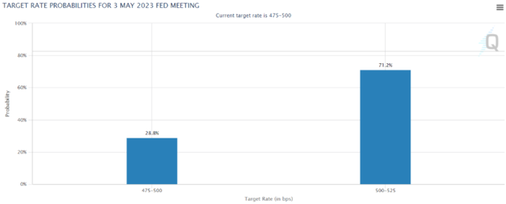

# 美联储高官现分歧：三把手呼吁再加息一次，芝加哥联储主席认为需谨慎

面对当前的经济形势和银行业危机带来的阴影，美联储内部的分歧似乎正在公开化。

4月11日周二，美联储“三把手”、纽约联储主席John
Williams表示，美联储政策制定者在降低通胀方面仍有更多工作要做，并表示尽管银行业动荡带来不确定性，但他们不会改变方针，他强调今年应当再加息一次；但芝加哥联储主席Austan
Goolsbee则认为，在银行业危机刚刚平息一些的当下，美联储下一步行动应该更谨慎。

“三把手”呼吁再加息一次后暂停，暗示未来可能降息

**Williams表示，美联储政策制定者在3月的经济展望中说，今年将再加息一次，然后暂停加息，这是一个“合理的起点”——尽管调整利率的路径将取决于即将公布的经济数据。不过他表示，如果通胀下降，美联储将需要降低利率。**

Williams表示：

我们需要做我们该做的事情，以确保降低通胀。

Williams认为，通胀正在下降，但仍远高于美联储2%的目标。他补充说，一项关键的基本价格指标最近几乎没有变化：

我们已经看到数据一直强劲，通货膨胀率仍然很高。

在谈到最近的银行业危机时，他说，这一事件对美国经济的影响尚不确定。

上个月的预测显示，根据美联储官员的预测中值，18位美联储高级官员预计到年底利率将达到5.1%。这意味着美联储可能再加息25个基点，投资者押注美联储会在5月初的议息会议上再次加息，并将在今年年底开始降息。但美联储则否认了今年年内降息的可能性。

Williams表示，市场预期反映了对经济衰退以及通胀大幅放缓的预测：

我们看到通胀放缓的迹象，但通胀仍然很高。部分核心服务通胀（不包括住房）尚未出现变化。 因此，要让通胀率回到2%，我们的工作仍然有些困难。

Williams认为，美联储官员已将利率上调至“有点限制性”的水平，现在必须确定将利率提高到足够限制的水平还需要多长时间：

显然，这将受到数据和经济前景的驱动。此外，美联储的资产负债表缩减计划，即量化紧缩 ，也进展非常顺利，短期内不需要调整。

芝加哥联储主席：美联储需要谨慎行事

**周二，芝加哥联储主席Austan
Goolsbee表示，面对近期银行业压力，美联储应对加息持谨慎态度，他是第一位较明确表达下次议息会议可能需要暂停加息的美联储高官。**
他认为，银行贷款减少将有助于平息通胀，并减少货币政策的工作余地：

在金融系统受到压力的时刻，正确的货币政策需要审慎和耐心地评估金融压力对实体经济的潜在影响。

鉴于这些金融行业逆风的走向充满不确定性，我认为我们需要保持谨慎。我们应该收集更多数据，并小心不要过度激进地加息，直到我们看到不利因素对我们降低通胀有多大作用。

Goolsbee强调，地区性银行是重要的融资与信贷来源，美联储需要保持谨慎，避免过于激进地加息。此外，他认为，美联储需要对金融市场负面状况的影响程度给出准确的把握。他认为，信贷紧缩可能会对经济带来显著的冲击。不过他也强调，最近几周以来，银行业风波已经趋于平息。

Goolsbee表示，通胀和劳动力市场数据在2022年底和今年年初“出人意料地强劲”，但3月份硅谷银行倒闭的连锁反应以及由此产生的金融市场压力可能对美联储努力促成的对美国经济进行降温的行动有利。

据芝商所的统计，当前市场预测美联储5月初加息25个基点的概率超过七成。

