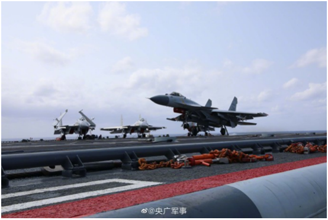

# 美航母又跑了？台名嘴讽：5000美军性命比台湾人怎么想重要

【环球网报道】据台湾中时新闻网11日报道，民进党当局领导人蔡英文“过境”窜美后，解放军8日起启动了为期3天的环台军演。有外媒称，美军“尼米兹”号航母舰队8日军演一开始就转头北上，台湾前外事官员介文汲11日分析称，美军不希望卷入大陆军演，
“一艘航空母舰上5000名官兵的性命，绝对高于台湾人怎么想”。

_山东舰首次参加环台岛战备警巡和“联合利剑”演习现场图片。图自@央广军事_

报道称，大陆日前环台军演，首次派遣航母“山东舰”前往台湾东南外海约200海里处演习，美军“尼米兹”号航母则是在台湾东部约400海里处进行“监控”。“澳大利亚新闻网”报道称，“尼米兹”号航母7日靠近台湾，一度与“山东舰”仅距离200海里，但8日军演一开始就果断转头北上，与去年8月一样。

介文汲11日在岛内政论节目《卢秀芳辣晚报》中分析，美军航母越接近山东舰就越有对抗姿态，而美军并不想干涉大陆军演，转头离开就是向中国发出信号，表达“与我无关”，不希望局势被误判。

介文汲提到，解放军的新型舰对舰、高超音速导弹“鹰击21”射程高达1500公里，而美军航母的舰载机F-35飞行距离只有1000公里，美军若想保障航母就要与中国大陆军舰保持1500公里的安全距离。

介文汲讽刺称，美军航母直接掉头离开就是完全不希望被误解有对峙的感觉，平常还能靠近晃一晃，但大陆军演一开始美国非走不可，“一艘航空母舰上5000名官兵的性命，绝对高于台湾人怎么想”。

对此，有岛内网友在台媒评论区留言表示，“果不失美国本色”、“美军在中国沿海只是枪靶子，只剩下放话的功能”。

也有网友称，“幻想很美好，现实很骨感。”“台湾人在美国人眼里就是一群渣。”

4月10日，东部战区新闻发言人施毅陆军大校表示，4月8日至10日，中国人民解放军东部战区圆满完成环台岛战备警巡和“联合利剑”演习各项任务，全面检验了实战条件下部队多军兵种一体化联合作战能力。战区部队全时待战、随时能战，坚决粉碎任何形式的“台独”分裂和外来干涉图谋。

此次军演让岛内不少人意识到大陆是在“动真格”。台湾前“立委”郭正亮10日在《头条开讲》节目中表示，台湾的军事专家认为大陆这次是在动真格的，“就是说接近实战状态”。

