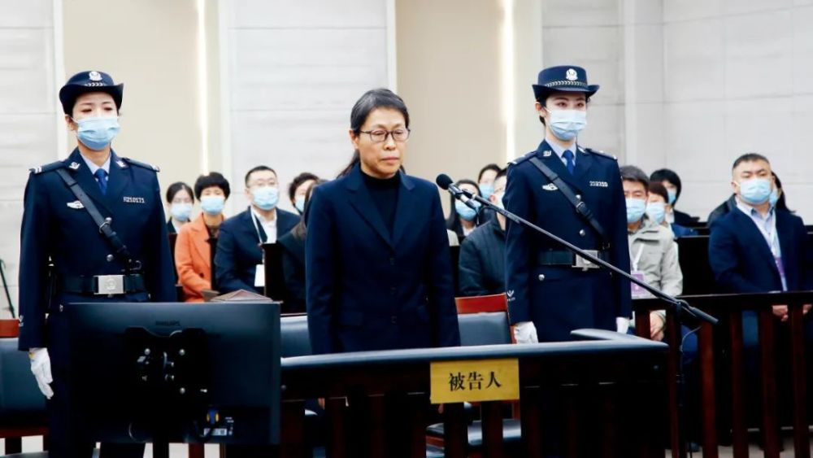
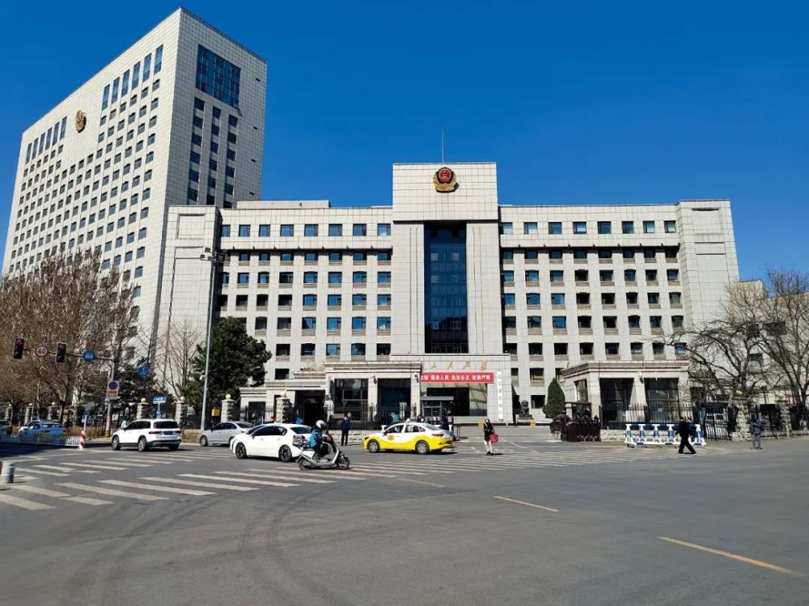

# 解码辽宁反腐

3月23日，60岁的辽宁省原副省长郝春荣站在了大连市中院的被告席上。她头发已有些许灰白，双目微闭，神情黯然。检方指控其受贿1883万余元。她当庭表示认罪、悔罪。法庭将择期宣判。

郝春荣去年3月被查，她也是去年以来辽宁省被查的6名省部级官员之一。

_3月23日，辽宁省大连市中级人民法院一审公开开庭审理了辽宁省人民政府原党组成员、副省长郝春荣受贿一案。图/大连中院_

近年来，辽宁省的反腐力度持续加压。连续三任公安厅厅长落马，2022年更有5名省部级官员被查，成为去年省部级官员落马数量最多的省份。

辽宁省纪委副书记、省监委副主任吕宏在去年曾披露一组数字：党的十八大以来，辽宁省纪检监察机关立案213593件、处分192761人、移送检察机关5187人，其中处分厅局级干部1011人、县处级干部9338人。

辽宁严峻的反腐形势此前已引发高层关注。2018年9月28日，习近平总书记在沈阳主持召开深入推进东北振兴座谈会时强调，政治生态同自然生态一样，污染容易，治理不易。要坚持无禁区、全覆盖、零容忍，坚决查处各类腐败案件，始终保持党同人民的血肉联系。

今年1月29日，辽宁省第十三届纪律检查委员会第三次全体会议召开，辽宁省委书记郝鹏的一席表态被外界解读为辽宁的“反腐时间表”。他指出，要充分认清辽宁反腐败斗争的长期性、艰巨性和复杂性，力争用3年左右时间基本清除腐败存量，用5年左右时间构建全面遏制增量、保障振兴发展的反腐败治理新格局。

**11个月内6名“辽虎”被查**

近年来，辽宁省落马的“老虎”不仅数量多，而且不少腐败官员之间还存在盘根错节的关系。

据《中国新闻周刊》不完全统计，2022年至今，辽宁省已有6名省部级官员被查，分别是辽宁省原副省长、省公安厅厅长王大伟（2022年3月1日），辽宁省原副省长郝春荣（2022年3月29日），辽宁省政协原副主席孙远良（2022年4月9日），辽宁省人大常委会原副主任孙国相（2022年6月2日），沈阳市人大常委会原主任付忠伟（2022年11月9日）和大连市原政协主席、党组书记郝宏军（2023年2月5日）。

这意味着在大约11个月时间内，辽宁省有6名省部级官员被查。2022年，全国有32名中管干部被查，其中5人来自辽宁。

值得注意的是，孙远良也是不到2年内，辽宁省被查的第4名省政协原副主席。此前三人分别为刘国强（2020年7月）、李文喜（2021年1月）、薛恒（2021年8月）。

截至本文发稿时，郝春荣受贿一案已进行了一审庭审。王大伟、孙远良、孙国相三人已被提起公诉。

值得注意的是，2022年以来，辽宁被查的官员中，多人与盘锦市有着千丝万缕的联系。上述6人中，有3人曾在盘锦市任重要职务：郝春荣2016年10月至2018年1月任市长，孙国相2008年2月至2016年9月历任代理市长、市长、市委书记，付忠伟2018年2月至2020年12月任市委书记。

2017年，时任盘锦市长的郝春荣在市政府廉政工作会议上强调：“廉洁是从政者的本色，勤政是公务员的本分。”而通报称，她在职务提拔、工作调动中为他人谋取利益，为官不廉，亲清不分，贪欲膨胀，以权谋私。

从检方指控看，郝春荣的受贿史最早始于1999年其任辽阳市太子河区委副书记、太子河区人民政府区长时，一直持续到2021年任辽宁省副省长期间。可以说，她被带病提拔超过20年，是边腐边升的典型。

辽宁省政界人士告诉《中国新闻周刊》，在郝春荣的升迁过程中，最引发关注和争议的一次，是2018年1月她从盘锦市市长的位置上升任辽宁省副省长，“她是地级市市长，未担任过市委书记，却直接升为副省长，这样的案例十分鲜见，且她在盘锦市长任上的政绩乏善可陈，所以这个升迁在省内引发了很多猜测”。

孙国相在盘锦任职约8年半，是3人中在该市工作时间最长的一个。有媒体称，在辽宁官场，孙国相被称为“笑面虎”，平时常以笑脸示人。同样的，也是嘴里说着反腐，却暗地贪腐。

孙国相还曾担任过鞍山市委书记、辽宁省人大常委会副主任。不过，虽然其仕途涉及多地和多个岗位，《中国新闻周刊》注意到，从廊坊市人民检察院起诉书指控看，其主要问题发生在盘锦任内。检方指控其利用担任盘锦市代市长、市长、市委书记等职务上的便利，以及利用本人职权、地位形成的便利条件，通过其他国家工作人员职务上的行为，为他人谋取利益，非法收受他人财物，数额特别巨大。

付忠伟是二十大后被查的辽宁“首虎”。他毕业于哈尔滨工业大学管理工程专业，曾被大连市委组织部选入百名跨世纪拔尖人才，并获得赴美国培训的机会。1998年经过公选，出任辽宁省审计厅厅长助理，此后历任辽宁省审计厅厅长、财政厅厅长。

付忠伟任辽宁省财政厅厅长时的一名下属孙涛（化名）告诉《中国新闻周刊》，付忠伟非常有才华，刚到财政厅时，也曾对一些腐败问题义愤填膺，其被查的结局让人唏嘘。

另据《中国新闻周刊》调查得知，2021年以来，付忠伟主政盘锦时的多个下属相继被查，包括原副市长、市公安局局长申海青（2021年11月），政法委原书记吴国丹（2022年2月），市人大常委会原主任杨权（2022年7月）等人。此外，2022年2月，辽宁省高级人民法院执行局局长王宏在任上被查，他曾在付忠伟担任盘锦市委书记时，任盘锦中院院长。

去年以来，盘锦还有多位官员被查，如盘锦市盘山县县长张雷(2022年5月)，盘锦市自然资源事务服务中心主任李成健（2022年5月）等。

孙涛告诉《中国新闻周刊》，盘锦是重要的石油、石化工业基地，是辽河油田总部所在地，也是一座沿海城市，经济比较活跃，特别是石油产业的上下游产业链比较长，工业项目多，如果监管不到位，就容易滋生权钱交易等腐败问题，甚至产生窝案，“很多官员到盘锦后，没有全身而退”。

_辽宁省公安厅。该单位出现了连续三任“问题厅长”，前后任职时间约为20年。摄影/本刊记者
周群峰_

**三任“落马厅长”把持警界20年**

“5.4亿余元，死缓”。1月6日，73岁的辽宁省公安厅原厅长李文喜等来一审宣判。

山东省泰安中院以受贿罪判处李文喜死刑，缓期二年执行，剥夺政治权利终身，并处没收个人全部财产，在其死刑缓期执行二年期满依法减为无期徒刑后，终身监禁，不得减刑、假释。

审理查明：2004年至2012年，李文喜利用担任辽宁省公安厅厅长，辽宁省政协党组成员、副主席，中国警察协会副主席等职务上的便利以及职权或者地位形成的便利条件，为他人在案件办理和企业经营等事项上提供帮助。李文喜涉案金额达5.4亿余元。

据《中国新闻周刊》统计，包括李文喜在内，辽宁省公安厅出现了连续三任“问题厅长”，前后任职时间约为20年（2002年5月至2022年4月）。

第一位就是李文喜，他是辽宁本溪人，曾任本溪县副县长、本溪市副市长兼公安局局长、辽宁省公安厅副厅长等职，此后升任省公安厅厅长，从2002年5月至2011年3月在位9年。2008年1月，他担任省政协副主席，继续兼任省公安厅厅长。2011年3月，他被免去厅长职务，专任省政协副主席。

2021年1月25日，李文喜被查。大约半年后，他被开除党籍，通报称其“想当官又想发财，获取巨额矿产收益，与不法商人大搞权钱交易”等。在检方指控中，也提到其涉及矿产腐败。

辽宁政商界知情人士告诉《中国新闻周刊》，李文喜的多名亲属在辽宁经商，主要涉及矿山生意，李文喜为家族生意保驾护航。另外，在他任公安厅厅长期间，辽宁警方经办的袁诚家案出现了较大瑕疵。

袁诚家是鞍山金和矿业有限公司董事长，和李文喜同为本溪人。2014年1月，袁诚家因组织、领导黑社会性质组织罪等6项罪名，被营口中院判处有期徒刑20年，其妻谢艳敏获刑3年5个月，法院还判决追缴、没收该组织聚敛的财物及其收益。一审宣判后，袁诚家约24亿元财产被罚没。

袁诚家的一位亲属告诉《中国新闻周刊》，当时公安厅从全省多地抽调警力组成专案组，在案件侦查阶段，未经法院判决，警方就将袁诚家的两个矿业（鞍山金和、隆盛达）查封并捆绑销售，“这两个矿价值数十亿，仅被卖了9.2亿，而且这9.2亿也未返给袁”。

2015年11月，辽宁省高院对该案做出二审判决，维持了一审法院对袁诚家夫妇的量刑，但对涉案财产的判决做出了较大调整。

辽宁省高院认为，现有证据不能证明袁诚家的17家企业及其企业账户资金等用于违法犯罪活动及与黑社会性质组织犯罪具有关联性，将这些企业及企业账户资金、车辆及冻结资金、其他资金部分予以追缴、没收不当，判决由查封、扣押、冻结机关依法返还。

2017年8月11日，辽宁省公安厅做出决定，返还袁诚家夫妇各项财物款约6.79亿元。

2011年3月，李文喜卸任省公安厅厅长职务。辽宁警方内部人士告诉《中国新闻周刊》，在李卸任前，时任大连市政府副市长、市公安局局长的王立科与另一位正厅级的公安系统官员争相接任李文喜做厅长。最终，辽宁省委向中央推荐了时任辽宁省政府副省长、营口市委书记薛恒。

薛恒是辽宁省绥中县人，曾任辽宁省民政厅厅长、丹东市委书记等。2013年3月，他卸任辽宁省公安厅厅长，继续担任副省长。2016年1月，出任省政协副主席，两年后卸任。

2021年8月，已经退休3年多的薛恒主动投案。2022年8月，内蒙古自治区巴彦淖尔市中级人民法院一审公开开庭审理了薛恒受贿、利用影响力受贿一案。

检方指控：2005年至2021年，薛恒直接或者通过亲属非法收受他人给予的财物，折合人民币共计1.35亿余元。2019年，薛恒离职后，利用其原职权和地位形成的便利条件，接受他人请托，通过其他国家工作人员职务上的行为，为他人提供帮助，收受财物共计86.3万元。

2013年3月，薛恒卸任后，黑龙江望奎人王大伟出任辽宁省公安厅厅长，后来还兼任过省长助理、副省长等职。2022年3月1日，中央纪委国家监委官网发布消息称王大伟被查。同年4月21日，他被免职。

多位辽宁省警方人士和商界人士告诉《中国新闻周刊》，王大伟被认为是辽宁省历任公安厅厅长中，胆子最大的一个。当地政法系统盛传，王大伟涉案金额超过李文喜，其被查后，办案人员在其沈阳市一位情妇住所处搜出的现金就超过1亿元。此外，在黑龙江齐齐哈尔市，办案人员在王大伟妹妹的一个住处，搜出数以亿计的人民币，“王大伟主要的钱都藏在齐齐哈尔”。

2022年9月，王大伟被双开。通报称，王大伟既想当大官又想发大财，为掩盖“裸官”问题，搞假结婚欺骗组织。2023年2月，王大伟涉嫌受贿一案，由湖北省襄阳市人民检察院审查起诉。

除了这三任“落马厅长”之外，辽宁公安系统还有多人被查。

《中国新闻周刊》注意到，大连市公安局连续3任公安局原局长被查。履历显示，从2009年12月到2021年 8
月，王立科、刘乐国、杨耀威相继任该局局长。2020年10月24日，已经担任江苏省委常委、政法委书记的王立科主动投案。2022年，杨耀威、刘乐国被查。

另外，辽宁省公安厅刑事犯罪案件侦查局原局长姚伟，沈阳市原副市长、市公安局原局长杨建军等还曾充当黑恶势力“保护伞”。

与杨建军共事过的沈阳政法系统人士告诉《中国新闻周刊》，杨建军早年就喜欢与各类商人交往。他的案件性质非常恶劣，该案一审已经开完庭，但又回炉继续调查。他涉及的问题比部分被查的公安厅原厅长还多。杨被查后，有80多名在其任上被提拔的干部回到了原单位等候处理，“比如有的人从正科级刚提到副处级，杨案发后，就只能回到原单位，但原来的职务没了，只能处于‘悬空状态’，做一名普通民警，等待后续处理”。

据了解，杨建军是“沈阳黑社会头目”张俊民（绰号“二民子”）的保护伞。知情者称，张俊民在沈阳新民市建了一所会所，供杨建军等官员玩乐。沈阳警方内部传言，张俊民曾将一名女子介绍给杨建军，进而将其“套牢”，为自己所用。

2020年以来，在辽宁公安系统中，被查的还有张德威（曾任辽宁省公安厅食品药品犯罪侦查总队总队长）、贾万根（曾任辽宁省公安厅反恐总队总队长）、崔力（曾任阜新市公安局副局长）、孟炜（曾任丹东市副市长、市公安局局长）、胡斌（曾任锦州北镇市副市长、公安局局长）等人。

多位辽宁省警方人士称，对辽宁省公安系统的整顿还没有结束。

**“官帽”生意化**

2016年9月，辽宁拉票贿选案被“揭盖”，震惊全国。

在2013年1月辽宁省十二届人大一次会议选举十二届全国人大代表过程中，有45名当选的全国人大代表以金钱或者其他财物拉票贿选，有523名辽宁省人大代表涉及此案。

辽宁省委原书记王珉、辽宁省委政法委原书记苏宏章、辽宁省人大常委会原副主任王阳、辽宁省人大常委会原副主任郑玉焯等4名省部级官员，都在审查通报中被点名与拉票贿选案有关。另据通报，拉票贿选还涉及省发改委、省法院等部门和大连、鞍山、朝阳等地市。

拉票贿选案被披露后，时任全国人大常委会委员长张德江指出，“辽宁拉票贿选案是新中国成立以来查处的第一起发生在省级层面、严重违反党纪国法、严重违反政治纪律和政治规矩、严重违反组织纪律和换届纪律、严重破坏人大选举制度的重大案件，是对我国人民代表大会制度的挑战，是对社会主义民主政治的挑战，是对国家法律和党的纪律的挑战，触碰了中国特色社会主义制度底线和中国共产党执政底线。”

事实上，辽宁官场拉票贿选问题此前已有端倪。2014年，中央第十一巡视组向辽宁省反馈巡视情况，指出辽宁“干部任用领导打招呼、拉票跑要之风较为突出”，要求省委吸取换届选举工作的教训，坚决查处拉票贿选，杜绝类似问题再次发生。辽宁省委在整改报告中称，全省排查出选人用人不正之风和拉票贿选等问题线索572件，并对选举全国人大代表中违反纪律的问题整改自查。

而在辽宁贿选案后，该省查处的多个案例仍存在买官卖官现象。

2018年2月22日至5月21日，中央第六巡视组对辽宁省进行巡视，巡视反馈指出，辽宁省反腐败减存量、遏增量任务艰巨。具体问题包括，消除薄熙来、王珉恶劣影响不彻底，有的党员干部对系统性拉票贿选案思想认识不深刻，跑官要官、买官卖官仍有市场等。

2022年11月8日，因犯受贿罪，辽宁省政协原副主席刘国强被天津市第一中级人民法院判处死缓，减为无期徒刑后，终身监禁，不得减刑、假释。其涉案金额达3.52亿余元。他的双开通报提到，他盲目听信“政治骗子”，花费巨资跑官买官被骗。

上文提及的辽宁公安厅两位“落马厅长”薛恒、王大伟都涉及这一问题，通报都称其大搞卖官鬻爵。辽宁省公安系统内部人士告诉《中国新闻周刊》，王大伟任公安厅厅长期间，卖官几乎到了明码标价的程度，“一些人按照资历可以晋升为副厅级，但是不送钱就难以解决。辽宁警界盛传，向王厅长送钱买官，起步价为50万元”。

多位沈阳警方人士透露，在落马官员杨建军任沈阳市副市长、市公安局局长期间，沈阳市某派出所民警，花200万向杨建军买官后，被提拔为市局某处副处长，“这200万中，有100万还是借的高利贷”。

中国监察学会常务理事、中国人民大学反腐败与廉政政策研究中心主任毛昭晖告诉《中国新闻周刊》，辽宁贿选案的根子问题就是买官卖官，如果是通过这种方式被提拔上来的人，就会变成“腐败二传手”，进一步污染政治生态。

一位在辽宁省政法系统工作了将近40年的内部人士告诉《中国新闻周刊》，他刚参加工作时，单位的风气非常好，领导也很爱才，如果哪个下属表现好，其他单位想调走，领导还不想放人。一些员工逢年过节到老领导家串门时，送两瓶罐头等表达心意也正常。但后来，官场风气就慢慢变味了，“这种风气形成后，再想扭转不太容易”。

辽宁省公安司法管理干部学院一位内部人士告诉《中国新闻周刊》，辽宁确实是腐败重灾区。他举例称，该校有一个反腐教育基地，会展示一些辽宁省的被查官员简介，“但是贪官太多了，有时更新得非常快”。

辽宁的腐败问题之所以如此严重，与当地的历史、经济密切相关。

北京新常态智库大数据分析技术研究院院长彭真怀，曾先后担任北京大学中国地方政府研究院执行院长、中国人民大学地方政府发展战略研究中心主任。他曾在沈阳等东北39个城市深入调研，著有《东北调查研究报告》一书。他在接受《中国新闻周刊》采访时表示，腐败不是辽宁特有的现象，但与其他省份相比，辽宁的腐败又与其历史因素密切有关。

他称，辽宁的国企数量非常多，在计划经济年代，国企的资源、产品和市场流通，都受权力控制，在这个背景下，部分当地人就容易形成了一种根深蒂固的观念，认为权力与利益之间存在可交换性。后来，虽然进行了市场化改革，但许多国企改革得不彻底，制度规范不到位，就容易出现权力寻租行为和塌方式腐败。

毛昭晖也告诉《中国新闻周刊》，经济转型时期是腐败高发期，长期以来，辽宁的经济转型之路不太顺利，很多人把注意力聚焦到金融等垄断性行业上，而这种行业往往权力集中，资金密集，更易出现腐败问题。

**从反腐破题“投资不过山海关”**

腐败已成破坏营商环境、制约辽宁经济发展的重要原因。

北京大学廉政建设研究中心副主任庄德水告诉《中国新闻周刊》，由于各种原因，东北地区让外界产生了“投资不过山海关”的说法，很多企业家担心投资后难以获得收益，甚至被当地政府“割韭菜”。腐败问题是破坏营商环境的最主要因素。只有通过高压反腐，让官员树立正确的权力意识和观念，才能持续改善营商环境，给投资者注入信心。

多位受访者认为，省委书记郝鹏、省纪委书记刘奇凡空降辽宁，体现了中央对辽宁经济发展和反腐的决心。

郝鹏于2022年11月到任辽宁省委书记。他此前担任国务院国资委党委书记、主任，在其任内，“国企改革”是贯穿始终的关键词。

2020年6月，《国企改革三年行动方案（2020—2022年）》审议通过。郝鹏作为国务院国有企业改革领导小组办公室主任撰文指出，要深刻认识实施国企改革三年行动的重大意义，努力推动国有企业改革向纵深发展，以改革创新引领国资国企高质量发展，在构建新发展格局中展现新作为，为全面建设社会主义现代化国家作出重要贡献。

而在他到任辽宁省委书记一职之后，辽宁提出将启动实施全面振兴新突破三年行动，大干三年、奋斗三年，以超常规举措打一场新时代东北振兴、辽宁振兴的“辽沈战役”。这其中，国有企业是龙头，是突击队、攻坚队。

《中国新闻周刊》注意到，在国资委任职期间，郝鹏在浙江、湖南等地调研时，就多次强调要加强央地合作。他到辽宁任职后，也为辽宁打开了央地合作的新局面。

3月1日，辽宁省政府与航天科工、航空工业集团、中国中化等8家央企签署了战略合作协议，沈阳、大连等地方政府、企业与部分央企集团或子企业完成项目签约25个，项目计划投资总额3732亿元，其中，央企计划投资总额超过2900亿元。

在这场新“辽沈战役”中，反腐成为了抓手。今年1月，郝鹏在省纪委监委机关调研时指出，要一刻不停推进全面从严治党，为打好打赢新时代东北振兴、辽宁振兴的“辽沈战役”提供坚强政治保证。

他后来在多个场合表态，“以政治生态的持续净化、法治环境的持续改善，来促进和保障营商环境的根本好转”“风清气正的政治生态，是实现全面振兴新突破的重要保障，是我们做好一切工作的重要前提”。

辽宁省纪委书记刘奇凡在2021年11月19日到任。他此前是内蒙古自治区党委常委、纪委书记，在其任间，内蒙古开展针对涉煤领域腐败“倒查20年”的专项整治工作。2021年11月，新华社报道称，在该项整治工作中，内蒙古已累计为国家挽回经济损失523.88亿元，共立案涉煤案件736件、1023人，其中厅局级干部69人、县处级干部243人，共有1656人被追责问责。

刘奇凡卸任内蒙古自治区党委常委、纪委书记时，发表离任感言称，“开展煤炭资源领域违规违法专项整治，党中央下令‘倒查20年’，我们没有考虑任何得失，义无反顾地冲了上去，高质量地完成了党中央交给我们的政治任务。”

日前，辽宁持续针对多个重点领域开展反腐工作。多位国企领导被查，包括营口港务集团有限公司原董事长李和忠（2022年8月），辽宁省鞍钢铸钢有限公司原党委书记、董事长张越（2023年3月），沈阳航空产业集团有限公司党委书记、董事长丛轶弢（2023年4月）等人。

与此同时，金融领域的反腐也动作频频。2022年5月，银保监会披露称，从2021年以来，在金融风险重灾区的辽宁，已有63名中小银行“一把手”被采取留置和刑事强制措施。这63人包括辽宁省农村信用社联合社原理事长王中印，中国银监会辽宁监管局原局长李林，辽宁金融控股集团有限公司原董事长刘波，东北财经大学党委原书记都本伟等。

另外，为了改善与营商环境最为息息相关的基层政治生态，辽宁还大力整治“微腐败”。截至2022年12月，辽宁省纪委监委分三轮集中交办的10975件“微腐败”信访举报已全部办结，共立案3503件，处分处理8775人，收缴违纪违法所得9756.36万元。同时，为受到失实举报的1216名干部澄清正名。

辽宁的新班底“对症下药”，备受期待。不过，庄德水告诉《中国新闻周刊》，辽宁的腐败形势与长期以来辽宁自上而下被污染的政治生态息息相关。从近段时间查处的多个案例看，辽宁清除腐败存量、遏制腐败增量的压力仍然巨大。

毛昭晖也告诉《中国新闻周刊》，在当前的环境中，辽宁既要大力反腐，又要发展好经济，是一种巨大考验。并且，改善营商环境属于系统性治理工程，涉及到完善政府治理模式，提高决策透明度和科学性等多方面因素，尤其是选人用人制度的公开、透明，“单纯的反腐并不意味着一定可以改善辽宁的营商环境。如果政府投资行为还是比较随意，一些决策不够公开透明等因素仍然存在，营商环境就还是得不到质的改善”。

记者：周群峰

