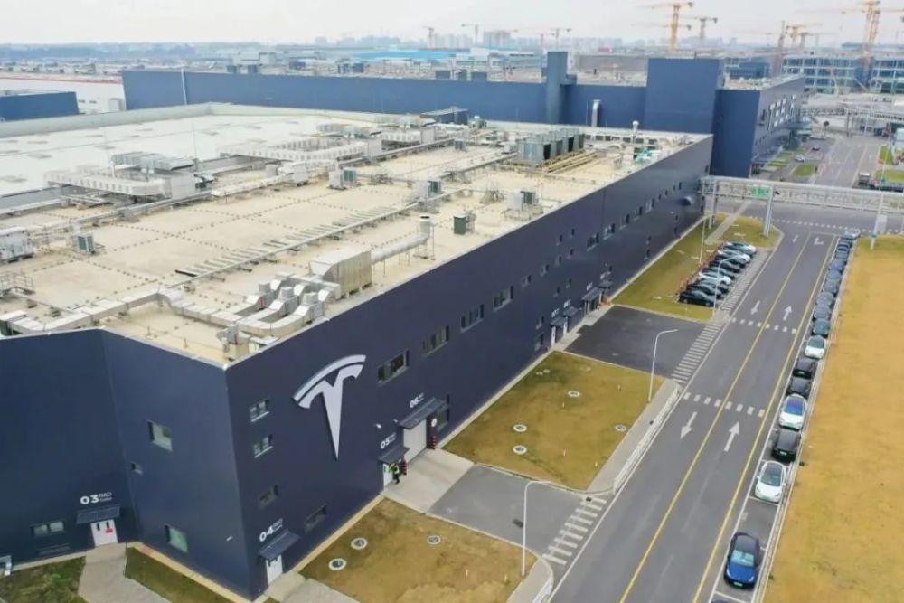

# 马斯克又在中国下一盘大棋：短期给中国企业压力，长期加速储能市场成熟

特斯拉创始人埃隆·马斯克的母亲梅耶·马斯克近期刚刚结束春日中国行，一连打卡了广州、厦门、成都、苏州、武汉多地。妈妈前脚刚走，儿子也要来中国了。据路透社报道，马斯克计划最早于
4 月访问中国，他上一次访问中国是在2020年初。

比马斯克访问中国更早落地的，是特斯拉在中国的新工厂。特斯拉将在美国本土之外建立储能工厂，首个海外工厂落户上海。

4月9日，特斯拉储能超级工厂项目在上海签约，工厂位于临港新片区，计划今年三季度开工，2024年二季度投产，初期规划年产能1万台Megapack储能电池组，总规模近40GWh，产品供应全球市场。

在签约仪式上，上海市政府副秘书长庄木弟表示，“五年前特斯拉上海超级工厂项目创造了全球瞩目的‘上海服务、临港速度’，助力上海成为新能源汽车产业发展的新高地。今天，我们又将见证特斯拉储能超级工厂项目的落地签约，这必将成为推动上海新型储能产业发展和绿色低碳转型的重要力量。”

_4月9日，特斯拉储能超级工厂签约仪式在上海举行。图/新华_

正像5年前特斯拉超级工厂一样，特斯拉储能超级工厂落地上海同样被赋予标志性意义。“当前，特斯拉这样有影响力的跨国公司与上海间的‘双向奔赴’无疑具有积极意义，一方面表达了我们对于引进外资的决心，另一方面也传递出西方跨国公司对于中国未来的看好。”有储能业内人士向《中国新闻周刊》感慨，从上海布局产业的角度来看，这也有助于储能相关投资，特别是人才的集聚。

这确实是一场“双向奔赴”，马斯克需要找到合适的土壤承载其储能野心。同时，尽管特斯拉的储能产品目前在国内存在感不强，但外界已经期待其为中国储能市场带来“鲶鱼效应”。

**特斯拉的储能布局**

目前，特斯拉的业务版图一方面是电动汽车，另一方面则是可再生能源，而后者可细分为太阳能和储能装置。Megapack将是特斯拉上海超级储能工厂的主要产品。

每套Megapack系统可以储存超过3MWh的能量，足够满足3600户家庭一小时用电需求，已经安装的装机容量超过16GWh，主要面向大型企业和公共事业单位。

一则视频可以展示Megapack的应用场景。4月初，特斯拉发布了位于加州蒙特雷县Cal Flats 旁240 MWh
Megapack的视频，其储存的能量足够7000多户家庭一天使用。“当需求高峰或电网出现故障时，Megapack 可提供可靠电力。”Cal
Flats是一个光伏电站，占地 2900英亩，装机容量达到280兆瓦，主要客户之一便是苹果公司。而早在2021 年 3 月，苹果公司便表示将在Cal
Flats旁建设电化学储能项目，后证实这一项目会使用特斯拉的Megapack。

提起特斯拉，人们的第一印象往往是新能源汽车，但马斯克的野心不止于此，作为一家能源公司，储能业务一直是特斯拉旗下重要板块，增速甚至超过新能源汽车业务。

目前，特斯拉的储能产品主要是Powerwall、Powerpack、Megapack，分别针对家庭、中小型企业、大型企业和公共事业单位。

特斯拉财报显示，2022年四季度，储能业务同比增长152％，装机量达到2.5GWh。2022年全年，新增储能电池装机量6.5GWh。

其实，特斯拉布局储能业务已久，2015年发布锂电池集成家用储能系统Powerwall和针对中小型工商业用户的Powerpack。Powerwall通常与户用光伏协同工作，当光照较弱无法为家庭供电时，其会为家庭提供能量，或者在停电时作为备用电池。

2016年，特斯拉向光伏组件生产商和安装商SolarCity提出收购要约，进一步向产业链上游延伸。从特斯拉有关收购的官方声明中，不难看出马斯克的野心：特斯拉的消费者开着电动汽车，我们还提供了储能设备帮助他们更有效地利用能源，只缺少一环了，就是保证接入的都是清洁能源，而太阳就在那里，一直持续不断地提供能量。

特斯拉自称为“世界上唯一的垂直一体化能源公司，为客户提供终端对终端的清洁能源产品。”甚至直接描绘出一幅“完美”的清洁能源使用图景：你的Model
S，Model X，或Model
3，你的太阳能电池板系统，以及你的能量墙将全部打通，你将能够以最有效、最可持续的方式来使用能源，降低成本，并最大限度地减少你对化石能源和大电网的依赖。

正是在这笔收购完成后，特斯拉从“特斯拉汽车公司”更名为“特斯拉公司”，Motors不再出现在公司名称中。

2021年4月，马斯克一度宣布特斯拉的储能系统不与光伏系统分售，用户若想安装Powerwall，就必须同时安装特斯拉的光伏系统。直到今年，这样的“捆绑销售”才被解除。目前，一套Powerwall系统售价从1.15万美元起步，一些地区的售价甚至高过1.5万美元。但无论是“捆绑销售”，还是较高的售价，都没有阻止需求的爆发。

2022年11月，特斯拉宣布已在全球安装25万套Powerwall系统，一年半之前的2021年5月，这一数字仅为10万套。在澳大利亚，Powerwall的数量比特斯拉新能源汽车数量还多，占其全球总安装量的近12％。

在Powerwall和Powerpack的基础上，特斯拉2019年推出了针对大型工商业用户的Megapack。与特斯拉的新能源汽车一样，Megapack更多使用外采电池，特斯拉扮演的角色是系统集成商，但是其将逆变器、电池模组、热管理系统及电力、电子元件高度整合，部件数量只有同类产品的十分之一，占用空间减少40％。

马斯克此前提及，“市场对储能产品的需求仍然超过我们的供应能力”。国金证券的数据显示，截至2022年底，美国是Megapack装机量最高的地区，占比高达63％，其次是澳大利亚、英国、比利时和其他地区，占比分别为23％、5％、3％和6％。在全部Megapack储备订单中，美国依旧处于首位，占比69％，其次为加拿大、英国和澳大利亚，占比分别为13％、10％和8％。

当前，Megapack的订单交付日期已经推迟至2025年一季度，价格也在上涨。伴随旺盛的需求，Megapack价格自然水涨船高。根据特斯拉官网，一套1.9MW/3.9MWh的Megapack储能系统、含安装不含税售价已上涨至26.69万美元，而在年初其价格尚不足26万美元。

全方位布局后，储能在特斯拉的新能源产业生态闭环中占据重要位置。今年3月1日，特斯拉发布宏图计划第三章，提出2050年人类社会可全部依靠可持续能源生存发展，储能是关键一环。

特斯拉预测，人类社会整体向可持续能源转换需要约200TWh电化学电池（1TWh等于1000GWh）。其中，在固定位置与电网连接的电化学储能电池用量为23TWh；汽车动力电池用量约为112TWh，为充电站配备储能电池需求量约为3.7TWh；船舶、飞机及为它们充电配备的储能电池需求量约为44TWh；此外还有15.2TWh电池用于热泵、工业供热等领域。

特斯拉还预测，全球电化学电池每年产能最终应当达到11488GWh，累计总投资额达2.18万亿美元；像Megapack这样的固定电化学储能电池年产能应达到2310GWh，累计总投资额为460亿美元。

特斯拉没有理由错过这一轮储能“盛宴”，而其需要解决的瓶颈便是产能与成本。

_特斯拉上海超级工厂。图/视觉中国_

**又一条鲶鱼？**

特斯拉在其2022年财报中提及，位于加州拉斯罗普的40GWh
Megapack工厂正在提高产量。该工厂将有助于进一步加快储能部署的增长。但当被投资者问及“全球对储能的需求几乎是无限的，特斯拉应该在哪里建造下一批Megapack工厂？每个大洲需要多少家工厂？”时，马斯克并未给出明确的时间节点，只是回应称，“我们将在未来提供有关这方面的更新，但这是我们正在审慎考虑的事情。你会在今年晚些时候或明年看到相关公告。”

此次Megapack工厂项目落户上海临港新片区，算是靴子落地。

特斯拉此前仅在加州拉斯罗普布局Megapack工厂。马斯克在个人社交媒体上表示，上海工厂将作为加州工厂Megapack产能的扩充。

除去扩充产能，降低成本也是特斯拉的目的之一。路透社分析说，上海Megapack工厂项目将帮助特斯拉利用中国的领先电池供应链来提高产能，降低Megapack锂离子电池成本，以满足全球增长的储能需求。

真锂研究创始人墨柯告诉《中国新闻周刊》，包括电池、逆变器、热管理系统等在内的配套产业在中国更为发达，在中国建厂可以有效降低Megapack成本。目前Megapack度电成本可能超过3000元，而中国类似产品的度电成本不足其一半。

特别是随着锂离子电池重要原材料碳酸锂价格下跌，国金证券统计称，今年1月~2月的储能项目整体报价环比明显下降，2小时储能系统加权平均报价环比分别下降9.82％、2.18％。

特斯拉并未公布上海Megapack工厂项目的电池来源。Megapack原本使用三元电池，2021年和2022年曾出现起火事故，此后开始采购磷酸铁锂电池。

相比于磷酸铁锂电池，三元电池被认为能量密度更高。“但由于新能源汽车空间有限，其要求动力电池具有较高的能量密度，即在有限的空间内储存更多电量。储能电池对能量密度要求较低，但对于成本与电芯的一致性要求更高。”墨柯说。

宁德时代董事长曾毓群曾在公司业绩说明会上称，储能电池的最大特点是寿命要达到20年以上，并且大的储能项目对电池一致性要求更高。他举例说，1GWh储能电站需要配备超过150万颗电芯，对产品一致性要求是汽车动力电池的10000倍以上。一致性对电池表现至关重要，只有当每个单体电芯各项参数和指标尽可能一致，集成之后才能稳定工作。

特斯拉利用中国成熟的供应链提高产能、降低成本，显然是希望像新能源汽车那样抢占中国储能市场。

“目前Megapack上海工厂产品的定位是供应全球，但是目前美欧的政策取向是将相关产业的产业链尽可能多地保留在本国、本地区，未来上海工厂如何将产品销往欧美市场尚存疑问，而如果仅仅针对中国市场，40GWh的产能在短期内又显得过于庞大。”墨柯说。

不过他表示，虽然特斯拉的储能产品目前在中国市场没有存在感，但是依然有潜力。特别是当特斯拉新能源汽车在中国市场占据相当份额，意味着需要与之配套充电场站，Megapack可以被应用于充电场站，帮助新能源汽车用户使用更多“谷电”，节约用车成本。如果成本降低，将会有底气参与中国工商业储能市场的竞争。

国内电化学储能市场正在迅猛增长。中国电力企业联合会发布的《2022年度电化学储能电站行业统计数据》显示，2022年中国新增投运电化学储能电站194座，总能量为7.86GWh，同比增长175.81％。其中，使用锂离子电池的电化学储能电站总能量为6.8GWh，全部为磷酸铁锂电池。其余电池种类为液流电池、铅酸和铅炭等电池。

外界期待特斯拉再次成为搅动中国储能市场的“鲶鱼”。

“特斯拉Megapack工厂落地上海，对于中国储能行业而言‘利大于弊’。一方面，与诸多To
B的国内储能厂商不同，特斯拉是一个消费品牌，有助于进一步提升国内普通消费者对储能行业的认知，有利于储能概念在舆论场上的进一步升温，从而带动资本市场关注度的提升。”有国内储能企业负责人向《中国新闻周刊》感慨，以特斯拉的实力，一定会倒逼中国企业向其看齐，注定存在鲶鱼效应。尽管短期来看可能对中国企业构成压力，但外资进入一定会加速中国储能市场的成熟。

记者：陈惟杉

