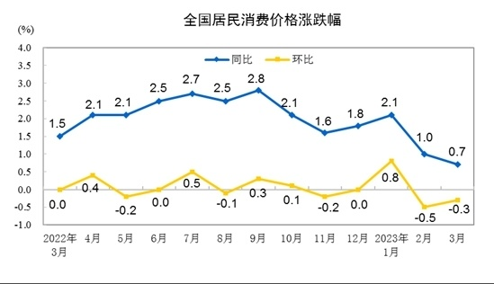

# 31省份3月CPI出炉：四川涨幅独升 吉林为0

中新经纬4月13日电
(王永乐)日前，国家统计局公布了31省份2023年3月居民消费价格指数(CPI)。中新经纬梳理发现，3月，31省份CPI同比涨幅仅有四川高于上月。其中，新疆最高为涨1.2%，吉林最低为持平。

_图源：国家统计局网站_

**四川CPI涨幅独升 吉林收窄至0**

国家统计局数据显示，2023年3月份，全国CPI环比下降0.3%，同比上涨0.7%。CPI同比增速低于市场预期，且连续两月回落。

中新经纬梳理发现，31省份3月CPI除吉林外同比均为上涨，涨幅高于或低于全国水平的省份均为13个，上月分别为13个和15个。从涨幅来看，除四川外的30省份涨幅均低于上月，上月31省份涨幅均收窄。

具体来看，新疆、河北、黑龙江、上海、江苏、浙江、云南、甘肃、青海、湖北、广东、海南、西藏等13省份涨幅高于全国水平，其中仅有新疆处于“1时代”；北京、福建、江西、四川、宁夏涨幅与全国水平持平；安徽、湖南、内蒙古、天津、山西、辽宁、山东、河南、广西、重庆、陕西、贵州、吉林等13省份涨幅低于全国水平，其中吉林涨幅最低为0%。

另外，从增减幅来看，四川涨0.1个百分点，吉林降幅最大为0.9个百分点。

中国民生银行首席经济学家温彬认为，食品和能源的非核心通胀下降是3月CPI转弱主要因素，市场较为期待的核心通胀虽然企稳但趋势偏弱，供给充沛和需求“稳而不强”是主要特征，需要政策继续保持促内需的力度。

**未来CPI怎么走？**

展望下阶段物价走势，机构普遍预计短期无通胀风险。

在东方金诚首席宏观分析师王青看来，4月CPI同比有可能进一步回落到0.5%左右，其中蔬菜价格、燃油小汽车价格同比下行仍将成为主要影响因素。在消费修复温和前景下，短期内核心CPI将继续处于1.0%左右的偏低水平。

财通证券宏观首席分析师陈兴分析称，从高频数据来看，3月以来，猪肉、鸡蛋价格降幅收窄，同时鲜菜供给滞后于需求回落，价格将略有抬升；但整体CPI仍受限于供给修复快于需求，预计4月CPI环比涨幅略回升，同比增速趋稳。

光大宏观高瑞东团队表示，从趋势上看，预计消费渐进式复苏将带动非食品价格缓慢上涨，但鉴于年内猪周期仍处在下行阶段，带动食品价格同比回落，将使得总体通胀水平保持在较低水平，预计未来一个季度内，CPI同比增速大概率仍低于1%。

万联证券宏观报告认为，二季度为消费淡季，CPI上涨幅度预期有限。随着五一假期迎来一波旅游高峰，在低基数作用下，旅游分项有望保持增长，可能会带动CPI回升。

华西证券也认为，随着需求平稳修复，叠加中央储备冻猪肉收储干预，猪肉价格可能会在二季度逐步企稳回升；服务消费价格也会随着居民收入的改善以及五一、端午假期的到来而逐步修复，进而带动CPI温和上行。

从全年走势来看，北大国民经济研究中心报告认为，2023年自然走势下的CPI同比增速中枢较2022年将会继续小幅上移，大概率呈现先高后低随后平稳的走势，预计2023年全年CPI同比增速约为2.0%。

