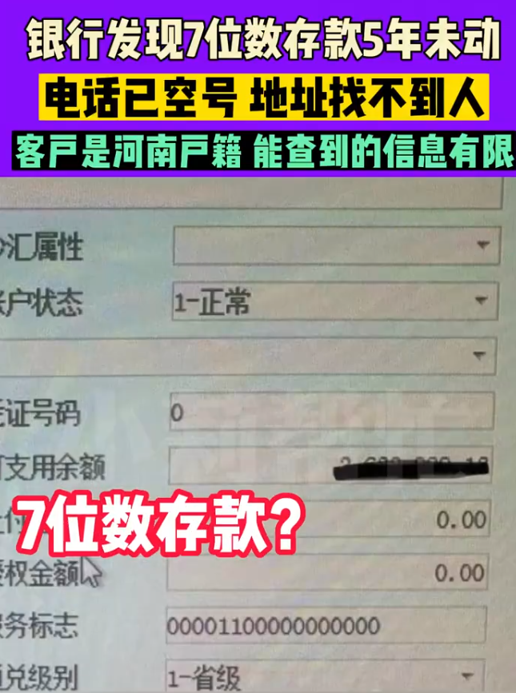

# 7位数存款5年未动，主人电话已空号，浙江一银行急寻河南籍储户

每经编辑：李泽东

4月13日， **#银行发现7位数存款5年未动急寻人，钱存活期联系电话是空号#** 的话题登上热搜，啥情况？

据河南电视台民生频道《小莉帮忙》报道，4月13日，浙江某银行一客户经理求助@小莉帮忙称，近期整理信息时，发现1笔7位数存款活期存了5年，一直没有动过。

**对方信息是位河南籍老人，手机号为空号** ，因跨省且身份地址信息查询多次无进展，希望帮忙联系当地核实老人情况。

_图片来源：河南电视台民生频道《小莉帮忙》_

“因为客户是外地的，派出所能够提供的信息有限。如果能联系到户籍所在的派出所，可以看一下客户是否安好。毕竟这不是一个小数目。希望她还能记得自己有这笔存款。”客户经理说。

对此，网友表示，“这个银行好负责啊，还继续联系这个老人”；

还有网友评论称，“我们也有过，客户国债到期了几年没来取，真的是电话上门找人，处理了几十笔，各种情况，有搬家的、有房子长期不住的、还有老人年纪大了儿子不来取钱的……最后剩一笔，客户号码地址都错误，就没找到”。

