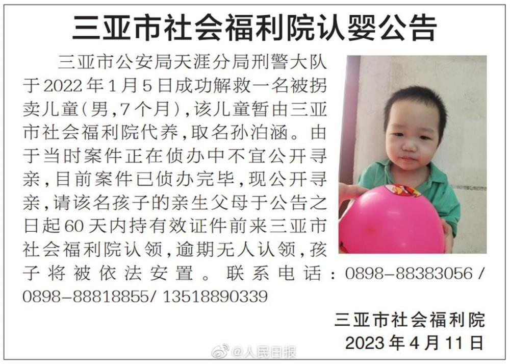

# 7名被拐儿童等待认亲 三亚福利院：即便领养 生父母无过错也要归还

4月11日，海南省三亚市福利院发布7则认婴公告。公告显示，三亚警方分别解救7名被拐儿童，共5男2女，由于当时案件正在侦办中，不宜公开寻亲，现案件已侦办完毕并公开寻亲。

13日上午，三亚市福利院工作人员告诉潇湘晨报（报料微信：xxcbbaoliao）记者，7名孩子目前身体健康，但福利院只负责孩子的日常生活照顾。“即便60天后有人领养了，若生父母无过错，收养关系还是要解除的。”工作人员说。

社会福利院发布的公告显示，这7个孩子5男2女，最大的7岁，最小的仅7个月。从2021年9月24日至2022年6月24日，这7个孩子先后被三亚市公安局天涯分局刑警大队解救，因未找到父母，暂由福利院代养。由于当时案件正在侦办中，不宜公开寻亲，现案件已侦办完毕并公开寻亲。

公告称，现请孩子们的亲生父母于公告之日起60天内持有效证件前往三亚市社会福利院认领，逾期无人认领，孩子将被依法安置。

4月13日，潇湘晨报记者从三亚市福利院一工作人员处了解到，目前福利院只负责孩子日常生活的照顾，目前孩子们身体健康。“至于寻找孩子的工作主要是由公安机关负责，我们这里对具体情况并不知情。”工作人员说。

上述工作人员表示，虽然公告中说明了逾期无人认领，孩子将被依法安置或者收养。但即便60天后孩子被好心人收养，但生父母没有过错的话，这个收养还是要解除的。截至目前，三亚市福利院还未收到任何相关认领消息和线索。

针对案件，潇湘晨报记者拨打了三亚市公安局天涯分局刑警大队的电话，但无人接听。

福利院工作人员口中的过错具体指代什么？湖南睿邦律师事务所执行主任刘明告诉潇湘晨报记者，所谓“过错”指代的是生父母存在法律规定的，可以剥夺生父母抚养权利的刑事犯罪，那么收养关系就是合法成立的，就不必解除。

此外，湖南万和联合律师事务所律师李健告诉潇湘晨报记者，依据《民法典》第一千零九十三条规定，下列未成年人，可以被收养：丧失父母的孤儿；查找不到生父母的未成年人。

此外李健还称，法律还规定了，收养关系解除后，经养父母抚养的成年养子女，对缺乏劳动能力又缺乏生活来源的养父母，应当给付生活费。生父母要求解除收养关系的，养父母可以要求生父母适当补偿收养期间支出的抚养费。但是，因养父母虐待、遗弃养子女而解除收养关系的除外。

潇湘晨报记者 郑旭

