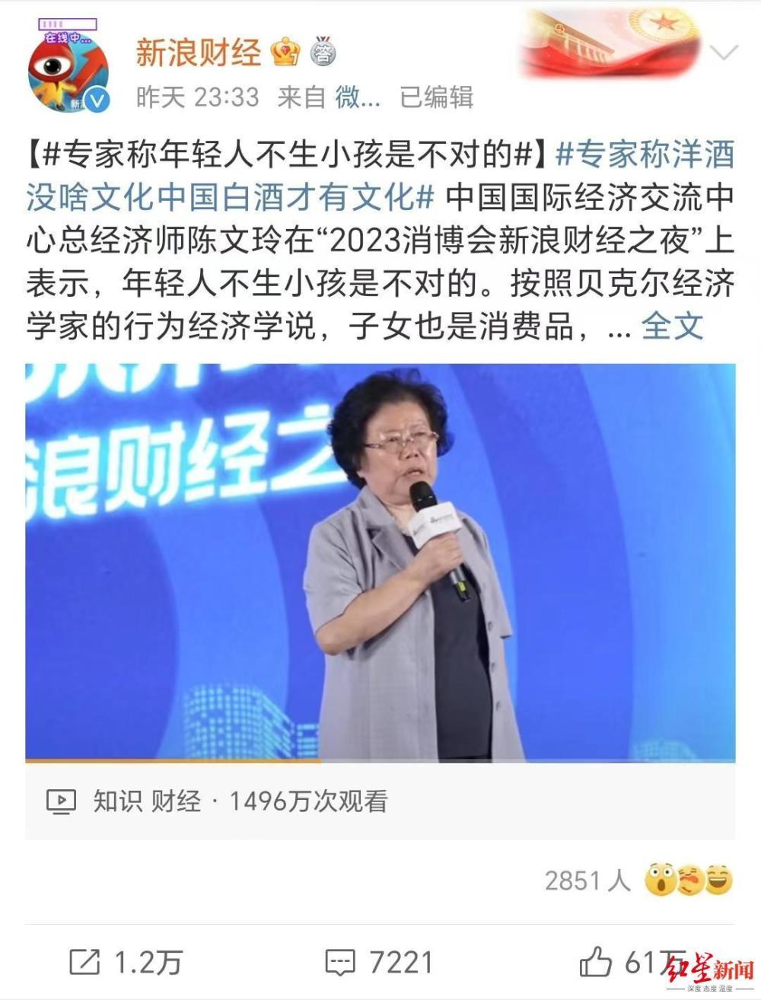

# 专家回应“年轻人不生小孩是不对的”：讲了五大趋势，这是其中之一

4月11日，经济学家、中国国际经济交流中心总经济师陈文玲在中国国际消费品博览会新浪财经之夜作主题演讲时表示，年轻人不生小孩是不对的。

“按照贝克尔经济学家的行为经济学说，子女也是消费品，子女是长周期的消费品，是可以给你带来长久回报的耐用消费品。所以年轻人不生小孩是不对的……”陈文玲这样表示。随后该话题登上微博热搜，引发网友讨论。

有网友质疑，生育源自父母对孩子的爱，如果把感情和经济挂钩，把亲情进行量化，那么人类可能连普通动物都不如了。也有网友反问，现在年轻人工资低、压力大，还要进行强制生育吗？“也许不生小孩不是最经济的选择，但对于是否生小孩这个不同的价值选择，本身没有对错之分，专家不能把自己的判断标准强加在别人身上。”

**4月12日，红星新闻记者联系到陈文玲，她表示，“有很多误解，前后文也没有联系起来，我讲了五大趋势，这是其中一个，网络上有点炒作。”**
对于网友质疑，她没有做出更多回应。

红星新闻记者查阅资料发现，按照贝克尔在1960年的论文《生育率的经济分析》中所下的定义：“子女是一种心理收入或满足的来源，按照经济学的术语，子女可以看成是一种消费商品，有些时候，子女还可以提供货币收入，所以子女既是一种耐用消费品又是一种生产品。”也就是说，孩子的生产和养育是要付出成本的，也是一种投资行为，包括经济投入和感情投入两部分。

贝尔克认为，父母在做出是否养育孩子以及养育孩子的数量方面的决定时，同样要遵循成本-
效益分析，这方面的研究有助于解释为什么富裕家庭孩子较少（需要支付的机会成本更高），而贫困家庭却往往倾向于生较多的孩子，为现代社会生育率持续下降提供了经济学解释。

这样看来，陈文玲演讲的观点与经济学家贝克尔的论点也是有出入的。对于陈文玲有关生孩子问题的发言，北京日报评论指出，人是受情感支配的动物，在生育这件事上更是如此。现代社会，在生不生孩子这件事上，情感诉求是第一位的，生搬硬套经济理论教大伙儿拨弄人生算盘，确实显得不近人情。

陈文玲在当天的演讲中，除了谈到生孩子与消费品的关系，其观点还包括，“今年消费会成为中国经济发展的第一大动力，这驾马车会跑起来，而且会跑得比那两驾马车更快”。谈到消费周期的趋势，她表示，可能会从长周期的耐用消费品转向永续利用的消费品。“为什么这么说？房子是长周期的消费品，汽车是长周期的消费品，我们现在购买的衣食住行的这些东西是即期的消费品，当你购买使用之后，它的消费价值与使用价值合一，走入了消费的最终点。”

陈文玲接着说，子女也是长周期的消费品，“所以年轻人不生小孩是不对的，你没有长周期的耐用消费品，他的价值是超过你购买其他消费品的价值的。”她还认为，随着人们生活水平的提高，中国将成为成熟的大众消费社会，可增值的收藏品、创造财富的消费将来也是一种趋势。

另外她还谈到“优雅生活方式的消费观将成为一大趋势”、中国白酒相比洋酒更有文化，地位也在不断提高。

红星新闻记者 卢燕飞

责编 任志江 编辑 何先锋

