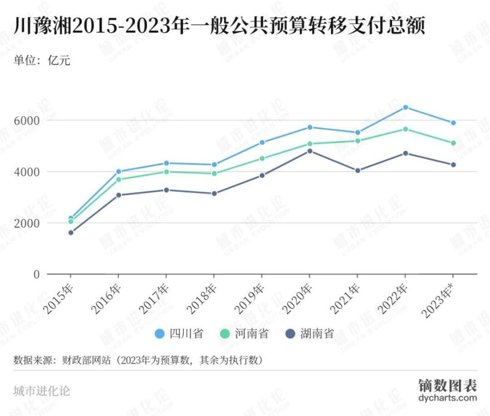
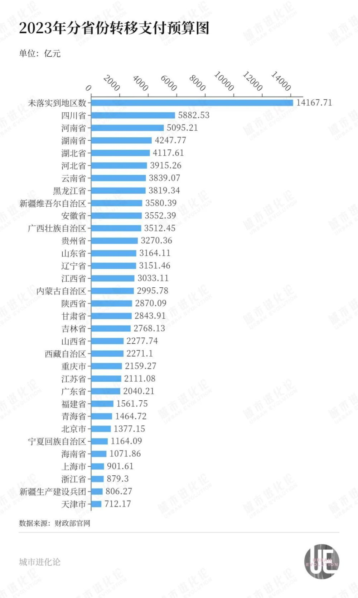
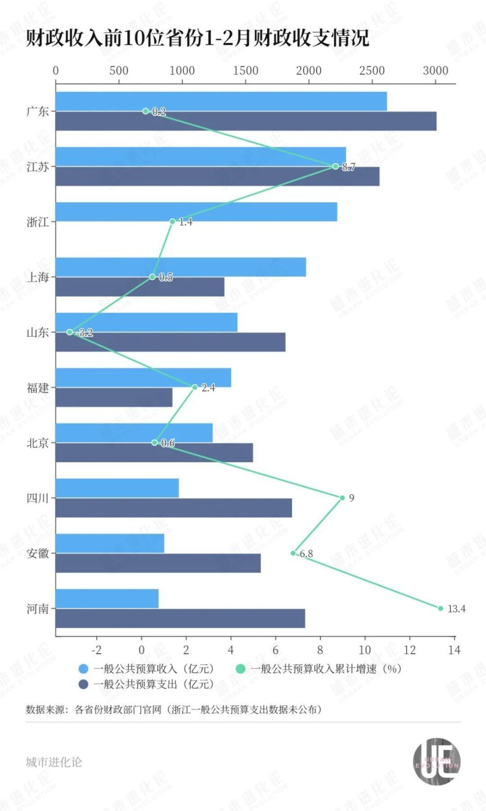
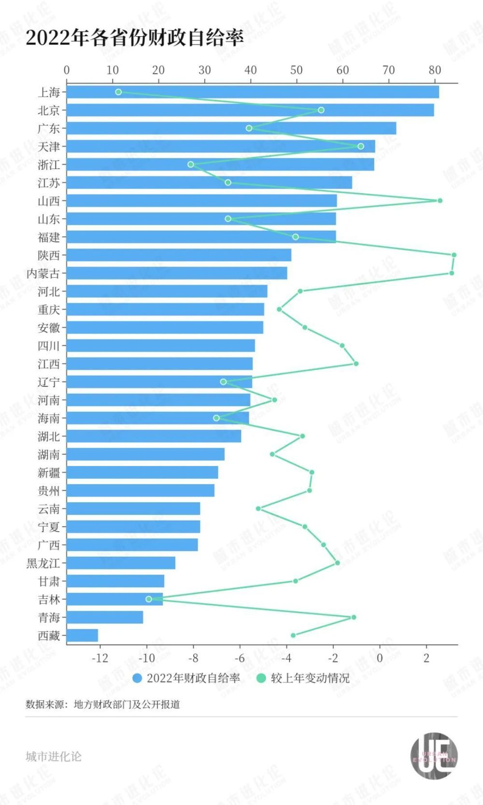

# 中央转移支付首破10万亿，钱都去哪儿了？川豫湘三省居前

每经记者：吴林静 每经编辑：杨欢

_图片来源：新华社（图文无关）_

2023年中央财政预算于近期公开，这当中，中央对地方的财政支持数据受到关注。

财政部部长刘昆提到，今年要实施“积极的财政政策”，“积极”的表现之一是“在推动财力下沉上加力，进一步增强中央对地方的转移支付，并向困难地区和欠发达地区倾斜”。

根据今年中央财政预算，2023年中央对地方转移支付的预算总数为100625亿元，在去年的基础上又增长了3.6%，还首次突破了10万亿元的关口。

事实上，为缓解地方财政收支矛盾、支持地方减税降费和兜底基层“三保”支出等，中央对地方的转移支付一直在增加。2020年以来，在中央一般公共预算支出中，对地方转移支付的占比一直保持在70%以上。

今年，10万亿元的资金“再分配”，会撒向哪些领域、哪些地区，城叔翻开了中央的“账本”。

再创新高

中央一般公共预算支出，共分三大部分，一个是中央本级支出，一个是中央预备费，还有一个就是中央对地方转移支付。

由于各省份直接的财政收入能力存在差异，中央为实现各个地方的公共服务水平平等，便补充建设了财政转移支付制度。分税制改革后，这一部分一直占据着中央财政支出的“大头”。

和GDP、财政收入飞速增长对应的是，转移支付的力度在不断加强。过去十年，转移支付所占比重在70%上下浮动，支出的总量则从五万亿元增长到了2023年的十万亿元。

不断攀升的转移支付，“一方面，与我国的财政管理体制有关。我国实行的是财政集中管理体制，在这种体制下，大额的集中性的税种集中在中央政府，中央政府通过大量的转移支付解决地方政府的收支不平衡问题。”

政府预算专家、上海财经大学教授邓淑莲告诉城叔，“另一方面，近年我国经济增长放缓，特别是疫情三年，地方政府收入大幅度减少，而支出不减反增，收支矛盾突出。转移支付是缓解地方政府收支压力的一个有效手段。”

10万亿元的一般公共预算转移支付，又进一步分为一般性转移支付和专项转移支付。

一般性转移支付是指中央政府对有财力缺口的地方政府进行补助，以均衡区域间基本财力配置为目标，2023年这笔资金总额为8.71万亿元，也是创下新高。

专项转移支付则据实安排，资金定向精准使用，2023年这笔资金总额约8500亿元，在往年基础上提升了千亿元左右。

同时，延续去年政策，今年继续设有“支持基层落实减税降费和重点民生等专项转移支付”，从去年的8000亿元调减至5000亿元。

以上三方面的转移支付加起来，就构成了今年庞大的一般公共预算转移支付规模，流向各个省份以及计划单列市。

省级分配

具体看分地区的资金分配情况。

自2015年财政部公布中央对地方转移支付分地区的情况以来，四川、河南获得的资金量一直排在数一数二的位置。

从往年来看，四川、河南两省合计获得的一般公共预算转移支付数，通常占当年中央对地方一般公共预算转移支付总额的10%以上。2023年，中央给四川的预算为5882.5亿元，给河南的预算为5095亿元。

排在第三名的“常客”是湖南省，只有2019年和2020年例外，被云南、湖北超过。2023年，湖南继续位列第三，获得一般性转移支付的预算为4248亿元。今年转移支付预算超过4000亿元的省份，还有湖北。

获得中央转移支付预算超过3000亿元的，有10个省份；超过2000亿元的，有9个省份；在1000亿元以上的，有5个省份。上海、浙江、天津和新疆生产建设兵团获得的转移支付预算，则不足千亿元。

10万亿元的转移支付预算中，目前有1.4万亿元没有落实到具体地区，会根据当年情况进行分配调整。比如，去年底中央对四川实际执行的转移支付资金超过了6000亿元，比年初的预算数多了1000亿元有余，为地方的预算支出提供支撑。

众所周知，转移支付是二次分配，初衷是推动区域均衡发展和基本公服均等化。创收能力强的经济发达地区，从中央拿到的转移支付少，几个不足千亿元的省份，大约只有“头部省份”的1/6到1/7。获得转移支付额度靠前的，主要是中部和西部地区，老少边穷片区较多，也是人口大省，所以川豫湘排在前三，也不意外。

超过3000亿元的省份，出现了东部地区的河北（3915亿元）、山东（3164亿元）、江西（3033亿元）。在邓淑莲看来，这几个省份获得转移支付额度比较靠前，人口总量大、地区发展洼地都是影响因素，还有比较关键的是“这些省份近年的经济发展不足以提供足够的财政收入，满足日益增长的财政支出，收支矛盾较为突出”。

从今年1-2月各省份财政收入情况来看，大部分已实现了正增长，财政收入前10位的省份中，山东是唯一财政收入继续呈现负增长的地区。

公共服务

公共财政的重要功能是实现人均公共服务的均等化，转移支付制度的设计，则是让欠发达地区也能提供公共服务与公共产品。

中央对地方转移支付，靠的是各个项目来支撑，确保资金流向该发力的领域。

从2023年中央预算表来看，中央对地方转移支付的名目共分了三个大类、32个中类，其中“共同财政事权转移支付”再细分了54个小项。2023年的“账本”，共计公开了其中46项转移支付项目的分地区情况。

转移支付如何给地方的基本医疗、教育、养老提供财力支撑，城叔从细分项目中看到了部分相关资金在各地区的分布情况。

先看教育。转移支付项目中与教育相关的资金，涉及了学前、义务教育、高中、高校、教师培训、学生资助、特殊教育等环节，总额约为3900亿元。

从披露信息来看，旨在提高入园率和覆盖率的“支持学前教育发展资金”，资金分配排名前三的省份是河南（16.9亿元）、四川（14.68亿元）和广西（12.08亿元）。

“改善普通高中学校办学条件补助资金”项目中，获得资金排名前三的则是河南（6.13亿元）、云南（5.6亿元）和贵州（5.45亿元）。

“支持地方高校改革发展资金”项下，河南（35.77亿元）依旧拔得头筹，安徽（23.33亿元）、四川（22.57亿元）紧随其后。

再看养老。与养老相关的资金，主要体现在“基本养老金转移支付”这一项目中。

2023年，中央向地方转移支付的基本养老金预算共计9277.63亿元。获得转移支付资金最多的是四川省，为1023.18亿元。其次是辽宁（938.32亿元）、湖北（739.77亿元）、河南（721.84亿元）、黑龙江（713.16亿元）。

_图片来源：财政部官网_

根据说明，基本养老金转移支付的分配逻辑都是与地方离退休人数挂钩，再向中西部地区有所倾斜。比如基本养老金中的“城乡居民基本养老保险补助经费”，对中西部地区是全额补助，对东部地区则只给予50%的补助。

“基本养老金转移支付的分配，除通常大家关注的老龄人口数量、转移支付系数、地方财力外，老年人口抚养比指标也不容忽略。老年人口抚养比即老年人口数与劳动年龄人口数之比，抚养比越高，则劳动力抚养负担越重。”西南财经大学财政税务学院副教授、博士生导师杨良松指出。

可以从表中看到，以2023年财政预算和七普数据为准，老龄人口比重较高的上海、江苏，因为自身财力较好，分配到的资金并不多。老龄人口绝对数较多的山东、江苏、广东，因抚养比低，分配到的资金也不多。

而四川、黑龙江等地区，一方面抚养比高、收支缺口压力大，另一方面本身财力又有限，最终分配到的基本养老金转移支付较多。

“转移支付看总量很抓眼球，但看人均可能又是另一回事。”杨良松提到，西部地区除了四川等人口大省，像西藏、青海人口总量很小，但人均的转移支付却较高。

与医疗相关的转移支付方面，细分了“城乡居民基本医疗保险补助”“医疗救助补助资金”“基本公共卫生服务补助资金”“基本药物制度补助资金”“计划生育转移支付资金”“医疗服务与保障能力提升补助资金”等7个项目，总额超过5300亿元。

综合7个项目的省份分布来看，河南（439亿元）和四川（405亿元）获得的转移医疗类转移支付较多，还有8个省份获得资金在200亿元至300亿元区间，包括湖南、山东、安徽、河北、广西、云南、贵州和湖北。

自给率低

近些年受疫情等冲击，地方财政收入增长乏力，而刚性支出不减，包括基层“保基本民生、保工资、保运转”底线要兜牢，基本医疗、教育、基本养老等保障水平要提高，民生支出占比和总量也都在增长。不少省份对中央财政转移支付依赖度越来越高。

今年2月，中国财政科学研究院发布了《2022年地方财政经济运行调研报告》。报告提到，由于地方本级收入受到明显冲击，转移支付成为地方政府维持基本运转的主要资金来源。

2022年地方财政自给率（地方本级一般公共预算收入/地方一般公共预算支出）为48.4%，比上一年下降4.3个百分点，自2014年的高点已经降低了10.3个百分点，“地方财政脆弱性风险日益上升”。

根据报告，过去一年，只有资源型省份的财政自给率在提高，东北、东部沿海地区降幅最大。

分地区来看，山西、内蒙古、陕西、新疆四个资源型省份的财政自给率较2021年提高3个百分点左右，主要由于2022年大宗商品价格维持相对高位。

东北和东部沿海地区的财政自给率降幅高于其他地区，其中受疫情冲击较大的上海、吉林两省市降幅最大，分别为11.2个百分点、9.9个百分点。

“不可否认，当前转移支付的规模很大，无论是占中央支出还是地方支出的比重，都比以前更高了。”杨良松认为，地方财政对中央转移支付已经表现出了强依赖。

将来，如何平衡央地财政收支、提高地方财政自主性？他建议，一方面，强化、健全地方税体系，增强地方的自有财力，缩小财政缺口。另一方面，进一步深化中央与地方财政事权和支出责任划分改革，“可以适当增加中央的事权。”

展望2023年，各省份对财政收入的判断也偏谨慎，六成省份2023年一般公共预算收入预测不高于6%。

为了缓解收支矛盾，除了进一步寻找增收减支的空间，一些省份也在强调“创新财政投入方式”，除了传统的依赖赤字、专项债发力，也提到要综合运用贴息、奖补、融资担保、政府投资基金等金融工具，辅助财政资金发挥更大的引导和撬动效用。

每日经济新闻

