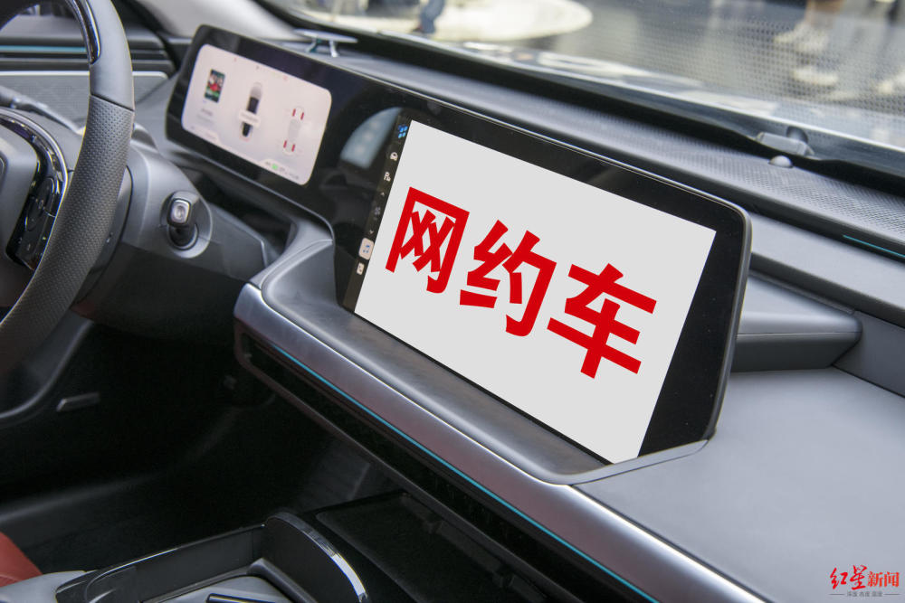

# 北京拥堵因网约车太多太便宜？研究表明有可能！专家：解决拥堵问题不是“一招就灵”

“北京主要是网约车带来的拥堵。”近日，在某媒体的一档节目中，全国乘用车市场信息联席会秘书长崔东树的一番话引发热议。

崔东树在该档节目中表示，“当前北京600万辆车里可能有20万的网约车，一天15个小时在路上跑，而私家车可能一天就2个小时在路上，1辆网约车相当于8辆私家车对道路的占用。网约车的运行成本又相对偏低，在北京什么都很贵但是打车很便宜。”他认为，需要提升网约车使用成本以减少拥堵。

日前，国家发改委综合交通运输所城市交通中心主任程世东接受红星新闻采访时表示，北京堵车问题是由多个原因导致的，解决北京拥堵问题不是“一招就灵”。

北京的拥堵和网约车关系有多大？如何才能缓解北京这样的特大城市的交通拥堵？红星新闻记者进行了深入采访，试图解答这个问题。

_↑资料配图 据ICphoto_

**拥堵是网约车带来的吗？研究表明有可能**

今年3月公布的《北京市2022年国民经济和社会发展统计公报》显示，截至2022年末，北京市机动车保有量712.8万辆，比上年末增加27.8万辆。民用汽车625.6万辆，增加11.3万辆。其中，私人汽车532.6万辆，增加11.4万辆；私人汽车中轿车290.6万辆。

关于网约车造成交通拥堵的问题，崔东树在上述媒体节目给出详细的分析。他表示，在北京市现有的汽车总数里，就有接近20万辆以上的网约车，这些车每天行驶时间长达15个小时，而私家车每天的行驶时间不到2个小时。因此，1辆网约车等于8辆私家车对道路的占用，网约车的运行成本也相对偏低。

此前，西南交通大学交通运输与物流学院的蒋阳升教授在2022年发表的一篇论文中，通过构建交通动力学模型，探究了网约车与城市交通拥堵的交互影响，研究结果表明，对于道路拥堵，网约车每增加1000辆，道路出行延误率全天平均增加1.59%，高峰期平均增加2.04%。这一结论印证了网约车增量对交通拥堵的影响。

据每日经济新闻报道，北京工业大学城市交通学院院长陈艳艳认为，仅靠模型预测交通状况未必完全可信。不同城市的交通状况不同。对交通压力较大的城市来说，网约车的流行或会加重道路负担，但在道路容量相对比较大的城市，可能就没有显著影响。“所以不能简单地说，网约车就一定会加剧交通拥堵。”

近年，网约车数量迅速增长，据网约车监管信息交互系统统计，截至2023年2月28日，全国共有303家网约车平台公司取得经营许可，各地共发放网约车驾驶员证517.7万本。2020年10月份的网约车行业运行基本情况是交通运输部官网上能检索到的最早统计信息，这一时期有207家网约车平台，网约车驾驶员证本数还不到现在的数据的一半。

据统计，今年2月份共收到网约车订单信息6.52亿单，与2020年10月份的6.3亿单订单信息无较大差异，这是否意味着网约车规模仍在持续扩大的同时，市场对网约车的需求早已饱和？

蒋阳升的研究还表明，网约车扩大车队规模除了会造成额外拥堵，也不利于网约车自身的运营和盈利。

4月6日，济南市城乡交通运输局发布《关于济南市网络预约出租汽车行业风险预警的通知》，通知提示济南市网约车市场运力已基本饱和，目前济南网约车单车日均接单量不足10单。同时，网约车数量过剩、市场主体过多也对行业的安全生产造成不利影响。

_↑资料配图
据ICphoto_

红星新闻记者搜索后发现，近年，广东珠海、福建厦门、海南海口等多个城市接续发布了网约车行业风险预警，提醒“入行需谨慎”。

对于网约车是否是北京拥堵的主要原因，程世东接受红星新闻记者采访时表示，“路少车多”是肯定的，但车的拥有量和使用量是两回事。“不能说因为车多就堵车”。

**北京为啥堵车？研究称根本原因是交通供求关系不平衡**

网约车是否会造成城市道路拥堵，并不是一个新话题。

2016年，北京交通大学交通系统科学与工程研究院闫学东教授的课题组发布了《基于滴滴大数据的北京道路交通运行状况分析报告》。报告指出，北京的道路拥堵主要因为出行需求导致，网约车不是造成北京道路拥堵的直接原因。

这一研究认为，北京交通拥堵问题的根本是有限路面资源无法满足日益增长的全域私家车出行需求的问题，而网约出租车的核心运营模式是“互联网+共享经济+共享交通”，具有四个特点可以有效帮助大城市“治堵”：以经济规律为杠杆，调节交通市场供需关系；以信息对称为核心，供给匹配需求；以大数据为手段，实现运营过程的全监控；以共享交通为模式，盘活私家车运力资源存量。

程世东表示，城市布局是影响一个城市拥堵与否的主要原因。他举例，如果城市规划得好，生活配套设施完善，公共交通发达，就不太需要开车。

清华大学交通研究所所长陆化普等学者2023年1月份发表的论文提出，要“基于公共交通为导向的发展模式”破解北京城市交通问题。研究认为，造成交通拥堵的根本原因是交通供求关系的不平衡。大规模单一功能的城市土地开发，造成了土地使用功能过度纯化，市民工作地和居住地分离严重，产生大规模长距离的“潮汐”通勤交通。加之公共交通分担率不高、末端交通系统不完善，使得交通拥堵问题日趋严重。

根据此研究，北京中心城区公共资源高度集中，就业岗位密度大，二环内职住比为2.27，而周边新城及大型居住区域缺乏就业岗位、生活配套设施和大型公共设施不完善，导致居住与就业分布耦合程度不够。

此研究的量化计算结果还表明，北京的交通效率明显低于东京，东京的出行效率是北京的1.5倍以上。而且，北京的公共交通分担率低于国外的优秀城市，换乘问题突出，北京地面公交之间、地面公交与轨道交通之间、城市交通与对外交通之间不但换乘距离长、而且运营匹配程度也有待提升。研究提到，共享单车有效打通了出行末端的“最后一公里”，但目前还存在封闭大院和一些公共场所禁止通行和进入等问题。

_↑北京出行早高峰
据ICphoto_

**如何破解北京等大城市拥堵？专家：多措并举实现交通效率最大化**

据《2022年度中国主要城市通勤监测报告》显示，2021年，北京通勤时长在60分钟以上的极端通勤比重为30%，是全国极端通勤人口最多的城市，也是单程平均通勤时耗最长的城市，达到48分钟。另外，北京的通勤空间半径（构建覆盖90%中心城区通勤人口的空间椭圆，以椭圆长轴半径）为41公里，是通勤空间尺度最大的城市。职住分离度可以理解为从居住地到最近就业场所的距离，是理论上能够实现的最小通勤距离，用于衡量城市职住空间供给的匹配度与平衡性，北京的这一数据达到6.6千米，在此报告调研的城市中最长。

陆化普等专家学者建议，采取包括调整城市结构与用地形态、规范出行者的交通行为、大力发展绿色交通、公交优先、综合交通枢纽一体化、科学停车供给、大力发展智能交通、交通管理精细化等措施破解北京交通拥堵。

根据住房和城乡建设部城市交通基础设施监测与治理实验室、中国城市规划设计研究院等共同完成的2022年度《中国主要城市道路网密度与运行状态监测报告》，截至2021年第四季度，北京市的道路平均密度为5.8公里/平方公里，低于全国36个主要城市的道路平均密度6.3公里/平方公里。2016年，中共中央、国务院的相关政策文件曾提出“到2020年，城市建成区平均道路网密度提高到8公里/平方公里，道路面积率达到15%”的目标。

程世东曾在接受媒体采访表示，西方国家城市发展一直是小街区，路网密，不会像我们一些城市经常出现交通毛细血管堵塞的情况。

对于修路能否解决堵车问题，美国纽约前交通局长珍妮特·萨迪-汗（Janette Sadik-
Khan）曾在接受《人物》杂志采访时表示，解决大城市拥堵的办法是提供新的出行方式，而不是修建更多的道路。

“路不可能无限制地修，在道路资源有限的情况下，只能是采用集约化的出行方式。”程世东表示，北京堵车问题是由多个原因导致的，解决北京拥堵问题也不是“一招就灵”。

程世东建议，市民在早晚高峰尽量选择公共交通等绿色、集约化的出行方式。这需要政府加强轨道和公共交通系统建设，促进步行和自行车等绿色出行方式抵达目的地的可行性，实现效率最大化。

红星新闻记者 张炎良 实习生 牛秀敏

编辑 何先锋 责任编辑 魏孔明

