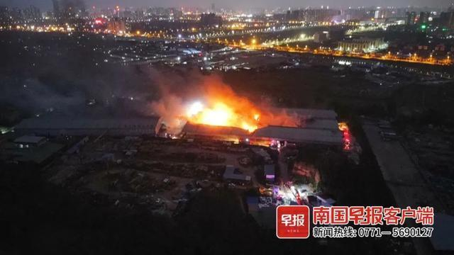

# 广西南宁一仓库发生火灾：暂无人员伤亡，大火仍未扑灭

南国早报全媒体记者谭双梅

今天（4月13日）17时许，南宁市江南区三津村一仓库发生火灾。

据网友发布的多段视频显示，现场火势不小，在西乡塘区也能远远看到浓烟腾空。有网友称，着火点在南宁市国联海绵厂内。

18时36分，@南宁消防
发布警情续报称，4月13日17时54分接到报警，江南区三津村一仓库发生火灾，暂无人员伤亡，燃烧物质为泡沫。南宁消防共调派11个灭火编队、22辆消防车、118名消防救援人员赶赴现场处置，全勤指挥部现场指挥作战。

19:10左右，南国早报全媒体记者在现场看到，路边停了十几辆消防车，由于现场道路狭小，消防车只能一辆一辆进去。

19:20，大火仍未扑灭。

20时许，记者看到，有多辆环卫洒水车、钩机等开往现场增援。

截至20:15，消防救援人员仍在现场处置。

（来源：南国早报）

