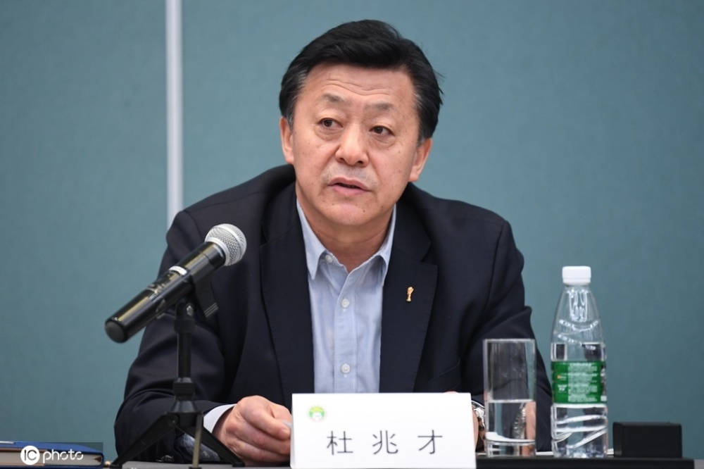

# 杜兆才被免去国家体育总局副局长职务

据人社部网站4月13日消息，国务院任免国家工作人员。

免去杜兆才的国家体育总局副局长职务。

本月早些时候，中央纪委国家监委网站宣布，国家体育总局党组成员、副局长杜兆才涉嫌严重违纪违法，目前正接受中央纪委国家监委纪律审查和监察调查。

杜兆才曾任国家体育总局田径运动管理中心主任，在2017年开始担任中国足协党委书记，2018年开始担任国家体育总局副局长，还曾担任国际足联理事。

