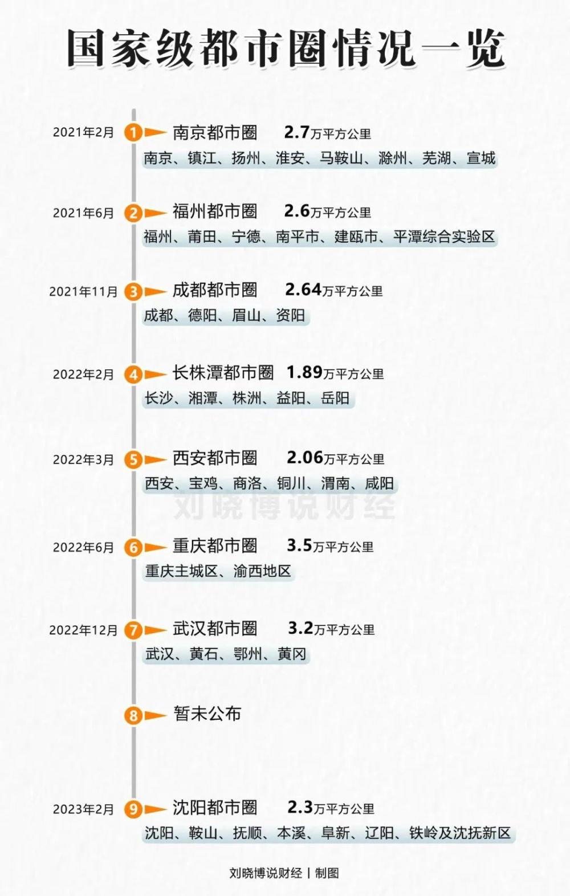
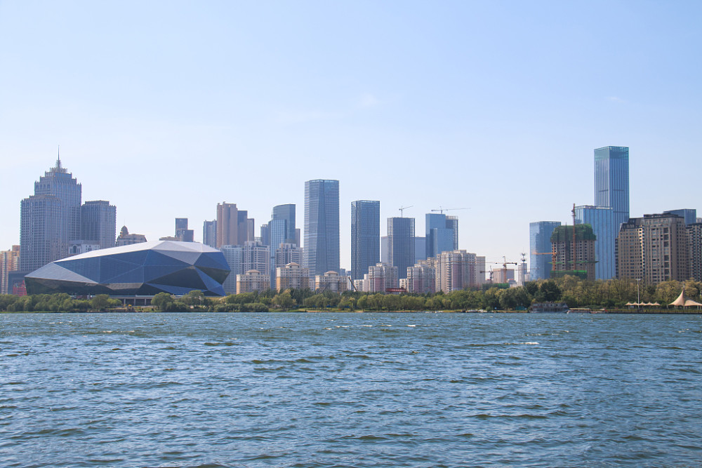
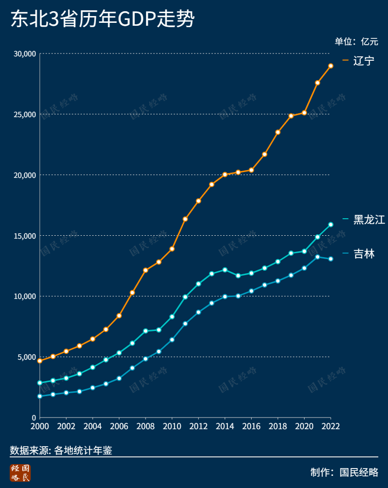
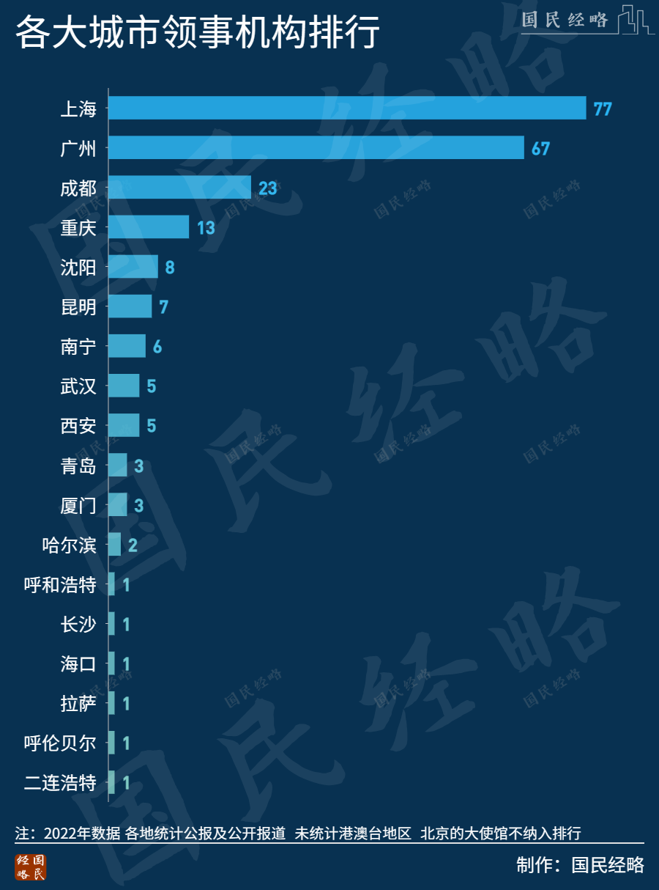
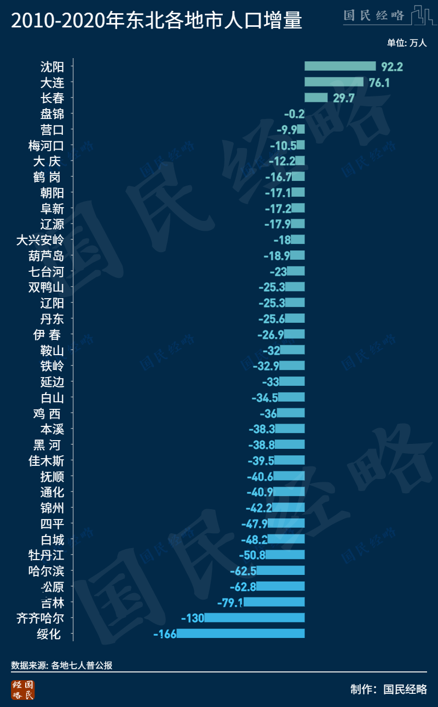
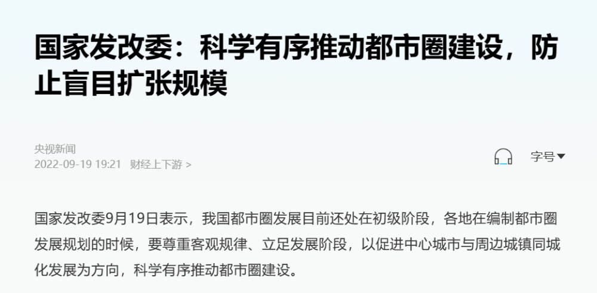

# 破零！东北终于有“国家级都市圈”了

**文|凯风**

抱团建圈，正在成为潮流。

01

这个地方，终于破零了。

日前，在央视节目上，沈阳有关人士透露， **沈阳都市圈正式获批** ，成为全国第九个国家级都市圈，也是 **东北第一个国家级都市圈。**

_沈阳都市圈示意图
来源：辽宁2035总规草案_

在此之前， **南京、福州、成都、长株潭、西安、重庆、武汉** 等7个都市圈规划先后获批，率先晋级为国家级都市圈。

这些都市圈，几乎都集中在南方。沈阳，是继西安之后的 **第二个来自北方的国家级都市圈。**

此番，沈阳官宣成为第9个国家级都市圈。这意味着， **在沈阳之前，至少还有一个都市圈获批** ，但究竟花落何方，相信不久之后就会有答案。

与以往获批的国际级都市圈相比， **沈阳都市圈的获批，有着极其特殊的意义。**

众所周知，我国共有7大地理分区，几乎每个大区都有属于自己的国家中心城市、万亿GDP城市和千万人口大市， **唯独东北成了例外。**

同样，在国家级都市圈的批复历程中，华东、西南、华中、西北等地先后取得突破。

虽然华南、华北同样付之阙如，但广州、深圳、北京几个超级都市圈，早已作为既有事实而存在，未必需要顶层规划进行“加冕”。

东北则不同。面临经济、人口增长双重之困，这个区域亟需一剂强心针。

**最好的强心针，当然是国家中心城市。**

然而，自2018年以来，“国中”就未再进行扩容，虽然沈阳表现出志在必得之心，但靴子能否落地、何时落地，存在巨大的不确定性。

退而求其次， **国家级都市圈的到来，也给了东北地区以新的发展底气。**

这意味着，东北并未缺席都市圈这一最热门的国家战略；而振兴东北，也将有了新的引领区。

02

东北第一个国家级都市圈，为何花落沈阳？

东北地区共有辽宁、吉林、黑龙江三个省份，沈阳、大连、长春、哈尔滨四大副省级的中心城市，沈阳何以拔得头筹？

长期以来， **沈阳都是东北大区的中心枢纽所在** ，如今又是东北最具竞争力的国家中心城市候选人。

同时，东北被称为“共和国长子”，而 **辽宁又是东北地区的“老大哥”。**

且不说吉林、黑龙江早期的工业化建设都与辽宁的支援不无关系，而如今辽宁依旧是东北地区GDP总量最高的地区，相当于黑吉两省的总和。

作为辽宁省会，沈阳在几十年前就曾作为整个东北大区的中心而存在， **三位数的区号（024** ）就足以说明其特殊地位。

如今沈阳依旧是整个东北领事馆数量最多的区域，更拥有以沈阳铁路局、中国民用航空东北区域管理局、中国气象局东北区域气象中心、国家电网东北分部、中国互联网八大核心节点等为代表的众多大区机构。

从经济和产业来看，沈阳GDP总量虽然不及大连，但大连石化产业一家独大，而沈阳产业结构更为多元，制造业门类相对齐全，从汽车到医药，从人工智能到航天军工，可谓无所不包。

根据赛迪研究院发布的《 **先进制造业百强市** (2022)》，沈阳晋升至第25位，较往年排名跃升9位， **位居东北第一** 。

在人口上 **，沈阳是整个东北少有的仍旧保持正增长的城市之一** ，也是最有望晋级千万人口俱乐部的城市。

根据《中西部，正在疯狂虹吸人口》一文分析，沈阳2022年常住人口达914.7万人，增长2.9万人，而其所在的辽宁省，常住人口减少32.4万人。

根据更为权威的人口普查数据，2010-2020年，沈阳常住人口增长92.2万人，而同期整个东北人口大幅减少1000多万人。

由于出生率下滑，自然人口负增长，沈阳的人口增量，主要来自外来人口的贡献，囊括辽宁其他地市及黑吉两省，吸引力覆盖整个东北地区。

可以说， **沈阳在东北，发挥着人口护城河的关键作用。**

就此而言，整个东北，无论是国家中心城市的竞夺，还是国家级都市圈的头啖汤，都非沈阳莫属。

03

晋级国家级都市圈，能带来什么利好？

有人说，国家级都市圈不过只是一个名号，有或无，多或少，高或低，都没有太大关系。

这句话对于 **北上广深等一线城市来说或许适用** 。这些城市本身综合实力一流、辐射效应强劲，并不需要一个特别的头衔进行加持。

一个典型的案例是，深圳连国家中心城市都不是，但从未有人怀疑深圳作为一线城市的含金量。

但是， **对于广大二三线城市** ，尤其是区域内存在“双子星”乃至“三城鼎立”格局的地方来说， **是否有国家战略倾斜，可谓至关重要。**

以最受瞩目的国家中心城市为例，“国中”是国家城镇体系的金字塔尖，这些城市“居于国家战略要津、肩负国家使命、引领区域发展、参与国际竞争、代表国家形象”。

换言之， **一旦成为“国中”** ，意味着这个城市将成为整个区域的引领者，成为国家战略的主要承载者，在整个区域的发展中将会获得明显先机。

国家级都市圈也是如此。一旦都市圈规划明确，就意味着 **中心城市的“势力范围”得到认可。**

如南京都市圈作为全国首个跨省都市圈，就是由江苏、安徽两省共同发布，由此确立了 **“徽京”** 的事实地位。

同时，都市圈获批之后，地铁、城轨将有望从中心城市向周边延伸。

这对于未能触及地铁门槛的周边地市来说，可谓及时雨；而对于中心城市来说，也能借助轨道交通不断向外拓展城市框架，从而为经济增长继续更大能量。

当然，一些实际的支持也不会少。

去年底， **辽宁就曾筹措数亿元资金，支持沈阳都市圈建设。**

而在官方文件中，更进一步明确沈阳都市圈 **“打造东北全面振兴全方位振兴引领区”** 的战略定位。

这些支持，无疑为沈阳代表东北竞夺国家中心城市提供更大支持，也为沈阳逐鹿“东北第一城”创造更大可能。

04

都市圈越来越多，但大扩张之路或将戛然而止。

去年9月，国家发改委新闻发言人表示，我国都市圈发展还处在初级阶段，各地要尊重客观规律，不能跨越发展阶段，在不具备条件的情况下推动都市圈建设。

这意味着，都市圈不能遍地开花，也不适宜无限扩大；不是每个普通地级市都能成为都市圈的中心，也不是随便几个城市都能形成都市圈。

根据清华大学中国新型城镇化研究院组编的《中国都市圈发展报告》，我国共有 **6个成熟型都市圈、17个发展型都市圈、11个培育型都市圈** 。

在主要城市中，广州、上海、杭州、深圳、北京、宁波为成熟型；成都、重庆、南京、西安、福州、沈阳等为“发展型”；石家庄、大连、南昌、贵阳、南宁等都市圈位列“培育型”。

显然，对应不同的发展阶段，都市圈建设的方向也存在明显差异。

对于类似广佛、深莞这样相当成熟的都市圈，城市边界几乎完全消失， **全域同城化** 将是最终发展方向。

对于正在发展中的都市圈而言，地铁的互联互通仍旧是第一位的，在此基础上，再寻求规划、产业乃至公共服务的一体化。

所以，获批国家级都市圈只是第一步，能否真正发挥都市圈的引领作用，借助都市圈实现城市能级乃至区域增长极的跃升，才是最关键的。

