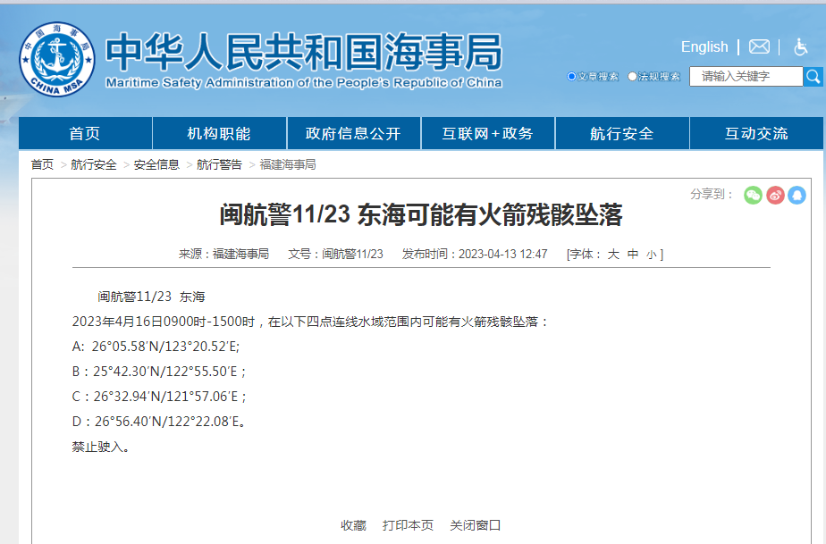

# 禁止驶入！东海部分水域可能有火箭残骸坠落

**闽航警11/23 东海可能有火箭残骸坠落**

闽航警11/23 东海

2023年4月16日0900时-1500时，在以下四点连线水域范围内可能有火箭残骸坠落：

A：26°05.58′N/123°20.52′E;

B：25°42.30′N/122°55.50′E；

C：26°32.94′N/121°57.06′E；

D：26°56.40′N/122°22.08′E。

禁止驶入。

来源：福建海事局

