# 裁员、收缩、业绩爆雷，寒冬之下“芯二代”发动代工争夺战

_“芯事重重”是腾讯科技半导体产业研究策划，第19期聚焦芯片巨头“二代”接班人的内幕。_

**划重点**

  * _1_ 2020年开始，芯片战场陆续交给“二代目”，三星李在镕、台积电刘德音与魏哲家逐步登台，到2022年接班格局基本确定。
  * _2_ 作为对比，芯片产业“一代目”身上带有一些共同标签，比如：基于理想的信念与坚持，以及杀伐决断的勇气。
  * _3_ 与创始人相比，接班人们普遍缺少鲜明的个人风格，务实成为这群人更为普遍的选择，并且要对地缘政治有更多考量。
  * _4_ 芯片寒冬之下，时代在变，人员流动，芯片市场的一些界线也逐渐模糊，三星、英特尔开始抢夺台积电的代工蛋糕。

**作者|陈默 编辑|江岳**

**微信公众号：首席人物观（ID：sxrenwuguan）**

1958年9月，美国德克萨斯州，德州仪器的电气工程师基尔比手工制作了一块简易集成电路。

这是一场他心里也没底的试验：使用同一种半导体材料制作电子器件，把它们集中在一块极小的半导体芯片上并相互连接，形成微型电路。当他兴奋地把这个想法告诉同期入职的同事张忠谋，后者不以为然，两人的上司也觉得这事儿麻烦且不靠谱。

于是，当基尔比坚持在那块简易电路板的输入端接入10伏电压时，估计没几个人知道， **现代电子工业就此迎来改变。**
这被认为是史上第一块半导体芯片，“轮子之后最重要的发明”。

依靠半导体技术和产业链的优势，美国甚至全球经济进入了新周期。此后数十年，芯片战场上硝烟四起，美日、日韩、中美……背后的角逐方不断变化，冲在一线的芯片公司们——比如以高通英伟达为代表的芯片设计公司、以台积电中芯国际为代表的芯片圆晶代工公司、以英特尔三星为代表的芯片垂直整合公司，也陆续崛起。

**某种意义上，芯片战争前半场的关键词是理想主义。**

至少对于那些奋身投入其中的创始人而言，他们拼尽全力所追寻的，远远不只是普通意义上的商业成功，在技术理想或者家国情怀的指引之下，他们甘愿自我牺牲，排除万难。他们被时代选中，最终也创造了新的时代。

当芯片战争进入下半场，创始人远去，接班人上场。从2020年左右开始，芯片大厂换届陆续进行，战场上的主角换成了三星的李在镕、台积电的刘德音与魏哲家、英特尔的基辛格、中芯国际的高永刚。

不过， **与创始人相比，他们缺乏足够鲜明的个人风格——当理想主义不再是芯片战场的主旋律，务实，也成为“二代目”们更普遍的选择。**

毕竟，寒冬之下，生存优先。

01 二代目登场

时间来到2018年。

6月5日，在最后一次主持完股东会后，年近87岁的台积电创始人、董事长张忠谋表示，
**相信新的董事会及新的领导人可以顺利、成功接班，“台积电的奇迹绝对没有停止，奇迹会一次又一次创造。”**

接替他掌管全球最大半导体公司的是刘德音与魏哲家，前者出任董事长，后者出任总裁。

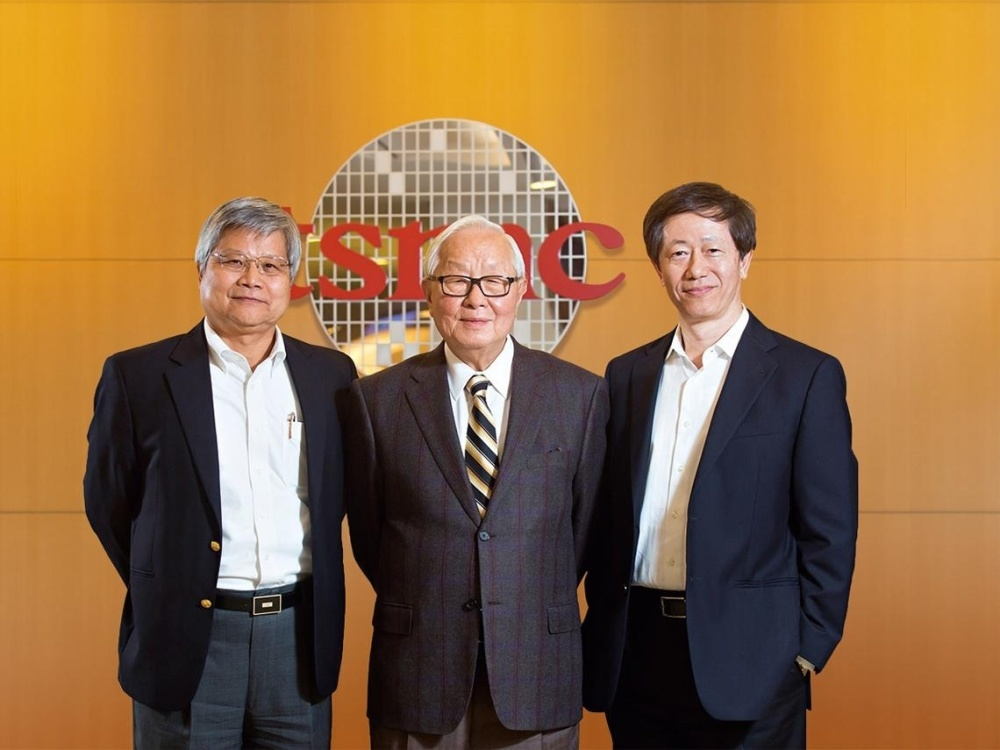

_图：（左）魏哲家、（中）张忠谋和（右）刘德音_

两人有诸多相似之处：都毕业于美国名校，都在台积电工作多年，从2013年就开始出任共同执行长——这是双首长制的雏形。张忠谋当时认为接班的火候还不到，在刘德音与魏哲家的性格中，有70%-80%还是工程师成分，他觉得，要到两人70%-80%是生意人性格时才能接班，“因为他们要为公司赚钱”。

**从性格上，刘德音与魏哲家形成互补。** 台湾地区《经济日报》曾报道，当张忠谋遇事要精辟见解分析会听刘德音意见，而举棋不定时则看魏哲家决策判断。

刘德音是典型的工程师：内敛稳重、实事求是、敢于担当。张忠谋曾经评价他的长处，“他是很reflective（深思熟虑）的人。假如你给他足够的时间，（他的）思想会非常缜密。”

这位美国加州大学伯克利分校的计算机信息博士，曾在美国贝尔实验室和英特尔工作过，1993年加入台积电。接班前，他在台积电的40nm、28nm
、28nm、16nm工艺等方面贡献良多，还操刀完成了台积电第一座12英寸晶圆厂。

一位曾与他在中学和大学同窗七年的同学形容，刘德音绝不是同学里最出名、最聪明、成绩最好的那个，却是最有修养、耐力最够的那个，习惯细水长流，游泳从来都是千公尺起跳。他也很有担当，汉微科董事长许金荣曾告诉媒体，“每次他被张董事长（张忠谋）骂了，总是一人承担下来，从不会推说下面的不对。”

魏哲家则更加明快。他活泼幽默，出现在媒体面前时总是笑嘻嘻的，自称喜欢《鹿鼎记》里的韦小宝。“魏哲家决策相当明快，这是他的长处。就像几十年前一个日本首相，有人形容他做决定好像一个机关枪似的快速，啪啪啪。”张忠谋这样评价。

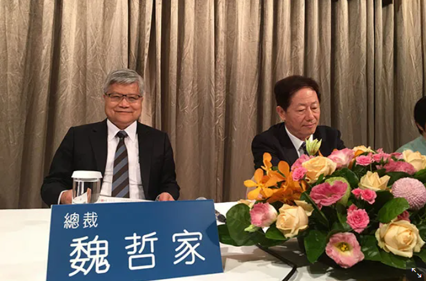

当然，魏哲家的执行力也很强。他是耶鲁大学电气工程博士，曾在德州仪器、意法半导体、特许半导体工作，于1998年加入台积电，据称在保障台积电0.13微米系统单芯片良率方面战功显赫。

在媒体公开报道中看出，魏哲家有很强的忧患意识。在看到美国斯坦福大学教授吉姆·柯林斯讲述成功公司如何走向失败的《巨人如何衰败》（《How the Mighty
Fall》）一书时，魏哲家表示了自己的忐忑——书中提及，成功企业失败的第一步，就是CEO“忘了我是谁”。

**根据张忠谋的说法，双首长接班制，是他留给台积电的最后一份礼物。**
只是几年之后，会赚钱已经远远不够了。一位曾经就职于台积电的芯片从业者评价：“张忠谋带领台积电在全球半导体行业中搏杀，实现技术突破，成为领军企业。而第二代则需要在中美脱钩的背景下，对地缘政治有更多的考量。”

“刘德音跟魏哲家都有张忠谋的一面，他们加起来，就是一个张忠谋。”在他看来，张忠谋的视野非常全面，除了技术，在宏观经济、政治、管理等方面的造诣都很高。此外，张忠谋还喜欢听巴赫，学过英国文学。当他在2009年因台积电遭遇金融风暴濒临亏损复出重任CEO时，就引用了莎士比亚在《亨利五世》中描述战斗的诗句：“Once
more unto the breach, dear friends.”（再冲啊，朋友们！）

战斗的宿命，同样落在了两位接班人身上。他们接手的2018年，台积电在7nm量产方面处于行业领先，342亿美元的年营收创下历史新高，但还是不及三星的一半。

得益于存储行业的繁荣，内存闪存芯片价格高涨，三星芯片业务在2017年就达到了690亿美元的营收，一举超越英特尔的630亿美元，夺走了后者从1992年就一直保持的行业第一位置，此后也长期保持在第一或第二。

**当台积电两位接班人带着张忠谋的烙印走向一线，他们所追赶的目标三星，也在4年后正式迎来了新的掌门人：李在镕。**

2022年10月，54岁的李在镕正式成为三星电子会长，诸多信号指向新风气的到来。比如，员工可以直呼李在镕的英文名字“JAY”或者“在镕先生”，李在镕还多次被拍到自己拖着行李箱出差，这都与传统的财阀作风相距甚远。

_图：2022年10月，三星电子副会长李在镕正式出任三星电子会长，韩联社相关报道截图_

《纽约时报》曾报道，在韩国企业界，上级总是以尖刻而且常常颇为暴烈的言辞训斥员工，“而李在镕领导下的三星开启了一场旨在清除这类言辞的运动”。还有一位三星前高管表示，“李在镕是个好人，根本没有等级观念”。

其实，作为三星“太子爷”的李在镕，早在2014年父亲李健熙因急性心肌梗塞倒下后，就开始逐渐执掌三星帝国。这位家中独子被称为“衔着金勺子出生”，爷爷是三星集团创始人李秉喆，父亲李健熙将三星集团发展成世界顶级企业。
**从加入三星工作到正式成为接班人，李在镕花了31年。** 1991年加入三星电子时，他还是23岁的少爷，2022年拿到三星集团会长头衔的他，已经年过半百。

只是，半导体芯片带给三星的荣耀，此时已经逐渐消退。

1970年代，李健熙顶着“半导体会搞垮三星”的质疑，毅然创办三星半导体——去年大火的以三星为原型的韩剧《财阀家的儿子》中，也设计了相关剧情。半导体业务最终撑起了三星的新故事，它成功打败了日本竞对，DRAM市场行业第一的记录至今保持了30年，NAND闪存至今保持了20年。三星，更是成为韩国人离不开的企业。

**但这些荣耀已经属于上一代。如今的半导体芯片业务，更像是拖累。**
三星集团旗下最大的子公司三星电子，最近发布了2023年一季度财报。曾经贡献公司80%利润的半导体部门，疲态尽显，导致三星电子在该季度的营业利润同比减少95.8%，跌至14年以来的最低水平。

02 被选中的人

很长时间里，李在镕都站在父亲的光环后面。

没办法，父亲李健熙有“天才CEO”之称。他眼光狠毒，擅长杀伐决断。投资内存，可以连亏13年；投资液晶面板，可以连亏7年，最终让三星凭借自杀式价格与技术成为行业霸主。

三星前雇员、现就职于伯恩斯坦投资公司的马克·纽曼曾认为，三星集团的秘密，就是对创始家族的信任。尽管他们存在种种缺陷，但在公司内部却拥有神一般的地位。而杰弗里·凯恩在作品《三星崛起》中，将三星的领导风格描述为军事化、大男子主义、对错误的零容忍度。

然而，过于强势的父亲往往会培养出温顺甚至略显怯懦的孩子。

李在镕性格与李健熙截然相反，他儒雅斯文，对父亲言听计从。面目清秀的他出现在镜头前面时总是西装笔挺、文质彬彬。

**区别于在孤独中成长、内向刚强的李健熙，李在镕精通多门语言，长于社交。**
他与苹果两任掌门人乔布斯和库克都建立了良好的私人关系，在受邀参加乔布斯的追掉会时他还透露，自己遇到困难时，最先接到了来自乔布斯的电话。

当年在拜访联想集团总裁杨元庆时，提前做好功课的李在镕送给他一瓶该年出产的葡萄酒，让杨元庆印象深刻。而比尔·盖茨现在用的Galaxy Z
Fold4手机，也是李在镕在见面时送给他的。在2023年3月的达沃斯论坛全球CEO午餐会上，媒体报道，李在镕不时开一些大家一起笑的笑话，“营造出愉快的气氛”。

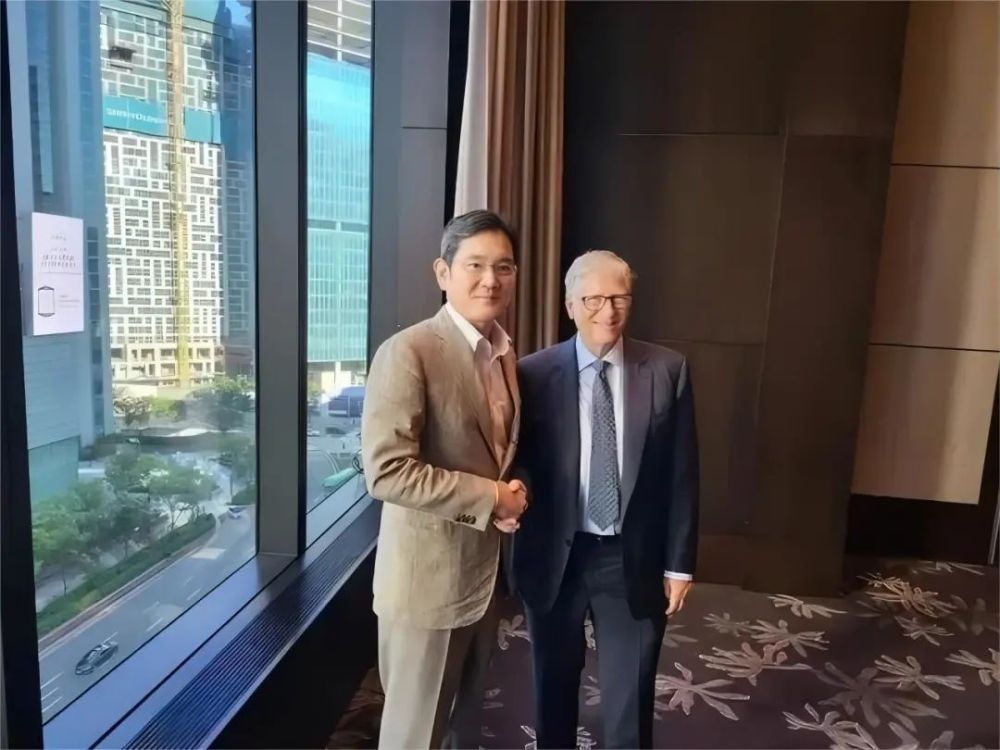

如果按照传统财阀或者商业帝国掌门人的标准，李在镕似乎有些过于随和——这位“普通模范生”身上，缺少了父亲那种“近乎破坏性创造的偏执狂风格”。

2021年1月，他因为与前任韩国总统朴槿惠与其亲信崔顺实的政商勾结，获刑两年半。在首尔拘留所，他的代号为“1616号”，住一个面积仅6.05平方米的单间，每天只准在户外活动1小时，无法上网。在失去自由的日子里，他努力健身，7个月里痩了26斤。首尔拘留所的一位狱警告诉韩国媒体，自己见过不少韩国的财阀大佬，“但是像李在镕这种无论见到谁都笑着打招呼的，还真的很少见”。即使身处囹圄，李在镕也被评为“模范囚犯”。

**他可能也是韩国公开道歉次数最多的财阀。**
三星首尔医院因管理不力造成MERS疫情“二次暴发”时、独子李智昊以“社会关怀”方式被名牌私立学校录取引发争议时，他都出面进行道歉。

2016年12月，韩国国会针对“闺蜜干政门”传唤韩国九大财阀掌门时，在一众老人之外，最年轻的李在镕成为众矢之的，九成问题都针对他。台湾《商业周刊》报道，当时李在镕频频道歉：“这全是我的错。”一位反对党议员指着他骂：“若这是贵公司的面试，你这种表现肯定被淘汰。”

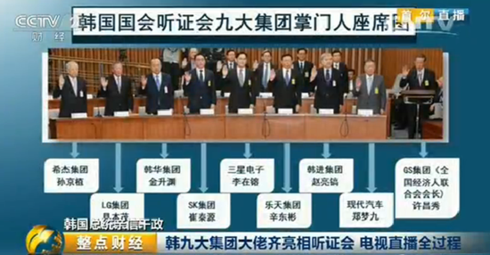

看起来，韩国最强大的商业帝国，遇到了最温顺的接班人。

还在三星副会长任上时，关于李在镕领导力不足的质疑就频频出现。作为被父亲选中的、也是唯一的接班人，他没有选择的余地。但显然，他并不希望儿子再重复自己的命运。于是，在2020年5月的一场道歉中，他宣布了一个令世人震惊的消息：不会让自己的子女再做接班人。

就这样， **他终结了三星这个全球最大的家族商业帝国的世袭制。** 等他结束会长任期，三星将交给职业经理人来管理。

尽管如此，作为三星掌门人的李在镕，还是尽职尽责，也不乏可圈可点之处。

比如推动三星组织管理的现代化。他在三星集团旗下多家公司分割CEO与董事长职权，允许除CEO以外的董事(包括外部董事)任董事长；解决财阀体制中交叉持股的弊端，比如2018年，三星消防与海事保险公司和三星电机出售了三星物产的全部股权；废除三星几十年来的“无工会经营”，成立工会，加强经营的透明度。

在芯片生产方面，2017年，三星电子将晶圆代工业务从系统大规模集成电路（LSI）业务中独立出来。从2018年开始，三星电子的研发投入开始逐年增加，到2021年时，三星电子的研发费用已经高于英特尔、台积电和中芯国际。

**他还赤裸裸地抢起了台积电的蛋糕——后者是圆晶行业的老大。在存储芯片市场，三星的老大位置相对稳固，但市场波动较大，不如圆晶代工稳定。**
2019年4月，李在镕就宣布了一项“半导体愿景2030”计划，要斥资133万亿韩元，到2030年位列全球逻辑芯片行业前列。2年后，这个数字被追加到171万亿韩元。

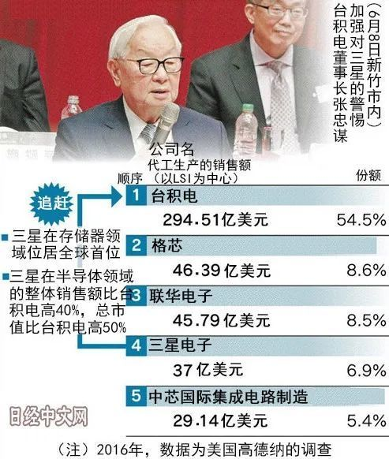

03 对手

**以接班人为观察维度的话，芯片战场的新格局，是在2022年基本确定下来的：刘魏二人在台积电基本站稳，三星李在镕正式接班，英特尔基辛格开始重振极客文化，中芯国际任命了新任董事长高永岗。**

至此，创始人基本退隐，二代目与新接班人们成为主角。

2000年成立的中芯国际，原本是家国情怀的展现：创始人张汝京是1970年代就在德州仪器工作的老芯片人，从名字到选址，都透着他对国家芯片事业发展的一腔热情。从打桩到投片生产，中芯国际只花了13个月，创下行业速度新高。仅仅成立3年，它就成为全球第四大芯片代工厂，在生产工艺上跟台积电叫起了板。

不过，在很长一段时间里，人事动荡始终是它无法摆脱的阴影。

因为与台积电的官司败诉，张汝京在2009年被迫离开，此后，中芯国际陷入两年的动荡期。接任CEO王宁国因大股东反对而离开，直到2011年，曾在台积电和华虹NEC任职并参与创立中芯国际的邱慈云出任CEO，动荡才暂时告一段落。
**在这段动荡期内，中芯国际与台积电的资本开支差距进一步拉大。**

2017年，梁孟松与赵海军成为中芯国际的联合CEO。

梁孟松的到来，曾经极大提振过中芯国际的士气。他曾是台积电研发处处长，在台积电的多次技术升级中立下汗马功劳，后来又加盟三星，成为其晶元代工部门的技术长。正是他力主三星电子放弃20nm，直接进入14nm工艺，帮助三星抢到了2015年苹果iPhone
6S的A9处理器订单，以及高通大单，让台积电损失高达10亿美元，并引来了后者的知识产权诉讼。

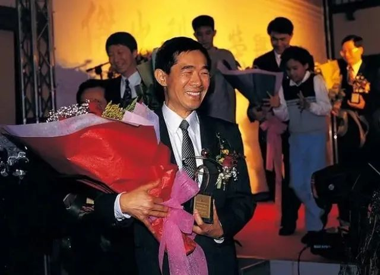

_图：梁孟松_

接任CEO后，梁孟松只用了298天就实现了中芯国际的14nm量产，堪称奇迹——台积电14nm工艺从研发到量产，花了三年多。

然而，动荡再起，2020年12月，中芯国际宣布委任前台积电营运长蒋尚义为副董事长。他是1997年加入台积电的研发主管，曾牵头多个关键技术节点的研发。毫不知情的梁孟松表示“十分错愕与不解”
，认为自己“不再被尊重与不被信任”，提出辞职。

不过，在中芯国际的挽留之下，梁孟松最后没有走，一段时间后，蒋尚义离职。后者在接受美国媒体采访时称：加入中芯国际是个错误决定，也是一生中做过最愚蠢的事情之一。

人事动荡并未停止——2022年3月，中芯国际原董事长周子学辞去董事长、执行董事职务，中芯国际首席财务官高永岗接任。有观点认为，这与中芯国际的战略变化有关，在2022年的缺芯大潮之下，中芯国际的业务重点从先进制程研发转向更加务实的成熟制程扩产，这导致了高管层面的再次变动。

**另一家频繁更换CEO的，是芯片巨头英特尔。**

从2019年到2021年，三任CEO走马灯一般上任，分别是布莱恩·科再奇、司睿博和帕特·基辛格（Pat
Gelsinger）。其中布莱恩因桃色绯闻匆忙离职，临时补位的司睿博是财务出身——这导致英特尔在手机、PC和制程工艺方面都出现问题，比如英特尔在7nm工艺制程方面一直未能取得关键性进展，苹果也在Mac中弃用X86架构的英特尔处理器。

随后接任CEO的基辛格，曾任英特尔首任CTO。

“他非常聪明、非常有野心并且傲慢自大。”前英特尔高管罗纳德·史密斯对《纽约时报》这样描述。基辛格18岁就进入了英特尔，在还是一位年轻工程师时，就写下誓言：要成为英特尔的CEO。但在英特尔工作30年后，他被迫离职。

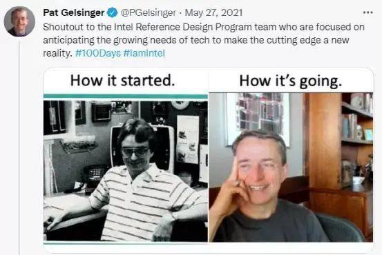

为了重新请他回来，英特尔可谓下了血本。《华尔街日报》报道，执掌英特尔的第一年，基辛格就获得了价值近1.8亿美元薪酬，是他前任的7倍，比苹果掌门人库克还高一大截。

英特尔不能继续“躺平”了。 **基辛格的回归，传递的信号之一是英特尔要重回技术路线。**

自称数据驱动的基辛格，可以说是在英特尔长大，如今他想“恢复标志性的英特尔”。在创新大会上，他穿的衬衫上就用ASCII码写着：“把极客带回来。”——他希望把过去英特尔那种以工程技术为中心的文化带回来。

如今的英特尔，肯定不是基辛格曾经喜欢的样子。“失去光彩的硅谷巨头。”这是人们如今提到英特尔时最常用到的词语。移动互联网的十年，也是英特尔失去的十年。这位电脑芯片霸主，错过了移动互联网的盛宴，只能羡慕ARM和高通的崛起。

关于基辛格的任务，《金融时报》的评价是：面临科技史上最艰难的东山再起之一。

在电脑芯片领域，英特尔面临着AMD的巨大挑战——2016年，英特尔和AMD的市场占有率分别是80%和20%，如今是60%和36%。在数据中心业务方面，英伟达和ARM也在不断蚕食其市场。

**“老人”基辛格显得野心勃勃。他上任没多久就提出了IDM 2.0战略，试图夺回在先进芯片制造领域的领导地位。**
英特尔的研发费用显著增加，大幅超越了AMD和NVDA。报道称，英特尔想在4年内推出5代先进制程工艺，从Intel 7一路推进到2024年量产Intel
18A工艺。

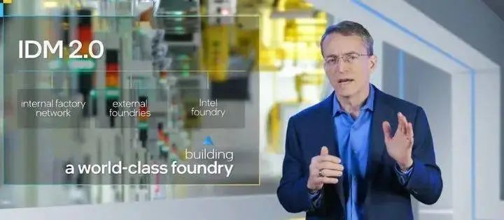

**此外，基辛格的另一个重要决定是重启晶圆代工。**
在《福布斯》资深撰稿人帕特里克·穆尔黑德看来，这是基辛格掌舵英特尔以来，实施的最大战略变化。而早在2012年，英特尔就与台积电、三星共同入股投资ASML，并占据最大份额。

2022年2月，英特尔以54亿美元收购了以色列芯片公司高塔半导体。穆尔黑德认为，此举将帮助英特尔加速垂直整合，直接进入晶圆代工产业——也就是台积电的地盘。

这看起来像是一场降维打击，但争议也随之而来。有评论者认为，大力投资制造工厂，使英特尔难以聚焦于科技研发。“由于基辛格先生投入巨资用于芯片制造，英特尔的股票已经下跌。”《纽约时报》评价。

04使命与特质

时间倒拨几十年，芯片产业的“一代目”们还在荒野之中摸索。 **他们身上带有一些共同标签，比如：基于理想的信念与坚持，以及杀伐决断的勇气。**

1987年，56岁的张忠谋在从美国回到台湾，从零开始创办台积电。他开创了圆晶代工的新行业，并将它做到极致。到2020年时，台积电已经生产了92%的世界上最先进的芯片。可以说，如果没有台积电，现代社会的诸多文明将会停摆。

_图：张忠谋在台积电开幕发布会上
NHK 纪录片_

1974年，三星的李健熙对父亲放出狠话：“爸，就算是只有我一个人，也要试试看那件事。”他用自己的钱收购了韩美合资的一家半导体公司，由此奠定了三星半导体帝国的基石。

至于中芯国际的张汝京，他生于1948年的南京，在台湾考上台大，赴美读到博士，又进入德州仪器，一路顺风顺水，但他一直记得父亲的那句提醒：“你什么时候去大陆建厂？”心愿最终在2000年的上海实现。有台湾的朋友来上海探望后告诉媒体，张汝京穿着工作衫和旧毛衣，看上去像传教士，办公桌是三夹板草草拼就。

“他说他有一个中国半导体的宏伟梦想，为这个梦想要彻底献身，好像甚至牺牲性命都可以。这个人不是为了赚钱才做这件事，这才是最可怕的。”

在创业之路上，理想主义如同一支猛烈燃烧的火把，吸引无数跟随者前赴后继，水滴石穿。与此同时，创始人也会因本身强烈的个性获得巨大的影响力，两相叠加，继而成为社会学家马克斯·韦伯所描述的魅力型（克里斯玛型）权威。

“张忠谋是一个不能容忍愚笨的人，所有人对张忠谋是又敬又怕。”曾任台积电技术长的加州大学柏克莱分校教授的胡正明这样说过。这句话很好地体现出张忠谋在台积电的影响力。也有观察者评价，在三星，李健熙有着“帝王般的影响力”。

在此基础上，他们也更有直面挑战，在最关键的时候力排众议、杀伐决断的底气。

比如在2009年的行业波谷中，张忠谋成功说服台积电董事会，将次年的资本投入从27亿美元增加到59亿美元，大幅增加28nm产能，让台积电在此后数年迎来了高速发展。

但，创始人终究不得不退场。“假如一个人可以长生不老的话，我会继续做下去。”2017年宣布将正式退休时，张忠谋如是说。这一次，他是卸下所有职位，裸退。

**“二代目”证明自己的这条路，并不比“从0到1”的过程容易许多。**
他们所接手的公司，往往已经被打上了过于强烈的创始人烙印。不是每家公司都能拥有库克——坦白来说，即使是让苹果公司挣到更多钱的库克，也没能拥有乔布斯那样的名声。

在芯片的战场上，更是如此。“二代目”们普遍展现出的特质变成了：务实。

2023年的行业下行周期中，李在镕拾起了父亲“杀敌一千，自伤八百”的降价大杀器——对成熟制程的芯片降价10%。据韩国媒体报道，3月20
日，李在镕与公司芯片部门高管举行会议，尽管有部分高管认为有必要减产，但是到最后，李在镕的态度依然是拒绝。

在三星电子2023年Q1业绩公布后，分析师认为，这主要是因为芯片业务的拖累。此时，李在镕终于扛不住了。一周后，三星电子表示，将削减存储芯片的产量。
**他没能像他父亲一样咬牙到底。但审时度势，没人会说这是一个错误的决定。**

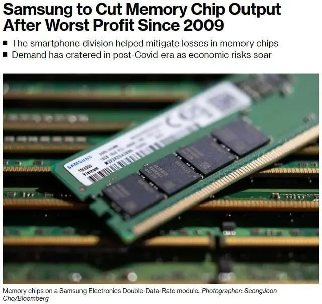

无他，一代人有一代人的使命。

05混战

时代在变，人员流动，芯片市场的一些界线也逐渐模糊。

三星和英特尔都抢起了台积电的蛋糕。李在镕的“半导体愿景2030”计划正在推进中，基辛格已经喊话：“我们将成为一家伟大的晶圆代工企业。”

**EUV光刻机成了香馍馍。**
作为全球唯一的高端芯片制程设备制造商，ASML生产的EUV光刻机被称为芯片制造的“皇冠”。不过，2021年数据显示，ASML近年来量产的EUV光刻机七成给了台积电。

三星已经出手。2022年6月，李在镕赴欧访问，在ASML荷兰总部与其CEO彼得·温宁克会面，成果颇丰——当年ASML的EUV光刻机出货量估计为51台，三星预定18台，台积电至少确保22台。二人见面后，三星抢到了“额外”的EUV光刻机。

_图：李在镕与ASML
CEO彼得·温宁克合影，韩联社_

**围绕先进制程工艺，竞争态势最为胶着的，还是三星和台积电。**

在7nm以及5nm、4nm方面，台积电都领先于三星，在代工良率方面如此。所以高通在发现三星代工888和骁龙8 Gen
1效果不佳后，扭头就找了台积电。2022年，台积电更是击败三星，拿下了特斯拉的FSD辅助驾驶芯片大单。

痛定思痛，李在镕下定决心提高良率，留住高端客户。为此，他不惜对高层开刀，换掉了三星生产芯片业务晶圆代工负责人，并集中人才攻克芯片封装短板，宁肯忍痛放弃LCD面板开发业务。“(我们要做的)
第一是技术，第二是技术，第三也是技术。”2022年6月从欧洲访问ASML归来时，他说。

在3nm制程方面，李在镕不仅抓技术，还成为最疯狂的推销员，抓住一切机会向外界宣传三星采用GAA（全环绕栅极晶体管）架构的3nm产品。据称采用这种架构，比台积电在3nm制程上用的FinFET（鳍式场效应晶体管）架构性能更佳。

2022年5月，美国总统拜登赴韩国访问，去三星的平泽园区参观。当时李在镕向拜登展示的，就是三星3nm
GAA技术的试制品。在试制品上，拜登和同行的韩国总统尹锡悦还签了名。

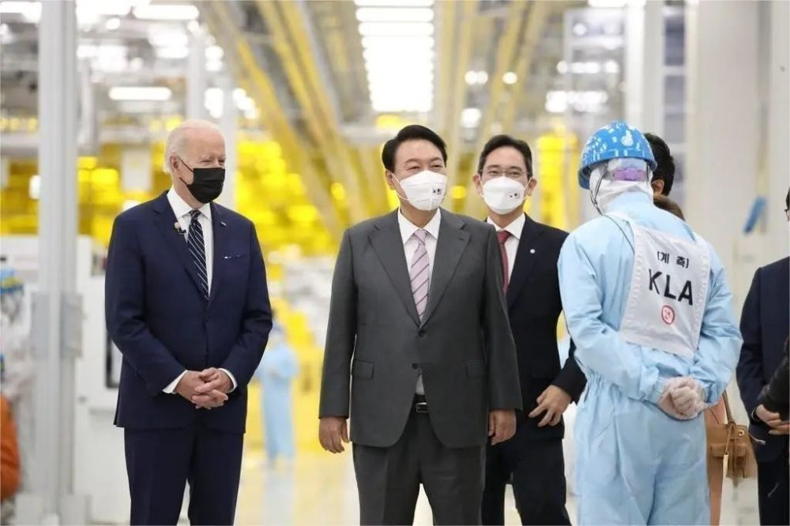

_图：美国总统拜登（左一）和韩国总统尹锡悦（左二）视察平泽园区，李在镕（左三）陪同视察，韩联社_

台积电当然不服气。

尽管三星宣布自己量产的时间比台积电早半年，但魏哲家反复强调的是台积电“具备良好的良品率”。他还在技术论坛上说，台积电 3
nm维持FinFET构架，主要是制程技术“不只好看、好听还要实用”——显而易见，这针对的就是三星。

“相较于5nm制程技术，我们3nm技术逻辑密度增加约60%，在相同速度下功耗降低30%-35%，这是世界上最先进的技术。”在宣布台积电3nm量产且与5nm量产良率相当时，刘德音说。

**与以往的在商言商相比，国际关系，现在也成了芯片大厂们考量的重要因素。**

英特尔的基辛格成为了《芯片法案》的推波助澜者。自称是虔诚基督徒的他，拿出了传教式的热情，游说美国政府通过《芯片法案》，补贴美国半导体产业，压制中国。他坦承，自己公司的政府事务负责人曾在奥巴马政府的商务部长手下工作，“他对通过《芯片法案》起到了开创性的作用”。

在游说时，他还多次喊话白宫，要求给英特尔比台积电等同行更高的补贴，“你想要拥有相关的知识产权、研发和税收，还是想要那些回流亚洲？”

2022年8月，拜登签署《芯片法案》，英特尔成为最大的受益者，收到的补贴和贷款可能高达175亿美元。而英特尔承诺在美国亚利桑那州和俄亥俄州芯片厂项目上投入超过500
亿美元。因此有媒体评价，宣称信仰“技术至上”的基辛格上任后真正在积极做的，和技术没啥关系。他其实就是在搞政治投机。

半导体曾经成为硅谷的火种，继而在日本、韩国、中国陆续燎原。然而，现在，美国希望这些产业和工厂重新回到本土。

或在压力之下，或看在市场份上，近年来，台积电、三星纷纷赴美建厂，并不断加大投资力度——三星的德克萨斯州泰勒工厂预计投资170亿美元。彭博社更称三星还准备投资近2000亿美元，在德州扩建11座晶圆厂。而台积电的亚利桑那州工厂一二期，总投资预计达到400亿美元。

“美国制造业回来了。”当拜登在台积电亚利桑那州工厂发表演讲时，出席者中有张忠谋、魏哲家和刘德音。

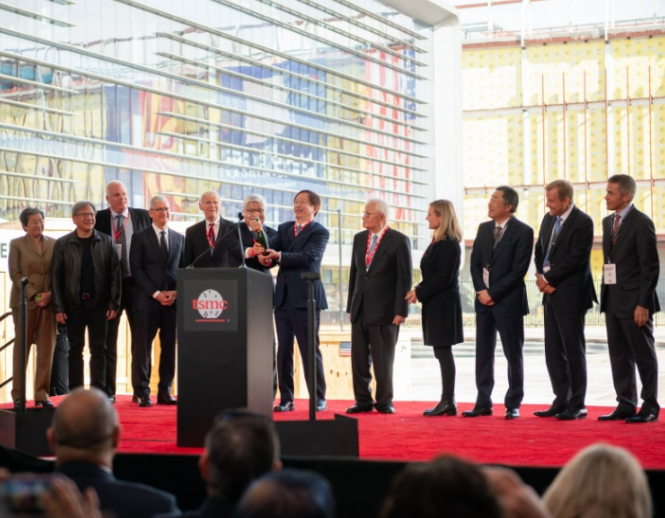

_图：(左一)AMD苏姿丰、(左二)英伟达黄仁勋、(左四)苹果库克、(左五)拜登，(左六)台积电魏哲家、(左七)台积电刘德音、(左八)台积电张忠谋_

2022年底，张忠谋在出席台积电亚利桑那州移机典礼时表示，台积电赴美建立第一家工厂至今已经27年。27年来，半导体行业见证了世界的大变化，世界地缘政治格局的大变化，“全球化几乎接近死亡，自由贸易也快消失了。很多人仍然希望它们能回来，但我认为它们不会回来”。

这是一个老半导体人最深沉的喟叹。

**也是在2022年，台积电在营收上首次超越三星，登上了全球半导体龙头宝座。**

在交棒之前，张忠谋已经设计了台积电将来2年7nm、5nm、3nm制程芯片的研发、设计、实验、试产和量产规划。“当时台积电的技术已经是世界第一，但营收还不是。在刘德音和魏哲家接任双首长之后，台积电开始了极力追赶。”一位前台积电员工称。在他看来，张忠谋就像是乔布斯，而刘德音和魏哲家就像是库克。乔布斯奠定了苹果的优势地位，库克则将苹果推向巅峰。

但正如苹果的风光背后藏着全球智能手机行业的衰退， **台积电的好成绩，也挡不住芯片行业快步入冬。**

半导体行业周期性极强。美国半导体协会的数据显示，从1976年到现在，全球半导体行业已经经历了七轮大周期。如今，第八轮周期悄然降临。

在新冠疫情流行期间，消费电子需求快速增加，全球持续出现史无前例的缺芯潮，芯片价格一度暴涨。后疫情时代，消费疲软，从2022年开始，芯片市场掉头向下，反映在财报中，就是一片齐刷刷的营收下滑、亏损增加。

寒冬还在继续。

魏哲家在2023年台积电的首场法说会上提到：2023年全年，内存之外的半导体产业将下滑4%，晶圆代工产业将下滑3%，台积电则会持续微幅成长。

基辛格宣布裁员、减少运营开支、削减高管薪酬和季度股息，本人也减薪25%。此外，英特尔推迟了在德国建设工厂的计划，美光科技、西部数据、海力士、铠侠等多家芯片大厂纷纷减产。

在三星电子2023年Q1业绩“暴雷”后不久，台积电公布了2023年3月营收——较上月减少10.9%，同比减少15.4%，创下17个月来新低。媒体近日报道，业界传闻称，因2023年Q1业绩不及预期，台积电高雄、南科等多个厂区扩产计划放缓，产能将重新调配。

**但所有的危机都可能孕育机会。这是芯片行业反复上演过的剧情。**

芯片创始人们曾经在行业低谷时大胆出击，打出漂亮的翻身仗。1980年代，日本和美国半导体战况正酣，DRAM价格大跌，竞争对手纷纷减产时，三星在李健熙领导下开始了逆周期扩张——当时三星每片芯片的成本是1.3美元，但只能卖0.3美元，出现巨亏。后来，随着DRAM价格的回升，三星守得云开见月明。

**说到底，理想主义和实用主义的分野在于路径。只要最终抵达的是伟大，只要技术与商业的结合真正改变了世界，让它变得更好而不是更坏，所有的努力都会有价值。**

这有点难。但对于二代目们，这也未尝不是“成为自己”的良机。

