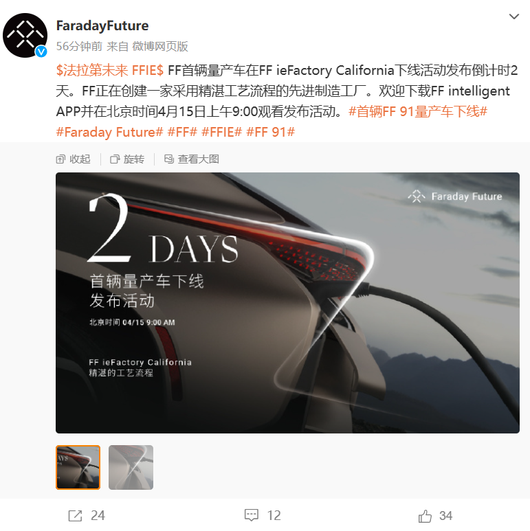
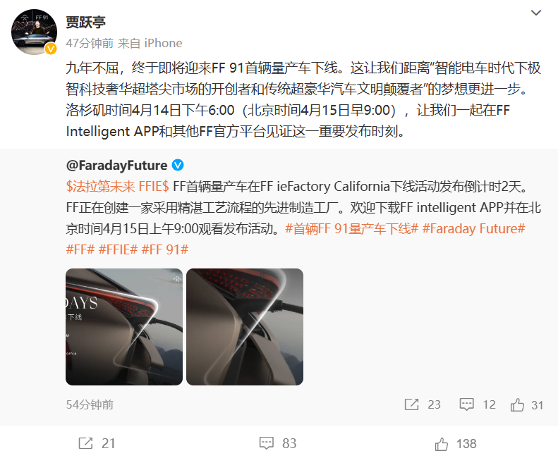
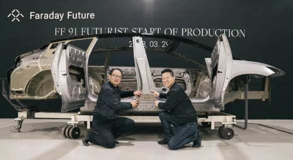
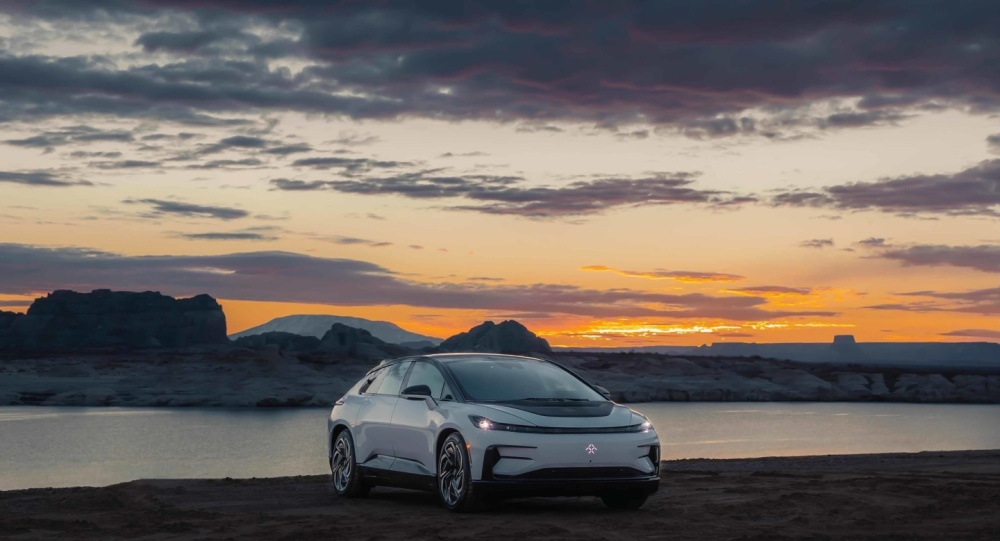

# 贾跃亭：“九年不屈”，法拉第未来FF 91首辆量产车4月15日下线

IT之家4月13日消息，法拉第未来Faraday Future今日宣布，FF 91首辆量产车在FF ieFactory
California下线活动发布倒计时2天，将于洛杉矶时间4月14日下午6:00（北京时间4月15日早 9:00）正式下线。

法拉第未来创始人、合伙人、首席产品及用户生态官贾跃亭随后表示，九年不屈，终于即将迎来FF
91首辆量产车下线。距离“智能电车时代下极智科技奢华超塔尖市场的开创者和传统超豪华汽车文明颠覆者”的梦想更进一步。

据IT之家此前报道，北京时间3月30日上午7:30，FF ieFactory California正式启动生产FF 91
Futurist，现场举行发布活动，FF全球CEO陈雪峰、FF创始人兼CPUO贾跃亭、FF全球产品执行高级副总裁Matthias
Aydt等进行演讲并展示FF ieFactory California工厂现场。这是Faraday Future首次正式宣布启动生产FF 91
Futurist。

法拉第未来官方此前表示，第一批量产FF 91 Futurist将于4月初下线，并在2023年4月底之前交付给客户。该公司还计划在4月26日举办FF 91
Futurist终极发布活动。

从FF官方App预订页面来看，FF 91系列可提供常规版FF 91、FF 91未来主义者版（FF 91 Futurist）、FF
91未来主义者联盟版三个款型。其中，FF 91未来主义者联盟版预订金额为5万元，目前已结束预订；FF 91未来主义者版预订金额为2万元；FF
91常规版暂未开启预订。

