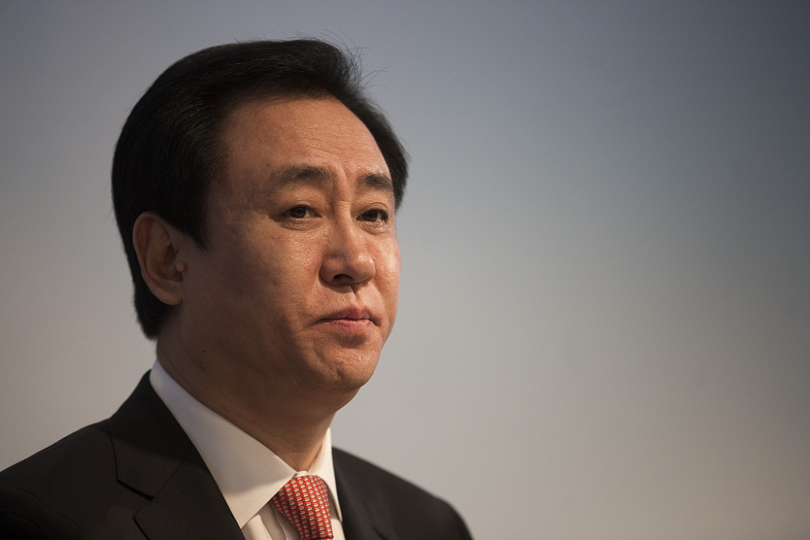
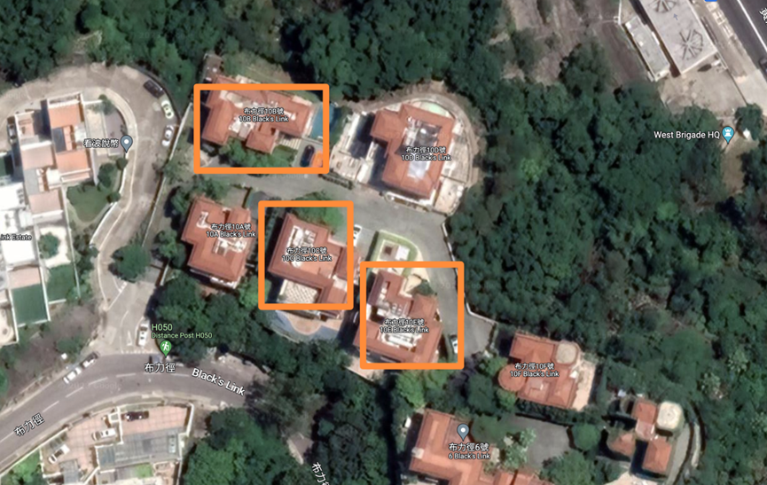
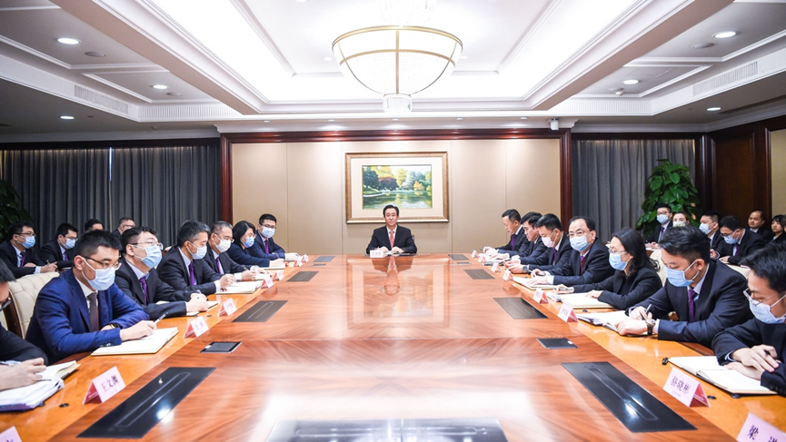
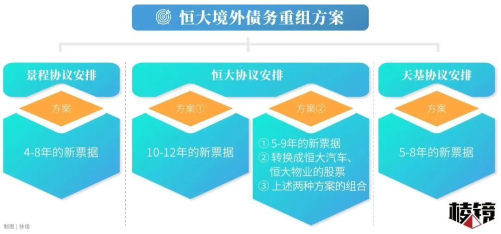
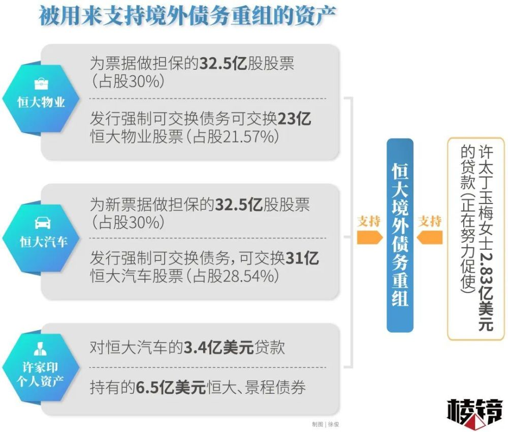

# “债王”许家印还钱记：他的诚意是10亿美元，包工头百万商票无处可兑

_来源：视觉中国_

作者 | 陈弗也

编辑 | 杨布丁

出品 | 棱镜·腾讯小满工作室

在香港聂高信山以南的山腰，有一段叫做“布力径”的盘山路。“布力”是19世纪末的一位香港总督，以此命名的这段道路也异常“显贵”，两旁聚集着多栋豪宅，主人们非富即贵，其中就包括中国恒大董事局主席许家印。

综合《财新》等多家媒体报道，许家印在此持有三栋别墅，分别为布力径10号的B座、C座和E座，总价值约30亿港币。过去两年多，恒大深陷债务危机的泥潭，作为许家印的私产，这3栋别墅未能幸免，如今或被抵押，或被拍卖。

这三栋别墅的处置，一度被视为许家印还钱的“诚意”。不过，对于有着近两万亿债务的恒大来说，这点钱只是杯水车薪。

_布力径10号三栋曾经属于许家印的别墅，来源：google地图_

3月22日，中国恒大（3333.HK）发布了境外债务重组方案，首次披露了其债务概况，一个公开的秘密也得到证实——恒大早已资不抵债：截至2021年底，恒大的总资产为16990亿人民币，但总负债达到18980亿元，股本总额为负1990亿元。

根据公开资料，恒大债务主要由明股实债、理财产品融资、商业承兑汇票、银行贷款、信托、境内信用债、担保、美元债等多个方面构成。

在此前，通过债转股、展期、新债换旧债、拍卖资产等方式，恒大解决了一些境内债务问题，此次重组的则是境外债务，以美元债为主。

“我们公司暴雷后，债权人也是追着要钱，刚开始，老板有点钱就会去还债，但后来发现这样不行，窟窿是堵不住的，要有序、有规划地还，否则我们就彻底没机会了。”一家知名企业的债务重组负责人曾向作者坦言。

而对于恒大这家高杠杆运作的房地产巨无霸来说，要偿还近两万亿负债，更像是一个“不可能的任务”。

**第一起警报后，苏宁先被拉下了水**

2020年9月，一封《恒大集团关于恳请支持重大资产重组项目的情况报告》（下称“《报告》”）在网上引爆，也使恒大的债务黑洞首次呈现在公众面前。

《报告》颇有“威胁”意味地写道：如果重组未能如期完成，恒大地产将会资金链断裂，进而引发金融系统性风险。不过，恒大集团很快便发布“严正声明”，声称相关文件和截图是凭空捏造，纯属诽谤，并已向公安机关报案。

这封《报告》的背后，是一笔1300亿元的“明股实债”接近违约。

2017年3月，为了完成与深深房的重组上市，恒大先后引入了1300亿元的战略投资。根据协议，如果无法完成重组，恒大需向投资者偿还1300亿元的本金，并支付137亿元的分红。

在这笔战略投资中，部分投资由许家印个人担保，投资者有权要求许家印回购股权。

“我们跟恒大有过合作，一起赚到过钱，当时的恒大如日中天，老许（指许家印）亲自来谈投资，派头很足，给出的条件也无法拒绝，我们想的是，即便重组不成功，也可以赚一笔利息。”一家战略投资者的负责人向作者回忆。

据该负责人介绍，之所以采用“明股实债”的方式，是因为恒大要降负债率。

最终，恒大与深深房的重组未能成功，这1300亿的借款，成为了恒大和许家印要解决的第一个债务难题。

许家印并未履行承诺来回购这些股权，相反，恒大提出了一个“债转股”的方案，大部分战略投资者选择了接受，不再要求回购，继续持有恒大的股权。而部分未接受“债转股”方案的战投者，在经过一系列谈判后，手中债务最后由深圳、广州的国资接盘。

为此，恒大举办了一场声势浩大的“补充协议签字仪式”，合影时，战投者和许家印一起举起了大拇指，营造了一股“有难同当”的氛围。

_来源：恒大地产_

这场债务危机的警报被解除，但一些投资者却被拖下了水。

受害最大的是苏宁易购，他们是最大的战略投资者，投资规模高达200亿，这笔未能收回的投资款成为了压垮这家零售巨头的最后一根稻草。没过多久，苏宁便开始出现了债务违约，随即爆发了一系列债务问题，股权被收购，创始人张近东最终从苏宁出局。

“不少苏宁高层在谈起许家印的时候，都会骂娘，他们认为，要不是恒大那两百亿不还，他们也不会有今天。”一位接近苏宁高层的人士向作者表示。

唯一一家从这场战投中“逃出生天”的是山东高速。与苏宁一样，山东高速也投资了200亿元，不同的是，他们没有接受“债转股”的方案，最终将股权转给了深圳市人才安居集团，并回笼了大部分的资金。

**许家“印”的钱，3折都兑不了**

在“战投危机”一年后，恒大的理财产品和商业承兑汇票开始暴雷。

早些年，恒大曾经发布过一款“超收宝”的理财产品，投资者主要是其管理层；2016年3月上线的恒大金服，则是一款针对大众的P2P平台，不过，伴随着P2P行业的整顿，恒大金服也逐步下线；2019年5月，恒大财富上线，又做起了销售理财产品的生意。

恒大理财产品的投资者既有其员工及其亲戚朋友，也有恒大地产的业主、供应商以及普通大众。

一位尚在恒大任职的中层管理者向作者表示，公司没出事之前，他每年都会拿出一部分工资和年终奖去投资理财产品，确实赚到过，基于对公司的信任，有时也会让亲戚朋友购买，但现在，手中有近百万元的理财无法兑付。

2021年9月，大量维权者聚集到深圳恒大总部，他们是理财产品投资者和商票的持有人。来自长沙的陈颖（化名）是恒大的一名业主，她向作者回忆，2021年6月，小区物业开始向业主们推荐恒大的理财产品，有的年化率高达14%，那个时候，她根本就不会想到这家世界500强企业会出事，很快投了30万进去。

她更没想到的是，仅仅3个月，恒大理财产品就暴雷了。

恒大财富总经理杜亮曾向投资者表示，恒大很难一下子拿出400亿来兑付到期的理财产品。400亿，这是一个不小的数字，但与恒大商票的规模相比，只是“小巫见大巫”。

在3月22日的最新债务重组方案中，恒大提到，截至2022年底，恒大在境内的商业承兑汇票逾期金额达到3263亿元。在境内的债务中，这是规模最大的一块。根据方案，他们的境内有息负债逾期金额为2084亿元，或有债务的逾期金额为1573亿元。

江苏一家建筑公司的负责人向作者介绍，他们每年与恒大有几个亿的生意，行情好的时候，恒大很少会拖欠工程款，但在2017年，他们发现恒大的商票开始多了起来，承接的不少项目都是用商票来支付。

“刚开始时，恒大的商票在圈子里还是硬通货，所以也没有太在意，只是觉得恒大正在高速发展，暂时出现了资金短缺的问题。”这位负责人回忆说。

当时，他还从市面上8折收购了一些商票，如果到期兑付了，就会有20个点的利润，但最终，几千万的商票砸在了手里。

“商票就是许家‘印’的钱！”刘杰（化名）是一位包工头，目前，他持有一百多万的恒大商票。每次做完一些工程后，上游厂商没现金支付，就会给他一些商票，按照票面价的8折来抵扣工程款。

一位持有两千多万恒大商票的人士则告诉作者，他手上的商票至今都无法兑付。他和一些商票持有人起诉了恒大，有人已经拿到了胜诉的判决书，但却发现找不到可以执行的资产。

“只要有东西就行，楼盘、商铺都可以，但是什么都没有。”这位持有人无奈地说，“打3折兑付，我们也可以接受。”

**展期、诉讼，“拖字诀”为上**

在恒大的债务体系中，有息负债是重要部分，根据3月22日的方案，截至2021年底，恒大的有息债务约5584亿人民币。

在3月28日的民生银行业绩发布会上，副行长石杰曾经指出，受困房企有息负债主要包括银行贷款、债券、信托、资管计划、代销基金、供应商垫资等，受困房企融资中影子银行占比较大，银行贷款不是最主要部分。

作为受困房企的典型，恒大有息负债的结构也是如此。

民生银行是恒大重要的合作银行，在2021年9月的一次投资者集体接待日上，民生银行行长郑万春曾表示，恒大在民生银行的贷款均为住宅类项目融资，以项目土地、在建工程、项目公司股权做抵押，当时，恒大的抵质押物整体足值有效。

根据公开报道，如今恒大的一些银行借款已被展期，涉及银行如民生银行、浙商银行、浦发银行等。

根据恒大相关财报，2020年底，银行对其授信总额为4829亿元，未使用的授信额度约为3002亿元，以此估算，其当时获得的银行贷款约为1827亿元。而在当年的财报中，他们“银行及其他借款”总额为6934亿元。

这也意味着，2020年的“其他借款”约为5107亿元。据财报解释，“其他借款”主要是指恒大旗下房地产项目开发公司与金融机构签订的信托计划。

一位专注于房地产债券的投资人士向作者分析，恒大一些地产项目的资金来源就是信托机构，这些信托机构通过发行信托产品向社会募资，然后以股权或债务的形式投入到这些地产项目，等项目完成后，信托机构获得相应收益。

“恒大危机爆发后，有的项目就开始停摆，有信托机构会起诉恒大，要求赔偿，也有信托机构会接手这些项目，自己来开发或者直接拍卖。”这位投资人士说。

据作者不完全统计，包括渤海银行、浦发银行、江西银行、徽商银行、贵州银行、天津信托、五矿信托、光大信托、民生信托、中航信托等银行或信托机构都选择起诉了恒大。

不过，和那些商票持有人一样，银行、信托能从诉讼中拿回钱的并不多。

恒大在3月22日的方案中写道，很多境内债权人已对他们采取了法律措施，其中，标的金额1亿元以上的未决“诉讼”案件超过789件，涉案总金额约3313亿元，另有43件未决“仲裁”案件，涉案总金额约322亿元。

在有息债务中，对于恒大来说，取得重大进展的是境内的公司债，方法依然是“拖字诀”。

根据3月22日的方案，自2022年以来，恒大对9支境内债券的本金或利息进行了展期，展期期限为6个月到1年不等，涉及本金约535亿元，涉及利息约37亿元。根据作者统计，这9支境内债券包括了恒大集团从2015年7月到2021年5月发行的所有债券。

不过，重组方案所说的内容并不准确，并非所有债券都得到了展期。

3月31日，恒大地产集团发布的有关债券公告中写道，“20恒大01”债券的展期方案并未获得债券持有人会议通过；“20恒大04”债券的利息被展期到2023年3月23日支付，但依然未能支付，恒大需要与债券持有人达成新的解决方案。

**只有“华尔街秃鹫”从恒大全身而退？**

“我从去年（指2021年）6月份开始就一直强调，任何时候都不能贱卖公司资产，不能依靠贱卖资产去还债务，否则资产贱卖完了也很难还清债务。”2022年2月，在恒大保交楼新年动员大会上，许家印曾做出这样的表态。

_2022年2月6日，恒大举行2022年保交楼新年开工动员大会，来源：恒大集团官网_

面对债权人的追债，恒大也一直都在艰难地“捂盘”，并谨慎地处理一些有价值的资产。

去年11月，恒大以75.4亿元的价格出售了深圳一地块，那里原计划被打造成恒大的超级总部基地。

这块土地的出售，彰显了恒大面对债务困境的无奈。不过，从交易价格上来看，恒大卖得不算亏，也践行了许家印“不贱卖”的指示。2017年12月，他们拿下这块地的代价是55.52亿元。

并非所有的资产都这么吃香。

位于香港湾仔的恒大中心，是香港的一栋标志性写字楼， 2015年，恒大斥资125亿港币从华人置地手中收购而来，创下了当时香港写字楼成交价格的记录。

_位于维多利亚港的恒大中心。来源：视觉中国_

此后，恒大以这栋楼做抵押，获得了76亿港元的贷款，贷款方是中信银行牵头的财团。

2021年下半年，这笔贷款逾期，恒大中心被迫出售。根据媒体报道，越秀地产曾经有意收购，交易价格为105亿港币，最终未能成交；此后，恒大将起拍价降至90亿港币，李嘉诚旗下的长实集团也曾有意，但也未能成功。

去年9月，写字楼被债权人接管，目前还在挂牌拍卖中，但价格很难超过7年前的收购价。

有着“华尔街秃鹫”之称的橡树资本，是少有一家通过“贱卖”恒大资产全身而退的债权方。作为全球最大的不良资产投资机构，当恒大深陷债务危机的时候，他们向恒大提供了约10亿美元的贷款。

去年11月，恒大发布公告，其位于香港元朗的一块未开发的土地被资产管理人出售，出售价格约6.4亿美元，恒大直接录得7.7亿美金亏损。

根据相关公告，出售该土地的资产管理人正是橡树资本。2021年1月，恒大以这块土地为抵押向橡树资本借了5.2亿美元的贷款。

此外，在橡树资本对恒大的贷款中，还有一个重要抵押物是位于江苏省启东市的海上威尼斯项目，如今，这个项目也已被橡树资本控制。

根据公开资料，橡树资本亚太区联席主席Raymond
Chan已于2021年10月9日成为项目公司的法定代表人，去年12月，法定代表人再次变更为Borrelli
Cosimo，后者是美国风险投资公司Kroll的董事总经理，Kroll曾经介入过多个中国企业的债务危机。

“债权人想要拍卖恒大的资产并不容易，恒大有的债务是信用债，没有抵押物，非信用债的抵押物也丰富多样，比如土地、股权、许老板个人担保等，这些抵押物有的被冻结，有的被多重起诉，橡树资本能够卖掉恒大的项目，并收回本金和利息，是极少数的个案。”上述专注于房地产债券的投资人士向作者分析。

此外，恒大的一些土地由于长期未开发，也被政府无偿收回。

去年11月，恒大发布公告，其武汉科技旅游城项目11宗土地被武汉市江夏区人民政府无偿收回，涉及净用地面积2071.3亩；更早之前，恒大的一个文旅项目“海口新世界美丽沙”被海口市政府无偿收回，涉及用地面积约3300亩。

根据作者的不完全统计，恒大在郑州、焦作、青岛、太原、成都、沧州等地均有土地被政府收回，涉及面积超过1万亩。

**90后的“清盘”申请加速方案出台？**

去年6月，一封“清盘呈请函”将沉寂多时的恒大债务危机再次推向热搜。

当时，一家名为Top Shine Global
Limited的公司向香港高等法院提交申请，要求对恒大进行清盘，该公司的实控人是90后潮汕小伙连浩民，根据公开报道，连浩民是有着“公海赌王”之称的连卓钊之子。

2021年3月，恒大为其旗下的“房车宝”引入战略投资，并承诺在一年内上市，如果未能如期上市，恒大将以1.15倍的价格回购投资者的股份。

最终，房车宝未能上市，恒大也未回购投资者的股份，作为投资者之一的连浩民便申请对恒大进行清盘。

这一“杀招”尚未对恒大带来实质性的伤害，但在一定程度上，也将恒大逼上了“绝路”——恒大不得不一次次向法院申请延期清盘聆讯，并加快制定境外债务重组方案。

“一般而言，香港法院在做出清盘命令前，须参考三项核心规定，在特殊情况下，也可以只需参考其中两项，这三项规定为：公司与香港是否有足够的联系，清盘令对清盘申请人是否有利，香港法院对公司资产的分配是否可以对一名或多名人士行使司法管辖权。”香港一位专注于公司债务重组的律师向作者分析。

在这位律师看来，这次清盘申请及时地提醒了债权人，不能无所事事地等待债务重组方案，他们需要评估清盘的后果，比如，清盘会导致恒大的其他贷款、债券出现一连串的交差违约，从而加剧债务重组的难度。

今年3月22日，恒大的境外债务重组方案终于出炉。

恒大用了201页的篇幅，简体中文、繁体中文、英文三种文字，详细解释了自己的重组方案。但简而言之，方案主要由“新债换旧债”、“债转股”两大方式组成。

恒大在境外主要有三大发债平台，分别为恒大公司、景程公司和天基公司，恒大也将债务分为“恒大协议安排”、“景程协议安排”和“天基协议安排”三大类，分别对应的是恒大、景程、天基三家公司的债权人。

景程、天基的解决方案相对简单，主要为新债换旧债，恒大的解决方案则要复杂很多，涉及金额也要大很多，它将债权人分为A、C两组。

A组涉及的债务为共计155亿美元的10支优先票据、1支180亿港币的可转换债券和1支不知额度的私募贷款；C组涉及的则为直接贷款、认沽期权、恒大对房车宝的回购义务、为境内债权人提供的担保等，涉及金额约124亿美元。

恒大将会对A组债权人全额偿债，对C组债权人，则会对债务重新评估后差额偿债，申请清盘的连浩民属于C组债权人。

对于这两组的债权人，恒大均提供了两个解决方案，一是接受恒大发行的10年-12年的新票据，这些票据的年利率为2%-4%不等；一是接受恒大发行的5-9年的新票据，这些票据可以置换成恒大物业、恒大汽车的股权。

在方案中，恒大也介绍了清盘的后果：境外的无担保债权人预估仅能回收约97.29亿人民币，回收率只在2.05%-9.34%之间。

同时，恒大也强调，如果重组生效，需要驳回(或撤回)可能针对恒大提出的任何清盘呈请。

**老许的诚意，只有10亿美元**

作为恒大集团主席，许家印在重组方案中的付出是债权人关注的一个焦点。

2017年，许家印来到了他个人的高光时刻，以391亿美元的身价成为了中国新首富，其财富有不少来自上市公司的分红。根据作者统计，自2009年恒大上市以来，许家印夫妇共获得了530亿人民币的分红。

早在2021年10月，彭博社报道称，监管部门要求许家印用个人财富来缓解恒大的债务。一年后，其报道继续称，境外债权人要求许家印向恒大注资20亿美元来支持重组。

过去两年多，关于许家印出售豪宅、艺术品、私人飞机、游艇等个人资产的新闻屡见不鲜，这一度也被债权人视为许家印还钱的诚意。

但是，这份最新的重组方案还是让不少人感到失望，许家印并未拿出太多的个人资产。

根据作者统计，许家印用于支持重组的个人资产主要有两部分，一是他对恒大汽车3.4亿美元的贷款，一是他持有的总额为6.5亿美元的恒大债券、景程债券。

“这些是恒大对他的债务，在其他债权人没有拿到抵偿的情况，老许肯定不能自己先拿，他放弃这些债务来支持重组是意料之内，他只有额外注入资金，才能显得有诚意，但是他并没有这样做。”上述专注于房地产债券的投资人士向作者分析。

不过，恒大也表示，他们会尽最大努力促使许家印太太丁玉梅女士向恒大汽车提供2.8亿美元贷款用来支持重组。

根据方案，恒大应该在不迟于3月31日与债权人特别小组达成协议，但直到4月3日深夜，方案才得到债权人特别小组成员的认可，这些成员持有恒大票据未偿还本金的20%和景程票据未偿还本金的35%。

根据香港法律，重组方案需要得到持有75%债务的债权人同意，法院才会批准生效。

在香港市场研究公司Bondsuperart分析师陈家朗看来，想让其他债权人接受这个方案，恒大需要提出具有吸引力的条件，这些条件必须要考虑到各个选项的预期损失和实际回收价值。

根据4月3日的公告，为了获得更多债权人的同意，恒大将会为4月27日前签署协议的债权人提供一笔同意费，金额为未偿还本金的0.25%。

不过，这笔同意费不会用现金支付，而是以实物支付。

“如果这个方案最终通过，未来几年，债权人将会和恒大捆绑在同一条船上，只有恒大不倒，他们的债务就不会变成坏债，在财务报表上依然会是资产。”上述专注于房地产债券的投资人士向作者分析，“恒大境外债的债权人其实很多都是恒大的老朋友，跟着投了很多年，之前也赚过不少。”

陈嘉朗也向作者介绍，持有恒大美元债最多的是基金公司，也有不少专门低价收购违约债券并积极参与重组谈判的对冲基金。

“恒大是发行美元债最多的内地房企，一度被称为‘债王’，也以高收益率而闻名，也会有一些私人银行或个人去投资他们，但他们的经验可能不足。”陈家朗分析说。

此外，根据公开资料，恒大的一些高管也是投资人，比如许家印、夏海钧都曾持有大量的恒大美元债。

但是，要想与恒大“同生共死”并不容易。恒大在重组方案中写道，未来三年，为保证复工复产有序进行，恒大预计需要额外的2500亿-3000亿元人民币的融资。从第4年开始，如果恒大可以恢复正常运营，其现金流才会逐步增加。

此外，在拯救恒大的同时，也需要拯救恒大汽车。根据公告，恒大汽车需要寻求290亿元的融资，否则就会有停产风险。但是，即便获得了这笔融资，未来三年，他们依然会亏损50亿-70亿元。

唯一不需要新融资的是恒大物业，如果恒大地产持续运营，未来三年，恒大物业的现金流可以达到130亿元-170亿元。但对于负债两万亿的恒大来说，这些显然难解燃眉之急。

