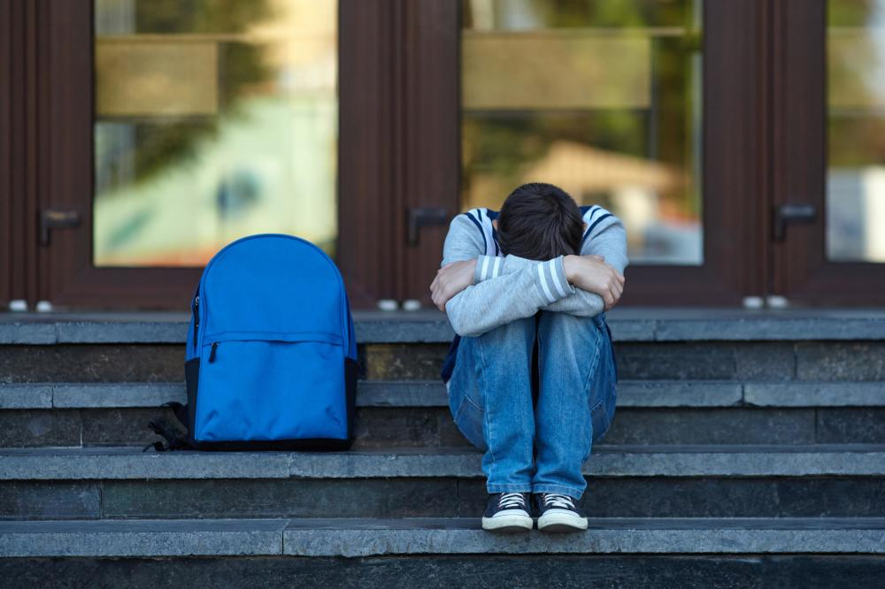

# “差生”，不配参加中考吗

近日，安徽省合肥市教育局发布的《关于禁止将初中未毕业学生分流到中职学校的通知》引发热议。

通知要求，全市所有初中学校要保障每一名学生全面完成九年义务教育。任何学校、教师特别是班主任不得以任何理由、通过任何途径动员、引导、介绍初中未毕业学生到中职学校（含技工学校、市外中职学校）就读。任何中专学校不得接收初三未毕业学生到校登记、试读、就读。

长期以来，因为多种原因，多地学校都存在引导未毕业初中生到中专学校就读的情况。

面对学校的“劝导”，家长很是无奈，明知孩子成绩不好，但又不甘心。

**普职分离**

初中是义务教育的最后阶段，中考过后，学生们就面临着普职分离。在不少省份，只有将近一半的学生可以进入普通高中学习，剩下的一半则进入职高、技校等就读。

而一些地方的学校或老师，则会在中考到来前，提前劝导一些学生参加职校春招，放弃中考。临近毕业季，这一现象更加突出。

近日，合肥市教育局专门就此现象发布了一则通知。其中提到，近期，该市有多名初三学生或家长反映班主任引导未毕业初中生到中专学校就读，引发家长不满，给该市义务教育和中职教育的招生和教学秩序造成不良影响。

通知要求，全市所有初中学校要保障每一名学生全面完成九年义务教育，禁止将初中未毕业学生分流到中职学校。任何学校、教师特别是班主任不得以任何理由、通过任何途径动员、引导、介绍初中未毕业学生到中职学校（含技工学校、市外中职学校）就读。任何中专学校不得接收初三未毕业学生到校登记、试读、就读。

合肥市教育局将通过接待来访、接听电话投诉、收集线上投诉等方式进行检查，如发现违反本通知要求的行为，将对负有责任的班主任、教师按违反师德行为予以处理；对学校予以通报、取消相应评先推优资格并与民办学校年检挂钩；在市政府对县（市）区政府目标管理绩效考核中对所属县（市）区予以扣分处理。

中国新闻周刊注意到，合肥市教育局曾于2022年12月下发通知，明确从2023年开始，全市中专学校原则上不再招收春季全日制学生，仅允许未完成上一年秋季招生计划的中专学校招收非义务教育在读学生，并由市教育局对新生逐人审核录取。

除了合肥，也有一些地方作出了类似的规定。早在2019年，广州市教委就在高中阶段学校招生考试报名工作的相关通知中要求，不得拒绝、阻止或变相阻止任何符合报名条件的考生报名中考。2023年该通知提到，各区、各学校要树立正确的教育质量观，依法落实和保障初三学生参加中考权利，不得干扰、限制学生报名；任何学校和个人不得以任何理由劝说学生放弃中考、中途退学、提前“分流”或转校。

上述通知还强调，未参加中考的考生，不能参加普通高中、中职三二分段及省级以上重点特色专业计划和中职学校的统一投档录取。

2019年，网传山东菏泽东明县100多名学生疑成绩差被强迫不能参加中考。山东省教育厅发布紧急通知，要求各地要从中吸取教训，严禁强制初三学生分流和剥夺学生中考权利。

该通知强调，严禁强制分流学生。通过在普通初中开设职业技术课程、组织普通初中学生到当地中等职业学校(含技工学校)选修职业教育专业课程等多种方式，确保初中学生完成义务教育，为中职招生打下基础，提供多种成才渠道，使他们升学有基础、就业有能力，有针对性地防止初中生辍学。学生分流必须坚持自愿原则，不得违背学生意愿强制分流。通知还要求，要全面开展违规宣传违规招生排查。

**为何要“劝退”**

初三下学期一开始，山东某地级市的学生小玲（化名）就被班主任叫去谈话。“我成绩一直在中上游，因为初三上学期动了一个手术，导致落下了很多课程，也没有参加考试”。

“他说给我找了个挺好的学校，军事化管理，还让我去了那里好好学，以我的成绩在那里就是前几名”，小玲回家征求了母亲的意见，最终便去了她现在所在的学校，没有拿到初中毕业证。但学校的情况却和班主任最初承诺的有所不同，学习氛围较差，所谓的军事化管理就是一天三集合和穿“迷彩服”。

虽然所在班级也能参加单考单招和春季高考，但因觉得“被骗”了，目前就读高一的小玲还在调整自己的心里预期。

通常，学校让学生签署的自愿放弃中考申请书有两种，一种仅声明放弃参加中考，另一种则会表示申请提前报读中等职业类学校，并承诺不反悔。小玲签下的申请书便属于后者。

学校或老师为何要劝导学生提前加入分流？“实行职校春招政策，主要是想让职业学校留住、招到一些比较好的学生，因为当时的职业学校普遍存在招不满的问题，后来一些地方政府也出台了政策支持这一做法。三十多年过去了，经历了各种各样的业态，也存在各种各样的问题。”中国教育科学研究院研究员储朝晖对中国新闻周刊表示。

华北地区一名初中教师向中国新闻周刊介绍，早两年，其学校也有老师在中考前介绍学生到中职学校，并收取“人头费”，一般是班主任负责。

“两年前，一个班四五十人有好几个会去上职校”，她表示，因当地政策调整，报考职校也需要有中考分数，一些中专分了就业班和升学班，好的专业分数要求较高。

在21世纪教育研究院院长熊丙奇看来，出现这样的违规办学行为，主要有两方面原因。

一是学校把成绩差的学生排除在参加中考之外，这样可以提高普高率；二是部分学校间存在招生合作协议，这样可以“帮助”当地的中职学校完成招生任务。

东莞某中学教师晓琪（化名）向中国新闻周刊介绍，在其学校，一些老师会劝导外市户籍，成绩也不好的学生先报考职校。

“因为东莞的外市户籍生比本市的学生的录取分要高十几分甚至几十分，不先报考职中，他们在市里基本就没书读了”，晓琪表示，该校老师也会劝本市成绩差的学生先报考职中，不然等中考出分，好的专业也没得选了。

熊丙奇认为，进一步分析，则会发现，这背后存在制度设计漏洞。

其一，中职的自主招生，可以招初中未毕业的学生，没有纳入中考统一报名、招生体系。按理，中职也属于高中阶段学校，应该规定中职招生纳入整体中考报名体系。也就是说，所有中职招收的学生必须符合初中毕业的基本条件，且应该在统一的中考报名平台报名。

“如此的话，中职学校提前自主招生，也是会作为初中学校的毕业生对待。就是计算升学率，也得把这部分学生纳入。”熊丙奇表示。

熊丙奇指出，另一方面的原因，是对初中学校的办学评价还存在升学率评价。2020年10月，中共中央、国务院印发《深化新时代教育评价改革总体方案》，明确坚决纠正片面追求升学率倾向。各级党委和政府要坚持正确政绩观，不得下达升学指标或以中高考升学率考核下一级党委和政府、教育部门、学校和教师，不得将升学率与学校工程项目、经费分配、评优评先等挂钩，不得通过任何形式以中高考成绩为标准奖励教师和学生。

“从现实看，一些地方还存在以升学率评价学校办学的问题。教师也就有动员学生先去上中职的动力。”熊丙奇认为。

晓琪也表示，学校肯定是有升学率压力的，“现在不少学校是集团化办学，学校的升学率不行，就可能会被合并到其他学校的集团”。

**如何抉择？**

面对学校的“劝导”，有些家长无奈接受了现实。“被劝退的都是达不到普高线的，参加也是考不上，不要妄想几个月就能有翻天覆地的改变”，有网友表示。

但有的家长仍不甘心，放弃中考，就意味着孩子不能就读公办中学。哪怕上一个不那么好的普通高中，也有机会在高考时实现逆袭。

“十三五”期间，我国实施了高中阶段教育全面普及攻坚计划。教育部数据显示，截至2021年，全国高中阶段教育毛入学率达91.4%，比2012年提高6.4个百分点。

在储朝晖看来，过去确实有一部分孩子上不了高中，但现在，几乎所有孩子都能上高中。很多家长期望，孩子尽可能上普通高中，而不是职业高中，“从内心里，家长总是希望孩子不管怎么样去考一考”。

“能够通过中考进入普通高中，从现在的情况来看，学生高考的成绩整体上还是比职业高中要高，尽管一些职校也有对口升学的政策，但也主要是面向高职学院。”储朝晖表示。

在熊丙奇看来，学生根据自身情况选择中职，与教师不让其参加中考，是两码事，“这种做法会进一步加深学生和家长对中职的偏见，刺激分流焦虑，认为中职是低人一等的教育。”

“根据《义务教育法》的规定，强制学生先进入职业高中，自身在一定程度上有违法的嫌疑”，储朝晖认为，是否报名参加中考，应完全由学生来做主，其他机构没有权力剥夺学生的权利。

熊丙奇分析称，推迟或者取消普职分流，在当前均不现实。但化解普职分流焦虑，必须在提高职业教育质量、提高职业教育地位上做文章。

“禁止违规的普职分流行为，除了需要严查外，教育部门也不妨建立普高、中职统一报名、招生平台，自主选择中职的学生，也要纳入中考统一报名，不要把中职自主招生排斥在中考之外。”熊丙奇表示，另外，必须扭转地方政府的教育政绩观，不能片面以中考升学率评价初中学校办学以及教师的教育教学。

作者：陈威敬

