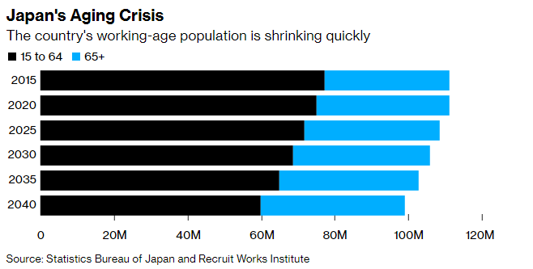
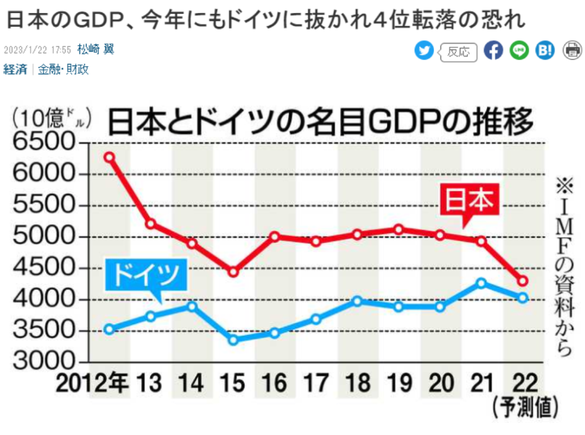

# “生孩子太贵了”日本人口去年自然减少73万，社保系统恐处崩溃边缘

每经记者：蔡鼎 每经编辑：高涵

日本政府当地时间周三（4月12日）公布的数据显示，由于死亡率的上升和生育率的持续下降，
**日本去年人口自然减少73.1万人，为1950年有记录以来的最大降幅，且为连续第12年出现人口下滑。**

不过，由于移民到日本的人口增加了17.5万人，因此去年日本的人口净减少了55.6万人。截至2022年年底，日本的人口为1.2449亿。

人口问题专家、美国威斯康辛麦迪逊大学高级科学家易富贤在接受《每日经济新闻》记者采访时指出，随着日本年龄中位数的增长，即老龄化问题的严重化，这将进一步拖累日本GDP和人均GDP。

日本人口连续12年下降，跌破1.25亿人

据日本媒体报道，4月12日，日本总务省发布报告称，截至2022年10月1日，日本人口总数跌破1.25亿人，连续12年下降。

日本共同社报道中称，不断减少的人口表明，日本迫切需要建立一种社会制度，以应对出生率的下降和人口老龄化的双重挑战。

日本内阁官房长官松野博一在周三的新闻发布会上表示，“日本必须采取坚定的措施解决出生率下降的问题，这是日本人口下降的一个主要因素，也是需要解决的首要问题之一。”

日本首相顾问森雅子表示，现在日本人口数量不是逐步下滑，而是直线下降，这表明现在出生的儿童将被扔进一个“扭曲、萎缩且失去运作能力的社会”。森雅子称，
**如果不采取任何措施，日本社会保障系统将崩溃，工业、经济实力将下降。**

按年龄结构来划分，
**日本去年劳动人口（15岁~64岁）为7420.8万人，比2021年减少29.6万人，占整体人口的比例为59.4%，与2021年的历史最低比例持平；去年，日本14岁及以下人口占总人口的11.6%，创历史新低，与此同时，65岁及以上人口占比29%，为历史新高。**

_图片来源：彭博社_

日本厚生劳动省去年报告称， **2022年日本的出生人口总数降至799728人，为厚生劳动省自1899年开始有数据记录以来的最低水平**
，而去年日本的死亡人数则上升8.9%至158万人。

周三公布的人口数据显示，人口减少的趋势在全日本各地都能见到——根据日本总务省的数据，截至去年10月的一年里，除东京外，日本47个县的常住居民人数都出现了下降。更可怕的是，
**日本中部的一个村庄25年来只记录了一个新生儿** 。

CNN报道中称，日本是全球出生率最低的国家之一，也是预期寿命最高的国家之一。日本政府的数据显示，2022年，日本每1500人中便有1人的年龄在100岁或以上。这意味着日本老年人口正在不断膨胀，且由于没有足够的年轻人来填补空缺，因此劳动力正在不断萎缩，这也构成了一场几十年的人口危机。

“生孩子实在太贵了”，人口问题恐危及日本GDP增长

日本人口数量形势如此严峻，以至于日本首相岸田文雄今年1月警告国会议员称，由于出生率不断下降，日本“处于无法维持社会功能的边缘。”

岸田文雄还补充称，育儿方面的支持是政府的“最重要政策”，解决这个问题“不能再等了”。他承诺在未来五年内投入约1万亿日元（约76亿美元）用于培训工人从事更多高技能的工作。此外，岸田文雄已经在想方设法解决明年预期中的卡车司机严重短缺的问题。

一些研究人员和气候科学家认为，随着气候危机的恶化，人口减少可能有利于生态系统的发展，并降低碳排放。然而，这也给日本这样的国家带来了麻烦，因为用于养老金和医疗的劳动力越来越少，照顾老年人的人也越来越少。

今年4月，日本从2023财年预算中拨出4.8万亿日元（约360亿美元）成立了新的儿童和家庭机构，重点关注建立更多托育中心等支持父母的措施，并提供青少年咨询等服务。《每日经济新闻》记者注意到，以前类似的举措通常是由地方政府实施的，迄今为止都未能扭转出生率下降的趋势。

此外，繁忙的城市生活方式和长时间的工作让一些日本人几乎没有时间来组建家庭，而不断上涨的生活成本意味着，对许多年轻人来说，生孩子实在太贵了。

根据金融机构Jeffreies的研究，2022年， **日本被列为全球抚养孩子成本最高的国家之一。** 此外，
**日本的经济自20世纪90年代初以来就停滞不前，这意味着令人沮丧的低工资和很少的向上流动性。**

此外，去年日本公民数量的下降也凸显了政府在移民问题上极端保守的观点。根据日本政府的数据，2021年，外国移民仅占日本人口的2.2%，而美国的这一比例为13.6%。

日本的人口问题，也已经危及到了该国的GDP——日本《产经新闻》今年年初曾报道称，日本GDP可能在今年（2023年）被德国赶超，跌至第四位。人口问题专家、美国威斯康辛麦迪逊大学高级科学家易富贤在接受《每日经济新闻》记者采访时指出，随着日本年龄中位数的增长，即老龄化问题的严重化，这将进一步拖累日本的GDP和人均GDP的增长。

_《产经新闻》报道截图_

他进一步指出，“1950年，日本人的年龄中位数是21岁，而美国是29岁。正如人们所预期的那样，
**日本随后实现了多年的更高速经济增长。然而日本主要年龄段（15~59岁）的劳动力数量自1994年开始下降**
，而美国的工作年龄人口则预计到2048年才减少。”

“到1992年时日本的年龄中位数比美国高5.5岁，其老年人口抚养比开始超过美国。不出所料，此后日本GDP增长一直低于美国。日本的人均GDP从1960年相当于美国的16%上升到了1995年的154%，
**但这个数字到2022年已经下降到46%，且未来可能会进一步下降到35%以下。** ”易富贤对《每日经济新闻》记者补充道。

