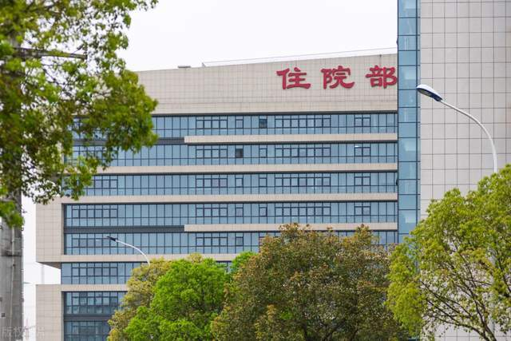

# 全球医院250强公布，中国大陆仅4家上榜，我国医院究竟强不强？

近三个月，国际两大知名医院排行榜单陆续放榜。

当怀着期待打开排行榜，渴求从中找寻我国医院的影子时，却发现需要手拿放大镜，才能找到——

2023年3月，美国时政杂志《新闻周刊(Newsweek)》联合数据公司Statista发布的“2023年度全球最佳医院”
排名中，并无中国大陆地区医院的踪影；

而1月，全球品牌价值评估机构Brand Finance发布的“全球最具价值医院品牌排行榜报告”榜单显示，
**仅有4家中国公立医院跻身前250名：上海交通大学医学院附属仁济医院（下称“仁济医院”），北京大学第三医院（下称“北医三院”），河北医科大学第三医院以及浙江大学第一附属医院（下称“浙大一附院”）**
。

“中国的高校、企业早已进入国际一流大学的评价体系，唯独医院慢了一步。”一位受访专家如此叹道。

但这份结果又让人有些“不服”，因为无论以何种角度审视，这四家算得上“优等生”的医院，显然不全是国人普遍认知里的中国最强公立医院代表。

在2021年的全国公立医院绩效考核（下称“国考”）中，浙大一附院排名第5，北医三院排名第6，仁济医院排名第28；而河北医科大学第三医院并未对外公布其“国考”成绩，标定其水平的唯一标记是在“复旦排行榜”的骨科专科排名榜中，这家又名为河北省骨科医院的机构，仅排名第7。

**纵观国内当下最权威的公立医院评价体系和排行榜——“国考”、复旦排行榜、艾力彼排行榜——最新发布的2021年情况，“公立医院尖子生”应当是：北京协和医院，复旦大学附属中山医院，四川大学华西医院，复旦大学附属华山医院，上海交通大学医学院附属瑞金医院……**

在与多位业内专家交流后八点健闻发现，上述“尖子生”之所以无一上榜，既与国内公立医院财务公开情况有关，也折射出不同体制国家对于医疗与医院的差异化定位，不同导向的评价体系，催生出了医院间不同的发展方向。

对于普通人而言，一个排行榜的意义不在于它能创造多少你追我赶的竞争感，或者提供多少业务竞争上的游戏感，而在于它多大程度上反映真实的发展现状。

在全球排行榜面前，去反复问：中国评价体系内公认的“好医院”，为什么在全球排名里没上榜、或没得好名次？这个问题背后是一种更为根源的好奇——在中国公立医院狂飙发展的近20年里，在一次次从千万级到百亿级的规模跨越后，国人当下究竟享有着什么样医疗资源。

上榜寥寥，财务数据不公开或是第一大变量

一家医院在“国考”中获得A++等级，这意味着它至少在国内赫赫有名，科研和学科建设均代表着中国公立医院的第一梯队水平。

对比Brand
Finance的“全球最有名气学术医学中心”榜单和2021年“国考”排行，在被披露的13家获得A++等级的医院中，只有北医三院和浙大一附院入选国际榜单。

其中，北医三院和仁济医院以相等的63.9分，位居94、93名，而浙大一附院和河北医科大学第三医院一起，仅入围了全球250强。

在排行榜上排名前列的，仍是那些早已闻名世界的顶级医院：梅奥诊所（Mayo Clinic），麻省总医院（Massachusetts General
Hospital），斯坦福大学医疗中心 (Stanford University Medical Center) ……

为什么中国医院上榜情况，和国内对中国医院实力的认知，差异如此之大？

其中一个因素是数据的可及性。当前国际知名医院排行榜单，均需要主动收集数据，因此依赖于医院数据公开的程度，而非医院主动上报。而在3、4年前，有关人士曾多次表示，公立医院不得参加由境外第三方组织的任何评价工作，更不得以此作为业绩加以宣传。

Brand
Finance中国区总裁陈忆登告诉八点健闻：“全球最具价值医院品牌排行榜报告’是今年首度发布的。虽然客观来说，上榜医院未必是当前全球范围内医院品牌价值最高的，但一定从国际第三方数据库中合法获取符合ISO10668和ISO20671标准的重要数据时，数据的数量和质量都较充沛的，尤其是财务数据。”

换言之，那些未上榜但品牌力很强的医院，可能是今年未能被成功抓取可用于计算的数据。

“如果无法从第三方的数据库中抓取到某家医院的各类数据，就无法对其进行客观、严谨的评估。”陈忆登表示，只有在各类数据包括财务数据被合法获取的情况下，才能够进行品牌价值的评估，这是全球公认的国际化标准委员会ISO对品牌估值的基本要求。

在过去，我国公立医院不需要公开财务数据，不像上市公司那般财务状况公开透明。

直到2015年底，国家财政部、国家卫生计生委、国家中医药局三大部门联合发布《关于加强公立医院财务和预算管理的指导意见》，其中明确要求，公立医院要建立财务信息公开制度，强化社会监督，提高医院财务运行透明度；2018年底，财务信息公开制度在全国所有公立医院和所有地区推开。

2021年，国务院办公厅下发《关于推动公立医院高质量发展的意见》，其中明确要求加强全面预算管理，定期公开医院相关财务信息，主动接受社会监督。

但即使如此，公立医院主动将“万贯家产”摆上台面、受公众监督的做法，在现实中也寥寥无几。

在国际医院排行榜面前，因公开数据的缺失，或许一时无法得出“中国医院强弱与否”的答案；但至少，数据获取造成的遗漏，某种程度上反映出中国医院数据不够透明的现实。

一位医管专家解释，与保险强势、医院需要适当披露内部数据以获取保险方信任度的美国不同，在目前国内的医疗体系中，院方并不会选择主动公开数据，这导致一些医疗机构内部的业务数据不可取得。

在Brand Finance发布的排行榜之外，美国时政杂志《新闻周刊(Newsweek)》联合数据公司Statista发布的“2023年度全球最佳医院”
，也尚未将中国大陆纳入排行范围，有观点认为，这一排行榜尚未纳入中国地区医院，大概率仍是受到数据获取和评价体系因素影响。

全球标尺之下，中国医院有多强？中国医疗强了吗？

即使如前文所述，中国医院没有跻身全球排行榜，但若想知道“在全球，中国医疗的能力处在是什么样的水平”，其实还有另一个解读维度。

根据国际知名期刊《柳叶刀》对不同国家医疗质量和医疗服务所做的可及性排名显示，我国从2015年的第60位，上升到2016年的48位，一年间上升了12位。

这是一个模糊的锚点。但至少证明，中国医疗水平正在快速发展的阶段。

但转到单体医院，评估的维度就复杂了。

庄一强指出，数据有四个属性：科学性，可获得性，准确性以及可持续性。在全球各个国家/地区数据开放程度不同的情况下，全球性的排行榜很难做。

“《美国新闻与世界报道》的‘美国最佳医院排行榜’排了30多年，也只包含美国医院，这说明他们不一定有信心拿到美国以外的数据。”

数据还涉及到可比性的问题。

全球医学专家委员会公开表示，“2023年度全球最佳医院”
评价体系所给出的分数仅在同一国家/地区的医院之间具有可比性，因为每个国家/地区的患者体验和医疗数据评估方式不同，数据不统一，因而无法进行跨国比较。

在数据问题之外，另有观点认为，在经济发展的不同阶段，社会对医院的期望和定义不同，对“好医院”的定义也不同。

清华大学医院管理研究院的教授钱庆文曾撰文指出：以美国为代表的部分国家将医疗视作“报酬”，“好医院”常常指的是那些可以提供“最好的”医疗技术的医院；而以瑞典、中国为代表的国家则把医疗视为“人权”，强调医院的公益性、普惠性，让更多的人可以享受基本的医疗服务。

基于对经济发展阶段差异的考虑，庄一强认为，医疗或许不需要做全球的排名。

“中国医院与英美医院的功能定位不同、运行环境不同，是不是本身就没有可比性？”一位医院管理方面的研究人员甚至表示，在美国，医疗被视为一个产业发展，拉动了GDP接近20%；在中国和整个欧洲大陆，医疗是一个福利性行业。

“而且在我国，公立医院以财政拨款和基本医疗保障的支持为主，二者或在定位上就有区别。”

“排名重要，但排名的标准和相关指标所针对的功能定位，也同样非常重要。”

多位受访专家亦认为，受到数据获取、经济发展阶段差异导致医疗评价维度不同等因素影响，从这个维度讲，当下还没有一个可以被视作权威的全球性医院排行榜。

但审视当前我国医院的发展阶段，其实一定程度上，国内外对医院的评价方向其实正在走向一致——中国公立医院发展的初级阶段正过去，中国医院已经从盲目扩张，奋力转向提质增效。

惠宏医疗管理集团首席专家傅天明教授表示，从2011年医院评审指标修正开始，中国三级医院评审中“80%以上都是质量相关的指标”，而之前强调的床位面积、人床比等已经占比较低。“从重规模、重硬件，转向重内涵、重软件。”

另一位医管专家亦表示，国内外医院评价的区别只在于评价方的目标以及评价方能够获取怎样的数据。“病人安全和医疗结果良好是全人类的一致追求。”

也有学者正在探索一套全球医院共用的评价体系。

北京协和医学院卫生健康政策管理学院医院领导力与管理学系创始系主任刘庭芳告诉八点健闻，为了让中国的医院管理和国际接轨、进入国际医院排行榜，北京协和医学院从2022年开始研究“中国式国际一流医院评价指标体系”。

他表示，作为一个世界大国，中国要创建国际一流的标准，既要结合国外的评价指标，也要结合本国国情。“中国医院不能单纯按照国外的评价指标发展。”

目前，他们已经研究出了一套标准，其中一级指标3条，二级指标29条，三级指标128条，并得到了医院、专家的支持。接下来，他们将在六家三级医院中验证这套标准，通过实践不断调整，待指标确定后正式进院，最终将达标的医院推荐给全球医学专家委员会（Global
Board of Medical Experts，由Statista设立，用于支持“全球最佳医院榜单”），参与国际排行。

刘庭芳表示，该课题即将在今年10月结题，也已经与全球医学专家委员会取得联系。他认为，或许两三年之后，就会有中国医院进入全球最佳医院榜单。

国内好医院的标尺：复旦、医科院排行榜、“国考”

在刘庭芳看来，国内有三种医疗机构评价工具：公立医院评审，公立医院绩效考核，以及民间的医院排行榜。

这三者之间有本质的不同：由国家制定标准、卫健主管部门评审的公立医院评审是评价医疗机构最基本的工具，更加全面综合，除了数据结果，现场评价至少要占到三分之一；相对的，公立医院绩效考核更加结果导向，以数据考核为主，同时评价频率更高。

“这两者是互补关系。公立医院四年一评审，期间，一年一度的绩效考核维持着评价链条，这既是补充，也是指挥棒的强化，让医院保持运转、改善的惯性。”

不止一位受访专家认为，医院无法通过由民间机构推动的医院排行榜了解自身存在的问题。

数据依然是这里的关键问题。

基于对中国医院数据可获得性差的判断，一位医管专家认为，在我国，科学的第三方排行榜一定不能谈论过大的事情，“因为你不可能取得足够全面的数据，除非政府下场。”他进一步强调，必须用科学方法解决明确、限定的研究问题，如医科院和复旦排行榜就是更专注于学科建设、科研技术等方面。

在需要上报的所有数据中，至少有50%是医院不愿对外披露的。

“例如经营状况，甚至临床科主任、副主任数量，都是机密数据。”一位民营医院从业者告诉八点健闻，“但是领导会看重这个，因为不希望自己的竞争对手排在前面。”

基于对机构权威性和数据获取的准确性、全面性的判断，多位专家和医疗从业者一致认为，“国考”是目前最客观的医院评价体系。除了数据全面翔实、公信力强，有医院管理者表示，其指标体系涵盖了医院运行的各个方面，贴合实际工作。

一位三甲医院院长表示，通过国考排行，能够看出自家医院在全国的位置，有利于明确医院发展的阶段和目标，并参考各指标进行发展规划。

排除“国考”，纵观目前国内三大医院排行榜，可以总结出两种导向：医院的学科建设和科研能力提升，以及医院综合能力提升。

其中，复旦大学的“中国最佳医院排行榜”和中国医学科学院的“中国医院科技量值与医学院校科技量值排行榜”关注医院的科研水平和学科建设，而广州艾力彼医院管理研究中心的“内地医院竞争力榜单”用200多个指标关注医院的综合发展。

研究方法也有所区别。复旦大学医院管理研究所有机结合了量化和质性研究方法，以20%科研学术得分和80%专科声誉得分构成评价体系。

中国医学科学院和香港艾力彼医院管理研究中心以量化研究方法为主，主要以分析医学专业论文“H”指数（数量和影响力）为评价指标。

张晓艺丨撰稿

李 琳丨责编

**本文首发于微信公众号「八点健闻」，未经授权不得转载**

