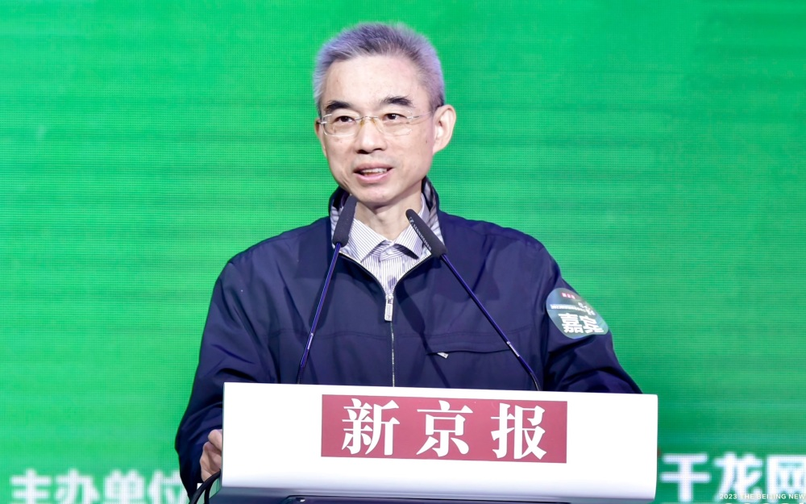

# 吴尊友：从世卫数据看，全球新冠大流行已经趋于结束

_▲4月13日，全国政协委员、中国疾病预防控制中心流行病学首席专家吴尊友在2023新京智库春季峰会上做演讲。_

新京报讯（记者肖隆平）4月13日，在新京报社、千龙网主办，新京智库、贝壳财经承办的“信心与繁荣——2023新京智库春季峰会”主题论坛“提升医疗卫生品质，更好保障生命健康”上，全国政协委员、中国疾病预防控制中心流行病学首席专家吴尊友表示，回顾20年来历次重大公共卫生事件，我们学到了很多，但也发现了一些不足。未来应对新发突发公共卫生事件，我们还需做好疾控体系的技术支撑、现有医疗卫生人才队伍的调配等工作。

**20年公卫事件中我们学到了很多**

吴尊友提出一个问题，回顾20年来重大公共卫生事件，从2003年非典，2008年的肠道病毒EV71，到2009年的甲流，再到2019年底/2020年初发生的新冠疫情，从这些重大公共卫生事件我们从中学到了什么？

“首先是发现我们的病原体鉴别能力弱。”吴尊友说，20年前，非典流行时病原体是什么时候分离的呢？是在非典流行五六个月以后才知道是冠状病毒引起的一种呼吸道传染性疾病，而且这个病原体的分离和确定工作不是中国的科学家，而是外国专家完成的。其次，我们对突发疫情的发现还是不够及时，再就是我们的疫情统计报告能力还比较弱。

吴尊友介绍，2003年非典结束后，我国政府努力补短板，用几年的时间，建立了短时间、多病种、多个实验室平行鉴别病原体的能力。即一旦有新的突发疫情发生，我们可以组织多个实验室同时来做病原体分离工作。像这次新型冠状病毒感染，我们在非常短的时间，即约一周时间，就把病原体分离出来了，破解了病毒的基因结构序列。在及时了解和掌握疫情方面，我们建立了“竖到底、横到边”的覆盖全国所有乡镇卫生院的传染病实时报告信息系统，还建立了以症状为指标的呼吸道传染病监测报告信息系统。

吴尊友认为，回顾刚经历三年的新冠疫情，还是让我们学到了很多。新冠流行不仅对普通老百姓，对专业人员一些原本的认知也造成了冲击，混淆了已经理解“很全面”的基本概念，比如“死亡”。

“在过去两三年，老百姓问得最多的就是新冠已经变成类似于流感了，病死率已经很低了，为什么我们还不放开？”
吴尊友说，可能大家知道：衡量一种传染病的严重程度，死亡是一个重要指标，而“死亡”也分绝对数和相对数，相对数又有死亡率和病死率两个指标。

吴尊友介绍，以香港五波新冠疫情的情况为例，从病死率来看，第一波疫情的病死率是3.23%，第二波病死率是0.45%，第三波病死率是2.5%，第四波病死率是1.4%，第五波疫情的病死率是0.48%。单从病死率来看，数字确实在减少，但从死亡人数来看却在增加。第一波疫情死亡的病例数是三人，而第五波疫情死亡的病例高达1万多（截至2022年底）。那么，第一波和第五波疫情，哪波更严重？

“所以，不能简单地看病死率的数值大小。”吴尊友说。同样是病死率这样一个概念，其含义在不同的传染病是不一样的，比如狂犬病的病死率是百分之百，不管是哪里都是这样。流感的病死率基本是0.1%左右。但是新冠的病死率，在“不同国家、不同时期、不同人口、不同的疫情规模”差异很大。所以说，病死率不是衡量新冠疫情严重程度的一个完全可靠的指标，它反映的是多种因素的综合体。

吴尊友认为，死亡风险实际上是感染以后才有可能面对的危险。如果疫情或者把疫情控制在萌芽之中，大家就都不感染，感染的风险就不存在，也就不可能因为感染而造成死亡了。而病死率只是考虑了感染以后那部分人群。也就是说，如果疫情感染的人数很多，虽然病死率很低，但造成的死亡人数规模也可能很大。所以，疫情规模对于死亡的数量和对判断疫情是否严重起着决定性作用。

从世界卫生组织网站公布的全球疫情数据来看，新冠全球大流行已经趋于结束，“新冠的发病和死亡对人类的威胁已经不再那么严重”，吴尊友说。

**新冠流行让我们还学到了什么**

吴尊友介绍，以前做暴发疫情的流行病学个案调查或者聚集性疫情调查，主要是依靠专业技术人员。新冠疫情暴发以后，做流行病学调查的主要是“三公”，即公安、公卫、工信等大数据部门与专业队伍的合作开展。这个变化提醒我们，公共信息在传染病学调查中发挥着非常重要的作用。同时，我们也感受到面临的巨大挑战。公共卫生人员有专业的判断能力、分析能力，但是供主政官员决策的重要信息，则是公安和工信部门掌握得更全面。

“无论是从大头娃娃劣质奶粉事件，还是儿童感染肠道病毒EV71，或者是新冠病毒感染的早期发现，我们认识到重大公共卫生事件发生的窗口在医院。”吴尊友说。医院是未来重大公共卫生事件发现的窗口和哨点，所以医防结合非常重要。如今，疾病控制体系改革已经完成了行政框架的构建，下一步技术框架如何支撑疾病控制体系还需要进一步做好从顶层设计到基层落实的全面规划。

吴尊友表示，在今年全国“两会”期间，国务院机构改革中包括将组建国家数据局。这是一个非常好的开始，有了国家数据局，数据信息的分享将变得可能，比如医院和疾控部门之间的信息共享。以去年12月为例，短时间内突然出现大量的新冠病例，医院此时的全部精力都在救治病人，没有时间对每个病人填写传染病报告卡，这就导致传染病实时报告信息系统不能反映全国的新冠疫情实时情况。

“如果以后可以直接从医院的信息系统抓取相关信息做分析，就不需要人工再去另外单独填报传染病报告信息。这样，类似的问题在将来就不会再发生了。”吴尊友说。这就涉及AI技术的应用，比如最近很火的ChatGPT，在未来的公共卫生事业中都将发挥巨大的作用。

吴尊友表示，有一种观点认为，公卫人员就是疾控系统的人员，实际上医疗系统，特别是基层的医疗机构都是公共卫生重要的人才队伍。因此，将来的公共卫生事业也需要把这支庞大的队伍用好，才能在将来应对新发突发公共卫生事件中，做好“保障人民健康、建设健康中国”工作。

编辑 柯锐

校对 吴兴发

