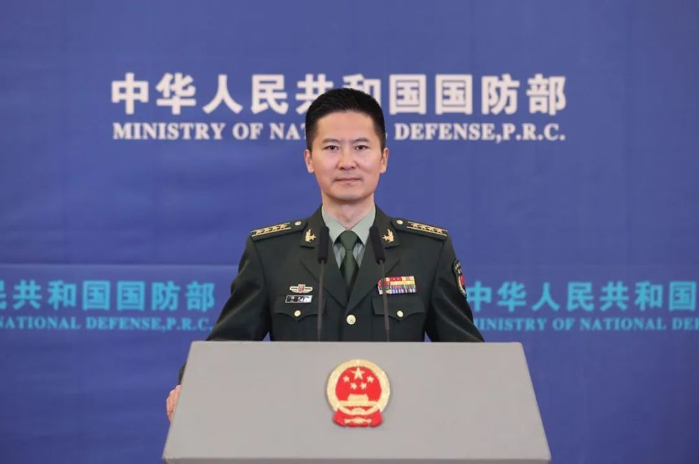

# 国务委员兼国防部长李尚福将对俄罗斯进行正式访问

来源：国防部发布

4月14日下午，国防部新闻发言人谭克非大校发布信息：

应俄罗斯国防部长绍伊古邀请，国务委员兼国防部长李尚福将于4月16日至19日对俄罗斯进行正式访问。期间，李尚福部长将与俄军队领导人举行会谈，参访俄军事院校。

近年来，在两国元首的战略引领下，中俄两军关系持续保持高位运行，战略沟通、联合演训、务实合作等取得新进展，为中俄新时代全面战略协作伙伴关系不断充实战略内涵。

