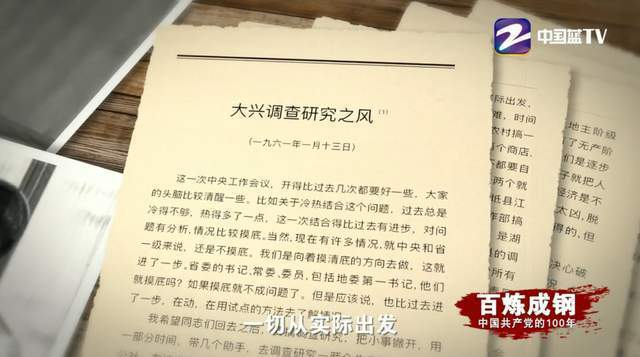

# 大兴调研现异化苗头！央媒：有领导干部“分解外包”调研任务“甩锅”基层

**撰文 | 董鑫**

《关于在全党大兴调查研究的工作方案》印发实施还不满1个月，近日，央媒发文披露，调研出现了异化苗头。

新华社主办《半月谈》4月13日发表题为《“逐级调研”，岂能成为“逐级要材料”？》的评论文章。

文中写道，《关于在全党大兴调查研究的工作方案》出台后，记者近期在基层调研采访发现，
**调研出现了“材料流转”“调研甩锅”“求量不求质”等异化苗头，是脱离群众的新形式主义。** 主要有三种表现：

**有基层干部“一个月领了几十项调研任务”，“逐级调研”异化为“逐级要材料”；**

**诸多调研任务大都压在基层少数“笔杆子”头上；调研的不写材料，写材料的没资格调研。**

逐级调研变成“层层要材料”

根据《半月谈》评论员文章的内容，“去基层调研”变成“向基层要材料”，领导干部将“写材料”的任务“甩锅”给基层，是记者采访中发现的主要问题。

先看“要材料”。

**有干部坦言，领导干部普遍事务多、会议多、活动多，有的干部领了任务，但没时间调研，只能通过“安排安排、布置布置、审核审核”，把任务“分解外包”。**

“材料收集整合”就是“最高效”的方式，所以逐级调研成为了“层层要材料”。

某市一位单位副职向记者大倒苦水称，近一个月，他已接到了几十项调研任务，每天至少一两个，相关红头文件摞了一沓子，有的要提供调研报告，有的要提供书面材料，还有的要提供相关素材。

这些调研任务有来自本系统上级领导的主题调研，有来自本地领导的主题调研，还有来自同级部门承担的调研。比如，一位宣传系统干部说，兄弟部门承担的依法治市、部校合作、交通安全等行业调研，只要能跟宣传沾上边的，都会让他们提供材料。

再看“写材料”。

根据中办印发的《关于在全党大兴调查研究的工作方案》，开展调研之后还要深化研究，全面梳理汇总调研情况，确保每个问题都有务实管用的破解之策。

但记者采访发现，在实际情况中， **调研的人不写材料，写材料的人则没资格调研。**

文中举例说，某地领导带领相关部门负责同志进行完调研，开会讨论、安排报告撰写任务时，无奈地说：“别安排了，在座的各位都不写材料，写材料的人是那些没去的人。”

**所以，领导接到的调研任务最终成为了“甩”向基层少数“笔杆子”的“锅”。**

为了完成这些已经倒排工期的“专属任务”，这些“笔杆子”型科长一方面向下级部门发通知，将任务时间提前，尽快索要“支撑材料”，另一方面只能“5+2”“白加黑”通过加班来搞定。

一位科长说，由于精力有限，除了主要领导的任务能保质完成外，其他的调研材料不得不“降格以求”，应付交差。

多地要求领导干部拿起“笔杆子”

调查研究是我们党的传家宝。

今年3月，中共中央办公厅印发了《关于在全党大兴调查研究的工作方案》，并发出通知，要求各地区各部门结合实际认真贯彻落实。

《工作方案》中明确提出，要严明工作纪律。包括
**不增加基层负担，要力戒形式主义、官僚主义，不搞作秀式、盆景式和蜻蜓点水式调研，防止走过场、不深入等。对违反作风建设要求和廉洁自律规定的，要依规依纪严肃问责。**

政知道（微信ID：upolitics）注意到，在《工作方案》之后，多个省份都在近期审议通过了各自省内大兴调查研究的实施方案。

值得一提的是，对于《半月谈》文章中提到的诸多问题，一些省份的工作方案中已做出了对应的规定和要求。

一方面，多个省份都对领导干部的调研时间提出要求。例如：

河北省明确，省级领导下基层调研时间不少于2个月；

陕西省要求，县处级以上领导班子成员全年到基层调研时间原则上不少于60天；

山东省要求，各级领导干部每年到基层调研时间不少于50天。

另一方，对于调研报告的撰写，也有的省份要求领导干部要拿起“笔杆子”。

河北省委办公厅印发的《河北省贯彻落实在全党大兴调查研究工作方案的主要措施》要求， **各级领导干部要亲自组织撰写调研报告**
，做到情况摸得清、问题抓得准、原因析得透、建议提得实。在此基础上，领导班子还要交流调研情况，研究对策措施，形成解决问题、促进工作的思路办法和政策举措。

吉林省委办公厅印发的《关于贯彻党中央决策部署在全省大兴调查研究的实施方案》中专门提出要
**“高质量起草调研报告”，县处级以上领导班子成员每人形成1篇以上调研报告，各级党委（党组）主要负责同志要对其他班子成员调研报告进行把关。**

**资料 ｜新华社、半月谈等**

**【版权声明】本文著作权归政知新媒体独家所有，未经授权，不得转载。**

