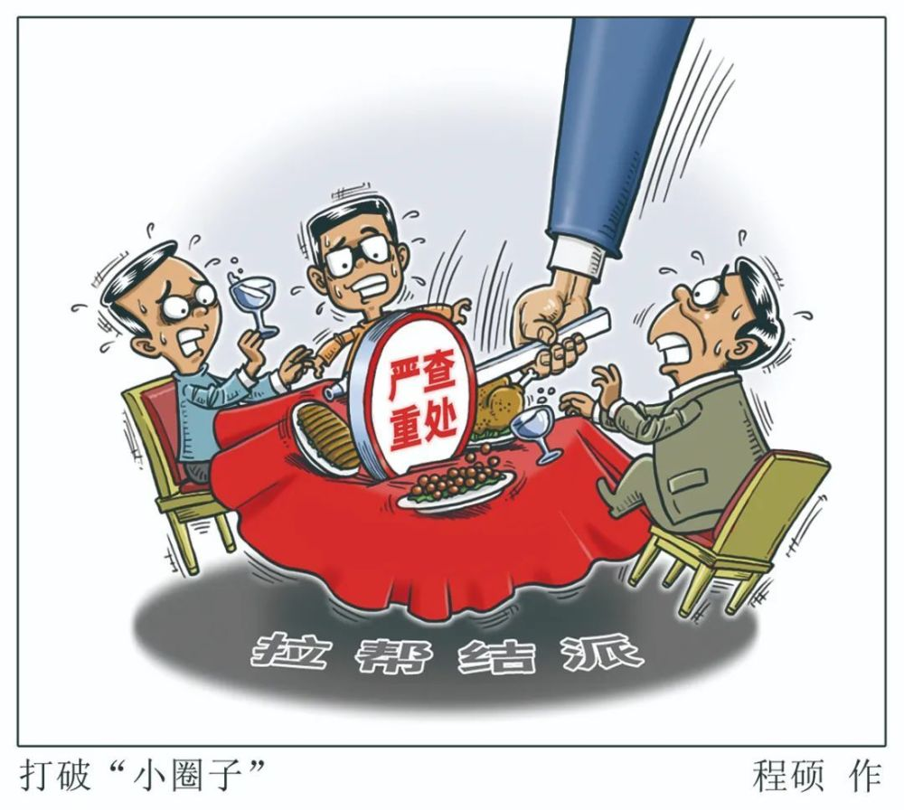

# 媒体：公开场合不喝，小圈子里猛喝，警惕领导干部“圈子酒”抬头

**半月谈评论员 黄豁**

近期，云南大理白族自治州剑川县部分领导干部在参加州委党校培训期间，违反中央八项规定精神，接受私营企业主宴请；多次违反干部教育培训纪律及学员管理规定未请假外出，违规聚餐饮酒，造成严重不良影响。最终，县长等24人被处分，多人被免职。此前，西部某省也发生类似事件，多名厅级干部在省委党校培训期间，无视中央八项规定精神，无视学习培训纪律，公然在学员宿舍聚餐饮酒，造成严重后果。

党校是干部教育培训的主阵地。少数领导干部却把党性锻炼的课堂视为“以酒会友”的酒场，用酒场编织关系场，将严肃的政治培训庸俗化、圈子化，严重败坏党的形象，其行为表面看是违反中央八项规定精神的作风问题，实质是违反党的政治纪律和政治规矩的行为。从这些违规聚餐饮酒的教训看，当前要警惕领导干部“圈子酒”抬头，尤其要坚决查处“圈子酒”背后的称兄道弟“小团伙”、任人唯亲“小圈子”、拉帮结派“小山头”以及利益交换、权钱交易等问题，坚决防止“四风”反弹回潮与隐形变异。

违规喝酒看起来是干部作风问题，但背后潜藏的“圈子文化”却是政治问题。随着全面从严治党不断深入，干部明目张胆大吃大喝很难看到了，但所谓“小范围聚一下”的“圈子酒”却潜滋暗长。公开场合不喝，小圈子里猛喝；跟一般人不喝，与圈中人才喝。

“喝什么酒不重要，和谁喝才重要。”在一些人看来，喝酒不是目的，仅仅是一种媒介，是进入圈子成为“自己人”的“入场券”。一些干部之所以敢于在严肃的学习培训期间，顶风违纪入酒局，说明他们觉得建立圈子、进入圈子、维护圈子比纪律规矩更重要，为此冒多大险、违多少规都值得。

热衷于喝“圈子酒”的干部表面看是好酒贪杯，酒逢“知己”千杯少，实际是为了关系的维护、利益的结盟，嘴上称兄道弟，心里全是利益。他们结成利益纽带，有的拉帮结派搞“小山头”，有的进行利益交换，有的甘愿人身依附谋求晋升，有的联手平事摆事。从深层次看，“圈子酒”往往容易滋生政治问题与经济问题交织的腐败，形成政商勾连的非正常关系。

这样的酒局通常不乏不良商人的身影，负责“埋单”和安排服务，所谓“不吃公款吃老板”。有的干部对此安之若素，甚至认为“吃饭若自己埋单，说明这个干部没朋友，没能力，太窝囊”。比如，因受贿罪一审获刑七年的青海省人民检察院原党组副书记、副检察长贾小刚在青海工作任职短短一年多的时间里，嗜酒如命，私藏880瓶茅台，要么在喝酒，要么在醒酒，要么就是在喝酒的路上，还专门在小区另租一套房作为“食堂”，与商人、请托者吃喝搞交易。

“圈子酒”败坏党风政风，在不知不觉中腐蚀干部队伍。有的干部不仅不对“圈子酒”说不，反而担心被圈子排斥。在云南省纪委监委《问“剑”破局》系列专题片中，面对镜头，一名参与酒局的干部坦言，虽然心里矛盾，但是不去又担心给别人留下自己不好相处的印象，也就跟着去了。有些干部面对饭局之约，内心也有过挣扎，最终难抵诱惑，步步妥协，屡屡赴约。

习近平总书记在二十届中纪委二次全会上强调，制定实施中央八项规定，是我们党在新时代的徙木立信之举，必须常抓不懈、久久为功，直至真正化风成俗，以优良党风引领社风民风。

官德如风，民德如草，风行则草偃。化风成俗，营造良好社会风气需要抓住“关键少数”。要深刻认识“四风”问题的顽固性、反复性，对于干部“圈子酒”苗头，露头就打，对隐形变异新动向时刻防范，对顶风违纪行为从严查处。在一些不止一次发生干部酒后失德、酒后失范、酒后失控的地区，要把握作风建设地区性、行业性、阶段性特点，抓住普遍发生、反复出现的问题深化整治，清除“圈子酒”的土壤和氛围，推进作风建设常态化长效化。

