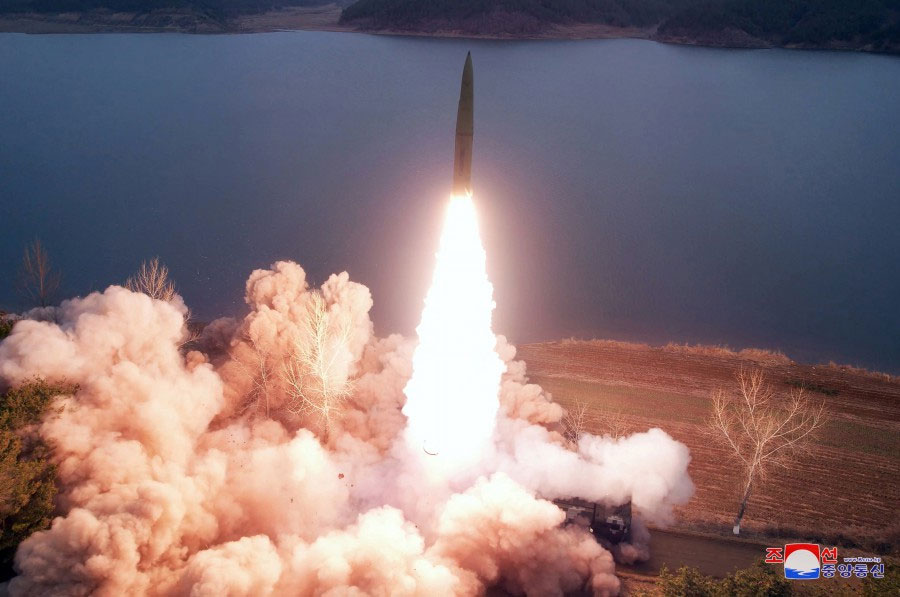

# 朝鲜13日向半岛东部海域发射弹道导弹，日本急发“避难警报”

【环球时报特约记者
金惠真】韩联社13日称，韩国军方当天捕捉到朝鲜向半岛东部海域发射一枚弹道导弹，导弹飞行约1000公里后落入东海。韩日两国分析，朝鲜当天发射的可能是新型固体燃料推进洲际弹道导弹。导弹发射引发日本政府紧急发布避难警报。美韩日的三国朝核问题磋商首席代表（对朝代表）当天通电话，抨击朝鲜发射中远程以上级别弹道导弹。

_朝鲜试射地对地战术弹道导弹，图源：朝中社_

《韩民族日报》13日称，朝鲜自本月7日始掐断几乎所有朝韩政府间的通信联络，而13日射导，意在抗议韩美举行大规模联合军演以及韩国近期刊发《朝鲜人权报告书》。

朝鲜13日射导令日本十分紧张。据日本NHK、共同社等媒体报道，朝鲜当天射导后，日本政府于上午7时55分通过“J-ALERT”系统向北海道居民发布避难警报，称“疑似朝鲜发射的弹道导弹可能于早上8时落到北海道附近，请立即避难到建筑物内或地下”。据悉，避难警报发布后，NHK反复播出警报信息近半小时。在日本政府确认导弹已落入东海后，解除该警报。在13日上午举行的例行记者会上，日本防卫大臣滨田靖一猛烈抨击朝鲜称，“这是面向国际社会，将挑衅力度再次拔高的暴力举动”，并表示“已通过外交途径，向朝鲜提出严正抗议”。

朝鲜射导后，韩国紧急召开国家安全保障会议（NSC）商讨对策。韩国SBS电视台13日称，韩国总统府当天上午对外表示，捕捉到朝鲜射导信息后，国家安保室迅速向尹锡悦总统作报告，并紧急召开NSC常任委员会议。会议上，常任委员们一致“强烈谴责”朝鲜先后射导，并表示“韩方除坚决落实韩美联合军演、构建坚固的联合应对态势外，还将在韩日军事情报保护协定基础上，加强韩美、韩美日间的情报共享”。

